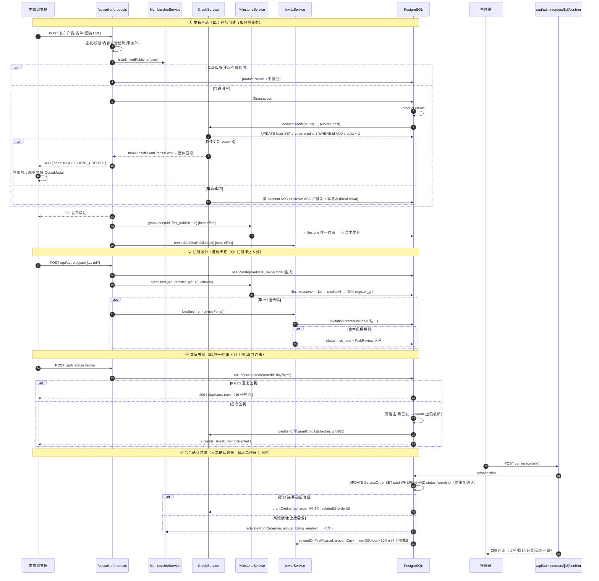
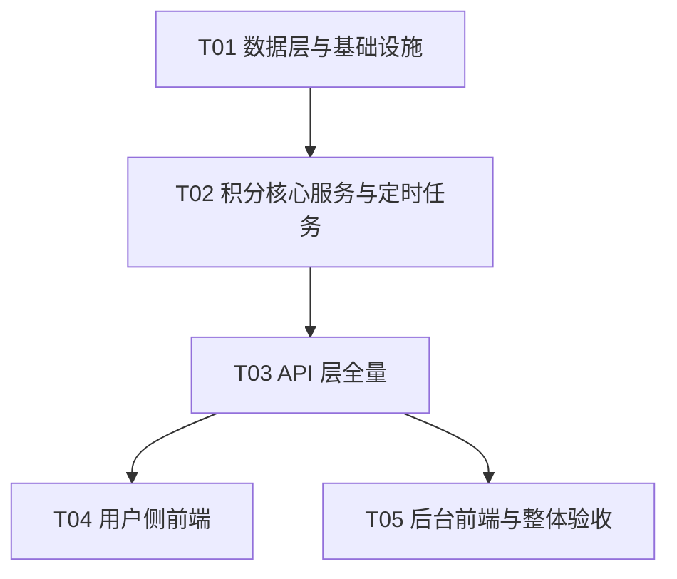

# 积分体系架构设计（一期 + 二期合并版）

> **版本**：V1.0 | **日期**：2026-07-23 | **架构师**：Bob
> **上游输入**：《积分体系增量 PRD V1.0（2026-07-23）》+ 主理人拍板口径 Q1–Q8
> **代码库基线**：Next.js 14 App Router + Prisma 5 + Neon PostgreSQL + next-intl（8 语言）+ Tailwind

---

## 1. 实现方案与框架选型

### 1.1 核心技术挑战与对策

| # | 挑战 | 对策 |
|---|------|------|
| C1 | **分类余额**（赠送分 90 天 / 充值分 1 年，同一用户多笔入账各有过期点） | 引入**积分批次表 `CreditLot`**：每笔入账生成一个批次（含 `account` 分类、`remainingAmount`、`expiresAt`）。分类余额 = 按 account 聚合未过期批次；`User.credits` 保留为**冗余总余额缓存**，所有变动在同一事务内同步 |
| C2 | **扣减顺序**（先扣快过期赠送分 → 再扣充值分；同笔消费可跨子账户） | 扣减服务在事务内按 `account ASC, expiresAt ASC` 锁定批次依次扣；跨账户拆分写入 `CreditTransaction.breakdown` JSON 明细（PRD 允许的"一行流水标注拆分明细"方案） |
| C3 | **并发安全（E1）** | 所有扣减第一刀是**条件更新**：`UPDATE "User" SET credits = credits - n WHERE id = ? AND credits >= n`（原子，数据库层兜底，永不负余额）；随后批次扣减在同一交互式事务内完成，任一步失败整体回滚。发布产品 = 建产品 + 扣分**同事务**，同生共死 |
| C4 | **发放幂等（E3）** | 一次性奖励全部走 **`UserMilestone` 表 `@@unique([userId, event])`**：发放 = 同事务内"建里程碑 → 建批次 → 加余额 → 写流水"，撞唯一约束（P2002）即返回"已发放"，重试/重放安全 |
| C5 | **过期任务** | Vercel Cron 每日调用 `/api/cron/credit-housekeeping`（复用现有 cron token 校验模式），分批扫描 `expiresAt <= now AND remainingAmount > 0` 的批次，逐批事务化作废 + 写 `expire` 流水；同一路由顺带关闭 24h 未确认订单 |
| C6 | **配置化运营**（按年收费开关、奖励数值、合规文案） | `SystemConfig` 键值表（JSON value）+ 进程内 60s 缓存；后台只读/可编辑页；改配置不发版 |
| C7 | **个人收款码人工确认流** | `ServiceOrder` 统一承载积分包与套餐订单（pending → paid/closed/rejected/refunded），后台确认动作在事务内"订单置 paid + 发分/开会员 + 写流水"，重复确认由状态条件更新拦截 |

### 1.2 框架/库选型

**沿用现有栈，不引入任何新框架、新依赖：**

- 后端：Next.js Route Handlers（现有模式）+ Prisma 交互式事务 `prisma.$transaction(async tx => ...)` + 必要处 `$executeRaw` 条件更新
- 定时任务：Vercel Cron（`vercel.json` 已有范例，`/api/cron/*` token 校验已有模式）
- 时区：原生 `Intl`（`en-CA` 格式取 Asia/Shanghai 的 `YYYY-MM-DD` 日键），不引 date-fns/dayjs
- 邀请码：`crypto.randomBytes` base36，不引 nanoid
- 前端：React Server/Client Components + Tailwind + 现有 `@/components/ui`（button/card/input）
- i18n：next-intl + `messages/*.json`，zh/en 同步，其余 6 语言后置（先 fallback）

### 1.3 架构模式

分层：`Route Handler（薄） → lib/credits/* 服务层（厚，全部积分写操作唯一入口） → Prisma`。
**铁律：任何代码不得绕过 `lib/credits/service.ts` 直接改 `User.credits` 或直写 `CreditTransaction`**（现有 admin/credits、recharge 路由一并改造收口）。

---

## 2. Prisma Schema 变更

### 2.1 迁移方向（可直接执行）

```bash
# 1. 改 schema.prisma（下文 2.2–2.4 全量）
# 2. 生成迁移
npx prisma migrate dev --name credit_system
# 3. 存量数据回填（独立脚本，迁移后执行，幂等可重跑）
npx tsx prisma/seed-credit-migration.ts
```

Neon 生产库执行 `npx prisma migrate deploy`。回填脚本设计为**幂等**（以 `sourceType='migration'` 批次是否已存在为判据），可安全重跑。

### 2.2 新增模型（完整定义）

```prisma
/// 积分批次：每笔入账一个批次，支撑分类余额/扣减顺序/过期任务
model CreditLot {
  id              String   @id @default(cuid())
  userId          String
  account         String   // gift | recharge
  sourceType      String   // register_gift|cert_gift|invite_reward|checkin|first_order_reward|recharge|admin_adjust|migration
  sourceId        String?  // milestoneId / serviceOrderId / adminUserId
  initialAmount   Int
  remainingAmount Int
  expiresAt       DateTime // gift=+90天 recharge=+1年（入账时刻起算）
  createdAt       DateTime @default(now())
  updatedAt       DateTime @updatedAt
  user            User     @relation(fields: [userId], references: [id], onDelete: Cascade)

  @@index([userId, account, expiresAt]) // 扣减顺序扫描
  @@index([expiresAt, remainingAmount]) // 过期任务扫描
}

/// 每日签到（day 为 Asia/Shanghai 的 YYYY-MM-DD 字符串，彻底规避时区换算）
model CheckIn {
  id        String   @id @default(cuid())
  userId    String
  day       String
  credits   Int      @default(1)  // 实际入账分（超月上限时为 0，仍记录签到事实保持连击）
  streakDay Int      @default(1)  // 当日连击序号
  createdAt DateTime @default(now())
  user      User     @relation(fields: [userId], references: [id], onDelete: Cascade)

  @@unique([userId, day]) // E2 防并发重复签到
  @@index([userId, day])
}

/// 邀请关系（被邀请人唯一；三档奖励状态机）
model Invitation {
  id                   String   @id @default(cuid())
  inviterId            String
  inviteeId            String   @unique
  code                 String
  status               String   @default("bound") // bound | risk_hold | completed
  certRewarded         Boolean  @default(false)
  firstPublishRewarded Boolean  @default(false)
  firstPayRewarded     Boolean  @default(false)
  riskFlag             String?  // 命中的风控规则
  createdAt            DateTime @default(now())
  updatedAt            DateTime @updatedAt
  inviter              User     @relation("Inviter", fields: [inviterId], references: [id], onDelete: Cascade)
  invitee              User     @relation("Invitee", fields: [inviteeId], references: [id], onDelete: Cascade)

  @@index([inviterId, createdAt]) // 邀请战绩 + 月上限统计
}

/// 一次性奖励里程碑（E3 幂等核心）
model UserMilestone {
  id        String   @id @default(cuid())
  userId    String
  event     String   // register_gift|cert_personal|cert_enterprise|first_publish|first_inquiry|first_deal
  relatedId String?  // 产品ID/询价ID/认证ID
  createdAt DateTime @default(now())
  user      User     @relation(fields: [userId], references: [id], onDelete: Cascade)

  @@unique([userId, event])
}

/// 服务订单：积分充值包 + 套餐（个人收款码人工确认的载体）
model ServiceOrder {
  id            String   @id @default(cuid())
  orderNo       String   @unique  // SO + yymmdd + 6位随机
  userId        String
  orderType     String   // credit_pack | membership
  sku           String   // pack10|pack30|pack60|pack150 | plan_basic|plan_premium|plan_enterprise
  amountCny     Float    // 元
  credits       Int      @default(0) // 积分包/基础版套餐发放的分
  status        String   @default("pending") // pending|paid|closed|rejected|refunded
  screenshotUrl String?
  note          String?  // 用户备注（付款手机号等）
  adminNote     String?
  confirmedBy   String?
  confirmedAt   DateTime?
  closedAt      DateTime?
  createdAt     DateTime @default(now())
  updatedAt     DateTime @updatedAt
  user          User     @relation(fields: [userId], references: [id], onDelete: Cascade)

  @@index([userId, status, createdAt])
  @@index([status, createdAt]) // 后台列表 + 24h 自动关闭扫描
}

/// 推广位（置顶/刷新/首页推荐位台账）
model Promotion {
  id          String    @id @default(cuid())
  userId      String
  productId   String
  type        String    // top | refresh | home_feature
  creditsCost Int
  startAt     DateTime  @default(now())
  endAt       DateTime? // refresh 为即时型，endAt 为空
  status      String    @default("active") // active | expired | cancelled
  createdAt   DateTime  @default(now())
  user        User      @relation(fields: [userId], references: [id], onDelete: Cascade)
  product     Product   @relation(fields: [productId], references: [id], onDelete: Cascade)

  @@index([userId, status])
  @@index([type, status, endAt]) // 推荐位计数 + 过期扫描
}

/// 每日名额计数器（首页推荐位每日 10 个，原子防超卖）
model DailyQuota {
  id   String @id @default(cuid())
  day  String // YYYY-MM-DD Asia/Shanghai
  type String // home_feature
  used Int    @default(0)

  @@unique([day, type])
}

/// 系统配置（运营参数/合规文案/收款码图）
model SystemConfig {
  key       String   @id  // annual_billing_enabled | credit_packs | plans | compliance_text | payment_qr | reward_values ...
  value     String   // JSON 字符串
  updatedBy String?
  createdAt DateTime @default(now())
  updatedAt DateTime @updatedAt
}

/// 风控审核队列（E6：命中规则不直拒，进人工）
model RiskReview {
  id           String    @id @default(cuid())
  relationType String    // invitation | register
  relationId   String
  rule         String    // same_device | same_phone | same_payaccount | multi_register_ip
  status       String    @default("pending") // pending | approved | rejected
  handledBy    String?
  handledAt    DateTime?
  note         String?
  createdAt    DateTime  @default(now())

  @@index([status, createdAt])
}
```

### 2.3 现有模型改动

```prisma
model User {
  // ……现有字段保持不变……
  inviteCode        String?   @unique      // 注册时生成，8位
  invitedViaCode    String?                // 注册时使用的邀请码（冗余便于排查）
  lifetime          Boolean   @default(false) // 终身权益（存量付费用户迁移置 true）
  badges            String[]  @default([])    // ["dealt_seller"] 等徽章
  deviceFingerprint String?
  registerIp        String?
  // 新增关系
  creditLots         CreditLot[]
  checkIns           CheckIn[]
  milestones         UserMilestone[]
  invitationsSent    Invitation[]  @relation("Inviter")
  invitationReceived Invitation?   @relation("Invitee")
  serviceOrders      ServiceOrder[]
  promotions         Promotion[]
}

model CreditTransaction {
  // ……现有字段保持不变（id/userId/type/amount/balance/reason/relatedId/createdAt）……
  account    String?   // gift | recharge | mixed（扣减且跨账户时）
  lotId      String?   // 入账时关联批次
  expiresAt  DateTime? // 入账时冗余批次过期时间（明细页直接展示）
  breakdown  String?   // 扣减拆分 JSON：[{lotId, account, amount}]
  operatorId String?   // admin_adjust / 确认充值的操作人

  @@index([userId, type, createdAt]) // 邀请月上限/签到月上限统计
}

model Product {
  // ……现有字段保持不变……
  promotedUntil DateTime? // 置顶截止（列表排序冗余，Promotion 为台账）
  promotedAt    DateTime? // 最近一次购买置顶时间（置顶层内按此倒序，Q5）
  refreshedAt   DateTime? // 刷新卡排序权重（不修改 createdAt 展示）
  promotions    Promotion[]
}
```

### 2.4 存量数据迁移（回填脚本 `prisma/seed-credit-migration.ts`）

1. **余额迁移（Q4）**：每个 `credits > 0` 的用户建一个 `CreditLot{account:'recharge', sourceType:'migration', remainingAmount=credits, expiresAt=now+1年}` + 一条 `type='migration'` 流水（新增流水类型，避免污染 `recharge` 充值收入口径）。
2. **终身标记**：`membershipTier IN ('basic','premium','enterprise') AND membershipExpiresAt IS NULL` 的用户置 `lifetime=true`（页面显示"终身有效"，权益判定跳过过期检查）。已有 `membershipExpiresAt` 的用户保持原值不动。
3. **邀请码**：所有存量用户生成 `inviteCode`（撞码重试）。
4. 脚本输出迁移报告（用户数/总迁移分/lifetime 用户数）。

---

## 3. 核心数据结构与接口

### 3.1 类图（服务层 + 数据模型关系）

另存 `docs/architecture/积分体系-class-diagram.mermaid`。

```mermaid
classDiagram
    class User {
        +String id
        +Int credits
        +String membershipTier
        +DateTime? membershipExpiresAt
        +Boolean lifetime
        +String? inviteCode
        +String[] badges
        +String? deviceFingerprint
        +String? registerIp
    }
    class CreditLot {
        +String id
        +String account
        +String sourceType
        +Int initialAmount
        +Int remainingAmount
        +DateTime expiresAt
    }
    class CreditTransaction {
        +String id
        +String type
        +Int amount
        +Int balance
        +String? account
        +String? breakdown
        +String? relatedId
    }
    class CheckIn {
        +String userId
        +String day
        +Int credits
        +Int streakDay
    }
    class Invitation {
        +String inviterId
        +String inviteeId
        +Boolean certRewarded
        +Boolean firstPublishRewarded
        +Boolean firstPayRewarded
        +String status
    }
    class UserMilestone {
        +String userId
        +String event
        +String? relatedId
    }
    class ServiceOrder {
        +String orderNo
        +String orderType
        +String sku
        +Float amountCny
        +Int credits
        +String status
    }
    class Promotion {
        +String productId
        +String type
        +Int creditsCost
        +DateTime? endAt
        +String status
    }
    class DailyQuota {
        +String day
        +String type
        +Int used
    }
    class SystemConfig {
        +String key
        +String value
    }
    class RiskReview {
        +String relationType
        +String relationId
        +String rule
        +String status
    }

    class CreditService {
        +grantCredits(input) GrantResult
        +deductCredits(tx, userId, amount, meta) DeductResult
        +expireLots(batchSize) ExpireReport
        +getSummary(userId) CreditSummary
    }
    class MilestoneService {
        +grantOnce(userId, event, reward, relatedId) boolean
    }
    class CheckInService {
        +checkIn(userId) CheckInResult
        +getStatus(userId) CheckInStatus
    }
    class InviteService {
        +bind(inviteeId, code, ctx) BindResult
        +rewardOnCert(inviteeId) void
        +rewardOnFirstPublish(inviteeId, productId) void
        +rewardOnFirstPay(inviteeId, amountCny) void
    }
    class OrderService {
        +createOrder(userId, sku) ServiceOrder
        +confirmPaid(adminId, orderId) void
        +rejectOrder(adminId, orderId, note) void
        +closeExpiredOrders() int
    }
    class MallService {
        +purchase(userId, productId, item, opts) Promotion
        +getHomeFeatureAvailability() int
    }
    class MembershipService {
        +isActive(user) boolean
        +isUnlimitedPublisher(user) boolean
        +activateFromOrder(tx, user, order) void
    }
    class ConfigService {
        +get(key, fallback) T
        +set(key, value, operatorId) void
    }

    User "1" --> "*" CreditLot
    User "1" --> "*" CreditTransaction
    User "1" --> "*" CheckIn
    User "1" --> "*" Invitation : inviter
    User "1" --> "0..1" Invitation : invitee
    User "1" --> "*" UserMilestone
    User "1" --> "*" ServiceOrder
    User "1" --> "*" Promotion
    CreditLot "1" --> "0..*" CreditTransaction : lotId
    CreditService ..> CreditLot
    CreditService ..> CreditTransaction
    MilestoneService ..> UserMilestone
    MilestoneService ..> CreditService : grant
    CheckInService ..> CheckIn
    CheckInService ..> CreditService : grant
    InviteService ..> Invitation
    InviteService ..> RiskReview
    InviteService ..> CreditService : grant
    OrderService ..> ServiceOrder
    OrderService ..> CreditService : grant
    OrderService ..> MembershipService : activate
    MallService ..> Promotion
    MallService ..> DailyQuota
    MallService ..> CreditService : deduct
    MembershipService ..> SystemConfig : annual_billing_enabled
```



### 3.2 积分扣减服务（E1 并发安全）

`src/lib/credits/service.ts`

```ts
// —— 扣减（必须在交互式事务内调用，或自身开启事务）——
export async function deductCredits(
  tx: PrismaTx, userId: string, amount: number,
  meta: { type: TxnType; reason: string; relatedId?: string; operatorId?: string }
): Promise<{ newBalance: number; legs: DeductLeg[] }> {
  // ① 原子条件更新：并发下最多一个请求扣成功；余额不足 count=0（E1/E7）
  const n = await tx.$executeRaw`
    UPDATE "User" SET "credits" = "credits" - ${amount}, "updatedAt" = NOW()
    WHERE "id" = ${userId} AND "credits" >= ${amount}`;
  if (n === 0) throw new InsufficientCreditsError();

  // ② 批次扣减：account ASC（gift 先于 recharge）+ expiresAt ASC（快过期先扣）
  const lots = await tx.creditLot.findMany({
    where: { userId, remainingAmount: { gt: 0 }, expiresAt: { gt: new Date() } },
    orderBy: [{ account: "asc" }, { expiresAt: "asc" }],
  });
  let remaining = amount;
  const legs: DeductLeg[] = [];
  for (const lot of lots) {
    if (remaining <= 0) break;
    const take = Math.min(lot.remainingAmount, remaining);
    await tx.creditLot.update({
      where: { id: lot.id },
      data: { remainingAmount: { decrement: take } },
    });
    legs.push({ lotId: lot.id, account: lot.account, amount: take });
    remaining -= take;
  }
  // ③ 数据漂移防御：批次和 < 余额缓存 → 抛错回滚，①的扣减一并撤销
  if (remaining > 0) throw new CreditLotDriftError(userId);

  const u = await tx.user.findUniqueOrThrow({ where: { id: userId }, select: { credits: true } });
  await tx.creditTransaction.create({ data: {
    userId, type: meta.type, amount: -amount, balance: u.credits,
    reason: meta.reason, relatedId: meta.relatedId, operatorId: meta.operatorId,
    account: legs.every(l => l.account === "gift") ? "gift"
           : legs.every(l => l.account === "recharge") ? "recharge" : "mixed",
    breakdown: JSON.stringify(legs),
  }});
  return { newBalance: u.credits, legs };
}
```

**发布产品改造（同事务，同生共死）**：图片/视频上传与内容安全检测保持在事务外（OSS 副作用无法回滚，孤儿文件可后清）；`product.create` + `deductCredits` 包进同一 `$transaction`：

```ts
// /api/seller/products POST 尾部
if (membershipService.isUnlimitedPublisher(user)) {
  product = await prisma.product.create({ data });          // 高级版/企业版有效期内不扣分
} else {
  product = await prisma.$transaction(async (tx) => {
    const p = await tx.product.create({ data });
    await creditService.deductCredits(tx, user.id, PUBLISH_COST,
      { type: "publish_cost", reason: "发布产品消耗", relatedId: p.id });
    return p;
  });
}
// 事务外：首发里程碑 best-effort（幂等，失败可重试不阻塞发布）
milestoneService.grantOnce(user.id, "first_publish", { credits: 2, ... }, product.id)
  .catch(err => console.error("[first_publish]", err));
```

403 响应统一为：
```json
{ "success": false, "error": "积分不足", "code": "INSUFFICIENT_CREDITS", "credits": 0, "required": 1 }
```
前端以 `code === "INSUFFICIENT_CREDITS"` 作为额度弹窗唯一触发条件。

### 3.3 积分发放服务（E3 幂等）

```ts
export async function grantCredits(input: {
  userId: string; amount: number; account: "gift" | "recharge";
  type: TxnType; reason: string; relatedId?: string; operatorId?: string;
  milestoneEvent?: string;           // 传则走幂等闸
  ttlDays: number;                   // gift=90 recharge=365（入 SystemConfig 可调）
}): Promise<{ granted: boolean; duplicate?: boolean }> {
  return prisma.$transaction(async (tx) => {
    if (input.milestoneEvent) {
      try {
        await tx.userMilestone.create({ data: {
          userId: input.userId, event: input.milestoneEvent, relatedId: input.relatedId } });
      } catch (e) {
        if (isP2002(e)) return { granted: false, duplicate: true }; // 重放安全
        throw e;
      }
    }
    const lot = await tx.creditLot.create({ data: {
      userId: input.userId, account: input.account, sourceType: input.type,
      sourceId: input.relatedId, initialAmount: input.amount,
      remainingAmount: input.amount,
      expiresAt: addDays(new Date(), input.ttlDays),
    }});
    const u = await tx.user.update({ where: { id: input.userId },
      data: { credits: { increment: input.amount } }, select: { credits: true } });
    await tx.creditTransaction.create({ data: {
      userId: input.userId, type: input.type, amount: input.amount, balance: u.credits,
      reason: input.reason, relatedId: input.relatedId, operatorId: input.operatorId,
      account: input.account, lotId: lot.id, expiresAt: lot.expiresAt } });
    return { granted: true };
  });
}
```

### 3.4 签到服务（月上限 10 含连击，Q2）

```ts
checkIn(userId):
  day = shanghaiDay()                       // Intl 'en-CA' + Asia/Shanghai
  return prisma.$transaction(async tx => {
    // 唯一约束兜底并发；P2002 → "今日已签到"
    const monthPrefix = day.slice(0, 7);
    const monthGranted = sum(CheckIn.credits where userId, day startsWith monthPrefix);
    const streak = 昨天有记录 ? 昨天.streakDay + 1 : 1;
    let credits = 0;
    if (monthGranted < MONTH_CAP /*10*/) {
      credits = 1;
      if (streak % 7 === 0) credits += 3;                    // 连击第7天 +3（计入上限）
      credits = Math.min(credits, MONTH_CAP - monthGranted); // 上限截断
    }
    await tx.checkIn.create({ userId, day, credits, streakDay: streak }); // P2002 拦截重放
    if (credits > 0) await grantCredits({ account:'gift', type:'checkin', ttlDays:90, ... });
    return { day, credits, streak, monthGranted: monthGranted + credits, capped: credits === 0 };
  });
```

### 3.5 邀请服务（阶梯奖励 + 月封顶 200 + 风控）

```ts
rewardOnCert(inviteeId):   // 认证审核通过事件调用
  inv = invitation.findUnique({ inviteeId }); if (!inv || inv.status === "risk_hold") return;
  if (!inv.certRewarded) {
    inviterMonthSum = Σ creditTransaction(amount) where inviterId, type='invite_reward', 本月(Shanghai);
    grant = clamp(10, 0, 200 - inviterMonthSum);   // 超出部分不发放，流水备注"已达月度上限"
    if (grant > 0) grantCredits(inviter, grant, gift, 'invite_reward', relatedId: inv.id);
    grantCredits(invitee, 5, gift, 'invite_reward', relatedId: inv.id); // 被邀请人固定 +5，不占邀请人额度
    invitation.update({ certRewarded: true, status: ... });
  }
rewardOnFirstPublish(inviteeId, productId): 同上骨架，邀请人 +5。
rewardOnFirstPay(inviteeId, amountCny):
  raw = Math.min(50, Math.floor(amountCny * 0.1));  // 口径见"待明确事项"U2：99元→9分，999元→50分
  再走月上限截断。
```

**风控（绑定/发奖时点）**：命中 `same_device | same_phone | same_payaccount | multi_register_ip`（同设备/同 IP 24h 注册 ≥3）→ `Invitation.status='risk_hold'` + 写 `RiskReview`，奖励冻结；人工 approve 后补发（仍写 `invite_reward` 流水，备注补发）。

### 3.6 过期任务（cron）

`/api/cron/credit-housekeeping`（GET 供 Vercel Cron，POST 供手动，token 校验复用现有模式）：

```
Step1 过期作废：循环批次（每批 200 个 lot，上限 10 轮防超时）
  for lot in creditLot.findMany({ expiresAt <= now, remainingAmount > 0 }, take: 200):
    $transaction:
      // 乐观条件更新防并发重复作废
      UPDATE "CreditLot" SET "remainingAmount"=0 WHERE id=? AND "remainingAmount"=${lot.remainingAmount}
      if count===0 → skip
      UPDATE "User" SET credits = GREATEST(0, credits - ${lot.remainingAmount}) WHERE id=?
      insert CreditTransaction{type:'expire', amount:-N, balance, account:lot.account, lotId}
Step2 订单自动关闭：
  UPDATE "ServiceOrder" SET status='closed', "closedAt"=NOW()
  WHERE status='pending' AND "createdAt" < NOW() - INTERVAL '24 hours'
Step3 推广位过期标记（台账整洁；查询侧本就按 endAt 过滤，此步为可选优化）
```

`vercel.json` 增加：`{ "path": "/api/cron/credit-housekeeping?token=...", "schedule": "0 16 * * *" }`（UTC 16:00 = 北京时间 00:00，每日）。

### 3.7 程序调用流程（关键操作时序）

另存 `docs/architecture/积分体系-sequence-diagram.mermaid`。覆盖四条关键链路：①发布产品事务化扣分（E1）、②注册送分+邀请绑定、③签到（幂等+月上限）、④后台确认订单到账（发分/开会员+邀请首付费奖励）。



### 3.8 会员服务（按年收费可配置 + lifetime）

```ts
isActive(user): tier==='free' → false; lifetime → true; else membershipExpiresAt > now
isUnlimitedPublisher(user): isActive && tier ∈ {premium, enterprise}
canFreeAiReport(user):    isActive && tier ∈ {premium, enterprise}   // Q7：此类用户隐藏积分抵扣入口
activateFromOrder(tx, user, order):
  annual = config.get('annual_billing_enabled', true)
  if (order.sku === 'plan_basic')     → tier='basic'；grantCredits 50 充值分（ttl 365，Q3）
  if (plan_premium/plan_enterprise)   → tier=相应档；
      membershipExpiresAt = annual ? now+1年 : null; lifetime = !annual && user.lifetime(保持)
  // 存量 lifetime 用户永不被改写（迁移已置位）
```

---

## 4. API 路由清单

统一约定：响应 `{ success, data?, error?, code? }`；鉴权 `getTokenFromHeaders` + `verifyToken`；管理员校验 `role ∈ {admin, super_admin}`（复用现有 `checkAdmin` 模式）。

### 4.1 用户侧新增

| 方法 | 路径 | 说明 | 请求 | 响应 data |
|---|---|---|---|---|
| GET | `/api/credits/summary` | 积分账户总览（余额卡数据源） | — | `{ total, gift, recharge, expiringIn7d, nextExpireAt, membership: {tier,expiresAt,lifetime,isActive}, inviteCode }` |
| GET | `/api/credits/transactions?type=&page=&pageSize=` | 流水分页/类型筛选 | query | `{ list: [{id,type,amount,balance,account,reason,relatedId,expiresAt,createdAt}], total, page }` |
| POST | `/api/credits/checkin` | 每日签到 | — | `{ day, credits, streak, monthGranted, capped, duplicate? }`；重复签到 200 + `duplicate:true` |
| GET | `/api/credits/checkin?month=YYYY-MM` | 签到状态/日历 | query | `{ todaySigned, streak, monthGranted, monthCap, days: [{day,credits}] }` |
| GET | `/api/invite/my` | 邀请码/链接/战绩 | — | `{ code, link, invitedCount, earned, monthEarned, monthCap, list: [{inviteeName, createdAt, stage}] }` |
| POST | `/api/invite/bind` | 绑定邀请关系（注册 24h 内补填） | `{ code }` | `{ bound, riskHold? }`；逾期/已绑定/自邀请 → 400 |
| GET | `/api/credits/config` | 公开运营配置 | — | `{ packs: [...4档], plans: [...3档], complianceText, paymentQr: {wechat,alipay}, annualBilling, rechargeSlaText: "工作日 2 小时内到账"(Q8) }` |
| POST | `/api/orders` | 创建充值/套餐订单 | `{ sku }` | `{ order: {id,orderNo,amountCny,credits,status}, payment: {qr,note} }` |
| GET | `/api/orders/my` | 我的订单列表 | query `status` | `{ list }` |
| POST | `/api/orders/[id]/screenshot` | 上传付款截图（可选） | `{ url }`（先走现有 `/api/upload`） | `{ ok }` |
| POST | `/api/mall/purchase` | 商城购买 | `{ item: 'top'\|'refresh'\|'home_feature'\|'ai_report', productId?, days? , reportOrderId? }` | `{ promotion?, newBalance }`；推荐位满 → 409 `HOME_FEATURE_FULL` |
| GET | `/api/mall/promotions/my` | 我的生效中推广 | — | `{ list: [{id,type,productId,productName,startAt,endAt,status}] }` |
| GET | `/api/mall/home-feature-quota` | 推荐位今日余量 | — | `{ day, cap: 10, used, left }` |

### 4.2 后台新增（admin）

| 方法 | 路径 | 说明 |
|---|---|---|
| GET | `/api/admin/orders?status=&page=` | 订单列表（用户/金额/状态/截图/时间） |
| POST | `/api/admin/orders/[id]/confirm` | 确认到账：事务内"条件更新订单 pending→paid + 发分/开会员 + 流水"；已关闭/已确认 → 409 |
| POST | `/api/admin/orders/[id]/reject` | 驳回（写 adminNote，订单 → rejected） |
| GET / PUT | `/api/admin/system-config` | 读/写配置（annual_billing_enabled、奖励数值、收款码、合规文案、充值包/套餐定义） |
| GET | `/api/admin/risk-reviews?status=` | 风控队列 |
| POST | `/api/admin/risk-reviews/[id]/resolve` | `{ action: 'approve'\|'reject', note }`；approve → 补发邀请奖励 |
| POST | `/api/admin/certifications/[id]/review` | 认证审核（approve/reject）。**代码库现状无此 API，本次新建并作为 cert_gift/邀请一档奖励的唯一触发点** |
| GET | `/api/admin/credits/transactions?userId=&type=` | 全量流水查询（运营查账，US-7） |
| GET | `/api/admin/stats/overview` | Q6 最简统计：累计注册、本月发布、本月订单数/实付额、本月发放/消耗积分、付费会员数 |

### 4.3 现有路由改造点

| 路由 | 改造 |
|---|---|
| `POST /api/auth/register` | credits 初始 0 → 注册后 `grantOnce(register_gift, 5, gift, 90d)`（Q1 临时口径：注册即送）；生成 `inviteCode`；接受 `ref` 参数 → 建 Invitation（含设备/IP 风控采集）；`membershipConfig.free.credits` 改为 0（送分收口到服务层） |
| `POST /api/seller/products` | 按 §3.2 事务化改造；premium/enterprise 有效期内免扣；事务外触发 `first_publish` 里程碑与 `invite.firstPublish` 奖励 |
| `PUT /api/seller/products/[id]` | 支持 `status:'sold'`（仅限 owner）；首次置 sold → `first_deal` 里程碑 +20 + `badges` 追加 `dealt_seller` |
| `POST /api/inquiries` | 创建成功后对 `product.sellerId` 触发 `first_inquiry` 里程碑 +5（best-effort，不阻塞买家） |
| `POST /api/admin/credits` | 收口走 `grantCredits/admin_adjust`（正向）与 `deductCredits/admin_adjust`（负向，E4 余额不足时置 0 并登记），补全流水 |
| `POST /api/credits/recharge` | **废弃**：返回 410 + 迁移提示；前端入口全部替换为 `/api/orders` |
| `POST /api/deep-report` | `create_order` 增加 `paymentMethod:'credits'`（仅 standard/19.9 档）：扣 10 分（`ai_deduct`）→ 订单直置 paid；premium/enterprise 用户前端不展示该入口（Q7），服务端二次校验防误扣 |
| `GET /api/products` | 排序扩展：`promotedUntil > now` 的产品前置（层内 `promotedAt` 倒序，Q5），其余按 `COALESCE(refreshedAt, createdAt) DESC` 后再叠加现有 sort 参数；首页推荐位数据源改为生效中 `home_feature` Promotion |

---

## 5. 前端页面/组件清单

移动端优先；付费路径 ≤3 步（弹窗/套餐页 → 选档 → 扫码）；zh/en 同步。

| 路径 | 组件 | 职责 |
|---|---|---|
| `/[locale]/credits/page.tsx`（改造） | — | 积分账户主页：账户卡 + 签到卡 + 邀请卡 + 商城入口 + 充值包 + 流水明细 |
| `/[locale]/credits/credit-account-card.tsx`（新） | Client | 总余额大字 + 赠送/充值分类 + "X 积分将于 7 日内过期"提示条 + 会员状态（lifetime 显示"终身有效"） |
| `/[locale]/credits/checkin-card.tsx`（新） | Client | 今日签到按钮、连击天数、月进度 10 格、当月日历（P1） |
| `/[locale]/credits/invite-card.tsx`（新） | Client | 邀请码/复制链接、战绩（已邀 X 人/已赚 X 分/本月剩余额度）、24h 内补填输入框、规则折叠 |
| `/[locale]/credits/recharge-packs.tsx`（新，替换 `recharge-form.tsx`） | Client | 4 档固定包卡片 + 合规文案条（增值信息服务费）+ 下单 → 收款码弹层（含 SLA 文案"工作日 2 小时内到账"+ 备注提示 + 截图上传） |
| `/[locale]/credits/credit-transactions.tsx`（改造） | Client | 类型筛选 + 月份分页 + 中英流水文案 + 过期时间展示 |
| `/[locale]/credits/newcomer-tasks.tsx`（新，P1） | Client | 新手三步任务清单（首发→首询价→首成交 + 进度） |
| `/[locale]/plans/page.tsx`（新） + `plan-comparison.tsx` / `plan-calculator.tsx` / `plan-payment.tsx` | SSR+Client | 三档对比表（高级版居中放大 + "最受欢迎"默认选中）、算账四档推荐、FAQ（按年/终身/退款规则）、合规条、扫码支付区；价格按 `annual_billing_enabled` 展示 "/年" |
| `/[locale]/seller/mall/page.tsx`（新） + `mall-item-card.tsx` / `mall-purchase-dialog.tsx` | Client | 4 商品卡（置顶 5/天、刷新 2/次、AI 抵扣 10 分、推荐位 20/天 + 今日余量）；购买弹层选产品/天数；余额不足引导充值 |
| `/[locale]/seller/promotions/page.tsx`（新，P1） | Client | 我的生效中置顶/推荐位及到期时间 |
| `src/components/credits/quota-modal.tsx`（新） | Client | 额度耗尽弹窗：标题 + 算账文案 + 三档精简对比 + "去看看套餐"/"先充点积分" + 社会证明行（<10 隐藏）+ 埋点 4 事件 |
| `/[locale]/seller/products/new/page.tsx`（改造） | Client | 403 `INSUFFICIENT_CREDITS` → 打开 QuotaModal（替换现纯文案）；AI 报告页同 modal 复用（P1，文案换"10 积分即可解锁"） |
| `/[locale]/admin/orders/page.tsx`（新） | Client | 订单确认台：状态筛选、截图查看、确认/驳回 |
| `/[locale]/admin/config/page.tsx`（新） | Client | 系统配置编辑（按年开关、奖励数值、收款码、文案） |
| `/[locale]/admin/risk/page.tsx`（新） | Client | 风控审核队列（通过/拒绝 + 备注） |
| `/[locale]/admin/stats/page.tsx`（新） | Client | Q6 只读统计卡片（注册/发布/订单额/积分发放消耗/付费会员） |
| `/[locale]/admin/admin-sidebar.tsx`（改造） | — | 新增 4 个入口 |
| 导航栏（登录态） | Client | 积分图标 + 总余额（数据源 `/api/credits/summary`，挂现有 layout 组件） |
| `messages/zh.json`、`messages/en.json`（改造） | — | `credits.*` 扩展、`plans.*`、`mall.*`、`quotaModal.*`、`adminOrders.*` 等命名空间 |

埋点：`quota_modal_show / quota_modal_click_plan / quota_modal_click_recharge / quota_modal_close` —— 前端 console + 复用现有轻量方案（无埋点基建则先写 `localStorage` + 后台 stats 页读服务端替代指标；见 U6）。

---

## 6. 依赖包列表

**无新增第三方依赖。** 全部能力由现有依赖覆盖（next 14 / prisma 5 / next-intl / tailwind / zod / lucide-react）。

---

## 7. 任务列表（按实现顺序，含依赖）

> 约束：≤5 任务、每任务 ≥3 文件、配置集中首任务。

| 任务 | 名称 | 涉及文件 | 依赖 | 优先级 |
|---|---|---|---|---|
| **T01** | 数据层与基础设施 | `prisma/schema.prisma`（§2 全量变更）、`prisma/migrations/*/migration.sql`（migrate dev 生成）、`prisma/seed-credit-migration.ts`（存量回填）、`src/lib/credits/constants.ts`（流水/账户/ SKU/里程碑枚举 + 默认数值）、`src/lib/credits/config.ts`（SystemConfig 读写 + 60s 缓存）、`src/lib/credits/errors.ts`（InsufficientCreditsError 等）、`src/lib/credits/time.ts`（Asia/Shanghai 日键） | — | P0 |
| **T02** | 积分核心服务与定时任务 | `src/lib/credits/service.ts`（grant/deduct/expire/getSummary）、`src/lib/credits/milestone.ts`（grantOnce）、`src/lib/credits/membership.ts`（isActive/isUnlimited/activateFromOrder）、`src/lib/credits/checkin.ts`、`src/lib/credits/invite.ts`（绑定/三档奖励/月上限/风控冻结）、`src/app/api/cron/credit-housekeeping/route.ts`、`vercel.json`（新增 cron）、`scripts/verify-credit-service.ts`（服务层自验脚本：发放→扣减顺序→过期→幂等回放） | T01 | P0 |
| **T03** | API 层全量 | 新增：`/api/credits/summary`、`/api/credits/transactions`、`/api/credits/checkin`、`/api/credits/config`、`/api/invite/my`、`/api/invite/bind`、`/api/orders`(+`[id]/screenshot`、`my`)、`/api/mall/purchase`(+`promotions/my`、`home-feature-quota`)、`/api/admin/orders`(+confirm/reject)、`/api/admin/system-config`、`/api/admin/risk-reviews`(+resolve)、`/api/admin/certifications/[id]/review`、`/api/admin/credits/transactions`、`/api/admin/stats/overview`；改造：`/api/auth/register`、`/api/seller/products`、`/api/seller/products/[id]`、`/api/inquiries`、`/api/admin/credits`、`/api/credits/recharge`(410)、`/api/deep-report`、`/api/products`(排序) | T02 | P0 |
| **T04** | 用户侧前端 | `credits/page.tsx` + `credit-account-card/checkin-card/invite-card/recharge-packs/newcomer-tasks.tsx`、`credit-transactions.tsx` 改造、`plans/page.tsx`(+3 组件)、`seller/mall/page.tsx`(+2 组件)、`seller/promotions/page.tsx`、`components/credits/quota-modal.tsx`、`seller/products/new/page.tsx` 403 接入、导航栏积分入口、`messages/zh.json`、`messages/en.json` | T03 | P0 |
| **T05** | 后台前端与整体验收 | `admin/orders/page.tsx`、`admin/config/page.tsx`、`admin/risk/page.tsx`、`admin/stats/page.tsx`、`admin/admin-sidebar.tsx`、迁移脚本生产执行记录、`docs/architecture/验收走查清单.md`（按 PRD 9 模块验收标准逐项） | T03 | P0 |

### 任务依赖图



---

## 8. 共享知识（跨文件约定）

1. **积分写操作唯一入口**：`lib/credits/service.ts`。禁止任何路由/脚本直接 `user.update({credits})` 或直写流水。Code Review 红线。
2. **响应格式**：`{ success: boolean, data?: any, error?: string, code?: string }`（沿用现有约定，不引入新包装）。积分不足固定 `HTTP 403 + code:'INSUFFICIENT_CREDITS'`。
3. **流水类型枚举**（`CreditTransaction.type`）：`register_gift | cert_gift | invite_reward | checkin | recharge | first_order_reward | admin_adjust | publish_cost | mall_cost | ai_deduct | expire | migration`。
4. **账户枚举**：`gift`（90 天）/ `recharge`（365 天）；扣减跨账户时流水 `account='mixed'`，明细在 `breakdown` JSON。
5. **日界口径**：所有"自然日/自然月"均为 **Asia/Shanghai**，日键统一 `shanghaiDay(): 'YYYY-MM-DD'`（`Intl.DateTimeFormat('en-CA', { timeZone: 'Asia/Shanghai' })`），禁止 `new Date().toISOString().slice(0,10)`。
6. **金额单位**：人民币**元**（Float，展示保留 2 位）；积分 Int。首付费邀请奖励公式 `min(50, floor(amountCny * 0.1))`。
7. **SKU 枚举**：`pack10/pack30/pack60/pack150`（20/54/96/199 元）与 `plan_basic/plan_premium/plan_enterprise`（99/299/999 元），定义存 SystemConfig，价格/分值以配置为准、代码只兜底默认值。
8. **会员权益判定**：只调 `membershipService.isActive/isUnlimitedPublisher/canFreeAiReport`，禁止散落 `membershipExpiresAt` 裸判断（lifetime 口径唯一收口）。
9. **合规文案统一出处**：收费名目固定"**增值信息服务费**"，文案存 SystemConfig `compliance_text` + i18n key `credits.compliance`，页面/订单/弹窗禁止出现"会员费/佣金/代收代付"字样。
10. **买家侧红线**：不改任何买家浏览/搜索/询价收费逻辑；弹窗/商城/套餐入口永不向 `role=buyer` 且无产品的用户强推。
11. **认证类型映射**：PRD"实名认证"= 现有 `personnel`（+5），"企业认证"= 现有 `institution`（+10）；`vehicle` 认证不发分。服务层映射表兼容 `personal/enterprise` 别名（见 U1）。
12. **Prisma client**：统一 `import { prisma } from "@/lib/db"`；鉴权统一 `verifyToken + getTokenFromHeaders`（@/lib/auth）。
13. **里程碑事件枚举**：`register_gift | cert_personal | cert_enterprise | first_publish | first_inquiry | first_deal`。

---

## 9. 待明确事项（假设已标注，需产品/主理人确认）

| # | 事项 | 本设计采用的假设 |
|---|------|------|
| U1 | **认证类型口径**：代码现状 certType 为 `institution/personnel/vehicle`，PRD 写 `personal/enterprise`；且代码库**不存在认证审核 API**（只有申请与公开查询，审核疑似人工改库） | 假设映射 personnel→实名、institution→企业；本期新建 `/api/admin/certifications/[id]/review` 作为唯一审核入口并挂钩发分。若另有审核入口需告知 |
| U2 | **首付费邀请奖励公式**：PRD 正文"10% 按 1 元=0.5 分换算"、E8"÷2 四舍五入"、验收例"99 元→9 分"三处表述不一 | 按验收例为准：`min(50, floor(实付×10%))`（99→9，999→50） |
| U3 | **AI 报告订单为内存态 mock**（`/api/deep-report` 不落库） | 积分抵扣直接置内存订单 paid 并写 `ai_deduct` 流水（relatedId=reportOrderId）；后续落库改造不影响积分侧 |
| U4 | **设备指纹**：代码库无指纹采集能力 | 本期极简方案：注册/绑定时前端生成 localStorage UUID 上报 + 服务端记录 `registerIp`；同收款账号人工核对。不引第三方指纹 SDK |
| U5 | **导航栏积分入口**：现有 layout 是否有全局用户状态注入未逐一核实 | T04 中先以 `/api/credits/summary` 客户端拉取实现，若已有全局 store 再收口 |
| U6 | **埋点基建**：代码库无事件采集表/服务 | 弹窗 4 事件本期前端打 console + 跳转率用服务端可算指标替代（弹窗期订单创建数）；如需精确口径再立小任务加 `AnalyticsEvent` 表 |
| U7 | **邮箱验证**：Q1 已拍板本期"注册即送 5 分" | register 直接发分，里程碑 `register_gift` 预留；邮箱验证上线后仅需把发分调用挪到验证回调 |
| U8 | **老 recharge 接口存量调用方** | 返回 410；T04 全量替换前端入口后观察一周日志再删除代码 |

---

*本设计覆盖 PRD 9 个功能模块与边界 E1–E9，数值口径与主理人拍板 Q1–Q8 一致；迁移方案保证存量用户余额与终身权益平滑过渡。*
