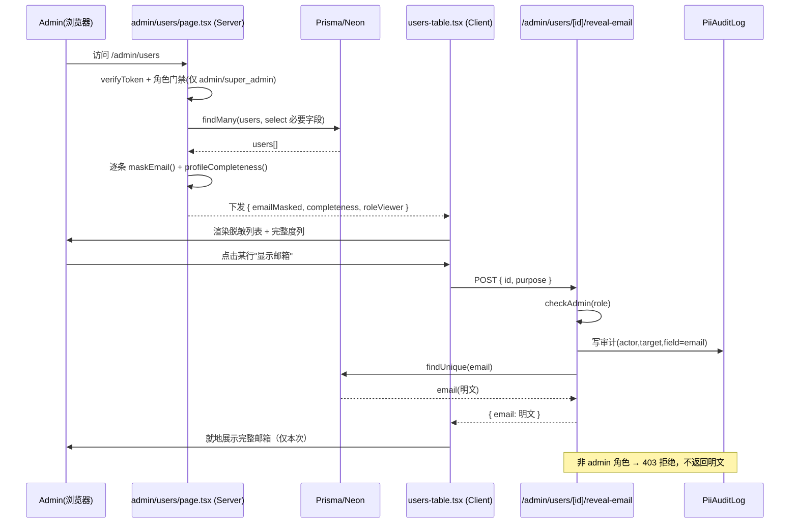
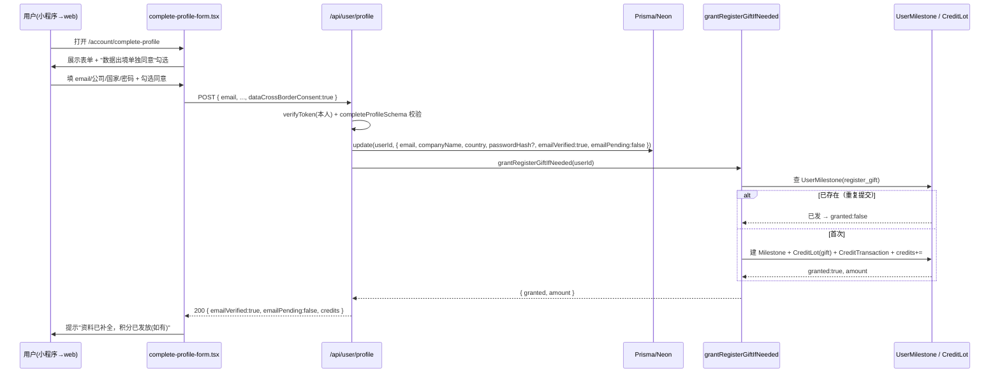
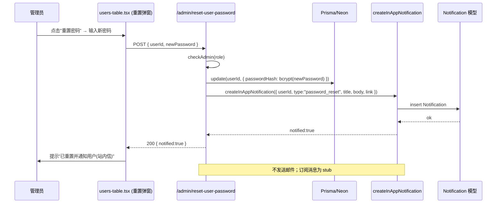

# 邮箱数据安全方案「阶段 0」技术设计与任务分解

> **版本**：阶段 0 实施设计 V1.0 ｜ **日期**：2026-07-23 ｜ **架构师**：高见远（Bob）
> **上游依据**：《邮箱数据安全与合规补全找回方案》V1.0（立忠已批准，决策层方案）
> **上游统一方案**：《统一注册登录权限与积分经营方案》（角色/会员/红线口径一致）
> **性质**：**仅技术设计与任务分解，不写实现代码、不修改任何源文件**。所有改动以"新增/修改"清单与接口签名呈现，落地由工程师按本文执行。
> **代码依据**：基于真实代码读取（`prisma/schema.prisma`、`src/app/api/auth/**`、`src/lib/**`、`src/app/[locale]/admin|auth|privacy`），设计不脱离现状。

---

## 一、实现方案与框架选型

### 1.1 现状事实（决定设计边界）

| 维度 | 现状（已实读代码） | 对阶段 0 的含义 |
|------|------------------|----------------|
| 技术栈 | Next.js 14 App Router + Prisma + Neon(PostgreSQL) + Tailwind + next-intl（8 语言路由）+ Vercel 部署 | 阶段 0 **沿用，不引入新重依赖** |
| User 模型 | `email String? @unique`、`phone String?`、`resetToken/resetTokenExpires`；**无 `emailPending`/`emailVerified`** | 需最小新增 2 个布尔字段 |
| DB 访问 | `src/lib/db.ts` 裸 Prisma 单例，**无加密层，明文存储** | 阶段 0 仅脱敏（不加密），但 PII 读写必须收口到 `src/lib/pii.ts` 为阶段 2 加密留 seam |
| 鉴权 | `src/lib/auth.ts`（Node 端 `verifyToken`）、`src/lib/auth-edge.ts`（Edge 端 HS256）；角色 `super_admin/admin/seller/buyer/editor` | `checkAdmin` 复用 `admin/credits/route.ts` 的 `["admin","super_admin"].includes(role)` 模式 |
| 站内信 | **`Notification` 模型已存在**（`user` 关联、`type/title/body/link/read`） | 0-4 管理员重置通知**直接复用**，无需新建模型 |
| 后台用户列表 | `src/app/[locale]/admin/users/page.tsx` 服务端组件，**原样渲染 `u.email`（明文，无脱敏）** | 0-1 核心改造点：改为服务端脱敏 + 客户端"显示"按钮 + 审计 |
| 注册接口 | `auth/register/route.ts` 用 `registerSchema`（email 可选）+ `membershipConfig.free.credits` 直接写 `credits` | 需补 `dataCrossBorderConsent` 校验、`emailPending/emailVerified` 写入 |
| 小程序注册 | `auth/miniprogram/login/route.ts` 建号**只写** miniOpenid/username/passwordHash/role/lang，**缺 email** | 置 `emailPending=true`，不阻塞注册 |
| 补全资料页 | **无** `account`/`profile`/`settings` 路由 | 0-3 web 补全入口为**全新页面** |
| 管理员重置 API | **不存在**（`admin/credits|role|expo` 有，无 `reset-user-password`） | 0-4 需**新建** API |
| 隐私政策 | `privacy/page.tsx` 内联 `PrivacyContentZh/En`（仅 zh/en 两套，**非 8 语言**） | 0-5 加"数据出境"专章（zh/en 内联，8 语言同步见待明确） |
| 订阅消息 | 无基础设施 | 0-4 仅做**站内信**（真实）；小程序订阅消息留 **stub 接口** |

### 1.2 框架选型与决策

| 项 | 选型 | 理由 |
|----|------|------|
| 前端框架 | 沿用 Next.js 14 App Router（Server + Client Components） | 后台列表用 Server Component 脱敏后下发，避免明文到客户端 |
| ORM / DB | 沿用 Prisma + Neon | 仅加 2 个字段 + 1 个新增审计模型（`db push` 同步） |
| 国际化 | 沿用 next-intl | 注册表单同意文案走 `messages/*.json` 翻译 key；隐私政策内联 zh/en |
| 样式 | 沿用 Tailwind | 复用现有 `Input/Select/Button`（`@/components/ui/*`） |
| 加密（阶段 2） | **本阶段不做**，仅预留 seam | 所有 PII 序列化收口 `src/lib/pii.ts`，阶段 2 在其中加 AES-256 |
| 新依赖 | **无** | 脱敏=纯函数，站内信=现有 Notification 模型，审计=新增 Prisma 模型 |

### 1.3 架构模式

- **PII 收口层（seam）**：所有邮箱/手机"写库前 / 读出库后 / 返回 API 前"的处理统一经过 `src/lib/pii.ts`（脱敏）+ `src/lib/credits`、`src/lib/notify` 等纯函数模块。组件/路由**禁止**手写脱敏逻辑。
- **角色门禁**：后台 PII 读取接口服务端硬校验 `role ∈ {super_admin, admin}`；`seller/buyer` 仅可见本人资料。
- **审计留痕**：`super_admin/admin` 点击"显示完整邮箱"→ 服务端写 `PiiAuditLog` 后再返回明文。
- **幂等发分**：补全资料触发注册礼包，经 `UserMilestone(register_gift)` 去重，重复提交不重复发分。

---

## 二、文件清单（新增 / 修改，相对路径）

> 路径相对仓库根 `usedfarmmach/`。标注【新增】/【修改】。

### 2.1 数据层（Schema / Lib）

| 文件 | 动作 | 说明 |
|------|------|------|
| `prisma/schema.prisma` | 【修改】 | `User` 增加 `emailPending`、`emailVerified`；**新增** `PiiAuditLog` 模型（additive，不动任何现有模型） |
| `src/lib/pii.ts` | 【新增】 | 脱敏与 PII 序列化核心：`maskEmail` / `maskPhone` / `canViewFullPii` / `piiResponse` / `profileCompleteness` |
| `src/lib/credits/grant.ts` | 【新增】 | 幂等注册礼包：`grantRegisterGiftIfNeeded(userId)` |
| `src/lib/notify.ts` | 【新增】 | `createInAppNotification(...)`（真实，写 Notification）；`sendWechatSubscribeMessage(...)`（**stub**，留接口） |

### 2.2 校验（Validators）

| 文件 | 动作 | 说明 |
|------|------|------|
| `src/lib/validators.ts` | 【修改】 | `registerSchema` 增 `dataCrossBorderConsent` 必填布尔；新增 `completeProfileSchema`、`adminResetPasswordSchema` |

### 2.3 API 路由

| 文件 | 动作 | 说明 |
|------|------|------|
| `src/app/api/auth/miniprogram/login/route.ts` | 【修改】 | 建号时 `emailPending: true`（email 恒空，不阻塞） |
| `src/app/api/auth/register/route.ts` | 【修改】 | 接收并校验 `dataCrossBorderConsent`；建号写 `emailPending/emailVerified` |
| `src/app/api/user/profile/route.ts` | 【新增】 | `POST` 本人补全资料（email/company/country/password），设 `emailVerified`，幂等发分 |
| `src/app/api/admin/reset-user-password/route.ts` | 【新增】 | `POST` 管理员手动重置密码（仅 admin）+ 站内信通知 |
| `src/app/api/admin/users/[id]/reveal-email/route.ts` | 【新增】 | `POST` 显示完整邮箱（仅 admin）+ 写 `PiiAuditLog` 审计 |

### 2.4 后台界面（Admin）

| 文件 | 动作 | 说明 |
|------|------|------|
| `src/app/[locale]/admin/users/page.tsx` | 【修改】 | Server：脱敏 email 下发、计算完整度、角色门禁收紧到 admin/super_admin；列表数据传给 client table |
| `src/app/[locale]/admin/users/users-table.tsx` | 【新增】 | Client：脱敏展示 + "显示"按钮（调 reveal API）+ 资料完整度列 + 重置密码入口 |
| `src/app/[locale]/admin/users/credit-manager.tsx` | 【修改】 | 保留原有积分管理；本次不改动其核心（完整度列与重置入口放 `users-table.tsx`） |

### 2.5 前端表单 / 页面（Auth / Account / Privacy）

| 文件 | 动作 | 说明 |
|------|------|------|
| `src/components/auth/register-form.tsx` | 【修改】 | 注册表单加"已阅读并同意数据出境"勾选，提交携带 `dataCrossBorderConsent` |
| `src/components/auth/forgot-password-form.tsx` | 【修改】 | 无邮箱用户提示"请联系客服/管理员重置" |
| `src/app/[locale]/account/complete-profile/page.tsx` | 【新增】 | web 补全资料页（引导式，非强制） |
| `src/components/account/complete-profile-form.tsx` | 【新增】 | 补全资料表单 + 数据出境同意勾选 + 调 `/api/user/profile` |
| `src/app/[locale]/privacy/page.tsx` | 【修改】 | `PrivacyContentZh` / `PrivacyContentEn` 增加"数据出境"专章 |
| `messages/zh.json`、`messages/en.json`（及 8 语言文件） | 【修改】 | 注册同意勾选文案 key（如 `auth.register.crossBorderConsent`） |

> 注：隐私政策正文为内联 JSX（zh/en），不依赖 `messages/*.json`；翻译 key 仅用于注册/补全表单的勾选文案。

---

## 三、数据结构与接口

### 3.1 Prisma Schema 变更（最小、additive）

```prisma
// ── model User：仅新增 2 个布尔字段，其余字段与关系一律不动 ──
model User {
  // …… 现有字段保持不变 ……

  /// 邮箱待补全标记：小程序无邮箱注册自动置 true；web 注册有邮箱则 false
  emailPending Boolean @default(false)

  /// 邮箱是否已验证：阶段0补全即视为已验证（自证）；阶段1改为令牌验证后置 true
  emailVerified Boolean @default(false)

  // …… 现有关系（apiKeys / auctionsAsSeller / notifications / creditLots …）全部保留 ……
}

// ── 新增模型：PII 访问审计（additive，不影响任何现有表）──
/// 记录"谁、何时、读了哪个用户的哪个 PII 字段、用途"，保留 ≥6 个月
model PiiAuditLog {
  id           String   @id @default(cuid())
  actorId      String   // 操作人（admin/super_admin）userId
  targetUserId String   // 被查看的用户
  field        String   // 如 "email" | "phone"
  action       String   @default("view_full") // view_full | export
  purpose      String?  // 用途备注（可选）
  createdAt    DateTime @default(now())

  @@index([actorId, createdAt])
  @@index([targetUserId, createdAt])
}
```

> **同步步骤（必要）**：
> 1. `npx prisma generate` —— 重新生成 client（类型含新字段）。
> 2. `npx prisma db push` —— 将 `emailPending/emailVerified/PiiAuditLog` 推到 Neon（无迁移历史风险，沿用现有 push 流程）。
> 3. 现有 `Subscriber`、`CreditLot`、`Invitation`、`UserMilestone`、`Notification` 等**全部保留不动**。

### 3.2 脱敏与 PII 序列化层 `src/lib/pii.ts`（新增，核心 seam）

```ts
// 脱敏规则严格遵循方案 3.2：邮箱 zh***@qq.com；手机 138****8000
export function maskEmail(raw: string | null | undefined): string
export function maskPhone(raw: string | null | undefined): string

// 角色可见性：仅 super_admin / admin 可看完整 PII
export function canViewFullPii(role: string): boolean   // role ∈ {super_admin, admin}

// 统一 PII 响应构造：默认全部脱敏；仅当 viewer 为 admin 且显式 reveal 时才带 full
export interface PiiViewer { role: string }
export function piiResponse(
  user: { email?: string | null; phone?: string | null; /* … */ },
  opts: { viewer: PiiViewer; reveal?: boolean }
): { email: string; phone: string; emailFull?: string; phoneFull?: string }

// 资料完整度（方案 4.2）：用于后台"完整度列"与引导补全
export interface Completeness {
  hasEmail: boolean; hasCompany: boolean; hasCountry: boolean; hasPhone: boolean;
  score: number;        // 0–100
  pending: boolean;     // emailPending === true
}
export function profileCompleteness(user: {
  email?: string | null; companyName?: string | null;
  country?: string | null; phone?: string | null; emailPending?: boolean;
}): Completeness
```

> **约束（共享知识）**：组件/路由**禁止**手写脱敏；一律 import `pii.ts`。阶段 2 加密在此文件内加 `encryptField/decryptField`，调用方不变。

### 3.3 幂等发分 `src/lib/credits/grant.ts`（新增）

```ts
// 经 UserMilestone(register_gift) 去重；已发则跳过，保证幂等
// 数值取 DEFAULT_REWARD_VALUES.registerGift（见 src/lib/credits/constants.ts）
export async function grantRegisterGiftIfNeeded(userId: string): Promise<{ granted: boolean; amount: number }>
```

### 3.4 通知 `src/lib/notify.ts`（新增）

```ts
// 真实：写 Notification 模型（站内信）
export async function createInAppNotification(input: {
  userId: string; type: string; title: string; body?: string; link?: string;
}): Promise<void>

// Stub：小程序订阅消息（阶段1/2 接入）。阶段0 仅留接口，调用即 no-op / 抛 NotImplemented
export async function sendWechatSubscribeMessage(input: {
  userId: string; templateId: string; data: Record<string, unknown>;
}): Promise<{ delivered: false; reason: "not_implemented" }>
```

### 3.5 关键 API 签名

#### ① `POST /api/user/profile`（本人补全资料，0-3）

```ts
// 请求头：Authorization: Bearer <token>（本人）
// 请求体（completeProfileSchema）：
{
  email?: string;          // 合法邮箱；提交即视为验证（阶段0自证，见待明确）
  companyName?: string;
  country?: string;
  password?: string;        // 可选，设/改登录密码（≥6位）
  dataCrossBorderConsent: boolean; // 必须 true
}
// 响应：
// 200 { success: true, data: { emailVerified: true, emailPending: false, credits: number } }
// 400 { success: false, error: "..." }          // 校验失败 / 未勾选同意
// 401 { success: false, error: "未登录" }
// 409 { success: false, error: "邮箱已被占用" }   // email 唯一约束冲突
```
> 服务端动作：更新本人字段 → `emailVerified=true`、`emailPending=false` → 调 `grantRegisterGiftIfNeeded`（幂等）→ 返回最新积分。

#### ② `POST /api/admin/reset-user-password`（管理员重置，0-4）

```ts
// 请求头：Authorization: Bearer <token>（admin/super_admin）
// 请求体（adminResetPasswordSchema）：
{ userId: string; newPassword?: string }  // newPassword 可不传，由服务端生成随机密码
// 响应：
// 200 { success: true, data: { notified: true } }
// 403 { success: false, error: "无权限" }     // 非 admin 角色
// 404 { success: false, error: "用户不存在" }
```
> 服务端动作：`checkAdmin` → `bcrypt.hash(newPassword)` 更新 `passwordHash` → `createInAppNotification`（站内信："您的密码已被管理员重置，请尽快登录修改"）→ （stub）`sendWechatSubscribeMessage`。**不发邮件**。

#### ③ `POST /api/admin/users/[id]/reveal-email`（显示完整邮箱 + 审计，0-1）

```ts
// 请求头：Authorization: Bearer <token>（admin/super_admin）
// 路径参数：id = 目标用户 id
// 请求体：{ purpose?: string }
// 响应：
// 200 { success: true, data: { email: string } }   // 返回明文（仅本次）
// 403 { success: false, error: "无权限" }
```
> 服务端动作：`checkAdmin` → 写 `PiiAuditLog{actorId, targetUserId:id, field:"email", action:"view_full", purpose}` → 返回该用户明文 email。**列表默认不下发明文**（已在 Server Component 脱敏）。

#### ④ `POST /api/auth/register`（改造，0-3/0-5）

```ts
// 请求体新增：dataCrossBorderConsent: boolean（必须 true，否则 400）
// 建号写入：emailPending = email ? false : true；emailVerified = false
```

#### ⑤ `POST /api/auth/miniprogram/login`（改造，0-3）

```ts
// 建号 data 新增：emailPending: true   // email 恒空，不阻塞注册
```

---

## 四、程序调用流程（Mermaid 时序图）

### 4.1 后台查看用户列表（脱敏 → 角色校验 → 完整需留痕）



### 4.2 小程序用户 web 补全邮箱（提交 → 设 emailVerified → 触发发分幂等）



### 4.3 管理员手动重置密码 + 站内信通知（0-4）



---

## 五、任务列表（有序、含依赖、按实现顺序）

> 共 **12** 个原子任务。依赖关系见末节依赖图。验收点供工程师自检。

| 编号 | 任务 | 涉及文件 | 依赖 | 优先级 | 验收点 |
|------|------|----------|------|--------|--------|
| T01 | Schema 加字段 + 审计模型并同步 | `prisma/schema.prisma` | — | P0 | `prisma generate` + `db push` 成功；`User.emailPending/emailVerified`、`PiiAuditLog` 存在；现有模型零改动 |
| T02 | PII 脱敏/序列化核心库 | `src/lib/pii.ts`【新增】 | — | P0 | `maskEmail("zhangsan@qq.com")==="zh***@qq.com"`；`maskPhone("13812348000")==="138****8000"`；`canViewFullPii("admin")===true`、`("buyer")===false` |
| T03 | 校验器扩展 | `src/lib/validators.ts` | — | P0 | `registerSchema` 含 `dataCrossBorderConsent` 必填；`completeProfileSchema`、`adminResetPasswordSchema` 可解析 |
| T04 | 幂等注册礼包 | `src/lib/credits/grant.ts`【新增】 | — | P1 | 连调两次 `grantRegisterGiftIfNeeded` 仅发一次；积分不重复增加 |
| T05 | 通知层（站内信真实 + 订阅 stub） | `src/lib/notify.ts`【新增】 | — | P1 | `createInAppNotification` 写入 `Notification`；`sendWechatSubscribeMessage` 返回 `not_implemented` 不报错 |
| T06 | 注册链路写入 pending/同意 | `auth/miniprogram/login/route.ts`、`auth/register/route.ts` | T01,T03 | P0 | 小程序注册置 `emailPending=true` 且不阻塞；web 注册未勾选同意→400，有邮箱则 `emailPending=false` |
| T07 | 后台列表脱敏 + 完整度列 | `admin/users/page.tsx`、`admin/users/users-table.tsx`【新增】 | T01,T02 | P0 | 列表默认脱敏邮箱；新增"资料完整度"列（含 pending 标灰）；非 admin 看不到明文 |
| T08 | 显示完整邮箱 + 审计 API | `admin/users/[id]/reveal-email/route.ts`【新增】 | T01,T02 | P0 | admin 点击"显示"→返回明文且 `PiiAuditLog` 留痕；非 admin→403 |
| T09 | 管理员重置密码 API + 通知 | `admin/reset-user-password/route.ts`【新增】 | T05 | P1 | 重置后目标用户收到站内信；非 admin→403；不发送邮件 |
| T10 | web 补全资料 API | `user/profile/route.ts`【新增】 | T01,T03,T04 | P0 | 提交后 `emailVerified=true/emailPending=false`；重复提交发分幂等；未勾选同意→400 |
| T11 | 前端：补全页 + 注册同意 + 忘记密码提示 | `account/complete-profile/page.tsx`【新增】、`complete-profile-form.tsx`【新增】、`register-form.tsx`、`forgot-password-form.tsx`、`messages/*.json` | T03,T10 | P0 | 补全页可提交并提示结果；注册未勾选被拦截；忘记密码页提示联系管理员 |
| T12 | 隐私政策"数据出境"专章 | `privacy/page.tsx` | — | P0 | 页面含"数据出境"章节，列明 Vercel/Neon 等境外接收方与单独同意说明（zh/en） |

---

## 六、依赖包列表

| 包 | 版本 | 用途 | 是否新增 |
|----|------|------|----------|
| `next` | ^14 | App Router（沿用） | 否 |
| `prisma` / `@prisma/client` | 现有 | ORM（沿用） | 否 |
| `zod` | 现有 | 校验（沿用 `validators.ts`） | 否 |
| `bcryptjs` | 现有 | 密码哈希（沿用） | 否 |
| `next-intl` | 现有 | 国际化（沿用） | 否 |
| `lucide-react` | 现有 | 图标（沿用） | 否 |

> **结论：阶段 0 无需新增任何第三方依赖。** 脱敏为纯函数，站内信复用现有 `Notification` 模型，审计为新增 Prisma 模型（`db push` 同步，无外部依赖）。

---

## 七、共享知识（跨文件约定）

1. **脱敏唯一出口**：所有邮箱/手机脱敏一律走 `src/lib/pii.ts` 的 `maskEmail`/`maskPhone`；**禁止**在组件/路由里手写 `slice/replace` 脱敏。
2. **后台完整 PII 读取**：仅 `super_admin`/`admin` 在点击"显示"后由 `reveal-email` API 返回明文，且**必须**写 `PiiAuditLog`（谁/何时/读谁/字段/用途）。
3. **Schema 同步是硬步骤**：新增/修改字段后，`prisma generate` + `prisma db push` 必做；CI/部署前确认迁移已应用。
4. **小程序注册不阻塞**：`miniprogram/login` 建号恒置 `emailPending=true`（email 恒空），**不因缺邮箱失败**；web 注册 email 可选，有则 `emailPending=false`。
5. **阶段 0 视为"自证验证"**：补全资料提交即把 `emailVerified=true`（无邮件服务，无法发验证链接）；阶段 1 接入 Resend 后改为令牌验证后置 true（已在 `user/profile` 留口）。
6. **发分幂等**：补全触发的注册礼包必须经 `grantRegisterGiftIfNeeded`（基于 `UserMilestone.register_gift` 去重），重复提交不重复发分。
7. **通知渠道**：管理员重置**只走站内信**（写 `Notification`）+ 订阅消息 stub；**不发邮件**（方案 5.1）。
8. **隐私合规底线**：注册/补全表单必须"数据出境单独同意"勾选（`dataCrossBorderConsent=true` 才放行）；隐私政策含"数据出境"专章。
9. **加密 seam 预留**：PII 读写收口 `pii.ts`；阶段 2 在其中加 `encryptField/decryptField`，调用方无需改动。
10. **现有模型零改动**：`Subscriber`、`CreditLot`、`Invitation`、`UserMilestone`、`Notification`、`ApiKey` 等已上线表一律不动；新增仅 `PiiAuditLog`（additive）。

---

## 八、待明确事项（需老板/PM 拍板或工程师注意）

| # | 事项 | 现状/建议 | 影响 |
|---|------|-----------|------|
| Q1 | **注册礼包数值口径**：`register/route.ts` 当前直接写 `credits: membershipConfig.free.credits = 10`，而 `credits/constants.ts` 的 `registerGift` 默认为 **5**。补全触发发分应以哪个为准？ | 建议统一为 `DEFAULT_REWARD_VALUES.registerGift`（5），并让 web 注册也改走 `grantRegisterGiftIfNeeded` 幂等发放，避免双口径。 | 影响发分金额与幂等逻辑 |
| Q2 | **单独同意是否持久化**：方案允许"绑定现有同意逻辑或新增字段"。阶段 0 仅做**提交时校验**（不落库）。是否需新增 `consentCrossBorderAt DateTime?` 留存同意Proof？ | 建议阶段 0 仅校验（最小 schema 改动）；若合规要求留存证据，后续加 `consentCrossBorderAt` 字段（additive）。 | schema 是否再加字段 |
| Q3 | **隐私政策 8 语言同步**：站点标称 8 语言，但 `privacy/page.tsx` 仅内联 zh/en 两套，"数据出境"专章若只补 zh/en，其余 6 语言是否暂缺？ | 建议阶段 0 先补 zh/en（与现有结构一致），8 语言全量同步列入后续；或确认隐私页是否本就只出 zh/en。 | 合规完整性 |
| Q4 | **订阅消息基础设施**：`sendWechatSubscribeMessage` 为 stub。是否需要本阶段配置小程序 AppID/模板 ID 占位？ | 阶段 0 仅留接口；AppID/模板在阶段 1 接入 Resend/订阅时一并配置。 | 无阻塞 |
| Q5 | **后台角色门禁收紧**：`admin/users/page.tsx` 当前仅把 `editor` 重定向到 products，`seller/buyer` 仍能进入。是否本阶段一并收紧到仅 `admin/super_admin`？ | 建议在 T07 一并加服务端角色校验（与 API 的 `checkAdmin` 对齐），避免越权看列表。 | 安全 |
| Q6 | **"近期待注册用户"范围**：当前 `admin/users` 拉全量 `findMany`。完整度列加在全量，还是新增"仅待补全(emailPending 或资料缺失)"筛选视图？ | 建议全量加列 + 顶部加"仅待补全"筛选开关（前端过滤），不改查询。 | UX |
| Q7 | **emailVerified 自证风险**：阶段 0 补全即 `emailVerified=true`，未经邮件确认，个保法下"验证"语义偏弱。 | 已在共享知识第 5 条说明为阶段 0 临时口径；阶段 1 改令牌验证。需 PM 确认可接受。 | 合规 |
| Q8 | **审计保留与导出**：`PiiAuditLog` 保留 ≥6 个月（方案 3.4）。是否需配套"导出审批"界面？ | 阶段 0 仅落库 + reveal 写入；导出审批（super_admin 审批）建议放阶段 1/2。 | 范围边界 |

---

## 附：类图（Mermaid）

```mermaid
classDiagram
    class User {
      +String id
      +String? email
      +String? phone
      +String role
      +String? companyName
      +String? country
      +Boolean emailPending
      +Boolean emailVerified
      +notifications Notification[]
    }
    class PiiAuditLog {
      +String id
      +String actorId
      +String targetUserId
      +String field
      +String action
      +DateTime createdAt
    }
    class Notification {
      +String id
      +String userId
      +String type
      +String title
      +String? body
      +String? link
      +Boolean read
    }
    class PiiService {
      <<lib/pii.ts>>
      +maskEmail(raw) string
      +maskPhone(raw) string
      +canViewFullPii(role) boolean
      +piiResponse(user, opts) object
      +profileCompleteness(user) Completeness
    }
    class CreditGrantService {
      <<lib/credits/grant.ts>>
      +grantRegisterGiftIfNeeded(userId) Promise~{granted,amount}~
    }
    class NotifyService {
      <<lib/notify.ts>>
      +createInAppNotification(input) Promise~void~
      +sendWechatSubscribeMessage(input) Promise~{delivered:false}~
    }
    User "1" --> "0..*" Notification : 站内信
    PiiAuditLog ..> User : actorId / targetUserId
    PiiService ..> User : 序列化/脱敏
    CreditGrantService ..> User : 幂等发分(经 UserMilestone)
    NotifyService ..> Notification : 写入
```

---

> **落盘路径**：`D:\神雕农机\usedfarmmach\docs\architecture\邮箱方案阶段0实施设计_2026-07-23.md`
> **交付物**：本文档（设计 + 任务分解，未改动任何源码）。下一步由工程师按 T01→T12 顺序实现，共享知识第 1–10 条为跨文件硬约束。
