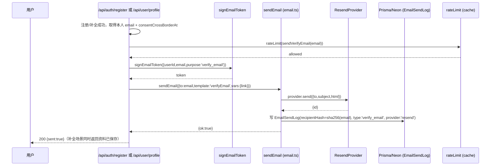
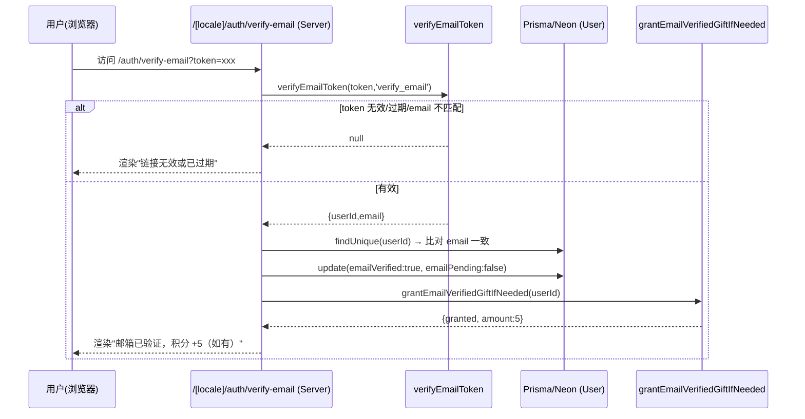
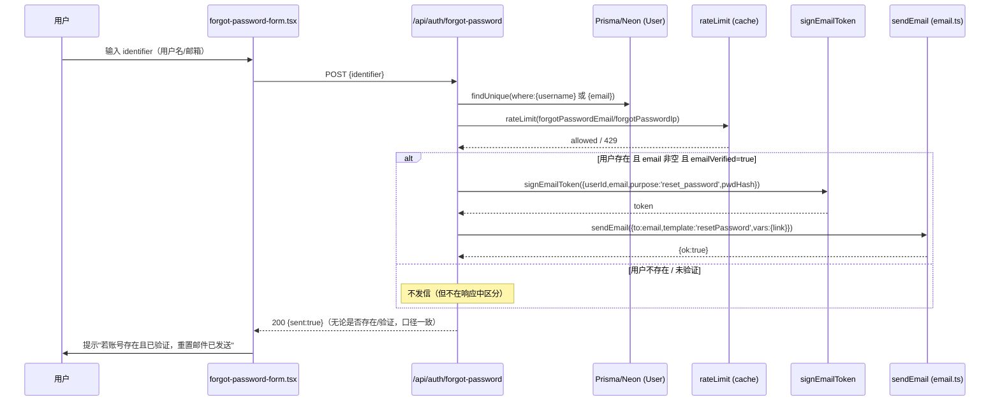
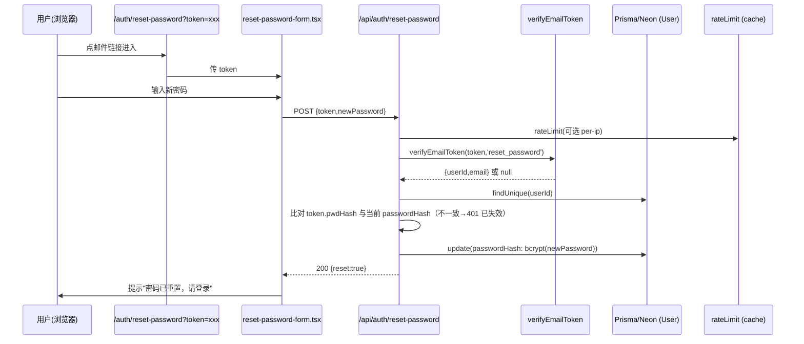
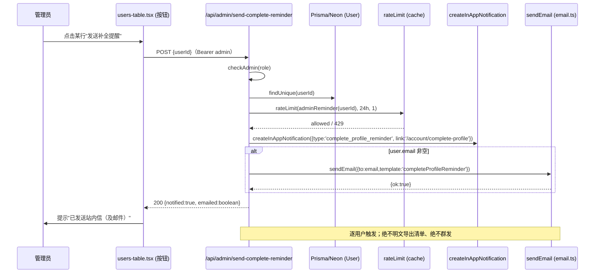
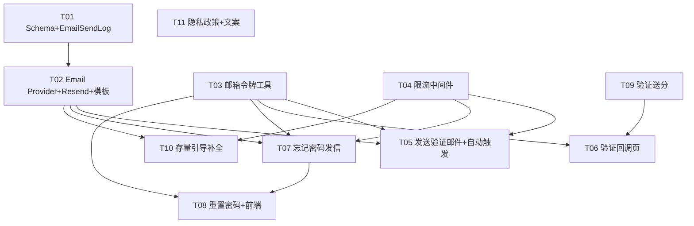

# 邮箱数据安全方案「阶段 1」技术设计与任务分解

> **版本**：阶段 1 实施设计 V1.0 ｜ **日期**：2026-07-24 ｜ **架构师**：高见远（Bob）
> **上游依据**：《邮箱数据安全与合规补全找回方案》V1.0（立忠已批准）
> **前置落地**：阶段 0（commit 771cc94，已部署）——脱敏展示、emailPending 标记、资料完整度列、管理员手动重置、隐私政策数据出境专章、web 补全入口
> **性质**：**仅技术设计与任务分解，不写实现代码、不修改任何源文件**。所有改动以"新增/修改"清单与接口签名呈现，落地由工程师按本文执行。
> **代码依据**：基于真实代码读取（`prisma/schema.prisma`、`src/lib/pii.ts`、`src/lib/credits/grant.ts`、`src/lib/notify.ts`、`src/lib/cache.ts`、`src/app/api/**`、`src/app/[locale]/admin/users/**`），设计不脱离现状与阶段 0 风格。

---

## 〇、合规硬约束：Resend（美国）取舍与推荐方案

> 任务明确要求：Resend 是美国服务商，把中国用户的邮箱地址（PII）发给 Resend，是在 Vercel+Neon 现有数据出境之上再增加一个境外处理方。必须给出明确取舍。

### 现状基线
- 站点已部署 **Vercel（美国）+ Neon PostgreSQL（境外）+ 密钥在 Vercel 环境变量** → 所有个人信息（含邮箱 PII）在存储/处理环节**均已发生数据出境**（阶段 0 隐私政策已单列"数据出境"专章，注册/补全已强制"单独同意"）。
- 个保法第 38/39 条：向境外提供个人信息须**告知 + 单独同意 + PIPIA**；累计一般个人信息 **< 10 万人** 可豁免"安全评估/标准合同/认证"三项行政机制，但**告知与单独同意为硬性要求**。

### 推荐方案（综合 PM 方案拍板项 #4 与合规要求）
**采用 (a) 接受并随之更新隐私政策"数据出境"章（将 Resend, Inc. 列为境外接收/处理方），同时 (b) 在架构层预留国内邮件服务商切换能力，待 ICP + 域名备案完成后双轨追加阿里云 DirectMail / 腾讯云 SES 提升国内送达率。**

理由：
1. **零资质、可立即上线**：Resend 注册即用，对境外买家（站点主营出口农机，海外客户占比高）送达率好；阿里云 DirectMail / 腾讯云 SES 需备案与资质，当前 ICP 未就绪，不可阻塞阶段 1。
2. **出境面可控**：阶段 1 仅向邮件服务商传输**必要字段（邮箱地址本身）**，传输场景严格限定为三类事务邮件（验证 / 重置 / 补全提醒），不外传手机号、公司名等其他 PII；传输通道全程 TLS。
3. **合规动作明确**：在隐私政策"数据出境"章**追加 Resend 为境外处理方**（处理目的、数据项、所在国家、行权渠道），注册/补全时的"数据出境单独同意"已覆盖该场景（阶段 0 已落地），并建议补做 PIPIA 留档。
4. **可平滑切换**：通过 `EmailProvider` 抽象（见 §2 / §3），国内服务商接入仅是新增一个实现类 + 环境变量切换，**业务代码零改动**；未来可按收件人属地（如国内域名 → 阿里云，海外 → Resend）做双轨路由。

> **结论一句话**：阶段 1 先接 Resend（并在隐私政策列其为境外处理方），架构预留国内服务商切换；不以"等待国内服务商资质"为由拖延邮箱可用化。

---

## 一、实现方案与框架选型

### 1.1 现状事实（决定设计边界）

| 维度 | 现状（已实读代码） | 对阶段 1 的含义 |
|------|------------------|----------------|
| 技术栈 | Next.js 14 App Router + Prisma + Neon + Tailwind + next-intl（8 语言）+ Vercel | 沿用，不引入新重框架 |
| User 模型 | 已有 `email` / `emailPending` / `emailVerified` / `consentCrossBorderAt`；`resetToken`/`resetTokenExpires` 存在但**阶段 0 未使用** | 验证/重置**改用签名令牌**（stateless），不新增 DB 表；`User` 字段零改动 |
| 加密 | `db.ts` 裸 Prisma 单例，**明文存储**（阶段 2 才做字段级加密） | 阶段 1 令牌内**不存明文敏感字段**；EmailSendLog 仅存邮箱 SHA-256 摘要 |
| 缓存/限流 | `src/lib/cache.ts` 已封装，prod 走 Upstash Redis、dev 走内存 | 限流**复用 cache.ts**，跨实例一致，无需新依赖 |
| 邮件库 | `package.json` 已含 `nodemailer`，但 PM 明确要接 **Resend** | 新增 `resend` 依赖 + `EmailProvider` 抽象；nodemailer 暂不使用（可作未来备选） |
| 站内信 | `notify.ts` 的 `createInAppNotification` 已落地 | 存量用户引导补全**复用站内信** + 邮件双通道 |
| PII 审计 | `PiiAuditLog`（阶段 0）记录"人读完整 PII" | 发邮件**不写 PiiAuditLog**（非人读），改用轻量 `EmailSendLog` 做跨境/限流追溯 |

### 1.2 框架/库选型

| 项 | 选型 | 理由 |
|----|------|------|
| 邮件发送 | 新增 `resend`（`^4`）Node SDK | PM 指定；零资质、境外送达好、API 简洁 |
| 邮件抽象 | `EmailProvider` 接口 + `ResendProvider` 实现 + 国内 stub | 便于换阿里云/腾讯云（合规诉求），业务代码不动 |
| 令牌方案 | **JWT 签名 magic link**（复用 `JWT_SECRET`，stateless） | 不新增 DB 表；与 `auth.ts` 的 sign/verify 一致；重置令牌内嵌 `passwordHash` 摘要实现"改密即作废" |
| 限流 | 复用 `src/lib/cache.ts`（Upstash Redis / 内存） | 已存在，跨实例一致，免新依赖 |
| 模板渲染 | `src/lib/email/templates.ts` 纯函数返回 `{subject, html, text}` | 无 JSX 依赖、易测、易 i18n |
| 新依赖 | 仅 `resend`（+ `@types/resend` 如有） | 其余全部复用现有库 |

### 1.3 两个关键设计决策的取舍

**决策 A：是否新增 EmailToken / PasswordResetToken 表？**
> **推荐：不新增表，改用 JWT 签名令牌（`src/lib/email-token.ts`）。**
- 理由：① 验证邮件与重置链接本质都是"短期、一次性、可绑定声明的令牌"，JWT 签名天然满足；② 复用既有 `JWT_SECRET` 与 `auth.ts` 的验签模式，风格统一、免迁移；③ stateless 无需清理过期行；④ 重置令牌通过**内嵌 `passwordHash` 摘要**实现"用户改密后旧链接自动失效"（天然吊销）。
- 现有 `User.resetToken` / `resetTokenExpires` 列**保留不动**（共享知识：现有模型零改动），本阶段不使用，由签名令牌机制取代。

**决策 B：发送验证/重置邮件是否写 PiiAuditLog？**
> **规则：发送邮件不写 PiiAuditLog；但写轻量 `EmailSendLog`（仅存收件邮箱 SHA-256 摘要）。**
- `PiiAuditLog` 语义 = **人工（admin）查看/导出完整 PII**，发送邮件是向用户本人地址的自动化流程，不构成"运营人员读到明文"，故**不触发 PiiAuditLog**（避免审计噪声）。
- 但向境外处理方（Resend）传输邮箱属于**跨境处理事件**，需可追溯以支撑合规（PIPIA、10 万人阈值监控）。故新增 `EmailSendLog`：记录 `{userId?, type, provider, recipientHash, status, ip, createdAt}`，**recipientHash 为邮箱 SHA-256（不存明文）**，既留痕又不二次扩散 PII。
- 限流命中、发送失败同样写 `EmailSendLog(status=failed)` 以便排查。

### 1.4 架构模式
- **邮件收口层**：所有发信一律经 `src/lib/email.ts` 的 `sendEmail()` 门面 → 选 provider → 调 `EmailSendLog` 写摘要；组件/路由**禁止**直接 `new Resend()`。
- **令牌收口层**：所有邮箱类令牌经 `src/lib/email-token.ts` 的 `signEmailToken`/`verifyEmailToken`，`purpose` 强绑定（verify_email / reset_password / complete_profile_reminder），杜绝混用。
- **限流收口层**：发信类接口统一在入口调 `rateLimit()`（基于 `cache.ts`）。
- **幂等发分**：验证成功经 `grantEmailVerifiedGiftIfNeeded`（基于 `UserMilestone.email_verified_gift` 去重）。
- **不泄露原则**：忘记密码统一返回"若邮箱存在已发送"，不区分账号是否存在；仅对 `emailVerified=true` 用户发重置邮件（方案 5.2）。

---

## 二、文件清单（新增 / 修改，相对路径）

> 路径相对仓库根 `usedfarmmach/`。标注【新增】/【修改】。

### 2.1 数据层（Schema / Lib）
| 文件 | 动作 | 说明 |
|------|------|------|
| `prisma/schema.prisma` | 【修改】 | **新增** `EmailSendLog` 模型（additive，仅存收件邮箱 hash）；`User` 现有字段与 `PiiAuditLog` 等**零改动** |
| `src/lib/email/provider.ts` | 【新增】 | `EmailProvider` 接口 + `ResendProvider`（resend SDK）+ 国内服务商 stub（`AliyunDirectMailProvider` / `TencentSesProvider`） |
| `src/lib/email.ts` | 【新增】 | `sendEmail()` 门面：按 env/config 选 provider → 发信 → 写 `EmailSendLog`（recipientHash） |
| `src/lib/email/templates.ts` | 【新增】 | 三套事务邮件模板（verifyEmail / resetPassword / completeProfileReminder）的 `{subject, html, text}` 构造 |
| `src/lib/email-token.ts` | 【新增】 | 签名/校验邮箱类令牌（基于 `JWT_SECRET`，`purpose` 绑定，重置令牌内嵌 `passwordHash` 摘要） |
| `src/lib/rate-limit.ts` | 【新增】 | `rateLimit()` 复用 `cache.ts`（Upstash/内存）；预设 per-email / per-ip / per-ip+email 限流 |
| `src/lib/credits/grant.ts` | 【修改】 | 新增 `grantEmailVerifiedGiftIfNeeded(userId)`（幂等，event=`email_verified_gift`） |
| `src/lib/credits/constants.ts` | 【修改】 | `MILESTONE_EVENTS` 增 `email_verified_gift`；`DEFAULT_REWARD_VALUES` 增 `emailVerifiedGift: 5` |
| `package.json` | 【修改】 | 新增依赖 `resend`（及 `@types/resend` 若有） |
| `.env.example`（或现有 env 文档） | 【修改】 | 新增 `RESEND_API_KEY`、`EMAIL_FROM`（如 `no-reply@usedfarmmach.com`） |

### 2.2 API 路由
| 文件 | 动作 | 说明 |
|------|------|------|
| `src/app/api/auth/send-verify-email/route.ts` | 【新增】 | `POST` 本人触发发送验证邮件（限流）；注册/补全后由服务端自动调用 |
| `src/app/[locale]/auth/verify-email/page.tsx` | 【新增】 | 验证回调页（Server Component）：读 `?token=` → 校验 → 置 `emailVerified=true` + 幂等发分 → 渲染结果 |
| `src/app/api/auth/forgot-password/route.ts` | 【新增】 | `POST` 忘记密码发信：统一返回"若邮箱存在已发送"；仅 `emailVerified` 用户发重置邮件（限流） |
| `src/app/api/auth/reset-password/route.ts` | 【新增】 | `POST` 消费 reset 令牌改密（校验内嵌 `passwordHash` 摘要） |
| `src/app/api/admin/send-complete-reminder/route.ts` | 【新增】 | `POST` 管理员发补全提醒（站内信 + 邮件双通道，限流，绝不导出明文） |
| `src/app/api/auth/register/route.ts` | 【修改】 | 注册成功（有 email 且已 consent）后自动调 `sendVerifyEmail` |
| `src/app/api/user/profile/route.ts` | 【修改】 | 补全提交且提供 email 时：置 `emailVerified=false`、自动发验证邮件（**取代阶段 0"自证即 true"**）；未提供 email 时维持阶段 0 行为 |

### 2.3 前端页面 / 组件（Auth / Account / Admin）
| 文件 | 动作 | 说明 |
|------|------|------|
| `src/components/auth/forgot-password-form.tsx` | 【修改】 | 文案细化：有邮箱走邮件、无邮箱提示联系管理员（沿用阶段 0 口径） |
| `src/components/auth/reset-password-form.tsx` | 【新增】 | 重置密码表单（输入新密码，调 reset-password API） |
| `src/app/[locale]/auth/reset-password/page.tsx` | 【新增】 | 重置页（读 `?token=`，渲染 reset-password-form） |
| `src/app/[locale]/admin/users/users-table.tsx` | 【修改】 | 行"操作"区新增"发送补全提醒"按钮（admin/super_admin 可见），调 `send-complete-reminder` |
| `src/app/[locale]/admin/users/page.tsx` | 【修改】 | 下发 `canRemind` 标识（同 `canReveal` 逻辑）给 `UsersTable` |
| `src/app/[locale]/privacy/page.tsx` | 【修改】 | "数据出境"章追加 Resend, Inc.（美国）为境外处理方及处理目的/数据项/行权渠道 |
| `messages/zh.json`、`messages/en.json`（及 8 语言文件） | 【修改】 | 新增 forgot/verify/reset/提醒 相关文案 key |

---

## 三、数据结构与接口

### 3.1 Prisma Schema 变更（最小、additive）

```prisma
// ── 新增模型：邮件发送日志（additive，不影响任何现有表）──
/// 记录"向用户发过哪类邮件、经哪个服务商、收件人是谁（仅 hash）"，
/// 用于跨境传输追溯、限流排查、PIPIA 与 10 万人阈值监控。
/// 注意：recipientHash = SHA-256(email)，【不存明文邮箱】，避免二次扩散 PII。
model EmailSendLog {
  id            String    @id @default(cuid())
  userId        String?  // 目标用户（站内/本人场景有值；匿名找回场景可空）
  type          String    // verify_email | reset_password | complete_profile_reminder
  provider      String    // resend | aliyun_directmail | tencent_ses
  recipientHash String    // 收件邮箱 SHA-256 摘要（不存明文）
  status        String    @default("sent") // sent | failed
  ip            String?   // 触发来源 IP（风控/追溯）
  createdAt     DateTime  @default(now())

  @@index([userId, createdAt])
  @@index([type, createdAt])
  @@index([recipientHash, createdAt])
}
```

> **同步步骤**：`npx prisma generate` + `npx prisma db push`。`User` 现有字段（email/emailPending/emailVerified/consentCrossBorderAt/resetToken/resetTokenExpires）**一律不动**；不新增 EmailToken/PasswordResetToken 表（改用 JWT 签名，见 §1.3 决策 A）。

### 3.2 邮件 Provider 抽象 `src/lib/email/provider.ts`（新增）

```ts
export interface EmailInput {
  to: string;
  subject: string;
  html: string;
  text?: string;
}
export interface EmailSendResult { id: string | null; provider: string }

export interface EmailProvider {
  readonly name: string;                 // "resend" | "aliyun_directmail" | "tencent_ses"
  send(input: EmailInput): Promise<EmailSendResult>;
}

// ResendProvider：Resend Node SDK，API key 走 env RESEND_API_KEY
export class ResendProvider implements EmailProvider { /* ... */ }

// 国内服务商 stub（阶段 2 / ICP 备案后启用，先留接口）
export class AliyunDirectMailProvider implements EmailProvider { /* stub */ }
export class TencentSesProvider implements EmailProvider { /* stub */ }
```

### 3.3 发信门面 `src/lib/email.ts`（新增）

```ts
/**
 * 唯一发信出口：选 provider → 发信 → 写 EmailSendLog(recipientHash)。
 * 组件/路由禁止直接 new Resend()。
 */
export interface SendEmailOptions {
  to: string;
  template: "verifyEmail" | "resetPassword" | "completeProfileReminder";
  vars: Record<string, string>;   // 模板变量（如 { link, username, expiresMin }）
  userId?: string;                 // 目标用户（匿名找回可空）
  ip?: string;                    // 触发来源 IP
  locale?: string;                // 模板语言（默认 zh）
}

export async function sendEmail(opts: SendEmailOptions): Promise<{ ok: boolean }>
// 内部：按 env EMAIL_PROVIDER（默认 resend）选 provider；
//      调 templates 渲染；调 provider.send；写 EmailSendLog（recipientHash=sha256(to)）；失败记 status=failed
```

### 3.4 邮件模板 `src/lib/email/templates.ts`（新增）

```ts
export interface EmailTemplate { subject: string; html: string; text: string }

export function renderVerifyEmail(vars: { link: string; expiresMin: number; locale: string }): EmailTemplate
export function renderResetPassword(vars: { link: string; expiresMin: number; locale: string }): EmailTemplate
export function renderCompleteProfileReminder(vars: { link: string; locale: string }): EmailTemplate
// 纯函数；html 用内联样式（兼容邮件客户端）；text 为纯文本降级
```

### 3.5 邮箱令牌 `src/lib/email-token.ts`（新增）

```ts
export type EmailTokenPurpose = "verify_email" | "reset_password" | "complete_profile_reminder";

export interface SignEmailTokenInput {
  userId: string;
  email: string;
  purpose: EmailTokenPurpose;
  /** 仅 reset_password 需要：内嵌 passwordHash 摘要，实现"改密即作废" */
  pwdHash?: string;
}

/** 基于 JWT_SECRET 签名；过期按 purpose 取：reset=30min, verify=24h, reminder=7d */
export function signEmailToken(input: SignEmailTokenInput): string

/** 校验 purpose + 过期 + （reset）pwdHash 匹配；失败返回 null */
export function verifyEmailToken(token: string, expectedPurpose: EmailTokenPurpose):
  { userId: string; email: string } | null
```

### 3.6 限流 `src/lib/rate-limit.ts`（新增）

```ts
/**
 * 复用 src/lib/cache.ts（prod=Upstash Redis，dev=内存）。
 * 滑动窗口计数：windowSec 内最多 max 次，key 不存在则新建。
 */
export interface RateLimitResult { allowed: boolean; remaining: number; retryAfterSec: number }
export async function rateLimit(opts: {
  key: string;          // 如 `rl:fpwd:email:${sha256(email)}` 或 `rl:fpwd:ip:${ip}`
  windowSec: number;
  max: number;
}): Promise<RateLimitResult>

// 预设 key 构造器
export const rateLimitKeys = {
  forgotPasswordEmail: (email: string) => `rl:fpwd:email:${sha256(email)}`,     // 每邮箱每小时
  forgotPasswordIp: (ip: string) => `rl:fpwd:ip:${ip}`,                         // 每 IP 每小时
  sendVerifyEmail: (email: string) => `rl:verify:email:${sha256(email)}`,       // 每邮箱每小时
  adminReminder: (userId: string) => `rl:remind:user:${userId}`,                // 每用户每 24h
};
```

### 3.7 验证送分 `src/lib/credits/grant.ts`（修改）+ `constants.ts`（修改）

```ts
// 新增：验证送分（幂等）。数值取 rewardValues.emailVerifiedGift（默认 5，与注册礼包一致）
// 经 UserMilestone(event=email_verified_gift) 去重；已发则跳过
export async function grantEmailVerifiedGiftIfNeeded(userId: string): Promise<GrantResult>
```

```ts
// constants.ts 调整
export const MILESTONE_EVENTS = [ ..., "email_verified_gift" ] as const;
export const DEFAULT_REWARD_VALUES = { ..., emailVerifiedGift: 5 } as const; // 推荐送 5 分
```

### 3.8 关键 API 签名

#### ① `POST /api/auth/send-verify-email`（本人触发，T05）
```ts
// 请求头：Authorization: Bearer <token>（本人）
// 响应：
// 200 { success: true, data: { sent: true } }
// 400 { success: false, error: "邮箱未设置" }
// 401 { success: false, error: "未登录" }
// 429 { success: false, error: "发送过于频繁，请稍后再试" }
// 服务端：查本人 email → 不存在/已验证则 400/200(sent:false) → 生成 verify_email token
//        → sendEmail({template:'verifyEmail', vars:{link}}) → 限流
```

#### ② `GET /[locale]/auth/verify-email?token=...`（验证回调页，T06，Server Component）
```ts
// 服务端：verifyEmailToken(token, 'verify_email') → 取 {userId,email}
//   → 比对 user.email 与 token.email 一致 → 置 emailVerified=true, emailPending=false
//   → grantEmailVerifiedGiftIfNeeded(userId)（幂等 +5）
//   → 渲染成功/失败/过期 三态
// 注意：token 篡改/过期/email 不匹配 → 渲染失败态（不抛 500）
```

#### ③ `POST /api/auth/forgot-password`（忘记密码发信，T07）
```ts
// 请求体：{ identifier: string }   // 用户名或邮箱
// 响应（统一，不泄露账号是否存在）：
// 200 { success: true, data: { sent: true } }   // 无论账号是否存在/是否验证，均返回成功口径
// 429 { success: false, error: "操作过于频繁" }
// 服务端：
//   1) 按 identifier 查 user（username 或 email）
//   2) 限流：per-email + per-ip（若 identifier 为邮箱）
//   3) 若 user 存在 且 email 非空 且 emailVerified=true：
//        生成 reset_password token（内嵌 pwdHash 摘要）→ sendEmail({template:'resetPassword'})
//      否则：不发信（但不向客户端区分"用户不存在/未验证"）
//   4) 返回 200 { sent:true }（统一口径）
```

#### ④ `POST /api/auth/reset-password`（消费重置令牌，T08）
```ts
// 请求体：{ token: string, newPassword: string }  // newPassword ≥6
// 响应：
// 200 { success: true, data: { reset: true } }
// 400 { success: false, error: "链接无效或已过期" }   // token 篡改/过期/email 不匹配
// 401 { success: false, error: "链接已失效，请重新申请" } // token 内嵌 pwdHash 与当前不符（已改密）
// 429 { success: false, error: "操作过于频繁" }
// 服务端：verifyEmailToken(token,'reset_password') → 比对 user.email 与 token.email
//        → 比对 token.pwdHash 与当前 user.passwordHash（不一致→401 已失效）
//        → bcrypt.hash(newPassword) → update passwordHash
```

#### ⑤ `POST /api/admin/send-complete-reminder`（管理员发补全提醒，T10）
```ts
// 请求头：Authorization: Bearer <token>（admin/super_admin）
// 请求体：{ userId: string }
// 响应：
// 200 { success: true, data: { notified: true, emailed: boolean } }
// 403 { success: false, error: "无权限" }
// 404 { success: false, error: "用户不存在" }
// 429 { success: false, error: "该用户 24 小时内已提醒" }
// 服务端：checkAdmin → 查 user → 限流 per-user 24h
//        → createInAppNotification({type:'complete_profile_reminder',...})（站内信，真实）
//        → 若 user.email 非空：sendEmail({template:'completeProfileReminder'})
//        → 绝不明文导出清单、绝不群发（逐用户触发）
```

---

## 四、程序调用流程（Mermaid 时序图）

### 4.1 注册后 / 补全后发送验证邮件


### 4.2 邮箱验证回调（magic link 点击）


### 4.3 忘记密码 — 发信（统一口径、不泄露）


### 4.4 重置密码（消费 reset 令牌）


### 4.5 管理员发补全提醒（站内信 + 邮件，绝不群发明文）


---

## 五、任务列表（有序、含依赖、按实现顺序）

> 遵循阶段 0 已批准风格，采用**细粒度 T01–T11 分解**（非 5 个粗粒度），便于工程师逐文件落地。若需企业级里程碑聚合，可两两合并，但内部验收点不变。

| 编号 | 任务 | 涉及文件 | 依赖 | 优先级 | 验收点（一句话） |
|------|------|----------|------|--------|------------------|
| T01 | Schema 增量：EmailSendLog + 同步 | `prisma/schema.prisma` | — | P0 | `prisma generate`+`db push` 成功；`EmailSendLog` 存在；`User`/现有模型零改动 |
| T02 | 邮件 Provider 抽象 + Resend 接入 + 模板 | `src/lib/email/provider.ts`【新增】、`src/lib/email.ts`【新增】、`src/lib/email/templates.ts`【新增】、`package.json`【修改】、`.env.example`【修改】 | T01 | P0 | `sendEmail({template:'verifyEmail'})` 经 Resend 发出且写入 `EmailSendLog`（recipientHash 非空、无明文） |
| T03 | 邮箱令牌工具（签名/校验） | `src/lib/email-token.ts`【新增】 | — | P0 | 签名→校验往返成功；篡改 email/purpose/过期返回 null；reset token 改密后失效 |
| T04 | 限流中间件（复用 cache.ts） | `src/lib/rate-limit.ts`【新增】 | — | P0 | 同 email 1 小时内第 6 次被拒（429）；prod 经 Upstash 跨实例一致 |
| T05 | 发送验证邮件 + 注册/补全自动触发 | `src/app/api/auth/send-verify-email/route.ts`【新增】、`src/app/api/auth/register/route.ts`【修改】、`src/app/api/user/profile/route.ts`【修改】 | T02,T03,T04 | P0 | 注册/补全后目标邮箱收到验证邮件；补全提交不再"自证即 true"而是发验证信；限流生效 |
| T06 | 邮箱验证回调页（magic link） | `src/app/[locale]/auth/verify-email/page.tsx`【新增】 | T03,T09 | P0 | 点链接后 `emailVerified=true`、幂等 +5；错误/过期 token 渲染失败态不抛 500 |
| T07 | 忘记密码发信（标准流程 + 不泄露） | `src/app/api/auth/forgot-password/route.ts`【新增】 | T02,T03,T04 | P0 | 任意 identifier 统一返回"已发送"；仅 `emailVerified` 用户收信；限流生效 |
| T08 | 重置密码（消费 reset token）+ 前端 | `src/app/api/auth/reset-password/route.ts`【新增】、`src/components/auth/reset-password-form.tsx`【新增】、`src/app/[locale]/auth/reset-password/page.tsx`【新增】、`src/components/auth/forgot-password-form.tsx`【修改】 | T03,T07 | P0 | 合法 token 改密成功；过期/篡改失败；改密后旧 token 401 失效 |
| T09 | 验证成功幂等发分 | `src/lib/credits/grant.ts`【修改】、`src/lib/credits/constants.ts`【修改】 | — | P1 | 验证成功后 `+5` 且仅一次；重复验证不重复发分 |
| T10 | 存量用户引导补全（后台按钮 + 双通道） | `src/app/api/admin/send-complete-reminder/route.ts`【新增】、`src/app/[locale]/admin/users/users-table.tsx`【修改】、`src/app/[locale]/admin/users/page.tsx`【修改】 | T02,T04 | P1 | 点击按钮目标用户收到站内信（且有邮箱则收邮件）；非 admin 看不到/403；绝不导出明文群发 |
| T11 | 隐私政策更新（Resend 出境章）+ 前端文案 | `src/app/[locale]/privacy/page.tsx`【修改】、`messages/zh.json`、`messages/en.json`（及 8 语言）【修改】 | — | P1 | 隐私政策数据出境章列出 Resend, Inc.（美国）；各新页面/表单文案 key 齐备可翻译 |

---

## 六、依赖包列表

| 包 | 版本 | 用途 | 是否新增 |
|----|------|------|----------|
| `resend` | `^4.0.0` | 邮件发送（Resend Node SDK，接 `RESEND_API_KEY`） | **是（新增）** |
| `next` / `prisma` / `@prisma/client` | 现有 | 沿用 | 否 |
| `zod` | 现有 | 校验（沿用 `validators.ts`） | 否 |
| `bcryptjs` | 现有 | 密码哈希 | 否 |
| `jsonwebtoken` | 现有 | 令牌签名/校验（复用 `JWT_SECRET`，`email-token.ts` 用） | 否 |
| `next-intl` | 现有 | 国际化 | 否 |
| `@upstash/redis` | 现有 | 限流（经 `cache.ts` 复用，prod 生效） | 否 |
| `nodemailer` | 现有 | **暂不使用**（可作未来/国内服务商备选，但阶段 1 走 Resend） | 否 |

**新增环境变量**：`RESEND_API_KEY`（Resend 后台获取）、`EMAIL_FROM`（发件地址，如 `no-reply@usedfarmmach.com`）、`EMAIL_PROVIDER`（默认 `resend`，未来可 `aliyun_directmail`/`tencent_ses`）。

---

## 七、共享知识（跨文件约定）

1. **发信唯一出口**：所有邮件一律经 `src/lib/email.ts` 的 `sendEmail()`；组件/路由**禁止**直接 `new Resend()` 或调用 provider。
2. **Provider 可切换**：新增服务商只需在 `provider.ts` 加实现类 + 在 `email.ts` 注册；业务代码零改动。阶段 1 仅 `resend` 生效。
3. **令牌收口**：所有邮箱类令牌经 `src/lib/email-token.ts`，`purpose` 强绑定；重置令牌内嵌 `passwordHash` 摘要——用户**改密后旧重置链接自动失效**（天然吊销）。不新增 DB 令牌表。
4. **限流收口**：发信类接口入口统一调 `rateLimit()`（基于 `cache.ts`）；预设 key 见 `rateLimitKeys`。建议参数：忘记密码每邮箱/每 IP 每小时 ≤5；发验证邮件每邮箱每小时 ≤3；管理员提醒每用户每 24h ≤1。
5. **不泄露原则**：忘记密码**统一返回"若邮箱存在已发送"**，不区分账号是否存在、是否已验证；仅对 `emailVerified=true` 用户实际发重置邮件（方案 5.2）。
6. **发送邮件不写 PiiAuditLog**（非人读 PII），改写 `EmailSendLog`（仅存收件邮箱 SHA-256 摘要）；`PiiAuditLog` 仍仅用于 admin 查看完整邮箱的审计。
7. **补全即发验证、非自证**：`/api/user/profile` 提交 email 后**不再**直接置 `emailVerified=true`（取代阶段 0 自证口径），改为置 `emailVerified=false` 并自动发验证邮件；点击 magic link 后才置 true。阶段 0 已自证为 true 的历史用户不回退。
8. **验证送分幂等**：验证成功经 `grantEmailVerifiedGiftIfNeeded`（基于 `UserMilestone.email_verified_gift` 去重），推荐送 **5 分**（与注册礼包一致），重复验证不重复发。
9. **存量触达合规底线**：管理员"发送补全提醒"逐用户触发，**走站内信 + 邮件双通道**；**绝不明文导出用户清单、绝不群发**（方案 4.2 红线）。
10. **现有模型零改动**：`User`（`resetToken`/`resetTokenExpires` 列保留不用）、`PiiAuditLog`、`Notification`、`UserMilestone`、`CreditLot` 等一律不动；新增仅 `EmailSendLog`（additive）。
11. **邮件模板纯函数**：`templates.ts` 返回 `{subject, html, text}`，html 内联样式；语言经 `locale` 选择（至少 zh/en，与站点 8 语言策略一致，先 zh/en）。
12. **跨境合规**：隐私政策"数据出境"章必须列出 Resend, Inc.（美国）为境外处理方及处理目的/数据项/行权渠道；建议补做 PIPIA 留档，并监控累计出境人数（阶段 2 看板）。

---

## 八、任务依赖图（Mermaid）



---

## 九、待明确事项（Open Questions，需老板/PM 拍板或工程师注意）

| # | 事项 | 现状/建议 | 影响 |
|---|------|-----------|------|
| Q1 | **RESEND_API_KEY 是否已由 PM/运维提供？** | 设计假设由环境变量注入；上线前需真值（否则发信 500）。建议本阶段即申请并存入 Vercel Encrypted Env。 | 阻塞 T02 联调与上线 |
| Q2 | **验证方式选 magic link 还是 6 位验证码？** | 本文**推荐 magic link（签名令牌）**：stateless、免 DB 表、与 `auth.ts` 一致、改密即吊销。备选 6 位码需新增存储/缓存。是否接受？ | 决定 T03/T05/T06/T08 实现 |
| Q3 | **验证送几分？** | 推荐 **5 分**（与注册礼包 `registerGift` 一致，口径统一）。是否接受？ | T09 数值 |
| Q4 | **国内邮件服务商切换时机？** | 推荐：先 Resend（阶段 1），待 ICP + 域名备案完成后双轨追加阿里云 DirectMail/腾讯云 SES。是否同意"先境外后国内"节奏？ | 合规与送达率 |
| Q5 | **`/api/user/profile` 自证口径切换** | 阶段 0 是"提交即 `emailVerified=true`"；阶段 1 改为"提交发验证信、点击才 true"。已有 `emailVerified=true` 的历史用户不回退。是否接受该切换？ | T05 行为变更 |
| Q6 | **EmailSendLog 是否本阶段必须？** | 推荐本阶段落地（跨境追溯 + 限流排查 + PIPIA 支撑，且仅为 hash，成本低）。若求最小改动可后置，但建议保留。 | T01/T02 范围 |
| Q7 | **忘记密码对非验证用户口径** | 方案 5.2 仅对 `emailVerified=true` 发信；未验证/无邮箱用户统一提示联系管理员（不泄露）。是否维持？ | T07 行为 |
| Q8 | **隐私政策 8 语言同步** | 同阶段 0：先补 zh/en 数据出境章（追加 Resend），其余 6 语言列入后续。 | T11 范围 |

---

## 附：类图（Mermaid）

> 见同目录 `邮箱方案阶段1-类图.mermaid`；时序图见 `邮箱方案阶段1-时序图.mermaid`。

> **落盘路径**：`D:\神雕农机\usedfarmmach\docs\architecture\邮箱方案阶段1实施设计_2026-07-24.md`
> **交付物**：本文档（设计 + 任务分解，未改动任何源码）。下一步由工程师按 T01→T11 顺序实现，共享知识第 1–12 条为跨文件硬约束。
