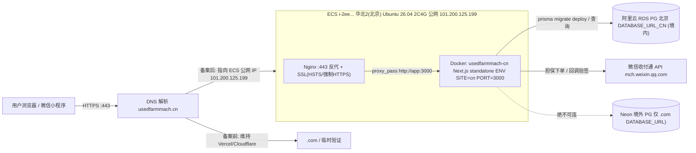
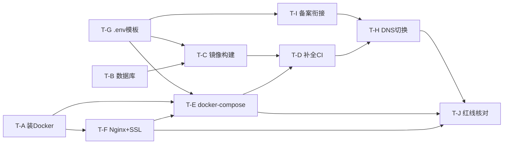

# 神雕农机 .cn 国内站 — 阿里云 ECS 部署架构设计 & 任务分解

> 架构师：高见远（Gao）｜基于仓库实读核对（Dockerfile.cn / deploy-cn.yml / src/lib/payments/wechat.ts / src/config/site.ts / src/lib/db.ts / next.config.js / package.json / (cn) 目录）
> 未执行任何 git / 部署操作。应用代码（T01–T05）已合并 main（a10d549 + f7c0cd3）。

---

## 0. 已核对现状

| 文件 | 结论 | 注意点 |
|---|---|---|
| `Dockerfile.cn` | 基本可用：node:20-alpine → standalone → `ENV SITE=cn` → HEALTHCHECK `/zh` → `CMD node server.js` → EXPOSE 3000 | ⚠️ 基础镜像与 CI `NODE_VERSION:"22"` 不一致，建议统一 `node:22-alpine` |
| `.github/workflows/deploy-cn.yml` | 62–91 行「Deploy to Aliyun ECS」整段被注释为占位 | 需补全为可执行 SSH 部署（T-D） |
| `src/lib/payments/wechat.ts` | 读 `WECHAT_PAY_*` 6 必填 + 可选 `WECHAT_PAY_PLATFORM_CERT`；仅 `createGuaranteeIntent` + `verifyCallback`，**不碰资金** ✓ | ⚠️ `isConfigured()` 只校验 5 项（漏 `WECHAT_PAY_NOTIFY_URL`），建议补全 |
| `src/config/site.ts` | `cn.compliance.icpNo = process.env.CN_ICP_NO ?? "冀ICP备XXXXXXXX号"` → 变量已读取 ✓ | 占位前缀「冀ICP备」(河北)，备案号下来后替换真实号 |
| ICP 渲染 | **仅** `src/app/[locale]/(cn)/publish/page.tsx:35-37` 渲染 `icpNo`；**无** `(cn)/layout.tsx`；`privacy/page.tsx` 仅散文未渲染变量 | → 站底「全局备案号」缺失，T-I 必须补 |
| `src/lib/db.ts` | `SITE=cn` → `DATABASE_URL_CN`；否则 → `DATABASE_URL`(Neon 境外) ✓ | 双库同源，红线校验点 |
| `next.config.js` | `output: standalone` 仅当 `SITE=cn`；注入 `SITE`/`NEXT_PUBLIC_SITE`；images 已允许 `*.oss-cn-beijing.aliyuncs.com` ✓ | 产物 `.next/standalone/server.js` |
| `package.json` | `build = prisma generate && next build`；**无** `migrate deploy` 脚本 | 生产用 `npx prisma migrate deploy`（T-B） |

---

## 1. 部署架构设计

### 1.1 部署拓扑（Mermaid）

### 1.2 备案前 vs 备案后差异

| 维度 | 备案前（管局审核中 ~9 工作日） | 备案后（备案号已下发） |
|---|---|---|
| DNS | `usedfarmmach.cn` 维持 Cloudflare+Vercel（仍由 Vercel 响应，SITE 默认 com） | 切到阿里云 DNS / 直接 A 记录指向 ECS 公网 IP `101.200.125.199` |
| 对外访问 | **阿里云拦截未备案域名的 80/443，不得对外** | 80/443 正常放行 |
| 验证方式 | 仅 ECS 内网/`localhost`：`ssh` 进 ECS 后 `curl -H "Host: usedfarmmach.cn" http://127.0.0.1:3000/zh`；可选临时高位端口(8443)浏览器自测 | 直接 `https://usedfarmmach.cn/zh` 公网验证 |
| 备案号 | 站底显示占位「冀ICP备XXXXXXXX号」 | 注入真实 `CN_ICP_NO`，站底显示真实备案号并链 `https://beian.miit.gov.cn` |
| 部署动作 | 可 Build + 推 ACR + 在 ECS 起容器（仅内部可达） | 切 DNS + 启用 80/443 + 全量公网流量 |

### 1.3 关键架构决策

1. **运行时 env 由 ECS 主机持有，CI 只推镜像**：所有敏感变量（`DATABASE_URL_CN`/`JWT_SECRET`/`OSS_*`/`WECHAT_PAY_*`）放 ECS `/opt/cn/.env.cn`，通过 `docker-compose --env-file` 注入。**绝不**在 `deploy-cn.yml` 用 `${{ secrets.X }}` 直接 `-e` 注入（会进 CI 日志）。CI 仅 `docker build` + 推 ACR。安全红线。
2. **docker-compose 双 service**：`nginx`(对外 80/443) + `app`(仅内部网络 `app:3000`，不暴露宿主机端口)。Nginx `proxy_pass http://app:3000`。
3. **数据库推荐 RDS PG 北京**：同地域低延迟、自动备份/高可用、运维省心；RDS 白名单放 ECS 私网 IP。预算敏感可用 ECS 本地 PG（docker `postgres:16` + volume），但需自管备份。
4. **镜像标签固定**：CI 推 `registry/usedfarmmach-cn:${GITHUB_SHA::8}`；部署时 `CN_IMAGE` 写入主机 env，compose 用 `image: ${CN_IMAGE}` 拉取并 `up -d`。

---

## 2. 任务分解（有序、含依赖、按实现顺序）

| ID | 任务 | 源文件（新建/修改） | 依赖 | 优先级 | 要点 |
|---|---|---|---|---|---|
| **T-G** | `.env.cn.example` 模板（定义全部变量） | `.env.cn.example`（新建） | 无 | P0 | 列出 .cn 站**全部**环境变量（见 §2.1），标注必填/可选/来源；`grep -rn "process.env" src` 复核无遗漏 |
| **T-I** | 备案衔接（CN_ICP_NO 站底渲染） | `src/app/[locale]/(cn)/layout.tsx`（新建）+ `src/components/cn/CnFooter.tsx`（新建） | 无 | P0 | 变量已读(`site.ts`)；仅 publish 页渲染，需新建 `(cn)` 布局/页脚全站渲染 `siteConfig.compliance.icpNo` 并链 `beian.miit.gov.cn`；仅 `isCnSite()` 时显示 |
| **T-A** | ECS 手动安装 Docker + docker-compose | `scripts/install-docker.sh`（新建） | 无（需 ECS SSH） | P0 | Ubuntu 26.04：装 `docker.io` + `docker-compose-plugin`；`systemctl enable --now docker`；建 `deploy` 非 root 用户 + 加 `docker` 组；验证 `docker version` |
| **T-B** | 数据库准备（RDS PG 北京 / 本地 PG + migrate） | （运维动作 + ECS 上 `npx prisma migrate deploy`） | 无 | P0 | 选 RDS PG 北京（推荐）或 ECS 本地 PG；RDS 白名单放 ECS 私网 IP；`DATABASE_URL_CN=<境内PG> npx prisma migrate deploy` 初始化 schema |
| **T-C** | 镜像构建（微调 Dockerfile.cn + 本地验证） | `Dockerfile.cn`（微调） | T-G | P1 | 基础镜像统一 `node:22-alpine`（对齐 CI）；确认 standalone 产物；本地 `docker build -f Dockerfile.cn -t usedfarmmach-cn .` + `docker run -e SITE=cn -p 3000:3000 usedfarmmach-cn` 起 `/zh` 验证 |
| **T-F** | Nginx 反代 + SSL | `deploy/nginx/nginx.conf`、`deploy/nginx/conf.d/cn.conf`（新建） | T-A | P1 | `proxy_pass http://app:3000`；`X-Forwarded-For/Proto/Host`；80→443 强制跳转；HSTS；证书用 Let's Encrypt certbot 或阿里云免费 DV |
| **T-E** | docker-compose（单机友好） | `docker-compose.yml`（新建） | T-C,T-F,T-G | P1 | 两 service：`nginx`(ports 80/443) + `app`(内部网, `env_file:/opt/cn/.env.cn`, `image:${CN_IMAGE}`, `restart:unless-stopped`, healthcheck `/zh`) |
| **T-D** | 补全 deploy-cn.yml 的 ECS 部署段 | `.github/workflows/deploy-cn.yml`（补全 62–91 行） | T-E,T-C,T-G | P0 | 用 `appleboy/ssh-action` SSH 进 ECS，执行 `export CN_IMAGE=$IMAGE_TAG && docker compose -f /opt/cn/docker-compose.yml --env-file /opt/cn/.env.cn pull app && docker compose ... up -d app`；私钥存 secret `DEPLOY_SSH_KEY`；**不在 CI 注入运行时 secrets** |
| **T-H** | DNS 切换（备案后） | （DNS 配置：阿里云 DNS / Cloudflare） | T-D 部署成功 + 备案号下发 | P1 | **备案号下来前禁止执行**；`usedfarmmach.cn` A 记录指向 `101.200.125.199`；`.xin` 不迁移、`.com` 维持 Vercel |
| **T-J** | 红线最终核对清单 | （检查动作，输出核对报告） | T-E,T-F,T-I,T-H | P0 | 数据不出境 / 不碰资金 / 备案前不对外 逐项核对（见 §6） |

### 2.1 `.env.cn.example` 变量表（T-G 产出）

| 变量 | 必填/可选 | 用途 | 来源/备注 |
|---|---|---|---|
| `SITE` | 必填 | 激活 .cn 站 | 固定 `cn` |
| `NEXT_PUBLIC_SITE` | 必填(构建期) | 客户端站点标识 | 固定 `cn` |
| `NEXT_PUBLIC_APP_URL` | 必填(构建期) | 站点公网地址 | `https://usedfarmmach.cn` |
| `DATABASE_URL_CN` | 必填 | .cn 境内数据库 | 阿里云 RDS PG 北京连接串（**绝不**指向 Neon） |
| `JWT_SECRET` | 必填 | 鉴权签名 | 强随机串 |
| `OSS_REGION` | 必填 | 阿里云 OSS 地域 | 如 `oss-cn-beijing` |
| `OSS_ACCESS_KEY_ID` | 必填 | OSS 访问 | |
| `OSS_ACCESS_KEY_SECRET` | 必填 | OSS 密钥 | |
| `OSS_BUCKET` | 必填 | OSS 桶名 | |
| `OSS_ENDPOINT` | 必填 | OSS 端点 | 如 `oss-cn-beijing.aliyuncs.com` |
| `WECHAT_PAY_APP_ID` | 必填 | 收付通小程序 AppID | |
| `WECHAT_PAY_MCH_ID` | 必填 | 平台商户号 | |
| `WECHAT_PAY_API_V3_KEY` | 必填 | API V3 密钥 | 32 字节 |
| `WECHAT_PAY_SERIAL_NO` | 必填 | 商户证书序列号 | |
| `WECHAT_PAY_PRIVATE_KEY` | 必填 | 商户私钥 PEM | 注意换行转义 |
| `WECHAT_PAY_NOTIFY_URL` | 必填 | 担保交易回调地址 | `https://usedfarmmach.cn/api/.../wechat/notify` |
| `WECHAT_PAY_PLATFORM_CERT` | 可选 | 平台证书公钥（严格验签） | 缺省降级为仅解密 |
| `CN_ICP_NO` | 必填 | 站底备案号 | 备案前占位，备案后填真实号 |
| `DATABASE_URL` | 可选 | .com Neon（cn 运行时不需要） | 主机可省略 |
| `NODE_ENV` / `NEXT_TELEMETRY_DISABLED` | 已固化 | — | Dockerfile 已设 |

> `WECHAT_PAY_*` 与既有 `WECHAT_*`（普通 Native 商户 `src/lib/wechat-pay.ts`）**严格区分、不得混用**。`resend`(境外) 仅 .com 用；.cn 如需邮件应改阿里云 DirectMail(境内)。

---

## 3. 文件清单（新建 / 修改）

**新建**
- `.env.cn.example` — .cn 全部环境变量模板（T-G）
- `scripts/install-docker.sh` — ECS Ubuntu 26.04 装 Docker 脚本（T-A）
- `deploy/nginx/nginx.conf` — Nginx 主配置（T-F）
- `deploy/nginx/conf.d/cn.conf` — .cn server 块（反代+SSL+强制HTTPS）（T-F）
- `docker-compose.yml` — nginx + app 两 service（T-E）
- `src/app/[locale]/(cn)/layout.tsx` — (cn) route-group 布局，挂页脚（T-I）
- `src/components/cn/CnFooter.tsx` — 渲染 `siteConfig.compliance.icpNo`（T-I）
- `deploy/deploy-cn.sh`（可选，T-D 在 ECS 上执行的部署脚本本体）

**修改**
- `Dockerfile.cn` — 基础镜像 `node:20-alpine` → `node:22-alpine`（对齐 CI）（T-C）
- `src/lib/payments/wechat.ts` — `isConfigured()` 补校验 `WECHAT_PAY_NOTIFY_URL`（小修）
- `.github/workflows/deploy-cn.yml` — 补全 62–91 行 ECS 部署段（T-D）

---

## 4. 依赖包 / 外部服务清单

| 类别 | 项 | 状态 | 备注（待用户确认） |
|---|---|---|---|
| 主机软件 | Docker + docker-compose-plugin | 需装 | ECS 未预装，T-A 手动装 |
| 证书 | certbot (Let's Encrypt) 或 阿里云免费 DV 证书 | 待定 | 推荐 certbot 自动续期 |
| 镜像仓库 | 阿里云 ACR | **待确认是否已开通** | registry 地址/命名空间/用户名/密码 → GH secrets `ALIYUN_ACR_*` |
| 数据库 | 阿里云 RDS PG（北京） | **待确认是否需新购** | 或 ECS 本地 PG；RDS 白名单放 ECS 私网 IP |
| 对象存储 | 阿里云 OSS（北京 bucket） | 待确认 bucket/endpoint | images 已 allowlist `oss-cn-beijing` |
| 支付 | 微信收付通商户号 + 证书 | 待提供 6 项+可选证书 | 可先占位跑通，支付功能推迟上线 |
| DNS | 阿里云 DNS / Cloudflare | 现状 Cloudflare+Vercel | T-H 切到 ECS |
| 部署密钥 | SSH 部署钥 | 待提供 | 私钥存 GH secret `DEPLOY_SSH_KEY` |
| 备案 | usedfarmmach.cn ICP | 管局审核中 | 备案号下来前不得对外 |
| 可选 | 阿里云 AccessKey | 视方案 | 用 SSH+ACR 方案时**不需要**；仅阿里云 CLI RunCommand 方案需要 |

---

## 5. 共享知识 / 跨文件约定

1. **env 命名隔离**：`WECHAT_PAY_*`（收付通，`src/lib/payments/wechat.ts`）与既有 `WECHAT_*`（普通 Native，`src/lib/wechat-pay.ts`）严格区分，互不引用。
2. **SITE 切换机制**：`SITE=cn` 激活 .cn；`next.config.js` 注入 `NEXT_PUBLIC_SITE`；`Dockerfile.cn` 与 `deploy-cn.yml` 都必须设 `SITE=cn` + `NEXT_PUBLIC_SITE=cn`。
3. **standalone 产物路径**：仅 `SITE=cn` 时 `output:'standalone'`；产物 `.next/standalone/server.js` 由 `Dockerfile.cn` COPY 并作 `CMD`。
4. **双库选择**：`src/lib/db.ts` 按 `SITE` 选 `DATABASE_URL_CN`/`DATABASE_URL`；CI 构建期已把 `DATABASE_URL_CN` 映射成 `DATABASE_URL` 供 `prisma generate/build`，运行时容器只需 `DATABASE_URL_CN`。
5. **secrets 不进 CI 日志**：运行时 env 一律由 ECS 主机 `/opt/cn/.env.cn`（`env_file`）提供；CI 只 build + 推 ACR。
6. **ICP 号渲染约定**：仅 `isCnSite()` 时显示，链接 `https://beian.miit.gov.cn`；值来自 `siteConfig.compliance.icpNo` ← `CN_ICP_NO`。

---

## 6. 红线最终核对清单（T-J 展开）

**A. 数据不出境**
- [ ] `DATABASE_URL_CN` 指向境内（RDS PG 北京 / ECS 本地 PG），host 非 `*.neon.tech` 等境外域名。
- [ ] `.cn` 运行时**不设置** Neon `DATABASE_URL`（或即使设也不被 `SITE=cn` 路径读取）。
- [ ] `resend`（美国）仅 `.com` 调用；`.cn` 不使用，或用阿里云 DirectMail(境内) 替代。
- [ ] `geoip-lite` 等 geo/出境计数逻辑仅 `.com` 启用；`.cn` 不向境外传输个人信息。
- [ ] OSS 用北京地域（`oss-cn-beijing`），图片不出境。

**B. .cn 不碰资金**
- [ ] `src/lib/payments/wechat.ts` 仅 `createGuaranteeIntent`（生成意图）+ `verifyCallback`（回调验签/解密回写订单状态）。
- [ ] 全仓检索无 `.cn` 路由写入 `CreditTransaction` / 分账 / payout / settlement / 资金流水 等表。
- [ ] 担保交易 `settle_info.profit_sharing=false`，真实收单在小程序闭环。

**C. 备案前不对外**
- [ ] `usedfarmmach.cn` 的 DNS 在备案号下发前**不**指向 ECS 公网 IP；仍由 Vercel/Cloudflare 响应。
- [ ] 备案前仅通过 ECS 内网/`localhost` + `Host` 头做功能验证，不开 80/443 对外。
- [ ] 站底 `CN_ICP_NO` 备案号已注入真实值（非占位）并渲染。
- [ ] 阿里云账号下该域名备案状态为「已通过」后方可切 DNS + 放公网流量。

---

## 7. 待明确事项（需用户拍板 / 提供）

1. **阿里云 ACR 是否已开通**？registry 地址、命名空间、用户名、密码 → GH secrets `ALIYUN_ACR_*`。
2. **RDS PG（北京）是否已购**？实例连接串？还是用 ECS 本地 PG？→ 决定 T-B 具体步骤。
3. **SSH 部署公钥怎么放**？现有 ECS 登录密钥对，还是新建 `deploy` 专用密钥对、私钥存 GH secret `DEPLOY_SSH_KEY`？→ 决定 T-D 方案。
4. **备案号预计何时下来**？决定 T-H / 对外时间窗口（当前管局审核中 ~9 工作日）。
5. **OSS（北京）bucket/endpoint/region 具体值**？用于 `.env.cn.example` 与 images allowlist 核对。
6. **微信收付通 6 项 + 可选平台证书**何时提供？可先占位跑通，支付功能推迟上线。
7. **.cn 是否需要邮件能力**？若需要，用阿里云 DirectMail(境内) 替代 resend(境外)。
8. **其它中间件（Redis 等）.cn 是否启用**？T-G 要求 `grep process.env` 全量复核，避免漏配。
9. **备案号前缀**：代码占位「冀ICP备XXXXXXXX号」(河北)，但 ECS 在北京/企业实名主体省份应一致，需用户提供真实备案号格式（如「京ICP备XXXXXX号」）。
10. **Node 版本统一**：确认 Dockerfile 基础镜像统一为 `node:22-alpine`（对齐 CI `NODE_VERSION:"22"`，当前为 20）。

---

## 8. 任务依赖图（Mermaid）

