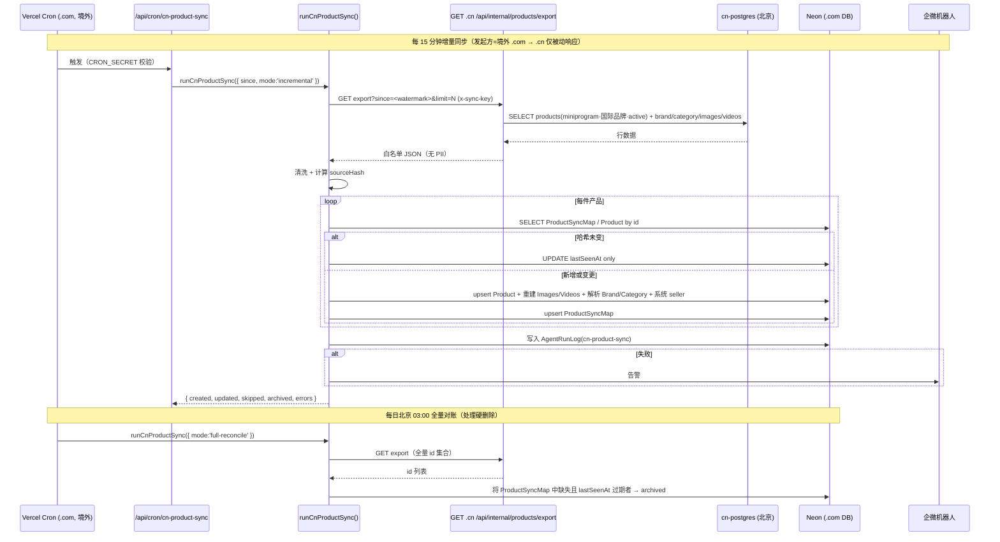
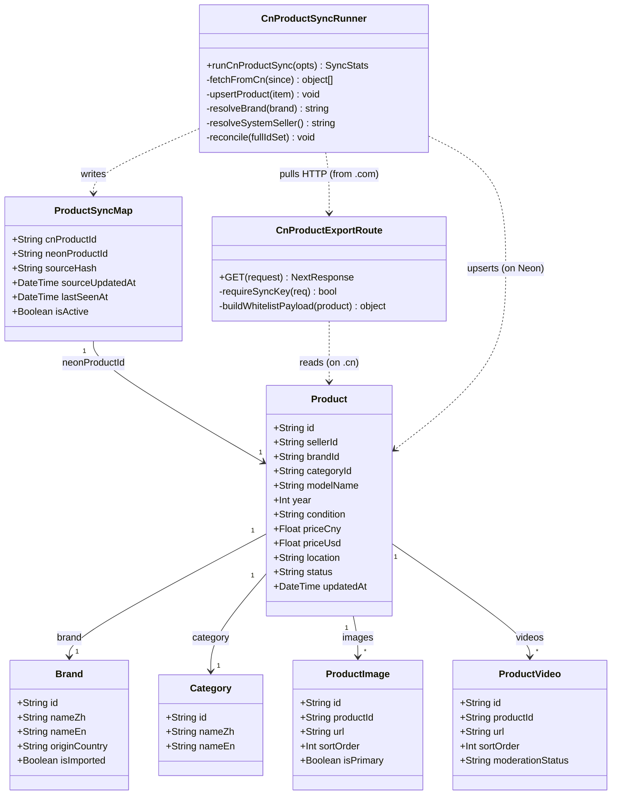

# 小程序产品 .cn → .com 数据打通架构方案

> 问题：小程序发布的产品写入 **.cn（境内 Beijing）** 库，`.com` 国际站读 **Neon（境外）**，导致全球 8 语买家在 `.com` 看不到这些产品。
> 方向：本次设计的是 **`.cn → .com`**（与既有 `docs/cn-content-sync-solution-2026-08-12.md` 的 `.com → .cn` 方向相反）。
> 日期：2026-09
> 配套文档：`docs/cn-content-sync-solution-2026-08-12.md`、`docs/cn-deploy-architecture.md`、`site-split-architecture.md`
> 状态：**设计已定稿；§8.2 七项已拍板（见下方横幅）**。实施蓝图见 `docs/cn-to-com-product-sync-implementation-plan.md`。

> ## ✅ 拍板定稿（2026-10-04 更新）
> | 议题 | 结果 |
> | --- | --- |
> | ① 合规定性 | **采纳选项一**（产品公开信息不属红线管辖）→ 采用**方案 A**；**业务负责人已指示开工，书面件业务侧补办** |
> | ② 同步范围 | 仅「国际品牌 + active」 |
> | ③ 延迟口径 | 增量 **15 分钟**；文案写「**有延迟**」 |
> | ④ 下线语义 | **真删（物理删除）** + 护栏（tombstone / 空快照不删 / 连续 N 轮异常不删 / FK 冲突降级 archived） |
> | ⑤ 坐标 | **(a) 只同步 `location` 文字地址**，坐标不出境（**语义待二次复核，见实施清单 §7.2-Q3**） |
> | ⑥ Valuation | **不同步**（用户 2026-10-04 改口）→ `.com` 侧**零改动**，详情页保持现有「实时重算」 |
> | ⑦ 密钥 | 新增 `CN_SYNC_API_KEY` |
>
> ⚠️ 本文以下设计中，凡与上述拍板相左者（如 §3.4 的"软删 archived"、§5.1 的"Valuation 同步"）**以拍板结果与实施清单为准**。

---

## 一、根因与现状事实（已侦察确认）

### 1.1 系统拓扑

| 维度 | `.com`（国际站） | `.cn`（国内站） |
| --- | --- | --- |
| 运行环境 | Vercel（境外，Pro 计划） | 阿里云 ECS `101.200.125.199`，Docker Compose（nginx + app + postgres + scout） |
| 代码 | 同一套 `D:\神雕农机\usedfarmmach`（Next.js 14 App Router + next-intl 8 语 + Prisma） | 同左（`SITE=cn`，镜像 `cn-app`） |
| 数据库 | Neon PostgreSQL（境外），env `DATABASE_URL` | `postgres:17` 容器（北京，容器名 `cn-postgres`），env `DATABASE_URL_CN` |
| 库选择逻辑 | `src/lib/db.ts`：`SITE !== 'cn'` → `DATABASE_URL` | `src/lib/db.ts`：`SITE === 'cn'` → `DATABASE_URL_CN` |
| 同步机制 | **无** | **无** |

> 关键结论：**两库物理隔离，目前不存在任何产品同步通道。** 小程序发布只写 `.cn`，`.com` 感知不到。

### 1.2 小程序发布路径（写侧）

| 事实 | 证据位置 |
| --- | --- |
| `API_BASE_URL = https://usedfarmmach.cn`（dev/staging/prod 三套一致） | `shendiao-miniprogram/config/env.js` |
| 发布走 `POST https://usedfarmmach.cn/api/internal/products`，Header `X-API-Key: INTERNAL_API_KEY` | `shendiao-miniprogram/pages/publish/publish.js` L747-751 |
| `INTERNAL_API_KEY` 硬编码在小程序包内（`config/env.js` L8，客户端可反解） | 同上 |
| 该路由在 **.cn 部署**执行 → 落 **cn-postgres（北京）** | `src/app/api/internal/products/route.ts` + `db.ts` |
| 图片/视频经 `oss-token` 直传阿里云北京 OSS，入库为完整 URL | `src/app/api/internal/products/route.ts` L34 / L534 / L609 |
| OSS bucket 北京 `usedfarmmach-oss`，**.com 与 .cn 共用同一 bucket** | `src/lib/image-url.ts` L12；`.com` 未覆盖 `NEXT_PUBLIC_OSS_BASE_URL` |

### 1.3 可见性规则（读侧，已就绪，只差数据）

`src/app/api/products/route.ts`（网站分支）与 `src/app/[locale]/products/page.tsx`（列表页）**已统一为共用 `src/lib/product-visibility.ts` 的 `buildWebsiteVisibleWhere()`**（单一事实来源；本次已统一口径，不再各自内联）：

```
网站端可见 = status=active AND OR[
  sellerId != <小程序账号id>,        -- 非小程序来源（sellerId 为 NOT NULL 列，无 SQL 三值逻辑）
  brand.isImported == true           -- 小程序·国际品牌
]
```

**含义：规则层本就允许「小程序来源 + 国际品牌 + active」在网站展示，国产品牌被排除。** 缺乏的只是数据。

### 1.4 写入侧字段（同步原料）

`src/app/api/internal/products/route.ts` 的 POST 表单：

| 分组 | 字段 |
| --- | --- |
| Product 主表 | `sellerId` `brandId` `categoryId` `modelName` `year` `condition` `priceCny`(必填) `priceUsd`(=round(priceCny/7.25)) `location` `descriptionZh` `enginePower` `engineType` `driveSystem` `mainConfig` `netWeight` `overallLength` `overallWidth` `overallHeight` `priceMode` `tradeTerm` `tradePort` `latitude` `longitude` `status='active'` |
| ProductImage | `url` `sortOrder` `isPrimary` |
| ProductVideo | `url` `sortOrder` `title` `duration` `fileSize` `moderationStatus` |
| Valuation | 估值记录（派生数据） |
| Brand | `nameZh` `nameEn` `originCountry` `isImported` |
| Category | `nameZh` `nameEn` |

其他要点：
- 写入前有重复检测 `checkDuplicateProduct(sellerId, brandId, modelName, year)`（不校验 status）。
- seller 由 `getOrCreateDefaultSeller()` 创建/复用系统账号 `email=miniprogram@shendiao.com`，`role=seller`、`companyName="小程序发布"`、`country="CN"`、`credits=999999` → **无自然人个人信息**。
- 当前 Vercel `.com` 侧虽部署了同一份路由代码，但因数据在 `.cn` 库，`.com` 的该路由实际操作的是 Neon，看不到 `.cn` 数据。

### 1.5 代码内已失真的两句文案（越权承诺，需处置）

| 位置 | 现文案 | 问题 | 处置建议 |
| --- | --- | --- | --- |
| `src/app/api/internal/products/route.ts` L897-899 | 国际品牌：`"国际品牌，手机+网站同时展示"`；国产品牌：`"国产品牌，仅在小程序展示"` | 前半句在切 `.cn` 后**已不成立**（`.com` 当前看不到任何小程序产品） | **定稿（拍板③，写"有延迟"）**：国际品牌 → `"国际品牌，产品将同步至网站展示（可能有延迟）"`；国产品牌 → `"国产品牌，仅在小程序展示"` |
| `src/app/api/miniapp/products/route.ts` L235 | `"产品发布成功！网站同步展示中。"` | "网站同步展示中"当前不成立 | **定稿（拍板③）**：改为 `"产品发布成功！产品将同步至网站展示（可能有延迟）。"` |

> 原则：**对用户的承诺必须与系统真实能力一致**。措辞已按"有延迟"定稿（不进"实时同步"承诺）。

### 1.6 已验证前置条件（**已实测，非假设**）

本方案的成立依赖以下三条前置事实，均已由团队实测确认：

| # | 前置条件 | 实测证据 | 结论 |
| --- | --- | --- | --- |
| V1 | **`.cn` 的 `/api/internal/*` 未被 nginx 封锁** —— `.com` 能穿透网关到达 `.cn` 应用层 | 从境外对 `https://usedfarmmach.cn/api/internal/products` 发 **GET** → 返回 **405 Method Not Allowed 且 body 为空**（该路由仅实现 POST）。**405 是 Next.js 应用层应答，而非 nginx 的 403/404 错误页** → 请求已穿透网关 | ✅ **方案 A 的命门条件成立**：`.com` 可访问 `.cn` 的 `/api/internal/*`，新增只读导出接口能被境外拉取 |
| V2 | **`src/` 全目录无任何 ID 格式校验** | grep `z.string().cuid` / `isValidId` / `id.length` 比较 / cuid 正则 → **零匹配** | ✅ 支持 §3.3 的「cuid 直通」决策：把 `.cn` 的 cuid 直接用作 Neon 主键，无任何格式假设会被打破 |
| V3 | **`Product` 确实存在卖家自留联系方式（PII）字段** | `prisma/schema.prisma` **L242-245**：`contactName` / `contactPhone` / `contactWechat` / `contactEmail`（注释：卖家自留联系方式） | ✅ §5.1「显式禁止出境」论证有据：这些字段**必须**被白名单排除，绝不出境 |

> V1 是**全方案的命门**——若 `.cn` 网关封锁 `/api/internal/*`，方案 A 需改走公网只读域名或专线，成本与复杂度显著上升。实测已排除该风险。

---

## 二、候选方案对比

> 红线前提：**.cn 运行时绝不主动出境**（`.cn` 容器/进程不得主动请求境外 `.com`/Neon）。凡要求 `.cn` 主动外呼的方案，天然出局。
> ⚠️ 但「不主动出境」只解决**方向**问题；**这批数据本身能否跨境**，须按数据性质正面论证 —— 见 **§5.0 合规定性论证**（并已提升为 §8.2 头号拍板项）。
> 合规口径：产品公开商业信息（品牌/型号/年份/参数/价格/位置/图片）不属个人信息、不属重要数据；**自然人个人信息（手机号/姓名/身份证/openid 关联资料）不得随之出境**。**注：精确地理坐标 `latitude`/`longitude` 按 §5.1.1 归为不出境字段。**

| 维度 | **A. `.com` 侧定时 pull（推荐）** | B. `.cn` 写时 push / 双写 | C. `.com` 读时聚合（实时反代） | D. 数据库级逻辑复制 |
| --- | --- | --- | --- | --- |
| 数据流 | `.com` Cron → HTTP GET `.cn` 只读导出接口 → 清洗 → upsert Neon | `.cn` 发布成功后 → 主动 POST 境外 `.com` | `.com` 每次列表/详情请求 → 实时 GET `.cn` API 拼装 | `.cn` PG 作为 publisher，Neon 作为 subscriber 拉 binlog |
| 优点 | 方向合规；`.cn` 零外呼；`.com` 完全掌控写入与限流；失败隔离；复用既有「导出 JSON + 幂等导入」范式 | 近实时；实现直观 | 无落地数据、无同步延迟 | 最"实时"、行级一致 |
| 缺点 | 存在同步延迟（可压到分钟级） | **触碰红线**：`.cn` 进程主动外呼境外；且写失败会拖累/回滚用户体验 | 强耦合：`.cn` 抖动直接导致 `.com` 报错；跨境 RTT 高；SSR/缓存/分页/排序/聚合全要改造，违反"不改前端 SSR" | 需把 `cn-postgres:5432` 暴露公网（重大安全风险）；全表复制带来 PII 出境风险；Neon 作 subscriber 到外部 publisher 运维复杂；破坏物理隔离 |
| 合规影响 | ✅ 不触碰"`.cn` 主动出境"红线（境外 → 境内，`.cn` 仅被动响应）；**是否触及 `site-split-architecture.md` §3.1「双向禁同步」需按数据性质定性 —— 见 §5.0，并已提升为 §8.2 头号拍板项** | ❌ 触碰"`.cn` 主动出境"红线 | ⚠️ 需逐请求出境，且暴露面大；每次都要做字段裁剪，风险持续 | ❌❌ 最差：全量行（含 PII）出境 + 暴露内网 PG |
| 可用性耦合 | 低（`.cn` 挂了只是本次跳过，`.com` 照常服务） | 高（跨境写失败影响发布） | **极高**（`.cn` 是 `.com` 的强依赖） | 高（复制中断导致数据分叉） |
| 延迟 | 秒级~分钟级（Cron 间隔决定） | 近实时 | 实时（但代价是 RTT + 抖动） | 近实时 |
| 幂等难度 | 低（按 id upsert + 水位线，天然幂等） | 中（需去重 + 失败重试 + 幂等键） | 无需（读时不落库） | 中（复制语义，但删除/状态一致性难控） |
| 与既有范式一致性 | ✅ 与 `cn-content-sync-solution` 的"导出 JSON + 幂等导入"同源，仅方向相反 | ❌ | ❌ | ❌ |

### 明确推荐：**方案 A（`.com` 侧定时 pull）**

理由：
1. **唯一不触碰"`.cn` 主动出境"红线**的可落地方案（请求由境外 `.com` 发起，境内 `.cn` 只被动响应入站请求，`.cn` 进程零外呼）。同时，**按数据性质**（公开经营信息、非 PII）的正面论证见 **§5.0**；该定性已提升为 **§8.2 头号拍板项**。
2. **可用性解耦**：`.cn` 短暂不可用时，`.com` 只是本轮跳过并告警，绝不影响买家浏览。
3. **不改前端 SSR**：`.com` 的 `/api/products` 查询逻辑一行不动，同步进来的产品天然命中既有可见性规则。
4. **与既有架构同源**：沿用"白名单导出 + 幂等 upsert"范式（既有文档证明该范式在本项目已跑通），工程心智负担最低。
5. **增量扩展、可回滚**：新增只读接口 + 新增同步任务 + 新增一张审计表，全部 additive，不改任何既有读取路径。

> C 方案可作为**可选兜底**（当 `.com` 需要"立即看到"某条产品时，由后台运维手动触发一次同步），但不作为常态数据通道。

---

## 三、推荐方案详细设计

### 3.1 数据流（ASCII）

```
┌────────────────────────────── 境内（中国 · 阿里云北京）──────────────────────────────┐
│                                                                                      │
│   微信小程序                                                                          │
│     POST https://usedfarmmach.cn/api/internal/products   (X-API-Key: INTERNAL_API_KEY)│
│            │                                                                          │
│            ▼                                                                          │
│   ECS 101.200.125.199   ┌───────────┐   读写    ┌────────────────┐                    │
│                         │  cn-app   │─────────▶ │  cn-postgres   │                    │
│                         │ (Next.js) │           │ (北京 · 容器内) │                    │
│                         └─────┬─────┘           └────────────────┘                    │
│                               │                                                       │
│   ★ 新增：只读导出接口（仅 SITE=cn 生效，独立密钥）                                       │
│     GET /api/internal/products/export?since=<ISO>&limit=<n>&token=<SYNC_KEY>          │
│     返回：纯公开商业字段 JSON（不含任何卖家/个人信息）                                     │
│                                                                                      │
└───────────────────────────────┼──────────────────────────────────────────────────────┘
                                │  ★ 请求方向：境外 .com → 境内 .cn（入站）
                                │    .cn 进程【零外呼】，仅被动响应；且仅传「公开经营信息」（无 PII）  ← 合规关键
┌───────────────────────────────┼──────────────────────────────────────────────────────┐
│ 境外（Vercel · .com）          ▼                                                        │
│                                                                                      │
│   Vercel Cron（每 15 分钟）──▶ /api/cron/cn-product-sync （Serverless，SITE=com）        │
│                                  │                                                   │
│                                  ├─ 1. GET .cn 导出接口（携带 SYNC_KEY，水位线 since）    │
│                                  ├─ 2. 字段白名单清洗（剔除 PII / 敏感字段）             │
│                                  ├─ 3. 幂等 upsert（Product / Brand / Category /        │
│                                  │      ProductImage / ProductVideo）+ 写 ProductSyncMap │
│                                  └─ 4. 每日 03:00 触发「全量对账」→ 缺失项标记 archived    │
│                                       失败 → 企微机器人告警                            │
│                                  │                                                   │
│                                  ▼                                                   │
│                           Neon PostgreSQL（境外）                                     │
│                                  ▲                                                   │
│   .com /api/products ────────────┘  读取（SSR 逻辑【完全不变】）                        │
│     既有可见性规则： active AND (seller≠miniprogram OR (miniprogram AND brand.isImported))│
│                                                                                      │
└──────────────────────────────────────────────────────────────────────────────────────┘
                                │
                                ▼
              全球 8 语买家在 .com 看到「国际品牌」小程序产品（图片直连北京 OSS，无需搬运）
```

### 3.2 新增 / 修改文件清单

| # | 绝对路径 | 类型 | 职责 |
| --- | --- | --- | --- |
| 1 | `D:\神雕农机\usedfarmmach\src\app\api\internal\products\export\route.ts` | **新增·.cn** | 只读导出接口。`SITE=cn` 才生效（否则 404）；独立密钥鉴权；按 `since`/`limit` 分页返回「小程序·国际品牌·active」产品 + 关联 Brand/Category/Images/Videos 的**白名单字段**。纯 DB 读，无任何外呼。 |
| 2 | `D:\神雕农机\usedfarmmach\src\app\api\cron\cn-product-sync\route.ts` | **新增·.com** | Vercel Cron 入口。校验 `CRON_SECRET`；调用 `runCnProductSync()`；返回统计结果。 |
| 3 | `D:\神雕农机\usedfarmmach\src\lib\cn-sync\run-sync.ts` | **新增·.com** | 同步核心：拉取 → 清洗 → 幂等 upsert → 写审计表 → 更新水位线 → 告警。可被 Cron route 与 CLI 共同复用。 |
| 4 | `D:\神雕农机\usedfarmmach\src\lib\cn-sync\field-whitelist.ts` | **新增** | 字段白名单 + 脱敏：定义允许跨境的字段集合，显式剔除 PII（`contact*`、seller/user 明细、openid 等）。 |
| 5 | `D:\神雕农机\usedfarmmach\src\lib\cn-sync\reconcile.ts` | **新增·.com** | 全量对账：拉全量 id 集合，把 `ProductSyncMap` 中不在集合内的映射对象标记下线（archive，不硬删）。 |
| 6 | `D:\神雕农机\usedfarmmach\prisma\schema.prisma` | **修改（additive）** | 新增模型 `ProductSyncMap`（映射 + 内容哈希 + 水位 + liveness）。**不改动任何既有模型字段**。 |
| 7 | `D:\神雕农机\usedfarmmach\vercel.json` | **新增/修改** | 配置 2 条 cron：`*/15 * * * *`（增量）、`0 19 * * *`（全量对账，UTC 19:00 = 北京 03:00）。 |
| 8 | `D:\神雕农机\usedfarmmach\scripts\cn-product-sync.js` | **新增** | 同步逻辑的 CLI 版（本地/CI 手动/回填执行）。`--full` 模式用于 Stage 0 存量补齐。 |
| 9 | `D:\神雕农机\usedfarmmach\src\app\api\internal\products\route.ts` | **修改** | 修正 L897-899 失真文案（见 §1.5）。 |
| 10 | `D:\神雕农机\usedfarmmach\src\app\api\miniapp\products\route.ts` | **修改** | 修正 L235 失真文案（见 §1.5）。 |
| 11 | `D:\神雕农机\usedfarmmach\docs\cn-to-com-product-sync-architecture.md` | **新增** | 本文档。 |

> 复用既有资产：告警复用 `src/lib/wecom/group-webhook.ts`（`WECOM_GROUP_WEBHOOK_URL`）；运行日志复用 `AgentRunLog`（`agentId='cn-product-sync'`）；OSS URL 复用 `src/lib/image-url.ts`（对完整 https URL 透传）。

### 3.3 幂等与 ID 对齐策略

**核心决策：Neon 侧 `Product.id` 直接复用 `.cn` 的 `Product.id`（cuid 直通，不加前缀），并以新增审计表 `ProductSyncMap` 作为来源与存活账本。**

| 关注点 | 设计 |
| --- | --- |
| 为什么复用 id | 两库主键各自生成 cuid，**不能假设天然相同**；但复用 `.cn` 的 cuid 作为 Neon 主键可让 upsert 变成单条 `where: { id }`，天然幂等、无额外 join。**已验证（见 §1.6 V2）**：`src/` 全目录 grep `z.string().cuid` / `isValidId` / `id.length` / cuid 正则 → **零匹配**，无任何 id 格式假设会被打破。cuid 跨库碰撞概率可忽略（~2^100 量级）。 |
| 冲突守卫 | upsert 前查 `ProductSyncMap`：若该 `cnProductId` 未登记，但 Neon 已存在同 id 的 `Product`，则**跳过并告警**（说明 id 被非同步来源占用），绝不覆盖。 |
| 审计表 `ProductSyncMap` | `cnProductId`(unique)、`neonProductId`(unique)、`sourceHash`(sha256)、`sourceUpdatedAt`、`syncedAt`、`lastSeenAt`、`isActive`。用于：①来源追溯；②内容哈希变更检测（同哈希跳过写，减少 Neon 写放大）；③全量对账判定下线（`lastSeenAt` 落后即下线）。 |
| 幂等键 | 产品级：`cnProductId`。关联表级：先 `deleteMany({ productId })` 再 `createMany` 重建 Images/Videos（与既有 `cn-content-sync` 导入脚本同款幂等手法）。 |
| 内容哈希 | `sourceHash = sha256(规范化(白名单字段 + 关联数组))`。哈希未变 → 完全跳过写；仅 `lastSeenAt` 刷新。 |

`ProductSyncMap`（Prisma 草案，**纯新增模型，不动既有模型**）：

```prisma
/// .cn → .com 产品同步映射与存活账本（additive，不影响任何既有表/查询）
model ProductSyncMap {
  id              String   @id @default(cuid())
  cnProductId     String   @unique   // .cn 侧 Product.id
  neonProductId   String   @unique   // .com 侧 Product.id（= cnProductId 直通）
  sourceHash      String              // 白名单内容 sha256
  sourceUpdatedAt DateTime            // .cn 侧 updatedAt（水位线依据）
  syncedAt        DateTime @default(now())
  lastSeenAt      DateTime @default(now())
  isActive        Boolean  @default(true) // false = 已从 .cn 消失/被过滤，.com 已 archive

  @@index([isActive, lastSeenAt])
  @@index([sourceUpdatedAt])
}
```

### 3.4 更新与下线传播

| `.cn` 侧事件 | 传播方式 | `.com` 侧结果 |
| --- | --- | --- |
| 新建产品 | 增量拉取（`updatedAt > since`）捕获 → 新建 Neon Product + 映射 | 出现在 `.com` |
| 改价 / 改参数 / 加图 | 增量拉取捕获（`updatedAt` 变化）→ 更新 Product + 重建关联 | `.com` 详情/列表更新（受 `/api/products` 60s 缓存 + ISR 影响，最终一致） |
| `status` 由 active → draft/inactive | 增量拉取携带 `status` → Neon 同步该 status | 命中 `.com` 既有规则 `status=active` → **自动从网站消失**（无需额外逻辑） |
| 品牌从"进口"改为"国产"（`isImported` 翻转） | 导出接口按**当前** `isImported` 过滤 → 该产品不再出现在导出集合 → 全量对账处理 | `.com` 网站消失 |
| **产品被硬删除**（`.cn` 无墓碑） | 增量拉取看不到删除；由**每日全量对账**兜底：导出全量 id 集合，`ProductSyncMap` 中不在集合者 → **物理删除**（拍板④） | `.com` 网站消失（**真删**；删除前写 `ProductSyncTombstone` 留档、`ProductSyncMap.deletedAt` 记痕；详见实施清单 §3.4） |
| 视频被微信审核 `rejected` | 同步携带 `moderationStatus`；`.com` 侧仅镜像非 `rejected` 视频 | `.com` 不展示违规视频 |

> **安全护栏（拍板④ 强化）**：`reconcile` ①仅在"全量快照请求 HTTP 成功 **且结果非空**"时才执行删除（含**分页防截断**）；②快照请求失败/为空 → **一律不删**；③**连续 N 轮异常一律不删**；④只动 `ProductSyncMap.isActive=true` 的对象，**绝不触碰**任何非同步来源的 `.com` 原生产品；⑤**删除前留档**（tombstone）；⑥存在下游依赖导致 FK 冲突 → **降级 `archived`**，绝不强删断。**下游依赖 = 8 类无 `onDelete:Cascade` 的 Product 引用**（询盘 Inquiry / 电子合同 / 拍卖 / 贷款申请 / 质保 / 维修记录 / 政府登记 / 托管订单；详见实施清单 §3.4）；**仅被收藏（Favorite）不算**（该关系有 `Cascade`）。**注：本节原写"软删 archived"，以拍板④（真删）为准。**

### 3.5 库存与可见性过滤（取舍）

| 选项 | 说明 | 取舍 |
| --- | --- | --- |
| (a) 只同步「国际品牌 + active」 | `.cn` 导出接口侧预过滤 `baseWhere = { status: "active", brand: { isImported: true } }`（**已放宽：不含 seller / source 条件**） | ✅ **推荐**。跨境数据最小化（合规优先）；且与 `.com` 既有可见性规则**精确同集合**，零泄漏可能 |
| (b) 全量同步，交给 `.com` 规则过滤 | 同步所有小程序产品，让 `.com` 的 `OR[...]` 规则筛掉国产 | ❌ 跨境数据量更大（国产农机商业信息也出境），无收益 |

**决策：采用 (a)。** 数据流里只让"本该在 `.com` 展示的那批"过境——这也是既有 `OR[...]` 规则允许的**唯一**子集，等价于"把规则的过滤前移到源头"。`.com` 侧规则仍保留（`.com` 仍是权威判定），形成"双保险"，而非替代。

### 3.6 卖家归属映射

| 项 | 决策 |
| --- | --- |
| 挂靠账号 | 在 Neon 侧创建/复用系统账号 `email = miniprogram@shendiao.com`（与 `.cn` 同 email），`role=seller`、`companyName="小程序发布"`、`country="CN"`、`credits=999999`、`isActive=true`。 |
| 为何必须是这个 email | `.com` 可见性规则以 `seller.email === 'miniprogram@shendiao.com'` 作为判定键。**只有挂到该账号，产品才会被规则放行。** |
| 携带的自然人信息 | **零**。系统账号，无手机号/姓名/身份证/openid 关联；产品侧 `contactName/contactPhone/contactWechat/contactEmail` 一律**剔除**（见 §5.1 白名单），不随同步出境。 |
| 权限/额度 | 系统账号额度天然充足；`.com` 侧该账号仅承载同步产品，不用于登录。 |

### 3.7 图片 / 视频 URL 复用

- `.cn` 与 `.com` **共用同一 OSS bucket**（北京 `usedfarmmach-oss`），入库 URL 已是完整 `https://usedfarmmach-oss.oss-cn-beijing.aliyuncs.com/uploads/products/<cnProductId>/...`。
- `src/lib/image-url.ts` 对完整 https URL **透传**并追加 `?x-oss-process` 压缩参数 → `.com` 直接复用，**无需搬运任何二进制**。
- 说明：因 Neon `Product.id = cnProductId`，OSS 路径中的 `<cnProductId>` 与 `.com` 产品 id 仍一致，**深链与调试友好**（注意 OSS 路径取自存库的完整 URL，不依赖运行时拼接，故即使将来改 id 策略也不受影响）。

---

## 四、鉴权与调度

### 4.1 密钥：新增独立密钥，不复用 `INTERNAL_API_KEY`

| 项 | 决策 | 理由 |
| --- | --- | --- |
| 导出接口认证 | **新增 `CN_SYNC_API_KEY`**（仅存 Vercel env + ECS `.env.cn`，server-to-server） | `INTERNAL_API_KEY` 硬编码在小程序包内（可被反解），若复用它保护导出接口，等于**把大批量产品导出能力交给任何拿到小程序包的人**。两个用途（写单条 vs 批量读全量）必须分权。 |
| 传输校验 | 请求头 `x-sync-key` + 时间戳/签名（可选 HMAC） | 防重放；最小实现可仅校验 key + IP 白名单（Vercel egress 段） |
| 现有写路径 | `INTERNAL_API_KEY` **保持不变** | 增量扩展，不动既有稳定链路 |

### 4.2 接口位置

| 接口 | 部署位置 | 说明 |
| --- | --- | --- |
| `GET /api/internal/products/export` | **`.cn`**（读 `.cn` 库） | 绝不在 `.com` 生效；代码内 `if (process.env.SITE !== 'cn') return 404`，防止 `.com` 误暴露 Neon 数据 |
| `GET /api/cron/cn-product-sync` | **`.com`**（写 Neon） | 校验 Vercel Cron `CRON_SECRET`；仅被动被 Cron 触发 |

### 4.3 触发方式与频率

| 优先级 | 触发方式 | 频率 | 说明 |
| --- | --- | --- | --- |
| 主 | **Vercel Cron**（Pro 计划，`.com` 侧） | 增量 **每 15 分钟**；全量对账 **每日北京 03:00** | 无需 CI、与 `.com` 部署同生命周期、天然在境外发起 |
| 备 | GitHub Actions `workflow_dispatch` / 定时 | 手动或每日兜底 | 当 Vercel Cron 异常时可手动补跑；跑同一 CLI（`scripts/cn-product-sync.js`） |
| 附 | 挂接现有流水线 `automation-1777885493367` | 每日 06:00 后的某任务节点 | 作为"每日一次"的第三重保险，或用于 Stage 0 回填触发 |

**为何该频率对「二手农机」业务足够**：
- 二手农机是**低频、高价值、非即时**交易品类，卖家发布量级为**每日个位数~数十条**，买家不会以秒级刷新求购；
- 15 分钟同步意味着「发布 → 全球可见」最长延迟 15 分钟 + 60s 缓存 + ISR，对慢决策的重资产交易**完全无感**；
- 高频同步的成本（Neon 写入 + 跨境请求）与业务价值严重不成比例——**用 15 分钟换取"两站可用性完全解耦 + 合规零风险"，是本场景的最优解**。

---

## 五、合规与安全

### 5.0 合规定性论证（正面论证：按"数据性质"，而非"谁主动"）

**为什么需要这一节**：`docs/site-split-architecture.md` §3.1 的驻留图对**两个方向都标了禁止**——

```mermaid
graph LR
    C2[(Neon 境外)] == 禁止跨境复制/同步 ==> D2[(RDS 北京)]
    D2[(RDS 北京)] == 禁止跨境复制/同步 ==> C2[(Neon 境外)]   %% ← 本方案正是此方向
```

因此，**仅用"发起权握在需要数据的一方"只回答了"谁主动"，没回答"这批数据能不能过去"**。必须正面论证。

**论证（按数据性质）：**

1. **已有同类先例，非新开数据类别**：`docs/cn-content-sync-solution-2026-08-12.md` 已开创「**公开内容跨境镜像**」——`.com` 的 SEO 文章 / 市场情报流向 `.cn`。本方案是其**对称的反向操作**（`.cn` 的产品公开信息流向 `.com`），论证结构可直接镜像复用。
2. **红线真正保护的是 PII / 重要数据，而非公开商业信息**：
   - `site-split-architecture.md` §3.2（L140）`AccountLink` 注释「轻量关联（**不复制 PII**）」→ 说明该文档的"禁同步"约束**以 PII 为靶心**；
   - §2.1（L98）「资产存储：阿里云 OSS 北京（**两站共用，纯静态资产不涉 PII**）」；
   - §9.9（L563）「OSS 静态资产跨境……**不视为数据出境**（与法务结论一致）」→ 而产品图片/视频资产**本就两站共用、两站可见**。
3. **本方案出境的数据集 = 经营主体主动面向全球公开的销售目录**：品牌 / 型号 / 年份 / 成色 / 参数 / 价格 / 位置文本 / 图片。**出境即其业务目的本身**（国际买家来 `.com` 看货、成交），**不含 PII、不含重要数据**。
4. **本方案比既有先例更严**：显式白名单（默认拒绝）+ 剔除 `sellerId`/`contact*`/openid + 仅取「国际品牌 + active」最小子集。

**结论**：产品目录的跨境同步，**性质上属"公开内容跨境镜像"（同既有先例），不落入 §3.1 红线所保护的 PII / 重要数据范畴** → 本方案是对既有架构的**合规增量**，而非突破。

> ⚠️ **这一定性是对红线的解释**：**业务负责人已于 2026-10-04 指示开工**，书面确认件由业务侧另行补办（现有书面依据仍为 `site-split-architecture.md` §9.9 L563）。§8.2 头号项已附"若不认可"时的架构反转兜底方案。

---

### 5.1 字段白名单（跨境的仅有集合）

| 对象 | 允许出境字段 | **显式禁止** |
| --- | --- | --- |
| Product | `id` `modelName` `year` `condition` `priceCny` `priceUsd` `location` `province` `city` `country` `descriptionZh` `priceMode` `tradeTerm` `tradePort` `enginePower` `engineType` `driveSystem` `mainConfig` `netWeight` `overallLength` `overallWidth` `overallHeight` `status` `aiGenerated` `createdAt` `updatedAt` | **`latitude` `longitude`**（精确地理坐标 → 见 §5.1.1）、**`sellerId`**（改由 `.com` 侧解析为系统账号）、**`contactName` `contactPhone` `contactWechat` `contactEmail`**（自然人 PII，schema L242-245）、任何 User 行字段 |
| Brand | `nameZh` `nameEn` `originCountry` `isImported` | — |
| Category | `nameZh` `nameEn` | — |
| ProductImage | `url` `sortOrder` `isPrimary` | — |
| ProductVideo | `url` `sortOrder` `title` `duration` `moderationStatus` | —（`fileSize` 视需要可选） |
| Valuation | **不同步**（拍板⑥，2026-10-04 改口）——**整体移出跨境集合**；`.com` 详情页保持现有「实时重算」，零改动 | — |
| User / openid | **完全不参与同步** | 一切 |

> 实现方式：`field-whitelist.ts` 采用**显式白名单 pick**（与 `scripts/export-cn-content.js` 的 `pick()` 同款），**默认丢弃未列字段**，而非黑名单剔除——白名单是"默认拒绝"，从结构上杜绝 PII 意外出境。

#### 5.1.1 坐标字段（`latitude`/`longitude`）处置 —— **✅ 已拍板 (a)：只同步 `location` 文本，坐标一律不出境**（用户"确认标注真实地址"的语义待二次复核，见实施清单 §7.2-Q3）

**问题**：坐标来自小程序 `wx.chooseLocation` 地图选点，精度可定位到**具体场地**；若发布者是自然人农场主，等同于公开其经营场所精确位置 → 落入「位置信息属个人信息」边界。此字段若放行，与 §5.1「白名单=默认拒绝」的精神自相矛盾，是最敏感的位置字段。

**先查证 `.com` 产品侧是否依赖坐标**（结论：**零依赖**）：

| 查证项 | 命令 / 位置 | 结果 |
| --- | --- | --- |
| 全 `src/` 引用 `latitude\|longitude` 的文件 | grep（`src/**`） | **仅 3 处**：`src/app/api/internal/products/route.ts`（**写侧**）、`src/app/[locale]/warehouses/WarehousesClient.tsx`、`src/app/api/service-centers/route.ts` —— **后两者是"仓库/服务中心"独立业务，与产品列表/详情无关** |
| 产品**详情页**是否用坐标 | `src/app/[locale]/products/[id]/page.tsx` | 仅 **L213 / L256 / L285** 使用 `product.location`（**文本**）；**全文无 `latitude`/`longitude`、无地图组件** |
| 产品**列表/读接口**是否返回坐标 | `src/app/api/products/route.ts` | include 仅 select `brand`/`category`/`images`/`videos`/`internationalPrices`/`seller`/`auctions`，**未 select `latitude`/`longitude`** |
| 是否存在地图 / 距离功能 | grep `leaflet\|AMap\|高德\|mapbox\|haversine\|物流测算\|距离排序\|distance`（`src/**`） | **零匹配** |

→ **结论：`.com` 产品列表/详情对坐标无任何功能依赖，故无需让坐标出境。**

**三个处置选项（供拍板，见 §8.2）：**

| 选项 | 做法 | 合规强度 | 对 `.com` 功能影响 | 推荐 |
| --- | --- | --- | --- | --- |
| **(a) 只同步 `location` 文本**（如「河北 石家庄」） | 完全不传 `latitude`/`longitude` | **最高**（坐标不出境） | 无（已查证零依赖） | ✅ **推荐** |
| (b) 坐标降精度到城市级 | 保留 2 位小数（约 ±1.1km）后传 | 中（仍属位置信息，只是模糊） | 无（零依赖，传了也无人用） | 备选 |
| (c) 保持原精度 | 原样传坐标 | 低（可定位自然人经营场所） | 无 | ❌ 不建议 |

**推荐理由**：既然 `.com` 对坐标零依赖，就**没有理由让最敏感的位置字段出境**——按 (a) 处理，边界最干净、争议最小。

### 5.2 脱敏

- 白名单已从源头排除 PII；额外对 `location`/`descriptionZh` 做**轻量 PII 扫描**（正则命中的手机号/身份证号 → 记录告警并置空该字段），作为纵深防御。
- 日志中**不打印**完整 payload；仅打印计数与哈希。

### 5.3 审计日志

- `ProductSyncMap`：每条同步产品的来源、哈希、时间、存活状态（可追溯到 `cnProductId`）。
- `AgentRunLog`（`agentId='cn-product-sync'`）：每轮运行的 `status`/`durationMs`/`result`(created/updated/skipped/archived 计数)/`errorMessage`。
- 建议保留 ≥ 6 个月（与 `PiiAuditLog` 口径一致）。

### 5.4 失败告警

- 复用 `src/lib/wecom/group-webhook.ts`（`WECOM_GROUP_WEBHOOK_URL`，未配置则 no-op）。
- 告警事件：导出接口不可达、鉴权失败、单轮错误数 > 阈值、**连续 N 轮零同步但 `.cn` 有新增**（疑似静默失败）、全量对账异常。
- 告警内容：运行统计 + 错误摘要 + `.com` 站内可点链接。

---

## 六、分阶段实施步骤

> 原则：**增量扩展，不删除、不影响既有稳定业务逻辑；不改前端 SSR 查询逻辑；每阶段可独立验收、可独立回滚。**

### Stage 0 — 存量一次补齐（让 `.com` 立刻看到已有小程序·国际品牌产品）

1. 落地 §3.2 文件 #1/#4/#6/#8（导出接口 + 白名单 + 映射表 + CLI）。
2. `ProductSyncMap` 建表：随 `.com` 部署走 `prisma db push`（additive，不删列）。
3. 本地/CI 手动执行 `node scripts/cn-product-sync.js --full`（一次性拉取 `.cn` 现存全部「小程序·国际品牌·active」产品），幂等 upsert 到 Neon。
4. 验收：`.com` 的 `/api/products` 能看到这些产品；图片正常。
5. **回滚**：删除本轮新建的同步产品 + 映射记录（脚本提供 `--rollback-stage0`），或直接停用映射并清空。

### Stage 1 — 增量常态同步

1. 落地 §3.2 文件 #2/#3/#7（Cron route + 同步核心 + `vercel.json`）。
2. 在 Vercel 配置 `CN_SYNC_API_KEY`、`CRON_SECRET`；在 ECS `.env.cn` 配置同一 `CN_SYNC_API_KEY`。
3. 开启 Vercel Cron：增量 `*/15`；全量对账 `0 19 * * *`（UTC）。
4. 验收：小程序发布一条国际品牌产品 → ≤15 分钟内在 `.com` 可见；改价 → 同步；下线 → 消失。
5. **回滚**：暂停/删除 cron（改 `vercel.json` 或 Vercel 后台 Pause）；`.com` 数据保持现状不影响浏览。

### Stage 2 — 监控与运维

1. 接入企微告警；观察 `AgentRunLog` 成功率。
2. 建立"同步延迟 / 错误率"看板（可先以日志+每轮统计代替）。
3. 补充运维 Runbook（异常处置、手动补跑、回填历史）。
4. 评估是否将「每日对账」并入现有流水线 `automation-1777885493367` 做统一编排。

---

## 七、验证清单与回滚方案

### 7.1 验证清单

| # | 场景 | 预期 |
| --- | --- | --- |
| 1 | `.cn` 导出接口（正确密钥） | 200；仅返回国际品牌 active；Payload **无 `contact*` / `sellerId` / `latitude` / `longitude` / 用户字段** |
| 2 | `.cn` 导出接口（错误/缺失密钥） | **401（鉴权失败）**——**不是 403/404 错误页**；`.com` 部署上访问该路由 → 404 |
| 2b | **部署后「路径放行」基线验证**（新增） | 新建 `/api/internal/products/export` 部署到 `.cn` 后，**未带 key 请求应返回 401**。**基线对照**：§1.6 V1 实测「`.cn` 现有 `/api/internal/*` GET → **405**」证明路径已穿透网关；若新接口返回 **403/404** 则说明被网关拦截 → 先解决 nginx/网关放行，再继续 |
| 3 | 小程序发布「国际品牌」产品 | ≤15min 内 `.com` `/api/products` 出现；图片/视频正常 |
| 4 | 小程序发布「国产品牌」产品 | `.com` **始终不可见**；`.cn`/小程序可见 |
| 5 | `.cn` 侧改价 | `.com` 价格最终一致 |
| 6 | `.cn` 侧产品改 inactive/draft | `.com` 消失 |
| 7 | `.cn` 侧删除产品 | 次日全量对账后 `.com` `archived`（消失）；不影响其他产品 |
| 8 | 重复执行同步 | `created/updated` 计数为 0 或仅哈希变更项；产品不重复 |
| 9 | `.cn` 导出接口不可达 | 本轮跳过 + 告警；**无任何下线/删除** |
| 10 | 非同步来源（`.com` 原生产品） | 全程不被触碰 |
| 11 | 企微告警 | 模拟失败时收到 Markdown 告警 |

### 7.2 回滚方案

| 层级 | 手段 |
| --- | --- |
| 停用 | Vercel 后台 Pause cron / 移除 `vercel.json` 条目，或删除 `CRON_SECRET` env |
| 数据 | 脚本 `--rollback`：按 `ProductSyncMap` 删除 `.com` 侧同步产品与映射（**只删自己建的**，零误伤）；或批量将映射对象置 `archived` |
| 文案 | 两处文案为独立小改动，可单独 revert |
| 兜底 | 因 `.com` 原生读取逻辑零改动，回滚后 `.com` 立即恢复"看不到小程序产品"的原状，**无残留副作用** |

---

## 八、风险表与待拍板问题

### 8.1 风险表

| 风险 | 等级 | 影响 | 缓解 |
| --- | --- | --- | --- |
| `.cn` 导出接口被冒用（批量拉取） | 中 | 数据被爬 | 独立 `CN_SYNC_API_KEY` + IP 白名单 + 速率限制；服务端不打印 payload |
| PII 意外出境 | 高 | 合规事故 | **白名单 pick（默认拒绝）** + 轻量 PII 扫描 + 白名单单元测试 |
| `.cn` 抖动导致误删 `.com` 产品 | 高 | 丢展示 | reconcile **仅在成功快照后**执行；只动 `isActive=true` 的同步对象；软删除 `archived` |
| id 复用与既有 Neon 产品冲突 | 低 | 覆盖数据 | upsert 前查 `ProductSyncMap`，冲突则跳过并告警 |
| 品牌 `isImported` 两站不一致 | 中 | 可见性异常 | 导出按当前 `isImported` 过滤；`.com` 侧解析品牌时确保一致并记录冲突 |
| Vercel Cron 在免费/超时下不稳 | 低 | 同步停滞 | Pro 计划已具备；GitHub Actions 兜底；连续零同步告警 |
| 同步延迟被误解为"发布失败" | 中 | 用户投诉 | 修正 §1.5 文案为"将同步至网站（可能有延迟）" |
| 微信审核拒绝的视频进入 `.com` | 低 | 合规 | 仅同步非 `rejected` 视频 |
| **精确地理坐标出境**（`latitude`/`longitude`） | 高 | 可定位到自然人经营场所 → 位置信息属个人信息边界 | **按 §5.1.1 选项 (a)：坐标不出境，只传 `location` 文本**；白名单显式排除 + 单元测试断言 |
| **「双向禁同步」红线解释争议**（§5.0） | 高 | 若定性不被业务/法务认可，方案不可实施 | 提交**显式书面确认**（§8.2 头号项）；预留「架构反转」兜底方案（§8.2 选项二要点） |

### 8.2 需产品负责人拍板的未决问题

> ✅ **七项均已拍板**（见文首「拍板定稿」横幅）。以下保留**原始问题陈述**备查；**与拍板结果冲突处（如①选项二、④软删）以拍板为准**。唯一**新增阻塞项**：①的"法务书面确认"尚未取得。

**① 【已拍板 · 合规定性】...（原为头号问题）**

§3.1 对**两个方向**都标注了「禁止跨境复制/同步」，本方案正是其中之一方向。§5.0 已按**数据性质**（公开经营信息、非 PII、非重要数据，且已有「公开内容跨境镜像」先例）正面论证其**不落入**红线保护范畴。请**二选一**拍板：

| 选项 | 认定 | 后果 |
| --- | --- | --- |
| **选项一（推荐）** | 认定「**产品公开信息不属红线管辖**」——红线的靶心是 PII / 重要数据，而产品目录是经营主体主动面向全球公开的销售信息 | **采用方案 A（本方案）**，可进入 Stage 0 |
| 选项二（保守） | 坚持 §3.1 字面，**不做任何跨库搬运** | **必须转向「架构反转」兜底方案**（下方要点），本方案作废 |

**选项二 → 兜底方案要点（架构反转：`.com` 作唯一产品主库，`.cn` 作展示镜像）**

1. **改写入端**：小程序发布改为 `POST https://usedfarmmach.com/api/internal/products`（写 Neon，`.com` 升为唯一产品主库）。
2. **方向反转**：由「`.cn` → `.com`」变为「`.com` → `.cn`」，**直接复用既有 `cn-content-sync-solution-2026-08-12.md` 的「镜像内 JSON + 部署后导入」范式**（`.cn` 只读镜像内文件、零外呼）——与既有合规范式完全一致，**无红线争议**。
3. **可见性适配**：`.cn` 变为镜像后，需放宽 `.cn` 的展示规则，让小程序「国产品牌」也能在 `.cn` 显示（在 `.cn` 查询中引入 `includeMiniapp` 语义）。
4. **代价（为何不更优）**：① 小程序 `API_BASE_URL` 从 `.cn` 改回 `.com` → **跨境写**（境内小程序 → 境外），可能触碰「境内自然人数据在境外处理」另一条合规线；② `.cn` 产品数据反过来依赖 `.com`，**引入跨站可用性耦合**（`.com` 抖动直接拖累 `.cn`）。
5. **结论**：兜底方案把风险从"数据出境"转移到"境内写境外 + 跨站耦合"，**并不更优**——故强烈建议争取**选项一**。

**② 坐标字段处置**：确认采用 **(a) 只同步 `location` 文本、`latitude`/`longitude` 不出境**（推荐，§5.1.1）；或改选 (b) 降精度到城市级 / (c) 保持原精度。

**③ 同步范围**：确认仅同步「国际品牌 + active」（推荐），还是也需要把某些「国产品牌」在 `.com` 展示？（后者需同时改 `.com` 既有可见性规则，超出本方案红线。）

**④ 同步延迟口径对用户的承诺**：文案最终措辞是"将同步至网站展示（可能有延迟）"还是"实时同步"？（建议前者，与 15 分钟频率一致。）

**⑤ 下线语义**：`.cn` 产品被删时，`.com` 采用**软删除 `archived`（推荐，可追溯）**还是物理删除？

**⑥ 频率取舍**：是否接受 15 分钟增量（推荐）；若业务要求更实时，可降到 5 分钟（Vercel Pro 支持），但需确认成本与跨境请求量可接受。

**⑦ Valuation（已定）**：✅ **不同步**（用户 2026-10-04 明确）→ `Valuation` 整体移出跨境集合；`.com` 详情页保持现有「`/api/valuation` 实时重算」行为，**零改动**。（备注：`.com` 详情页本就不读 `Valuation` 表，故"同步估值表"亦不会自动生效——用户选择不做，本条无实现工作。）

**⑧ 审计表命名与留存**：`ProductSyncMap` 命名与日志留存期（建议 ≥6 个月）是否认可。

**⑨ 独立密钥管理**：是否同意新增 `CN_SYNC_API_KEY`（而非复用可被反解的 `INTERNAL_API_KEY`）。

---

## 附录 A：与既有 `.com → .cn` 方案的对称性

| 维度 | 既有方案（`cn-content-sync-solution`） | 本方案 |
| --- | --- | --- |
| 方向 | `.com → .cn`（文章/情报） | `.cn → .com`（小程序产品） |
| 载体 | 镜像内 JSON + 部署后导入 | HTTP 只读导出接口 + Cron 拉取 upsert |
| 发起方 | `.com` 生成 JSON，`.cn` 部署时导入（`.cn` 读本地文件，零外呼） | `.com` 主动 GET `.cn`（`.cn` 被动响应，零外呼） |
| 红线 | `.cn` 运行时只连 `cn-postgres` | 同：`.cn` 进程零外呼，仅入站响应；**数据性质论证见 §5.0** |
| 幂等 | 按 slug/日期 deleteMany + create | 按 id upsert + 内容哈希；对账软删除 |
| 前端 | 零改动 | 零改动（SSR 逻辑不变） |

> 两份方案共享同一合规范式：**数据交换的"发起权"始终握在需要数据的一方，境内侧只做被动应答或本地读取，从不主动外呼。** 但"发起权"只解决"谁主动"；**"数据能不能过去"须按数据性质论证——见 §5.0**（本方案的关键补充）。

## 附录 B：图（Mermaid）

> 同目录另存：调用时序见 `docs/cn-to-com-product-sync-sequence.mermaid`，类图见 `docs/cn-to-com-product-sync-class.mermaid`。
> （注：仓库中已有的 `docs/sequence-diagram.mermaid` / `docs/class-diagram.mermaid` 属于 view-stats 交付物，与本方案无关，未改动。）




