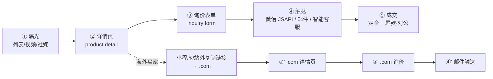

# 全球 8 语买家 / 卖家 发现—进入—转化 路径需求分析

> **文档类型**：需求分析（受众分层 + 触点路径矩阵 + 入口设计 + 合规引导 + 埋点 + 优先级）
> **产出**：产品经理（Alice）｜ **日期**：2026-06-15
> **范围**：`usedfarmmach.com`（国际站，8 语）/ `usedfarmmach.cn`（国内站）/ `shendiao-miniprogram`（小程序 v1.1.10）/ YouTube / 社媒·B2B 平台
> **依据（实读代码与既有文档，非推测）**：
> - `docs/site-split-prd.md`、`docs/site-split-architecture.md`（双站架构、geo 分流、数据驻留）
> - `src/lib/site.ts` 语义（8 语 `zh/en/ru/es/pt/ar/fr/hi`，`.com` 默认 `en`）、`src/components/layout/language-switcher.tsx`（现有语言切换器）
> - `src/components/layout/footer.tsx`（Footer 联系邮箱 `jiusei0319@gmail.com`）
> - `src/app/api/stats/track/route.ts`（埋点端点现状：仅接受 `scope ∈ {product,category,video,fieldVideo}` 的实体自增）
> - `shendiao-miniprogram/pages/publish/publish.js` L4 `WEBSITE_BASE_URL='https://usedfarmmach.cn'`、L974–985 `onCopyWebsite()`（`wx.setClipboardData`）
> - `联系方式分流修改方案.md`、`SEO-link-building-plan.md`

---

## 0. 硬约束护栏（本文档所有方案不得突破）

| # | 约束 | 对本文的设计含义 |
|---|------|------------------|
| 1 | **联系入口恒为 3 个**：智能客服（FAQ 静态匹配）/ 询价表单 / 邮箱 | 不新增第 4 个入口（不新增在线 IM、不新增电话专线、不新增表单字段以外的通道） |
| 2 | **禁止**微信 `open-type="contact"`，**禁止**「人工客服」字眼 | 客服话术一律用「智能客服」，转出用「询价表单」或「邮箱」 |
| 3 | **不做开放 C2C；每笔交易卖方恒为神雕农机** | 海外第三方只能是**寄售方**，不得出现「卖家直连买家」的链路与文案 |
| 4 | **小程序不使用 `web-view` 跳 `.com`** | 小程序内国际买家引导只能靠「文案 + 复制链接」 |
| 5 | 产品页邮箱 `932133255@qq.com`、其他页 `jiusei0319@gmail.com` | 新增触点文案若带邮箱，按此分流 |
| 6 | 定金走微信支付 JSAPI、尾款走线下对公转账 | 见 §7 风险：**该规则对海外买家不成立**，需另立海外定金路径 |
| 7 | `.cn` 数据不出境；`.com` 不主动服务/收集境内 PII | 入口与文案不得诱导境内用户把 PII 提交到 `.com` |

> 本文出现的所有「文案」均为**建议稿**，落地前需按 §附 的 8 语对照表统一入 `messages/*.json`（`.com`）与小程序 `i18n`。

---

## 1. 受众分层

三类受众的动机、语言、决策路径**本质不同**，不能用一套触点打穿。

### 1.1 分层总表

| 维度 | A 国内买家 | B 海外买家 | C 海外卖家 / 寄售方 |
|------|-----------|-----------|--------------------|
| **身份** | 国内农户 / 合作社 / 经销商 / 大宗采购 | 境外农场主 / 农机经销商 / 二手设备贸易商 / 拍卖商 | 境外持有闲置国际品牌机（CLAAS / New Holland 等）的机主、贸易商、经纪 |
| **核心动机** | 低价买到**已在中国境内**的进口品牌二手农机；合规、权属可核验 | 采购**中国境内**的进口品牌二手农机，赚中外价差（中国境内二手进口机普遍低于欧美同类） | 把手上机器**卖出高价市场**，变现、腾库位；不愿自建跨境渠道 |
| **语言** | 中文 | **8 语**：en / ru / es / pt / ar / fr / hi + zh | 主要 en，其次 ru / es / pt / ar |
| **主战场** | 微信生态（小程序、公众号「我AI您」、视频号）+ `.cn` + 百度 | Google / YouTube / LinkedIn / B2B 平台 + `.com` | LinkedIn / B2B 平台 / 行业目录 + `.com` |
| **决策路径特征** | 微信内「看到 → 问价 → 线下看机 → 小程序担保成交」，**链路短、信任靠线下与平台背书** | 「搜索/视频发现 → 比价 → 询价 → 要资料（照片/视频/工时/检测）→ 谈物流与单证 → 付定金 → 验机/发运」，**链路长、多轮往复、信任靠内容与专业度** | 「看到案例 → 提交机器信息 → 谈寄售条件与定价 → 签约/收机 → 由神雕负责售卖」，**B2B 属性、低频高值、谈单周期长** |
| **关键决策变量** | 价格、权属核验、车况、能否分期/担保 | 价格、机器真伪与工时、出口/物流与清关能力、能否提供检验报告与视频 | 定价是否诚实、结算是否安全、有无真实成交案例与买家池 |
| **本方案归属站** | `.cn` + 小程序 | `.com` | `.com` |
| **法务身份** | 买家（对神雕） | 买家（对神雕，卖方恒为神雕） | **寄售方**（非卖方，交易主体仍是神雕） |

### 1.2 海外买家按区域再切（语言优先级与信任锚点不同）

| 区域 | 主语言 | 次级语言 | 该区最在意 | 首选发现渠道 |
|------|--------|----------|-----------|-------------|
| 俄语区及中亚 | **ru** | en | 价格、可用件、能否发运到中亚/独联体、单据合规 | Yandex 系内容 / YouTube(ru) / 本地 B2B |
| 中东欧与巴尔干 | en / ru | fr | 欧标认证、可追溯维修记录、欧盟内的转运 | Google / LinkedIn / 欧洲农机论坛 |
| 南美 | **pt** / **es** | en | 价格、备件、清关代理、能否做 CIF | YouTube(es/pt) / WhatsApp 群 / 本地经销商 |
| 中东 | **ar** | en | 高温工况件、快速交付、单据与认证（SASO 类） | Google(ar) / LinkedIn / 展会展商名录 |
| 非洲 | en | fr / pt | 价格极敏感、件足耐用、付款方式灵活、代理 | Google / B2B 平台 / 中国出口商目录 |
| 东南亚 | en | zh | 交付快、运费低、可小批量、可现场看机 | Google / Shopee 外溢 / 华人商网 / 微信 |

> **结论**：`.com` 的 8 语不是「平均用力」，而是 **ru 与 es/pt/ar 三组要重点铺内容**，因为这三组区域的搜索供给最薄、竞品最少（对标 TractorHouse / Agriaffaires 的多语覆盖在这些区域偏弱）。

---

## 2. 到达路径矩阵

格式统一为：**入口位置 → 具体文案（中文 / 英/俄） → 落地页 → 转化动作**。至少覆盖：小程序内、`.cn` 站、`.com` 站、YouTube、社媒 / B2B 平台。

### 2.1 小程序内（主受众：A 国内买家；附：B 海外买家的华人中介）

| # | 入口位置 | 文案（中 / 英 / 俄） | 落地页 | 转化动作 |
|---|---------|---------------------|--------|---------|
| M1 | 首页 hero 下方 CTA | 中：`浏览在售车源` / 英：`Browse available machines` / 俄：`Смотреть технику в наличии` | `pages/list` | 进列表 |
| M2 | 列表页筛选条 | 中：`按品牌/机型/年份筛选` | `pages/list` | 进详情 |
| M3 | 产品详情页底部联系区 | 中：`在线询价`（→ 询价表单）/ `智能客服` | `pages/detail` | 提交询价 |
| M4 | 产品详情页底部「面向海外买家」区块 | 中：`面向海外买家：复制国际版链接，在浏览器打开（8 种语言）` / 英：`For overseas buyers: copy the international site link and open it in your browser (8 languages)` / 俄：`Для зарубежных покупателей: скопируйте ссылку на международный сайт и откройте её в браузере (8 языков)` | 无跳转（复制 `https://usedfarmmach.com`） | 复制链接（见 §4） |
| M5 | 发布成功页 | 中：`已发布成功，可在网站查看` + `复制国际版链接` | `pages/publish`（复用 L974 `onCopyWebsite` 模式） | 复制链接 |
| M6 | 我的 / 关于页 | 中：`海外买家请访问国际版（usedfarmmach.com，8 种语言）` | `pages/about` | 复制链接 |
| M7 | 视频号 / 公众号文章跳小程序 | 中：`点这里看全部在售车源` | 小程序卡片 → 首页 | 进小程序 |

> **M4/M5/M6 是小程序内唯一能把 B 类买家导向 `.com` 的合法通道**，必须用**独立常量** `INTL_SITE_URL='https://usedfarmmach.com'`——**不得**复用现有 `WEBSITE_BASE_URL`（其值为 `https://usedfarmmach.cn`，见 `publish.js` L4）。

### 2.2 `.cn` 站（主受众：A 国内买家；附：境内外商/替海外买家找货的中介）

| # | 入口位置 | 文案（中 / 英） | 落地页 | 转化动作 |
|---|---------|----------------|--------|---------|
| C1 | 首页 hero | 中：`国内二手农机流通 · 权属可核验` / 英：`Verified used farm machinery in China` | `/{locale}` | 进列表 / 发布 |
| C2 | 列表页 / 详情页 | 中：`在线询价`（询价表单） | `/{locale}/products/[id]` | 提交询价 |
| C3 | 详情页联系区 | 中：`智能客服`（FAQ 静态匹配，页面底部悬浮入口）/ 邮箱 `932133255@qq.com` | 当前页 | 客服 / 邮件 |
| C4 | Footer 常驻 | 中：`国际版（面向海外买家，8 种语言）` / 英：`International Edition (8 languages, for overseas buyers)` | `https://usedfarmmach.com/{locale}` | 跳国际站 |
| C5 | Header 语言切换器下拉底部 | 中：`🌐 国际版 usedfarmmach.com` | `https://usedfarmmach.com/{locale}` | 跳国际站（见 §3） |
| C6 | 详情页副 CTA（仅国际品牌机型） | 中：`该机型同时收录于国际版，供海外买家询价` | `https://usedfarmmach.com/{locale}/products/[id]` | 跳国际站 |
| C7 | Footer 合规区 | 中：`冀ICP备2024053719号-4` + `数据境内存储` | — | 合规展示 |

### 2.3 `.com` 站（主受众：B 海外买家、C 海外寄售方）

| # | 入口位置 | 文案（中 / 英 / 俄） | 落地页 | 转化动作 |
|---|---------|---------------------|--------|---------|
| G1 | 首页 hero（买家） | 中：`全球在售二手农机` / 英：`Used farm machinery, sourced from China` / 俄：`Б/у сельхозтехника из Китая` | `/{locale}` | 进列表 |
| G2 | 首页 hero（寄售方） | 中：`寄售您的设备` / 英：`Consign your machine` / 俄：`Сдать технику на реализацию` | `/{locale}/consign`（寄售落地页） | 提交机器信息 |
| G3 | 列表 / 详情页 | 中：`获取报价` / 英：`Get a quote` / 俄：`Получить предложение` | `/{locale}/products/[id]` | 打开询价表单 |
| G4 | 详情页联系区 | `Inquiry form` + email `932133255@qq.com`（农机业务）+ `Smart Assistant`（智能客服） | 当前页 | 询价 / 客服 / 邮件 |
| G5 | 详情页信任区 | 英：`Inspection report & operation videos available` | 当前页 | 索取资料（走询价） |
| G6 | 语言切换器（现有组件） | 8 语下拉（`zh/en/ru/es/pt/ar/fr/hi`） | 同页换语 | 换语言 |
| G7 | Footer | 英：`Company / Email / Address` + 合规声明 + **`国内市场请访问 usedfarmmach.cn`** | `https://usedfarmmach.cn` | 跳国内站 |
| G8 | 境内 IP 兜底页 | 中：`本站面向海外买家，您所在地区请访问国内站 usedfarmmach.cn` | 301 → `.cn` | 自动跳转 |

### 2.4 YouTube（主受众：B 海外买家）

| # | 入口位置 | 文案（中 / 英 / 俄） | 落地页 | 转化动作 |
|---|---------|---------------------|--------|---------|
| Y1 | 视频标题 / 描述首行 | 英：`CLAAS Rollant 850 for sale — operation video, China stock` / 俄：`CLAAS Rollant 850 — видео работы, в наличии в Китае` | — | 点描述链接 |
| Y2 | 描述第 2 行（固定区） | 英：`Full specs, inspection report & price → https://usedfarmmach.com/en/products/{id}` | `.com` 详情页（带 UTM） | 进详情 |
| Y3 | 描述第 3 行（联系） | 英：`Inquiries: inquiry form on the link above, or email 932133255@qq.com` | — | 询价 / 邮件 |
| Y4 | 置顶评论 | 英：`Overseas buyers only. Domestic buyers: usedfarmmach.cn` | 分站分流 | 进对应站 |
| Y5 | 频道 About | 英：`Shijiazhuang Shendiao Technology Co., Ltd. — used farm machinery export from China` | `.com` 首页 | 进首页 |
| Y6 | 数字人（HeyGen）口播结尾 | 英：`Link in the description — get your quote today.` | — | 点描述 |

> 关键：YouTube 描述链接必须**深链到具体产品页**（`/products/{id}`）而非首页，否则跳出率极高；且带 `?utm_source=youtube&utm_medium=video&utm_campaign={model}`，用于 §5 归因。

### 2.5 社媒 / B2B 平台

| # | 渠道 | 入口位置 | 文案（中 / 英 / 俄） | 落地页 | 转化动作 |
|---|------|---------|---------------------|--------|---------|
| S1 | LinkedIn 公司页 | About / 置顶帖 | 英：`Used CLAAS & New Holland machinery from China. 8 languages. → usedfarmmach.com` | `.com` 首页 | 进站 |
| S2 | LinkedIn 个人帖 | 案例贴文 | 英：`Delivered a CLAAS 850 to {country}. Details: usedfarmmach.com/en/products/{id}` | `.com` 详情页 | 询价 |
| S3 | B2B 平台（made-in-china / TradeWheel / AgriExpo / ExportHub） | 产品描述结尾 | 英：`Full inventory & specs: usedfarmmach.com` | `.com` 首页 / 详情 | 进站 |
| S4 | 公众号「我AI您」 | 文末 | 中：`海外买家请走国际版 usedfarmmach.com（8 种语言）` | `.com`（境外可直达；境内会跳回 `.cn`） | 进站 |
| S5 | 视频号「心无所住智启未来」 | 简介 / 评论区置顶 | 中：`国际版：usedfarmmach.com` | `.com` | 进站 |
| S6 | 聚媒通 8 平台（国内分发） | 文末固定区 | 中：`国内站 usedfarmmach.cn · 国际站 usedfarmmach.com` | 双站分流 | 进站 |
| S7 | 地图商户（百度/高德/腾讯） | 商户简介 | 中：`二手农机收购与转售 · 国际站 usedfarmmach.com` | `.cn` 主体 + `.com` 外链 | 认领 / 进站 |

---

## 3. `.cn` 站 → `.com` 的入口设计

### 3.1 形式选型：**不用纯语言切换式，采用「醒目国际版按钮」为主 + 语言切换器集成为辅**

| 方案 | 说明 | 评审结论 |
|------|------|---------|
| ① 纯语言切换式（选俄语等 → 自动跳 `.com/{ru}`） | 复用现有 `language-switcher.tsx` 的 8 语下拉 | ❌ **不单独采用**。原因：① 语义错误——「换语言」与「换站点」是两件事，`.cn` 只有 `zh/en`，用户选「俄语」实际是被送去另一个站点，会造成困惑；② 合规风险——境内用户误触后被送往境外站；③ `.com` 的 middleware 会把 CN IP **301 打回 `.cn`**，形成「点了跳走又跳回」的死循环观感 |
| ② 醒目国际版按钮（独立 CTA） | Header 右侧独立按钮 | ✅ **主方案** |
| ③ 语言切换器下拉底部固定项 | 在 8 语列表末尾追加分隔线 + 「🌐 International Edition」 | ✅ **辅助方案**（承接「我以为只是换语言」的用户） |
| ④ Footer 常驻链接 | Footer「联系我们」上方一行 | ✅ **兜底**（SEO 与直接导航） |

**最终采用：② + ③ + ④ 组合**，其中 ② 为唯一主 CTA，③④ 为从属。

### 3.2 入口位置（逐处）

| 位置 | 具体落点 | 说明 |
|------|---------|------|
| **Header（主）** | `src/components/layout/navbar.tsx`，**语言切换器左侧**、与「登录/注册」同排右侧 | 桌面端显示**文字按钮**，移动端收进汉堡菜单首屏；需在 `.cn` 构建（`SITE=cn`）时条件渲染 |
| **语言切换器下拉底部（辅）** | `src/components/layout/language-switcher.tsx` 列表末尾加 `divider` + 一项 | 拦截「选不到俄语」的困惑用户 |
| **Footer（兜底）** | `src/components/layout/footer.tsx`，`contactUs` 区块**上方**独立一行 | 常驻、可被搜索引擎抓取 |
| **产品详情页副 CTA** | `src/app/[locale]/products/[id]/page.tsx` 主询价按钮下方，**仅当机型为国际品牌时**显示 | 承接 C6，转化意图最强 |

### 3.3 按钮文案（8 语言）

主 CTA（Header 醒目按钮）：

| 语言 | 文案 |
|------|------|
| 中文 zh | `国际版（8 种语言）` |
| English en | `International Edition (8 languages)` |
| Русский ru | `Международная версия (8 языков)` |
| Español es | `Edición internacional (8 idiomas)` |
| Português pt | `Edição internacional (8 idiomas)` |
| العربية ar | `النسخة الدولية (8 لغات)` |
| Français fr | `Édition internationale (8 langues)` |
| हिन्दी hi | `अंतर्राष्ट्रीय संस्करण (8 भाषाएँ)` |

移动端短文案（宽度受限）：`🌐 International` / `🌐 国际版`。

### 3.4 跳转提示（确认弹层）

因存在「境内用户点入 `.com` 后被 301 打回」的真实风险，**主 CTA 必须带一次轻确认**，避免用户误以为站点故障：

> **弹层标题**：`即将前往国际版 usedfarmmach.com`
> **正文**：`国际版面向海外买家与客商，支持 8 种语言；国内用户请继续使用本站。`
> **按钮**：`继续前往`（主）/ `留在国内站`（次）

8 语正文（用于 `.com`/`.cn` 双端一致的弹层）：

| 语言 | 确认弹层正文 |
|------|-------------|
| zh | 国际版面向海外买家与客商，支持 8 种语言；国内用户请继续使用本站。 |
| en | The International Edition serves overseas buyers and partners in 8 languages. Domestic users may continue with the current site. |
| ru | Международная версия предназначена для зарубежных покупателей и партнёров и доступна на 8 языках. |
| es | La edición internacional atiende a compradores y socios del extranjero en 8 idiomas. |
| pt | A edição internacional atende compradores e parceiros estrangeiros em 8 idiomas. |
| ar | النسخة الدولية مخصّصة للمشترين والشركاء من خارج الصين وتدعم 8 لغات. |
| fr | L'édition internationale s'adresse aux acheteurs et partenaires étrangers, en 8 langues. |
| hi | अंतर्राष्ट्रीय संस्करण विदेशी खरीदारों और साझेदारों के लिए है और 8 भाषाओं में उपलब्ध है। |

> 弹层「继续前往」的跳转 URL 追加 `?from=cn&utm_source=cn_site`，供 §5 归因；并把 `sessionStorage` 写入 `intl_entry_clicked=1`，避免同一会话反复弹窗。

### 3.5 `hreflang` 策略（**重要，与直觉相反**）

| 决策项 | 结论 | 理由 |
|--------|------|------|
| `.cn` ↔ `.com` 之间互设 `hreflang` | ❌ **不要设** | 两站是**不同内容、不同合规主体、不同受众**（`.cn` 限 `zh/en` 且内容为国内流通/权属核验；`.com` 为 8 语跨境 listings）。互设 `hreflang` 会让 Google 判定二者为「同一页面的语言替代版本」，导致国际站权重被国内站稀释、或反之 |
| `.com` 站内 8 语互设 `hreflang` | ✅ **必须设** | `zh/en/ru/es/pt/ar/fr/hi` 八语互为 `alternate`，每条**自引用**；`x-default` → `/en` |
| `.cn` 站内 `zh/en` 互设 `hreflang` | ✅ **必须设** | `zh` 与 `en` 互为 `alternate`；`x-default` → `/zh` |
| 两站互链方式 | 普通 `<a href>` + 明确业务文案 | 用「国际版」「国内市场」等业务语义链接，而非 `hreflang` 语义 |

> **现状缺口**：实读 `src/app/[locale]/layout.tsx` 与 `src/lib/seo.ts` **未发现 `hreflang` / `alternates` 实现**（已 grep 确认）。这是一条**必须在 P0 补上**的 SEO 缺口，且正好与 `.com` 8 语一并做。

### 3.6 `.cn` → `.com` 入口的 geo 陷阱（必须让开发知道）

`.com` 的 middleware 规则为：`SITE=com` 且 `x-vercel-ip-country === 'CN'` → **301 跳回 `.cn`**（见 `site-split-architecture.md` §2.3）。

因此：

1. 主 CTA 的**运营话术**必须是「面向海外买家/客商」，**不能**写成「想看俄语版点这里」——否则境内用户点了必然被弹回，产生 Bug 投诉。
2. 若产品上确需让**境内用户**浏览国际版 listings（例如业务方要检查外网展示效果），需要 `.com` 侧提供一条**带签名参数的免跳转通道**（如 `?promo=<token>` 跳过 geo 301，token 由运营签发、限时）。**此项列为待确认**（见 §附 待确认 Q3）。
3. 移动端若在**微信内置浏览器**打开 `.com`，微信会拦截未备案境外域名（提示「已停止访问该网页」）。故 `.cn` 侧的 CTA 应增加一行灰字提示：`微信内无法直接打开，请在浏览器中访问`。

---

## 4. 小程序内的合规引导方案

### 4.1 为什么**不能**直接用 `web-view`（必须写进开发注释）

| 阻拦点 | 事实 | 结论 |
|--------|------|------|
| 微信业务域名准入 | `<web-view>` 只能打开已在**小程序后台「业务域名」白名单**内的域名；白名单要求域名**完成 ICP 备案** + 放置**域名校验文件并可公开访问** + HTTPS | `.com` 托管于 **Vercel 境外**，**永久无法完成 ICP 备案**（备案前置要求服务器在境内） |
| 现状配置 | 业务域名**仅配置了 `usedfarmmach.cn`**（并已随 2026-09-14 切换生效） | `.com` 不在白名单，`<web-view src="https://usedfarmmach.com/...">` 会**直接失败/白屏** |
| 是否可绕过 | 不可。这是微信平台强校验，非前端可绕 | ✅ 确认：小程序内跳 `.com` 只能用**文案 + 复制链接** |

### 4.2 方案总览

| 项 | 设计 |
|----|------|
| **承载页面** | ① 产品详情页 `pages/detail`；② 我的/关于 `pages/about`；③ 发布成功页 `pages/publish` |
| **形式** | 一块「For Overseas Buyers / 面向海外买家」说明区 + 一个**复制链接**按钮（`wx.setClipboardData`） |
| **目标 URL** | `https://usedfarmmach.com/{locale}`（按小程序当前语言映射 8 语 locale） |
| **不允许** | `<web-view>` 跳 `.com`、`open-type="contact"`、「人工客服」字样、任何「点击直接打开国际站」的诱导性表述 |

### 4.3 交互设计（以产品详情页为例）

```
┌───────────────────────────────────────────┐
│  面向海外买家 / For Overseas Buyers         │  ← 区块标题（中英并排）
│  ───────────────────────────────────────  │
│  受合规要求，小程序仅提供国内站服务。        │  ← 说明，解释「为什么点不开」
│  海外买家请复制下方链接，在手机浏览器中打开   │
│  国际版（支持 8 种语言）。                   │
│                                           │
│  ┌─────────────────────────────────────┐  │
│  │   📋 复制国际版链接                     │  │  ← 主按钮
│  └─────────────────────────────────────┘  │
│  usedfarmmach.com                         │  ← 只读展示站址（可选，纯文本）
└───────────────────────────────────────────┘
```

**点击「复制国际版链接」的交互序列**：

1. `wx.setClipboardData({ data: INTL_SITE_URL })`
2. `success` → `wx.showModal`（**用 Modal 而非 Toast**，因为需要用户确认下一步；与 `publish.js` L979 现有 Toast 做法**有意区分**）：

   > **标题**：国际版链接已复制 / Link copied
   > **内容**：请打开手机浏览器，粘贴并访问 usedfarmmach.com（支持 8 种语言）。
   > **确认按钮**：我知道了
   > **取消按钮**：不显示（`showCancel: false`）

3. `fail` → Modal 兜底：`复制失败，请手动输入网址：usedfarmmach.com`
4. 同时上报埋点（见 §5）：`mini_copy_intl`

### 4.4 文案（中 / 英 / 俄，其余 5 语见 §附）

| 元素 | 中文 | English | Русский |
|------|------|---------|---------|
| 区块标题 | 面向海外买家 | For Overseas Buyers | Для зарубежных покупателей |
| 说明 | 受合规要求，小程序仅提供国内站服务。海外买家请复制下方链接，在手机浏览器中打开国际版（支持 8 种语言）。 | Due to compliance requirements this mini-program serves the domestic site only. Overseas buyers, please copy the link below and open the international site in your mobile browser (8 languages). | В связи с требованиями комплаенса мини-программа обслуживает только внутренний сайт. Зарубежные покупатели, скопируйте ссылку ниже и откройте международный сайт в браузере (8 языков). |
| 按钮 | 📋 复制国际版链接 | 📋 Copy international site link | 📋 Скопировать ссылку на международный сайт |
| 复制成功弹层·内容 | 请打开手机浏览器，粘贴并访问 usedfarmmach.com（支持 8 种语言）。 | Please open your mobile browser, paste and visit usedfarmmach.com (8 languages). | Откройте браузер, вставьте и перейдите на usedfarmmach.com (8 языков). |

### 4.5 实施要点（给开发）

1. **新增常量**：`const INTL_SITE_URL = 'https://usedfarmmach.com'`（放在 `utils/config` 或页面顶部常量区），**禁止**复用 `publish.js` L4 的 `WEBSITE_BASE_URL`（值为 `.cn`）。
2. **新增方法**：`onCopyIntlSite()`，与现有 `onCopyWebsite()` 并存、互不复用（二者目标站不同、提示语不同）。
3. **locale 映射**：小程序当前语言若为英文 → `INTL_SITE_URL + '/en'`；未识别 → 默认 `/en`（`.com` 的 `defaultLocale`）。
4. **不做二维码直达跳转**：展示 `.com` 二维码图片会诱导用户在**微信内**扫码识别，而微信内置浏览器打开未备案境外域名会被拦截。若业务坚持放二维码，**必须在图片下方标注「请截图后使用手机浏览器扫码」**，并列为 P2 待评估。
5. **合规红线自查**：提交审核前逐字检查文案，确保无「人工客服」「在线客服直连」「点击直接跳转国际站」等表述。

---

## 5. 转化漏斗与埋点建议

### 5.1 漏斗模型



### 5.2 埋点事件表（**按现状可行性分级**）

> **端到端约束**：`POST /api/stats/track` 目前**只接受** `{ scope, id }` 且 `scope ∈ {product,category,video,fieldVideo}`，语义是**实体浏览量原子自增**、返回最新累计值。**通用事件端点尚未就绪**。因此下表严格区分「现有能力可直接用」与「需新增」，并给出**零后端**的过渡方案。

| 环节 | 事件名 | 端 | 现状可行性 | 落地方式 | 衡量指标 |
|------|--------|-----|-----------|---------|---------|
| 曝光·列表 | `view_list` | `.cn` / `.com` | ✅ **现有** | `POST /api/stats/track` `{scope:'category', id}` | 栏目 PV、来源占比 |
| 曝光·详情 | `view_product` | `.cn` / `.com` | ✅ **现有** | `{scope:'product', id}` | 产品 PV、PV/UV |
| 曝光·视频 | `play_video` / `play_field_video` | `.cn` / `.com` | ✅ **现有** | `{scope:'video'/'fieldVideo', id}` | 播放量、完播率（完播需新增） |
| 询价·提交 | `inquiry_submit` | `.cn` / `.com` | ✅ **服务端已有** | 复用 `UsageLog` `action='inquiry'`（架构 §5.2 已定义 `inquiry` 动作） | **询价数、询价/详情 转化率（核心指标）** |
| 邮件·点击 | `email_click` | `.cn` / `.com` | ⚠️ 需新增（前端） | P1 用 `/api/stats/event`；P0 可用 `mailto:` 链接 + 现有 `EmailSendLog` 间接推断 | 邮件触达数 |
| 客服·打开 | `open_chat` | `.cn` / `.com` | ⚠️ 需新增 | 同上；P0 用前端 `console` + 服务端访问日志临时替代 | 客服使用率、FAQ 命中率 |
| 表单·开始 | `form_start` | `.cn` / `.com` | ⚠️ 需新增 | 同上 | **表单放弃率 = 1 − inquiry_submit/form_start** |
| 客服·转询价 | `chat_to_inquiry` | `.cn` / `.com` | ⚠️ 需新增 | 同上 | 客服导流转化 |
| **国际版·入口点击** | `intl_entry_click` | `.cn` | ⚠️ 需新增 | 同上；P0 用 `?from=cn` 参数在 `.com` 侧落 `EmailSendLog`/访问日志计数 | `.cn→.com` 引流效果 |
| **小程序·复制国际站链接** | `mini_copy_intl` | 小程序 | ✅ **零后端可用** | **`wx.reportEvent('mini_copy_intl', { locale })`** + 小程序后台「自定义分析」看数 | 小程序→`.com` 引流数（**B 类买家最关键指标**） |
| 小程序·进详情 | `mini_view_product` | 小程序 | ✅ **现有** | 调 `.cn` 的 track（`scope:'product'`），写入 `.cn` 库 | 小程序车源热度 |
| 成交 | `deal_closed` | 线下 | ❌ 系统无 | **P2**：小程序侧复用 `UsageLog action='guarantee'`；官网侧线下成交由运营在 `ServiceOrder`/CRM 手工登记 | 成交台数、客单价、转化周期 |

### 5.3 埋点分阶段落地建议（务实版）

| 阶段 | 做法 | 成本 | 覆盖 |
|------|------|------|------|
| **P0（零 schema 变更）** | ① 曝光/详情/视频 → 复用现有 `track` 的 4 个 scope；② 询价 → 复用 `UsageLog(action='inquiry')`；③ 小程序复制链接 → `wx.reportEvent`（微信自定义分析）；④ `.cn→.com` 引流 → `?from=cn` 参数 | **0 新表、0 新端点** | 漏斗 ① ② ③ 与「小程序→`.com`」主链路可测 |
| **P1（新增轻量端点）** | 新增 `SiteEvent` **计数表**（`event String @id` + `count Int` + `day DateTime`，**只存聚合计数、不存 PII、不存 IP**）+ `POST /api/stats/event`（**事件名白名单**校验） | 1 张表 + 1 个 route | 补齐 `open_chat` / `form_start` / `email_click` / `intl_entry_click` / `lang_switch` |
| **P2（归因与画像）** | UTM 归因表 + 询价表单隐藏字段（`utm_source` / `referrer` / `locale`），关联到 `Inquiry` | 1 字段 + 1 表 | 分渠道 ROI、区域效果对比 |

> **⚠️ 不要改造 `/api/stats/track` 的语义去塞通用事件**——该端点承载的是公开「浏览量」口径（会直接渲染成访客可见 badge），混入业务事件会污染 PV 并可能外泄运营数据。通用事件**必须另开端点**。

### 5.4 北极星与阶段指标建议

| 层级 | 指标 | 目标（示例，需业务确认） |
|------|------|------------------------|
| 北极星 | **海外有效询价数**（去重，按 `email` / `country`，排除国内 IP） | 季度环比 +50% |
| 一级 | `.com` 8 语自然+视频流量 → 详情页 CTVR | ≥ 35% |
| 一级 | 详情页 → 询价 转化率（按语言分组） | ru / es / pt 组 ≥ 3% |
| 一级 | 小程序 → `.com` 引流数（`mini_copy_intl`） | 首月破 200 |
| 二级 | 询价 → 首次触达响应时效 | ≤ 12 小时 |
| 二级 | 触达 → 成交 转化率 | ≥ 8% |
| 二级 | `.cn` → `.com` 入口点击率（`intl_entry_click` / `.cn` 首页 UV） | ≥ 1.5% |

---

## 6. 优先级排序

> 负责人类型：**开发**（需工程排期）/ **运营**（今天可做）/ **内容**（需撰写翻译）。
> P0 = 本周可做；P1 = 本月；P2 = 本季度。

### P0（本周可做）

| # | 事项 | 负责人类型 | 说明 / 验收 |
|---|------|-----------|------------|
| P0-1 | **小程序内「面向海外买家」区块 + 复制国际站链接** | 开发 | 详情页 / 关于页 / 发布成功页三处；新增 `INTL_SITE_URL`，**不复用** `WEBSITE_BASE_URL`；弹 Modal 二次确认；验收：三处均能复制出 `https://usedfarmmach.com/{locale}` |
| P0-2 | **小程序复制链接埋点 `wx.reportEvent('mini_copy_intl')`** | 开发 | 微信自定义分析配置事件；验收：后台可见事件量 |
| P0-3 | **`.com` 8 语 `hreflang` + `.cn` `zh/en` `hreflang`（各自自引用，不互指）** | 开发 | 现状缺口（已 grep 确认未实现）；`x-default`：`.com`→`/en`、`.cn`→`/zh` |
| P0-4 | **`.cn` Footer 增加「国际版」常驻链接 + 免责式文案** | 开发（内容给稿） | 文案 `国际版（面向海外买家，8 种语言）`；8 语齐全 |
| P0-5 | **YouTube 视频描述模板统一**（深链 `?utm_source=youtube`） | 运营 + 内容 | 描述第 2 行深链到 `/products/{id}`；第 4 行做分站分流；验收：新发视频 100% 带深链 |
| P0-6 | **`.com` 首页 hero 重写**（买家 CTA + 寄售方 CTA 双入口） | 内容（8 语） | 见 §2.3 G1/G2；`Consign your machine` 必须在首屏可见 |
| P0-7 | **合规文案自查**（小程序 + 双站）：无 `open-type=contact`、无「人工客服」 | 运营 | 逐字检查清单 |
| P0-8 | **`/api/stats/track` 复用确认 + 询价 `UsageLog(inquiry)` 口径确认** | 开发 | 确认 `UsageLog` 已写入 `action='inquiry'`；若无则补 |

### P1（本月）

| # | 事项 | 负责人类型 | 说明 |
|---|------|-----------|------|
| P1-1 | **`.cn` Header「国际版」醒目按钮 + 确认弹层**（8 语） | 开发 | 见 §3.2/§3.4；含 `?from=cn` 归因参数 |
| P1-2 | **`SiteEvent` 计数表 + `POST /api/stats/event`（白名单）** | 开发 | 补齐 `open_chat`/`form_start`/`email_click`/`intl_entry_click`/`lang_switch`；**不存 PII** |
| P1-3 | **`language-switcher.tsx` 下拉底部追加「🌐 International Edition」** | 开发 | 承接「选不到俄语」的用户 |
| P1-4 | **产品详情页副 CTA**（仅国际品牌机型 → `.com` 同款页） | 开发 | 转化意图最强位置 |
| P1-5 | **询价表单增加隐藏归因字段**（`utm_source` / `locale` / `referrer`） | 开发 | 支撑 §5.4 分语言/分渠道指标 |
| P1-6 | **ru / es / pt / ar 四语内容铺量**（机型长尾页 + FAQ） | 内容 | 见 §1.2；对标竞品在俄语区/南美/中东的空白 |
| P1-7 | **B2B 平台（made-in-china / TradeWheel / AgriExpo）资料落地** | 运营 | 描述结尾统一挂 `.com`；配合 `SEO-link-building-plan.md` |
| P1-8 | **海外寄售方落地页 `/{locale}/consign`** | 开发 + 内容 | 承接 C 类受众；强调「神雕为唯一卖方」的信任说明 |

### P2（本季度）

| # | 事项 | 负责人类型 | 说明 |
|---|------|-----------|------|
| P2-1 | **`.com` 免 geo 跳转的运营通道**（`?promo=<token>`） | 开发 | 供业务方检查外网展示；见 §3.6-2 |
| P2-2 | **`.com` 二维码在 `.cn`/小程序的可控投放**（标注「浏览器扫码」） | 开发 + 运营 | 仅评估，因微信内打开 `.com` 会被拦截 |
| P2-3 | **分渠道 ROI 归因看板**（YouTube / LinkedIn / B2B / 小程序） | 开发 | 依赖 P1-2 + P1-5 |
| P2-4 | **海外买家定金路径专项**（Stripe / T-T 电汇） | 开发 + 业务 | 见 §7-3，属**业务前置阻塞项** |
| P2-5 | **8 语落地页内容矩阵规模化**（机型百科 / 品牌页） | 内容 | 与 `usedfarmmach-growth-plan.md` P2 对齐 |

---

## 7. 风险与合规提示（需提醒业务方）

| # | 风险 | 说明 | 缓解建议 |
|---|------|------|---------|
| 1 | **定金规则对海外买家不成立（高优）** | 现规则「定金走微信支付 JSAPI」要求**境内实名 + 人民币**；海外买家**无法**完成微信支付 JSAPI。若沿用该规则，海外订单将在**第一节漏斗（付定金）直接断裂** | 需为海外买家**另立定金路径**（Stripe Checkout / T-T 电汇定金 + 尾款对公），并明确「定金币种 + 退款条款」。**列为业务前置阻塞项，建议 P0 期间同步拉业务/财务定调** |
| 2 | **跨境收汇与结汇合规** | 尾款走线下对公转账收外币，涉及：出口收汇、服务贸易 vs 货物贸易申报、结汇核销、税务发票（出口退税或免税） | 财务明确「货物贸易」口径与对应单据（合同、发票、装箱单、提单、报关单）留存 |
| 3 | **二手农机出口准入与旧机电监管** | 出口旧机电涉及出境货物检验检疫、部分目的国强制认证（俄语区 EAC、中东 SASO、南美 INMETRO 等），不同国家准入差异大 | 按 §1.2 区域维护**准入清单**；详情页增加「出口可行性」提示，避免承诺不能交付的市场 |
| 4 | **数据出境（`.com` 侧）** | `.com` 不得主动收集境内 PII；《个人信息保护法》出境 10 万人阈值需自评估 | 复用架构 §3.4 三层识别；10 万阈值看板（`EmailSendLog` 计数）。**本文新增的 8 语落地页与表单字段不得采集境内用户信息** |
| 5 | **微信生态合规（小程序）** | ① 业务域名仅 `.cn`，跳 `.com` 不可行（见 §4.1）；② 诱导站外跳转/分享属违规；③ 不得使用 `open-type="contact"` | 坚持「复制链接」而非「打开链接」；文案中性描述「受合规要求」；提交审核前走 P0-7 清单 |
| 6 | **`.cn`→`.com` 的 geo 回跳** | 境内用户点国际版会被 301 打回，易被判为故障 | 见 §3.4 确认弹层 + §3.6 话术限定「面向海外买家」 |
| 7 | **不做开放 C2C 的表述风险** | 海外寄售方可能被外部误读为「卖家入驻/卖家直连买家」，触碰 C2C 红线 | 寄售落地页 `/{locale}/consign` 必须显著声明：`All transactions are concluded with Shijiazhuang Shendiao Technology Co., Ltd. Third parties act as consignors only.` |
| 8 | **联系入口一致性** | 现有 3 入口（智能客服 / 询价表单 / 邮箱）不得扩张；邮箱按页分流 | 新增触点（如 YouTube 描述、B2B 平台）只允许指向**询价表单**或**邮箱**；产品相关用 `932133255@qq.com`，其他用 `jiusei0319@gmail.com` |
| 9 | **8 语翻译质量** | 机翻在俄语/阿拉伯语上商务语感偏差大，直接影响专业信任 | ru / ar 两语建议**人工校对**；术语表（机型名、认证名）先冻结再翻译 |
| 10 | **RTL 排版（阿拉伯语）** | 现有 `language-switcher` 与布局未验证 RTL | 8 语落地页需验证 `ar` 的 `dir="rtl"` 排版（尤其新 CTA 按钮与弹层） |

---

## 附 A：8 语核心文案对照表（可直接入 `messages/*.json`）

| Key | zh | en | ru | es | pt | ar | fr | hi |
|-----|----|----|----|----|----|----|----|----|
| `intlEdition` | 国际版（8 种语言） | International Edition (8 languages) | Международная версия (8 языков) | Edición internacional (8 idiomas) | Edição internacional (8 idiomas) | النسخة الدولية (8 لغات) | Édition internationale (8 langues) | अंतर्राष्ट्रीय संस्करण (8 भाषाएँ) |
| `intlConfirmBody` | 国际版面向海外买家与客商，支持 8 种语言；国内用户请继续使用本站。 | The International Edition serves overseas buyers and partners in 8 languages. Domestic users may continue with the current site. | Международная версия предназначена для зарубежных покупателей и партнёров и доступна на 8 языках. | La edición internacional atiende a compradores y socios del extranjero en 8 idiomas. | A edição internacional atende compradores e parceiros estrangeiros em 8 idiomas. | النسخة الدولية مخصّصة للمشترين والشركاء من خارج الصين وتدعم 8 لغات. | L'édition internationale s'adresse aux acheteurs et partenaires étrangers, en 8 langues. | अंतर्राष्ट्रीय संस्करण विदेशी खरीदारों और साझेदारों के लिए है और 8 भाषाओं में उपलब्ध है। |
| `getQuote` | 获取报价 | Get a quote | Получить предложение | Solicitar cotización | Solicitar orçamento | اطلب عرض سعر | Demander un devis | कोटेशन प्राप्त करें |
| `consignMachine` | 寄售您的设备 | Consign your machine | Сдать технику на реализацию | Consignar su máquina | Consignar sua máquina | اعرض ماكينتك للتسويق | Mettre votre machine en dépôt-vente | अपनी मशीन बेचने के लिए सौंपें |
| `miniCopyIntlBtn` | 📋 复制国际版链接 | 📋 Copy international site link | 📋 Скопировать ссылку на международный сайт | 📋 Copiar enlace del sitio internacional | 📋 Copiar link do site internacional | 📋 انسخ رابط الموقع الدولي | 📋 Copier le lien du site international | 📋 अंतर्राष्ट्रीय साइट लिंक कॉपी करें |
| `miniCopyIntlDone` | 请打开手机浏览器，粘贴并访问 usedfarmmach.com（支持 8 种语言）。 | Please open your mobile browser, paste and visit usedfarmmach.com (8 languages). | Откройте браузер, вставьте и перейдите на usedfarmmach.com (8 языков). | Abra su navegador, pegue y visite usedfarmmach.com (8 idiomas). | Abra o navegador, cole e visite usedfarmmach.com (8 idiomas). | افتح متصفح هاتفك، الصق الرابط وافتح usedfarmmach.com (8 لغات). | Ouvrez votre navigateur, collez et visitez usedfarmmach.com (8 langues). | अपना ब्राउज़र खोलें, लिंक पेस्ट करें और usedfarmmach.com (8 भाषाएँ) खोलें। |
| `overseasBuyersBlock` | 面向海外买家 | For Overseas Buyers | Для зарубежных покупателей | Para compradores del extranjero | Para compradores estrangeiros | للمشترين من خارج الصين | Pour les acheteurs étrangers | विदेशी खरीदारों के लिए |
| `onlySellerDisclaimer` | 所有交易均与石家庄神雕农机科技有限公司订立，第三方仅为寄售方。 | All transactions are concluded with Shijiazhuang Shendiao Technology Co., Ltd. Third parties act as consignors only. | Все сделки заключаются с Shijiazhuang Shendiao Technology Co., Ltd. Третьи лица выступают только как консигнаторы. | Todas las transacciones se celebran con Shijiazhuang Shendiao Technology Co., Ltd. Los terceros actúan solo como consignatarios. | Todas as transações são celebradas com a Shijiazhuang Shendiao Technology Co., Ltd. Terceiros atuam apenas como consignantes. | تُبرم جميع المعاملات مع شركة Shijiazhuang Shendiao Technology Co., Ltd.، ويعمل الأطراف الثالثة كجهات أمانة فقط. | Toutes les transactions sont conclues avec Shijiazhuang Shendiao Technology Co., Ltd. Les tiers n'agissent qu'à titre de déposants. | सभी लेन-देन Shijiazhuang Shendiao Technology Co., Ltd. के साथ होते हैं। तीसरे पक्ष केवल कॉन्साइनर हैं। |

## 附 B：待确认问题（需业务/法务拍板）

| # | 问题 | 影响 | 建议拍板方 |
|---|------|------|-----------|
| Q1 | 海外买家**定金路径**如何落地（Stripe / T-T 电汇 / 组合）？ | 直接决定海外成交流水线是否断裂（§7-1） | 业务 + 财务 |
| Q2 | `.cn`「国际版」入口是否需要**只对境外 IP 显示**？还是全部用户可见（带确认弹层）？ | 影响入口设计复杂度与合规观感 | 业务 + 法务 |
| Q3 | 是否提供 `.com` **免 geo 跳转**的运营通道（`?promo=<token>`）？ | 决定 §3.6-2 是否实现 | 运营负责人 |
| Q4 | 小程序「复制国际版链接」的**目标 locale**：跟随小程序语言，还是统一 `/en`？ | 影响海外买家的第一屏语言体验 | 产品 + 运营 |
| Q5 | `SiteEvent` 计数表是否纳入本期排期？ | 决定 §5.3 能否进入 P1 | 技术负责人 |
| Q6 | ru / ar 是否安排**人工校对**预算？ | 影响专业信任与转化（§7-9） | 业务负责人 |
| Q7 | YouTube 深链用**哪种 UTM 规范**（渠道 / 机型 / 区域）？ | 影响 §5 归因口径一致性 | 运营 |
| Q8 | 海外寄售方的**结算与定价机制**（寄售佣金比例、结算周期）？ | 决定 `/{locale}/consign` 落地页的可承诺内容 | 业务 + 财务 |

---

*产出：产品经理 Alice ｜ 2026-06-15 ｜ 本文所有代码位置与现状判断均来自实读，未做推测；落地前请以 §附 B 拍板结论为准。*
