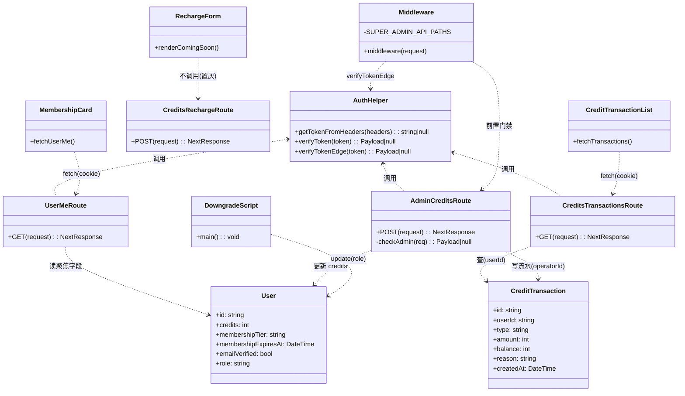
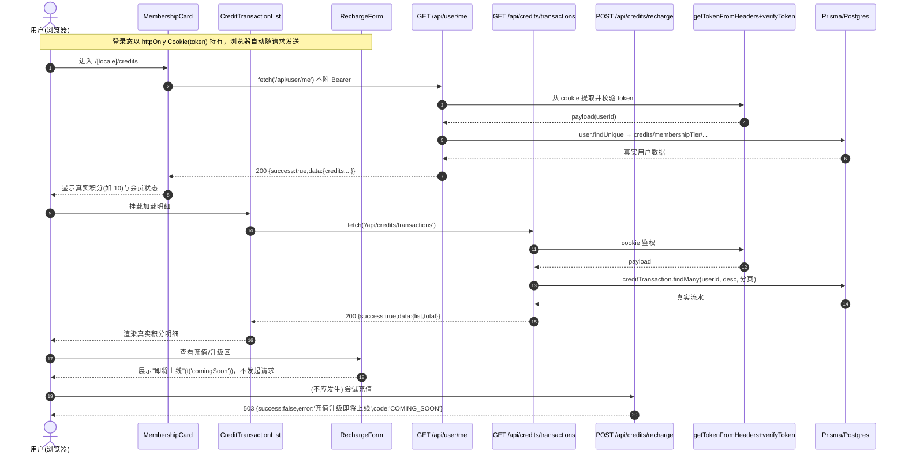
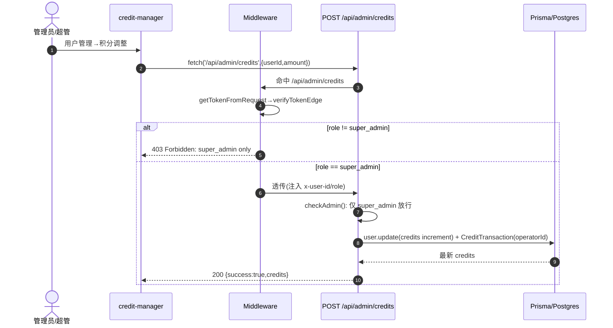
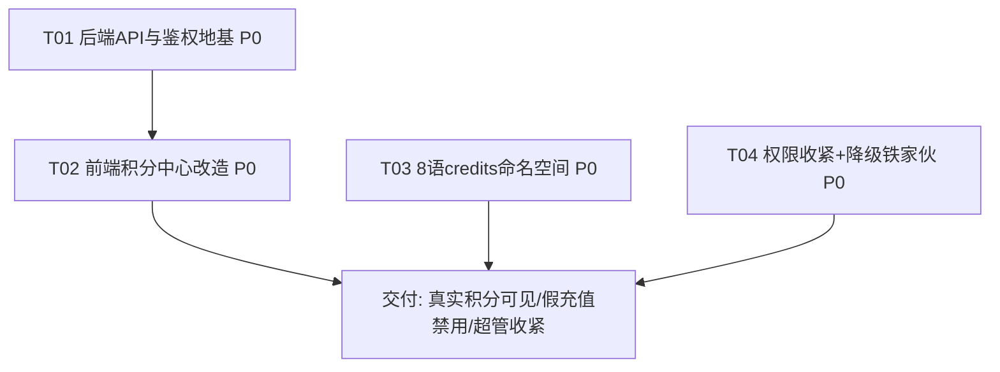

# 用户体系 P0 止血 — 技术设计文档（软件架构）

> **文档性质**：架构设计 + 任务分解（给工程师实现用）
> **依据 PRD**：`deliverables/用户体系完善方案_2026-07-24.md`（Alice 整合版 V1.0，已批准）
> **代码基线**：`usedfarmmach/`（Next.js 14 App Router + Prisma + PostgreSQL + next-intl）
> **目标**：让用户"看得到真积分 + 假充值不能白给分 + 超管不被滥用"，零资质依赖，立即可做

---

## Part A：系统设计

### 1. 实现方案（Implementation Approach）

#### 1.1 难点拆解

| 难点 | 说明 | 对策 |
|------|------|------|
| 积分中心"断联" | `/credits` 三个 client 组件用 `localStorage.getItem("token")` 取 Bearer，而真实登录是 **httpOnly Cookie + `verifyToken`**；且 `/api/user/me`、`/api/credits/transactions` 接口不存在 → 永远显示 0/空 | 新建两个只读 GET 接口（cookie 鉴权），前端改为 cookie 会话调用，移除 localStorage |
| 免支付增发积分（高危） | `/api/credits/recharge` 无支付校验直接 `credits.increment` + 写 `CreditTransaction` | 在真实支付接入前**禁用该端点**（POST 直接返回 503，不落库），前端充值/升级入口置灰为"即将上线" |
| 积分文案外显原始 key | `messages/*` 的 `credits` 命名空间只有导航标量 `"积分中心"`，缺 `title/recharge/...` 子键 | 将顶层的 `credits` 标量**改为对象**，补齐 8 语子键 |
| super_admin 权限过度授予 | `admin` 与 `super_admin` 门禁等价、功能无差；外部合作方 `932133255@qq.com` 持超管 | ① middleware 新增 `super_admin` 专属路径门禁；② `/api/admin/credits`（积分手动干预）收紧为仅 `super_admin`；③ 一次性脚本将铁家伙降级为 `admin` |
| 升级死链 | `MembershipCard` 升级调不存在的 `/api/credits/charge` | 升级按钮在真实支付前置灰，显示"即将上线"，不再调用任何不存在端点 |

#### 1.2 框架与库（全部复用既有，**无新增依赖**）

- **Next.js 14 App Router**：新建 `route.ts` 用 `GET`/`POST` handler，沿用 `NextResponse.json`。
- **Prisma + PostgreSQL**：`User.credits`、`CreditTransaction` 已是真实表，仅暴露查询。
- **next-intl**：`useTranslations("credits")` / `getTranslations("credits")` 已用于 4 个 credits 组件，仅需补齐消息键。
- **jsonwebtoken**（Node 端）+ Web Crypto（`auth-edge.ts`，Edge 端）：鉴权复用 `getTokenFromHeaders` + `verifyToken`（route 内）、`verifyTokenEdge`（middleware 内）。**不引入新库**。

#### 1.3 架构模式

保持现有「页面（Server Component 壳 + Client 组件取数）」+「API Route 鉴权 + Prisma」模式。新增接口与 `/api/user/profile` 完全同源：route 内 `getTokenFromHeaders(req.headers)` → `verifyToken` → `prisma`。**不引入新抽象层**，改动局部、可回滚。

---

### 2. 文件清单（File List）

#### 新建（New）
- `src/app/api/user/me/route.ts` — `GET /api/user/me`，返回本人聚焦数据（cookie 鉴权）
- `src/app/api/credits/transactions/route.ts` — `GET /api/credits/transactions`，分页查真实流水（cookie 鉴权）
- `scripts/p0-downgrade-superadmin.mjs` — 一次性脚本：将 `932133255@qq.com` 由 `super_admin` 降级为 `admin`

#### 修改（Modify）
- `src/app/api/credits/recharge/route.ts` — 禁用：POST 直接返回 `503`，**不再** `credits.increment` / 写流水
- `src/app/[locale]/credits/membership-card.tsx` — 移除 localStorage/Bearer；`fetch('/api/user/me')` 走 cookie；升级按钮置灰为"即将上线"
- `src/app/[locale]/credits/credit-transactions.tsx` — 移除 localStorage/Bearer；`fetch('/api/credits/transactions')` 走 cookie；类型文案走 i18n
- `src/app/[locale]/credits/recharge-form.tsx` — 改为"即将上线"卡片，移除充值调用与 localStorage
- `src/app/[locale]/credits/page.tsx` — 标题改用 `t("title")`（已用，确认解析即可）
- `src/middleware.ts` — 新增 `SUPER_ADMIN_API_PATHS`，对 `/api/admin/credits` 强制 `super_admin`
- `src/app/api/admin/credits/route.ts` — `checkAdmin()` 收紧为仅 `super_admin`
- `messages/zh.json` `en.json` `ru.json` `es.json` `pt.json` `ar.json` `fr.json` `hi.json` — 将顶层 `"credits"` 标量改为对象，补齐子键

---

### 3. 数据结构与接口（Class Diagram）

> 详见 `docs/p0-class.mermaid`。核心类关系：



#### 3.1 关键接口契约（API Contract）

**`GET /api/user/me`**（cookie 鉴权，复用 `getTokenFromHeaders`）
- 成功 `200`：`{ success: true, data: { id, email, emailVerified, credits, membershipTier, membershipExpiresAt, role } }`
- 失败 `401`：`{ success: false, error: "Unauthorized" | "Invalid token" }`
- 实现复用 `getUserFromToken(token)`（已存在，返回聚焦字段），无需重复查询。

**`GET /api/credits/transactions?page=1&pageSize=20`**（cookie 鉴权）
- 成功 `200`：`{ success: true, data: { list: Transaction[], total, page, pageSize } }`
  - `Transaction = { id, type, amount, balance, reason, createdAt }`
- 失败 `401`：`{ success: false, error: "Unauthorized" }`
- 实现：`prisma.creditTransaction.findMany({ where:{ userId }, orderBy:{ createdAt:'desc' }, skip, take })` + `count`。

**`POST /api/credits/recharge`**（禁用）
- 任何请求均返回 `503`：`{ success: false, error: "充值升级即将上线", code: "COMING_SOON" }`
- **不读取 body、不落库、不增积分**。真实支付接入（阶段2）后在此接微信/Stripe。

**`POST /api/admin/credits`**（收紧）
- `checkAdmin()` 改为仅 `super_admin` 放行；`admin` 返回 `403 { success:false, error:"无权限" }`。
- 成功写 `CreditTransaction`（operatorId = 操作人）留审计。

---

### 4. 程序调用流（Sequence Diagram）

> 详见 `docs/p0-sequence.mermaid`。要点：





---

### 5. 任何不明确 / 假设（Anything UNCLEAR）

1. **`.credits` 标量改对象的安全性**：已实读确认，顶层 `credits` 标量仅被 4 个 credits 组件通过 `useTranslations("credits")` 消费；侧边栏导航用的是独立的 `nav.credits` 键（见 `src/config/navigation.ts:26`），因此将 `credits` 改为对象**不会**破坏导航。仍建议工程师改完跑一次 `next-intl` 校验。
2. **`/api/user/me` 与既有 `/api/auth/me` 并存**：既有 `/api/auth/me` 返回 `{data:{user}}` 全量对象，疑似被其他页面使用，本设计**保留它不动**，新建聚焦的 `/api/user/me` 专门服务积分中心。若后续确认无人用 `/api/auth/me`，可再清理。
3. **降级为 `admin` 还是"受限运营角色"**：PRD 推荐「降级为 admin 或受限运营角色」。代码当前无独立"运营 admin"角色（仅 `super_admin/admin/seller/buyer`），故按 **降级为 `admin`** 设计；如需新建受限角色属 P1，超出 P0。
4. **`/admin/system` 不存在**：当前唯一 super_admin 差异化落点是「积分手动干预 `/api/admin/credits`」。middleware 门禁机制已预留 `SUPER_ADMIN_API_PATHS` 常量，后续 `/admin/system`、`/api/admin/system` 上线时直接加入即可。
5. **任务分解"首任务=基础设施"规则的偏离**：本项目为存量应用，基础设施（package.json / next.config / tsconfig / tailwind）已就绪。故将 T01 设为「后端 API 与鉴权地基」，承担基础设施职责（新建路由骨架 + 复用既有鉴权），而非重复创建工程脚手架。
6. **降级脚本执行**：`scripts/p0-downgrade-superadmin.mjs` 为**一次性运维操作**，需对生产库（`DATABASE_URL`）执行 `node scripts/p0-downgrade-superadmin.mjs`，不在构建/部署流程内，但属 P0 必做项。

---

## Part B：任务分解（Task Decomposition）

### 6. 所需依赖包（Required Packages）

**无新增依赖**。全部复用既有：`next` / `next-intl` / `@prisma/client` / `jsonwebtoken` / `bcryptjs`（已在 `package.json`）。`scripts/*.mjs` 用 Node 内置 + `@prisma/client`，与现有 `scripts_add_verifyemail_hi.js` 风格一致。

---

### 7. 任务清单（按依赖排序，≤5 个）

> 规则适配：本项目为存量应用，T01 承担"基础设施/地基"职责。

#### T01 — 后端 API 与鉴权地基（P0 核心）
- **源文件**：
  - `src/app/api/user/me/route.ts`（新）
  - `src/app/api/credits/transactions/route.ts`（新）
  - `src/app/api/credits/recharge/route.ts`（改：禁用 503）
- **依赖**：无
- **优先级**：P0
- **要点**：两个新 GET 复用 `getTokenFromHeaders`+`verifyToken`（与 `/api/user/profile` 同源）；recharge 直接 503 不落库。

#### T02 — 前端积分中心鉴权修正与组件改造
- **源文件**：
  - `src/app/[locale]/credits/membership-card.tsx`（改：移除 localStorage；`fetch('/api/user/me')` 走 cookie；升级按钮置灰）
  - `src/app/[locale]/credits/credit-transactions.tsx`（改：移除 localStorage；`fetch('/api/credits/transactions')` 走 cookie）
  - `src/app/[locale]/credits/recharge-form.tsx`（改：改为"即将上线"卡片）
  - `src/app/[locale]/credits/page.tsx`（改：标题确认用 `t("title")`）
- **依赖**：T01
- **优先级**：P0
- **要点**：所有 `localStorage.getItem("token")` + Bearer 头**全部删除**；浏览器自动带 cookie。`upgradeMembership()` 调用 `/api/credits/charge` 的逻辑移除，按钮 `disabled` 显示 `t('upgradeSoon')`。

#### T03 — 8 语 `credits` 命名空间补齐
- **源文件**：
  - `messages/zh.json` `en.json` `ru.json` `es.json` `pt.json` `ar.json` `fr.json` `hi.json`（8 个文件）
- **依赖**：无（与 T01/T02 可并行；键名与 T02 对齐）
- **优先级**：P0
- **要点**：将各文件顶层 `"credits": "<标量>"` 改为对象：
  ```json
  "credits": {
    "title": "会员积分中心",
    "membershipStatus": "会员状态",
    "creditsBalance": "积分余额",
    "recharge": "积分充值",
    "upgrade": "升级会员",
    "upgradeSoon": "升级即将上线",
    "comingSoon": "功能即将上线",
    "transactionTitle": "积分明细",
    "noRecords": "暂无记录",
    "loading": "加载中...",
    "transactionTypes": { "consume": "消费", "recharge": "充值", "reward": "奖励", "expire": "过期" },
    "tiers": { "free": "免费用户", "basic": "普通会员", "premium": "高级会员", "enterprise": "企业会员" }
  }
  ```
  （8 语各自翻译 `title/comingSoon/transactionTypes/tiers` 等；`nav.credits` 不动。）

#### T04 — 权限收紧：super_admin 专属 + 降级铁家伙
- **源文件**：
  - `src/middleware.ts`（改：新增 `SUPER_ADMIN_API_PATHS = ["/api/admin/credits"]`，API 分支对 `payload.role !== "super_admin"` 返回 403）
  - `src/app/api/admin/credits/route.ts`（改：`checkAdmin()` 收紧为仅 `super_admin`）
  - `scripts/p0-downgrade-superadmin.mjs`（新：一次性降级 `932133255@qq.com` → `admin`）
- **依赖**：无（与 T01–T03 可并行）
- **优先级**：P0
- **要点**：middleware 与 route 双层校验；降级脚本对生产库执行一次，附回滚说明（如需恢复 `role='super_admin'`）。

---

### 8. 共享知识（Shared Knowledge）

- **统一响应格式**：成功 `{ success: true, data, message? }`；失败 `{ success: false, error }`（与 `profile`/`recharge` 现有风格一致）。
- **鉴权模型（唯一真相）**：登录态 = `httpOnly` Cookie `token`（HS256 JWT，`JWT_SECRET`）。路由内用 `getTokenFromHeaders(req.headers)`（兼容 Bearer 回退，但前端**不再**发 Bearer）→ `verifyToken`；middleware 用 `verifyTokenEdge`。**前端组件禁止读 `localStorage`**。
- **日期**：DB `DateTime`；前端用 `new Date(...).toLocaleDateString()` 展示；接口返回 ISO 字符串。
- **积分数据真实性**：`User.credits` / `CreditTransaction` 已由发分链路真实写入，本 P0 只"暴露真实数据"，绝不新增任何免支付增发路径。
- **合规红线**：真实支付（微信/支付宝/Stripe）须等 ICP 备案或走已备案小程序通道；网站未备案前 `/api/credits/recharge` 必须保持 503。
- **`/credits` 页面本身不强制登录**（公开页），数据按 cookie 用户隔离；未登录时接口 401，组件优雅显示 0/空。

---

### 9. 任务依赖图（Task Dependency Graph）



> T01、T03、T04 相互独立可并行；T02 依赖 T01（需先有接口）。全部为 P0，建议 T01→T02 串行优先，T03/T04 并行推进。

---

---

## 实现核对纪要（2026-07-24，对照 software-engineer 落地代码）

> 工程师按已批准方案直接实现（未收到本设计文档）。下方记录与本文建议不一致、但**已确认正确**的实现选择，供团队对齐。结论：**实现符合 PRD 与本文实质要求，可交付**。

### 一致且正确（无需改动）
- `/api/user/me`、`/api/credits/transactions` 复用 `getUserFromRequest`（cookie 优先、兼容 Bearer），与 middleware / `/api/auth/me` / `/api/user/profile` 一致。
- `/api/credits/recharge` 已禁用（503，零写库）；`CREDITS_ISSUANCE_ENABLED=false` 作为阶段2总开关。
- 前端三组件已删除 `localStorage`、改 cookie 会话；升级按钮置灰 "即将上线"。
- `/api/admin/credits` 的 `checkAdmin()` 已收紧为仅 `super_admin`（真实端点已受保护）。
- 降级 SQL（`prisma/sql/2026-07-24_demote_super_admin.sql`）事务包裹、幂等（`WHERE role='super_admin'`）、可回滚，正确。

### 与本文建议不一致但可接受（以实现为准）
1. **响应信封**：`/api/credits/transactions` 实际返回 `data: Transaction[]` + 独立 `pagination:{page,pageSize,total,hasMore}`，而非本文 `data:{list,total,page,pageSize}`。前端 `setList(result.data)` 与之匹配，正确。
2. **i18n key 命名**：实际采用 `refresh / pleaseLogin / validUntil / upgradeComingSoon / alreadyHighest / transactions / noRecords / transactionTypes`（见 `messages/zh.json` 第 32–44 行），与本文示例键名（`loading/comingSoon/upgradeSoon/transactionTitle` 等）不同；以代码与消息文件为准。
3. **503 code/message**：实际 `code:"SERVICE_UNAVAILABLE"`、文案"积分充值服务即将上线，当前暂不可用"，与本文 `COMING_SOON` 不同，等效。
4. **middleware `SUPER_ADMIN_PATHS`**：实际值为 `["/admin/system","/api/admin/system"]`（未来路径，当前不存在），而非本文的 `/api/admin/credits`。因真实端点已在 route 层收紧，功能达标；如需网关层 defense-in-depth，可把 `/api/admin/credits` 也加入该数组（可选）。
5. **降级方式**：实际用 SQL（DML 事务）而非本文的 Node 脚本，更简洁、可事务、可回滚，优于脚本。

### 待办/建议（非阻塞）
- 8 语 `credits` 命名空间虽已补齐，建议用脚本核对 8 个 `messages/*.json` 的 `credits` 键集合完全一致（尤其 `transactionTypes` 子对象），避免非 zh 语言运行时回退为原始 key。组件已对 `transactionTypes` 做 key 兜底，其余键缺失会原样显示 key。
- `membership-card` 的会员等级 label 仍仅 `zh/en/ru`（来自 `MEMBERSHIP_TIERS`），其余 5 语回退 zh —— 与 PRD"8 语全量"属阶段2，当前可接受。

*设计：software-architect ｜ 基于《用户体系完善方案_2026-07-24》｜ 代码事实已实读核实（2026-07-24）。本设计仅给出实现方案与任务分解，不含源码实现（由工程师按本文落地）。*
