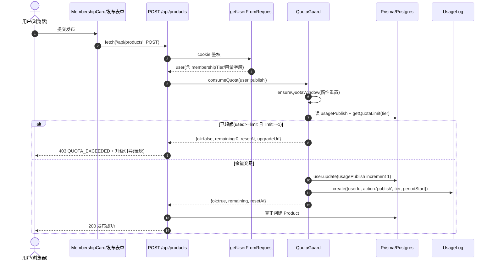
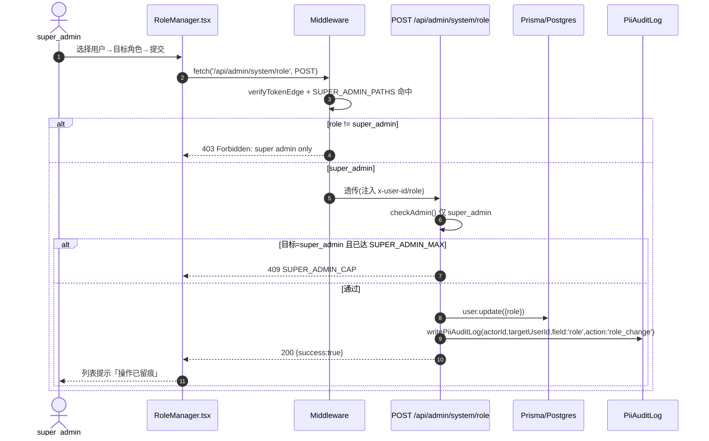
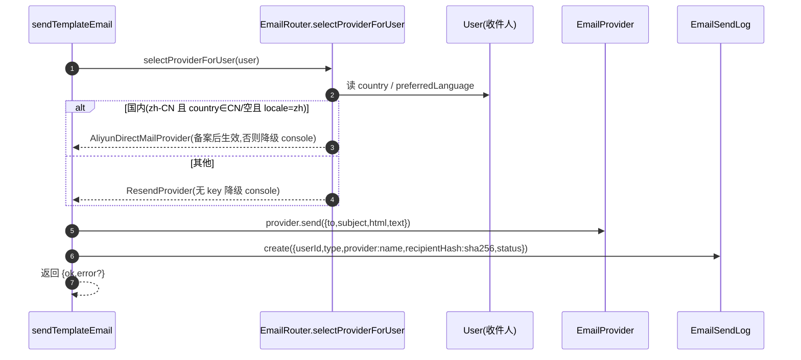

# 用户体系 P1 阶段 — 系统设计 + 任务分解（架构师产出）

> **文档性质**：架构设计 + 任务分解（给工程师实现用，不含源码）
> **撰写**：架构师 高见远（software-architect）｜ **日期**：2026-07-25
> **依据**：`deliverables/用户体系P1_PRD_2026-07-25.md` + `docs/p0-user-system-hemostasis-design.md`（已部署）
> **代码基线**：`usedfarmmach/`（Next.js 14 App Router + Prisma + Neon Postgres + next-intl 8语 + Vercel）
> **实读对齐**：`/api/user/me`、`/api/credits/transactions`、`/api/credits/recharge`、`middleware.ts`、`auth.ts`、`schema.prisma`、`email.ts`、`email/provider.ts`、`lib/permissions.ts`、`api/admin/role`、`admin/export-compliance`、`api/valuation`、`api/inquiries`、`api/products`

---

## Part A：系统设计

### 1. 实现方案（Implementation Approach）

#### 1.1 难点拆解与对策

| 难点 | 说明 | 对策 |
|------|------|------|
| 额度闸门真实化 | 会员等级已落库（`membershipTier`/`membershipExpiresAt`），但核心动作（发布/询价/AI估值/查看联系方式）**无任何用量闸门**；`MEMBERSHIP_TIERS` 已有 per-tier 上限但只用于展示/读权限，未强制计数 | 新增 `User` 用量计数器 + `UsageLog`；抽 `QuotaGuard` 助手在 4 个核心动作 route 顶部调用（Node 运行时，非 Edge）做「惰性重置 → 读上限 → 计数+1 / 超额拦截」 |
| 额度与积分解耦（红线） | 额度消费若写 `CreditTransaction` 会污染积分账本，且存在免支付增发隐患 | 额度消费**仅写独立 `UsageLog`**，绝不碰 `CreditTransaction`；`CREDITS_ISSUANCE_ENABLED` 维持 false |
| super_admin 真实专属能力 | 现有 `/api/admin/role` 仅 `admin` 级、角色集合有限、无审计；`/admin/system` 域中间件已收紧但无对应页面与端点 | 新增 `/api/admin/system/{role,audit,config,compliance}` 4 端点（route 层再校验 `super_admin`）+ 4 个 `/admin/system/*` 页面；角色变更写 `PiiAuditLog` |
| 数据出境合规看板 | 现 `admin/export-compliance` 是「商品出口合规 Agent」，与「**个人数据出境**」是两码事 | **新建** `/admin/system/compliance` 看板，指标取自 `EmailSendLog`（provider=resend 视为出境）distinct 收件人 + 10万阈值进度 |
| 国内双轨零业务改动 | 邮件 PII 出境靠 provider 选择；业务代码不应感知属地 | 在 `EmailProvider` 抽象层加 `selectProviderForUser(user)` 路由策略（按 `country`/`preferredLanguage`），`sendEmail` 门面透明切换；国内服务商 stub 真实实现 |

#### 1.2 框架与库（**全部复用既有，无新增依赖**）

- **Next.js 14 App Router**：route handler 沿用 `NextResponse.json`、`getUserFromRequest`（`@/lib/auth`）做 cookie 鉴权。
- **Prisma + PostgreSQL**：新增 `UsageLog` 模型 + `User` 用量字段（additive 迁移，可回滚）。
- **next-intl**：新增 `quota` / `adminSystem` 8语命名空间。
- **既有 `EmailProvider` 抽象**：`ResendProvider`/`ConsoleProvider` 已实现；`AliyunDirectMailProvider`/`TencentSesProvider` 为 stub，本期 **C1 仅接线、C2 真实实现**。
- **不引入新库**：`crypto`（SHA-256，已用）、`jsonwebtoken`（已用）均就绪。

#### 1.3 架构模式

保持现有「API Route 鉴权 + Prisma」+「Server Component 壳 + Client 取数」模式。**关键决策：QuotaGuard 是服务端助手函数（非 Edge 中间件）**——因为额度校验需读/写 DB（Prisma 在 Edge 不可用）。`middleware.ts` 只做认证门禁（已含 `SUPER_ADMIN_PATHS`）；额度与角色校验在 route handler（Node 运行时）内调用助手完成，保证 defense-in-depth 且可单测。

---

### 2. 文件清单（File List）

> 约定：🆕=新建，✏️=修改。所有路径相对 `usedfarmmach/`。

#### 数据模型 / 迁移
- ✏️ `prisma/schema.prisma` — `User` 增 `usagePeriodStart`、`usagePublish`、`usageInquiry`、`usageAiValuation`、`usageViewContact`；新增 `UsageLog` 模型
- 🆕 `prisma/migrations/`（自动生成，additive + 幂等回滚脚本说明）

#### 核心库（P1-a / P1-b / P1-c 共用地基）
- 🆕 `src/lib/quota/constants.ts` — `QUOTA_ACTIONS`、`getQuotaLimit(tier, action)`（复用并扩展 `MEMBERSHIP_TIERS`）
- 🆕 `src/lib/quota/guard.ts` — `ensureQuotaWindow(user)`（惰性重置）、`getQuotaState(user)`（只读）、`consumeQuota(user, action)`（计数+1 / 超额）
- 🆕 `src/lib/quota/index.ts` — 重导出
- ✏️ `src/lib/permissions.ts` — `MEMBERSHIP_TIERS` 补 `inquiriesPerMonth`/`contactsPerMonth`；新增 `SUPER_ADMIN_MAX = 3`、`ROLE_SET` 含 `partner_limited`
- 🆕 `src/lib/audit.ts` — `writePiiAuditLog({actorId, targetUserId, field, action, purpose})` 统一审计写入
- 🆕 `src/lib/email/routing.ts` — `selectProviderForUser(user)` 按属地/语言选 provider
- ✏️ `src/lib/email.ts` — `sendTemplateEmail` 改调 `selectProviderForUser`（业务零改动）
- ✏️ `src/lib/email/provider.ts` — 注册国内 provider；**C1** 维持 stub、**C2** 真实实现 `AliyunDirectMailProvider`/`TencentSesProvider`
- ✏️ `messages/zh.json` `en.json` `ru.json` `es.json` `pt.json` `ar.json` `fr.json` `hi.json` — 增 `quota`、`adminSystem` 命名空间

#### P1-a 额度引擎
- ✏️ `src/app/api/products/route.ts` — 发布 POST 注入 `consumeQuota('publish')`
- ✏️ `src/app/api/inquiries/route.ts` — 询价 POST 注入 `consumeQuota('inquiry')`
- ✏️ `src/app/api/valuation/route.ts` — AI 估值 POST 注入 `consumeQuota('aiValuation')`
- ✏️ `src/app/api/admin/users/[id]/reveal-email/route.ts` — 查看联系方式注入 `consumeQuota('viewContact')` + `writePiiAuditLog`
- 🆕 `src/app/api/user/quota/route.ts` — `GET` 返回本人本周期各动作 `used/limit/remaining/resetAt`
- ✏️ `src/app/[locale]/credits/membership-card.tsx` — 额度面板（已用/剩余/重置日）+ 超额置灰升级引导

#### P1-b 超管专属能力
- ✏️ `src/app/api/admin/role/route.ts` — 收紧为仅 `super_admin`、支持 `super_admin`/`partner_limited` 目标 + 超管上限校验、写 `PiiAuditLog`
- 🆕 `src/app/api/admin/system/audit/route.ts` — 读 `PiiAuditLog`+`EmailSendLog`（筛选/分页）
- 🆕 `src/app/api/admin/system/config/route.ts` — 只读系统配置（env 开关/provider 状态）
- 🆕 `src/app/api/admin/system/compliance/route.ts` — 数据出境指标（distinct 出境收件人数 + 10万阈值）
- 🆕 `src/app/[locale]/admin/system/roles/page.tsx` + `RoleManager.tsx`
- 🆕 `src/app/[locale]/admin/system/audit/page.tsx` + `AuditLogTable.tsx`
- 🆕 `src/app/[locale]/admin/system/config/page.tsx`
- 🆕 `src/app/[locale]/admin/system/compliance/page.tsx`
- ✏️ `src/app/[locale]/admin/admin-sidebar.tsx` — 新增「系统治理」分组入口（仅 super_admin 可见）

#### P1-c 国内双轨
- ✏️ `src/lib/email/routing.ts`（见上，C1 核心）
- ✏️ `src/lib/email/provider.ts`（见上，C1 接线 / C2 实现）
- ✏️ `.env*` / `vercel` 环境变量：`EMAIL_PROVIDER_DOMESTIC`（默认 `aliyun_directmail`）、`ALIYUN_DM_*`、`TENCENT_SES_*`（C2 启用）

---

### 3. 数据结构与接口（Class Diagram）

```mermaid
classDiagram
    class User {
        +id: string
        +role: string
        +membershipTier: string
        +membershipExpiresAt: DateTime
        +usagePeriodStart: DateTime
        +usagePublish: int
        +usageInquiry: int
        +usageAiValuation: int
        +usageViewContact: int
        +country: string
        +preferredLanguage: string
    }
    class UsageLog {
        +id: string
        +userId: string
        +action: string
        +tier: string
        +periodStart: DateTime
        +createdAt: DateTime
    }
    class PiiAuditLog {
        +id: string
        +actorId: string
        +targetUserId: string
        +field: string
        +action: string
        +purpose: string
        +createdAt: DateTime
    }
    class EmailSendLog {
        +id: string
        +userId: string
        +type: string
        +provider: string
        +recipientHash: string
        +status: string
        +createdAt: DateTime
    }
    class QuotaConfig {
        <<constants>>
        +QUOTA_ACTIONS: string[]
        +getQuotaLimit(tier, action): number|-1
        +SUPER_ADMIN_MAX: int
    }
    class QuotaGuard {
        +ensureQuotaWindow(user): void
        +getQuotaState(user): QuotaState
        +consumeQuota(user, action): QuotaResult
    }
    class EmailRouter {
        +selectProviderForUser(user): EmailProvider
    }
    class EmailProvider {
        <<interface>>
        +name: string
        +send(input): EmailSendResult
    }
    class ResendProvider
    class ConsoleProvider
    class AliyunDirectMailProvider
    class TencentSesProvider
    class ApiUserQuota {
        +GET(request): NextResponse
    }
    class ProductCreateRoute {
        +POST(request): NextResponse
    }
    class InquiryCreateRoute {
        +POST(request): NextResponse
    }
    class ValuationRoute {
        +POST(request): NextResponse
    }
    class RevealEmailRoute {
        +POST(request): NextResponse
    }
    class AdminSystemRoleRoute {
        +POST(request): NextResponse
    }
    class AdminSystemAuditRoute {
        +GET(request): NextResponse
    }
    class AdminSystemConfigRoute {
        +GET(request): NextResponse
    }
    class AdminSystemComplianceRoute {
        +GET(request): NextResponse
    }
    class MembershipCard {
        +renderQuotaPanel()
        +onOverLimit()
    }
    class RoleManagerPage {
        +changeRole()
    }
    class AuditLogPage
    class ConfigPage
    class CompliancePage

    QuotaGuard ..> User : 读/增计数
    QuotaGuard ..> UsageLog : 写消费流水
    QuotaGuard ..> QuotaConfig : 读上限
    EmailRouter ..> User : 读 country/locale
    EmailRouter ..> EmailProvider : 返回实例
    EmailProvider <|.. ResendProvider
    EmailProvider <|.. ConsoleProvider
    EmailProvider <|.. AliyunDirectMailProvider
    EmailProvider <|.. TencentSesProvider
    ProductCreateRoute ..> QuotaGuard : consumeQuota(publish)
    InquiryCreateRoute ..> QuotaGuard : consumeQuota(inquiry)
    ValuationRoute ..> QuotaGuard : consumeQuota(aiValuation)
    RevealEmailRoute ..> QuotaGuard : consumeQuota(viewContact)
    RevealEmailRoute ..> PiiAuditLog : writePiiAuditLog
    ApiUserQuota ..> QuotaGuard : getQuotaState
    MembershipCard ..> ApiUserQuota : fetch(quota)
    AdminSystemRoleRoute ..> User : update(role)
    AdminSystemRoleRoute ..> PiiAuditLog : writePiiAuditLog
    AdminSystemAuditRoute ..> PiiAuditLog : 查
    AdminSystemAuditRoute ..> EmailSendLog : 查
    AdminSystemComplianceRoute ..> EmailSendLog : 出境计数
    RoleManagerPage ..> AdminSystemRoleRoute : fetch(POST)
    AuditLogPage ..> AdminSystemAuditRoute : fetch
    ConfigPage ..> AdminSystemConfigRoute : fetch
    CompliancePage ..> AdminSystemComplianceRoute : fetch
```



#### 3.1 关键接口契约

**`GET /api/user/quota`**（cookie 鉴权）
- `200`：`{ success:true, data:{ periodStart, resetAt, items:{ action, used, limit, remaining }[] } }`
  - `limit` = `-1` 表示无限；`remaining` = `limit===-1 ? -1 : max(0, limit-used)`
- `401`：`{ success:false, error:"未登录" }`

**QuotaGuard 内部契约**
- `consumeQuota(user, action)` 返回 `{ ok:boolean, remaining:number, limit:number, resetAt:string }`
- 超额时 route 直接 `return NextResponse.json({ success:false, code:"QUOTA_EXCEEDED", error:"本月额度已用尽", data:{ remaining:0, resetAt, upgradeUrl:`/${locale}/membership` } }, { status: 403 })`（按 Q3 默认硬限额）。
- 惰性重置：`ensureQuotaWindow` 判断 `usagePeriodStart` 是否落在「当前自然月」（取 `YYYY-MM-01 00:00` 比对）；否 → `prisma.user.update({ data:{ usagePublish:0, usageInquiry:0, usageAiValuation:0, usageViewContact:0, usagePeriodStart: 月初 } })`。

**`POST /api/admin/system/role`**（super_admin 鉴权，双层：middleware + route `checkAdmin`）
- body：`{ userId, role }`，`role ∈ ROLE_SET`（含 `super_admin`、`partner_limited`）
- 若 `role==="super_admin"`：先 `count({where:{role:"super_admin"}})`，达 `SUPER_ADMIN_MAX` 返回 `409 { code:"SUPER_ADMIN_CAP" }`
- 成功：`user.update({role})` + `writePiiAuditLog({actorId, targetUserId:userId, field:"role", action:"role_change", purpose:reason})` → `200 {success:true}`

**`GET /api/admin/system/compliance`**（super_admin）
- `200`：`{ success:true, data:{ crossBorderRecipients:number, threshold:100000, ratio:number, providers:[{name, count}] } }`
- 口径：`crossBorderRecipients = distinct EmailSendLog.recipientHash WHERE provider='resend'`（console 为本地降级，不计；国内 provider 不计）。

---

### 4. 程序调用流（Sequence Diagram）

#### 4.1 额度闸门：受保护动作（以「发布」为例）



#### 4.2 超管角色管理（双层校验 + 审计）



#### 4.3 邮件双轨路由（业务零改动）



---

### 5. 任何不明确 / 假设（Anything UNCLEAR）

> 以下按 PRD 待拍板 Q1–Q8 采用**推荐默认值**设计；已标注需用户最终确认。

1. **Q4 额度口径（默认：月度额度 + 各动作独立计数）**：4 个动作（publish/inquiry/aiValuation/viewContact）**各持有独立月度计数器**，上限取同 tier 值（free 5 / basic 50 / premium·enterprise -1）。即「发布 5 次/月」与「AI估值 5 次/月」互不挤占。若老板想要「共享池」，改 `getQuotaLimit` 即可，落地不动。
2. **Q2 重置周期（默认：自然月）**：以 `usagePeriodStart` 是否落在当前 `YYYY-MM-01` 起判，惰性重置（无定时任务；可选 `scripts/p1-quota-reset-cron.mjs` 兜底，非必须）。
3. **Q3 超额行为（默认：硬限额阻断）**：返回 `403 QUOTA_EXCEEDED` + `remaining:0` + `resetAt` + `upgradeUrl`，前端置灰升级。
4. **Q1 国内服务商（默认：阿里云 DirectMail）**：`EMAIL_PROVIDER_DOMESTIC=aliyun_directmail`；**C2 需 ICP+域名备案生效**，备案前即使配置也走 console 降级（不真正出境）。
5. **Q5 P1 收款（默认：否）**：升级按钮仅展示/置灰，真实付费走 P2 已备案小程序通道；`/api/credits/recharge` 维持 503。
6. **Q6 多超管（默认：上限 3，当前 2 个）**：`SUPER_ADMIN_MAX=3`；**石家庄铁家伙（932133255@qq.com）维持 super_admin 不降级**（用户硬指令）。`/api/admin/system/role` 设 `super_admin` 时校验上限。
7. **Q7 双轨前置（默认：先 C1 路由框架，C2 待备案）**：C1 代码全量完成可上线；C2 真实发送标记 `blocked-by 备案`。
8. **Q8 解耦边界（已定）**：额度消费写独立 `UsageLog`，**绝不写 `CreditTransaction`**；积分未来不可兑额度。
9. **命名空间澄清**：现 `admin/export-compliance/page.tsx` 是「**商品出口**合规 Agent」，与 B5「**个人数据出境**合规看板」无关；B5 为**全新** `/admin/system/compliance` 页面，指标来自 `EmailSendLog`（provider=resend 计为出境）。
10. **既有 `/api/admin/role` 重叠**：该路由现存（admin 级、角色集有限、无审计）。本期**收紧为 super_admin + 补审计 + 扩角色集 + 超管上限**；原 admin 调用方改 403。不新建 `/api/admin/system/role` 以免双端点混乱（采用「改造旧端点」方案）。
11. **`partner_limited` 新角色值**：`User.role` 为自由字符串，新增 `"partner_limited"`（合作方受限权限，如只读/限定动作），具体受限动作表由 B1 UI 下拉给出，route 仅存值；A2 配额守卫对受限角色同样生效。

---

## Part B：任务分解（Task Decomposition）

### 6. 所需依赖包（Required Packages）

**无新增依赖**。全部复用既有：`next` / `next-intl` / `@prisma/client` / `jsonwebtoken` / `bcryptjs` / `crypto`（Node 内置，SHA-256）/ `lucide-react`（图标，已用）。国内服务商（阿里云/腾讯云）SDK 在 **C2** 阶段按需 `import()` 延迟加载（同 Resend 现有模式），不进主包。

---

### 7. 任务清单（按依赖排序，≤5 个）

> 规则适配：本项目为存量应用，T01 承担「基础设施/核心库+数据模型+i18n」职责（类比绿地的首任务=项目基础设施）。T02/T03/T04 仅依赖 T01，可**并行**；T05 依赖 T04 且 **blocked-by 备案**。

#### T01 — 基础层：数据模型 + 核心库 + i18n（P0 级地基）
- **源文件**：
  - `prisma/schema.prisma`（改：User 用量字段 + `UsageLog`）
  - `src/lib/quota/constants.ts`（新）、`src/lib/quota/guard.ts`（新）、`src/lib/quota/index.ts`（新）
  - `src/lib/permissions.ts`（改：补 `inquiriesPerMonth`/`contactsPerMonth` + `SUPER_ADMIN_MAX`/`ROLE_SET`）
  - `src/lib/audit.ts`（新：`writePiiAuditLog`）
  - `src/lib/email/routing.ts`（新：`selectProviderForUser`）
  - `messages/*.json` ×8（改：增 `quota`/`adminSystem`）
- **依赖**：无
- **优先级**：P0
- **要点**：迁移脚本须 additive + 可回滚；`getQuotaLimit` 复用 `MEMBERSHIP_TIERS`；`writePiiAuditLog` 为后续 B1/B2 共用。

#### T02 — P1-a 额度引擎落地（闸门 + 面板）
- **源文件**：
  - `src/app/api/products/route.ts`（改：发布注入 guard）
  - `src/app/api/inquiries/route.ts`（改：询价注入 guard）
  - `src/app/api/valuation/route.ts`（改：AI估值注入 guard）
  - `src/app/api/admin/users/[id]/reveal-email/route.ts`（改：查看联系方式注入 guard + 审计）
  - `src/app/api/user/quota/route.ts`（新：GET 用量）
  - `src/app/[locale]/credits/membership-card.tsx`（改：额度面板 + 超额置灰升级）
- **依赖**：T01
- **优先级**：P0
- **要点**：4 个受保护路由统一在 auth 后首行 `consumeQuota`；超额统一 `403 QUOTA_EXCEEDED` 结构；`/api/user/quota` 供面板与置灰判断。

#### T03 — P1-b 超管专属能力（端点 + 页面）
- **源文件**：
  - `src/app/api/admin/role/route.ts`（改：收紧 super_admin + 扩角色 + 上限 + 审计）
  - `src/app/api/admin/system/audit/route.ts`（新）、`src/app/api/admin/system/config/route.ts`（新）、`src/app/api/admin/system/compliance/route.ts`（新）
  - `src/app/[locale]/admin/system/roles/page.tsx` + `RoleManager.tsx`（新）
  - `src/app/[locale]/admin/system/audit/page.tsx` + `AuditLogTable.tsx`（新）
  - `src/app/[locale]/admin/system/config/page.tsx`（新）
  - `src/app/[locale]/admin/system/compliance/page.tsx`（新）
  - `src/app/[locale]/admin/admin-sidebar.tsx`（改：系统治理入口，仅 super_admin）
- **依赖**：T01
- **优先级**：P0
- **要点**：端点均 route 层再校验 `super_admin`（middleware 已网关层拦截）；compliance 指标口径见 §3.1；角色变更必写 `PiiAuditLog`。

#### T04 — P1-c C1 路由框架（业务零改动）
- **源文件**：
  - `src/lib/email/routing.ts`（新，T01 已建，本期接线）
  - `src/lib/email.ts`（改：`sendTemplateEmail` 调 `selectProviderForUser`）
  - `src/lib/email/provider.ts`（改：注册国内 provider 接入点，C1 仍 stub）
  - `.env*` / Vercel 环境变量（`EMAIL_PROVIDER_DOMESTIC` 等，C1 占位）
- **依赖**：T01
- **优先级**：P0
- **要点**：所有现存 `sendEmail` 调用方**零改动**；路由判定按 `country`/`preferredLanguage`；备案前国内通道降级 console，不真正出境。

#### T05 — P1-c C2 国内服务商真接入（blocked-by 备案）
- **源文件**：
  - `src/lib/email/provider.ts`（改：真实实现 `AliyunDirectMailProvider` / `TencentSesProvider` API 调用）
  - `.env*` / Vercel 环境变量（`ALIYUN_DM_*` / `TENCENT_SES_*` 真实 Key + 已备案域名）
- **依赖**：T04
- **优先级**：P0（代码可完成，**生效 blocked-by ICP+域名备案**）
- **要点**：仅当备案完成后切真实 Key 才真正走国内通道；此前即使配置也 console 降级。PII 最小化：国内通道同样只写 `recipientHash`（SHA-256），不落明文。

---

### 8. 共享知识（Shared Knowledge）

- **统一响应信封**：成功 `{ success:true, data, message? }`；失败 `{ success:false, error, code? }`（沿用 P0 `profile`/`recharge` 风格）。
- **鉴权唯一真相**：`httpOnly` Cookie `token`（HS256 JWT）。路由内 `getUserFromRequest(req)`（cookie 优先、兼容 Bearer）；`middleware` 用 `verifyTokenEdge`。**前端组件禁读 localStorage**。
- **双层校验惯式**：super_admin 端点 = middleware `SUPER_ADMIN_PATHS` 网关拦截 **+** route 内 `checkAdmin()` 再校验，缺一不可。
- **额度 vs 积分（红线）**：额度消费**只写 `UsageLog`**，积分账本 `CreditTransaction` 与额度**互不可串**；`CREDITS_ISSUANCE_ENABLED=false` 期间任何增发路径禁用。
- **PII 最小化**：所有邮件/审计落库仅存 `recipientHash=SHA-256(email)` 与必要操作人/对象 id，**绝不落明文邮箱/电话**（除既有 legacy 表，新表一律摘要）。
- **惰性重置语义**：以「当前自然月」为窗口；`usagePeriodStart` 跨月即重置全部计数器。无定时任务依赖。
- **超限统一结构**：`{ success:false, code:"QUOTA_EXCEEDED", error:"本月额度已用尽", data:{ remaining:0, resetAt, upgradeUrl } }` + HTTP `403`。
- **日期**：DB `DateTime`；接口返回 ISO 字符串；前端 `toLocaleDateString()` 展示；重置日展示「YYYY-MM-01」。
- **国内/国际路由判定**（C1）：`country==='CN'` 或（`country` 空 且 `preferredLanguage==='zh'`）→ 国内通道；其余 → Resend。无 key/未备案 → console 降级。
- **合规命名**：对外一律「增值信息服务费」；买家永远免费；网站未备案前不接任何商户号。

---

### 9. 任务依赖图（Task Dependency Graph）

```mermaid
graph TD
    T01[T01 基础层:模型+核心库+i18n P0] --> T02[T02 P1-a 额度引擎 P0]
    T01 --> T03[T03 P1-b 超管专属 P0]
    T01 --> T04[T04 P1-c C1 路由框架 P0]
    T04 --> T05[T05 P1-c C2 国内真接入 P0]
    T05 -. blocked-by 备案 .-> BA[ICP+域名备案]

    T02 --> DONE[交付:额度闸门真实化]
    T03 --> DONE
    T04 --> DONE
    T05 --> DONE2[交付:邮件双轨(备案后生效)]
```

> **并行说明**：T01 为地基，先完成；随后 **T02 / T03 / T04 三者相互独立、可并行推进**（仅依赖 T01）。T05 依赖 T04 且需外部「ICP+域名备案」完成后才真正生效（代码可先完成）。P1-a 与 P1-b 无资质依赖，立即可启动；P1-c 的 C1 立即可做，C2 标记 `blocked-by 备案`。

---

*设计：software-architect（高见远）｜ 基于《用户体系P1_PRD_2026-07-25》与 P0 已部署代码实读对齐 ｜ 2026-07-25 ｜ 本文仅给出实现方案与任务分解，不含源码（由工程师按本文落地）。*
