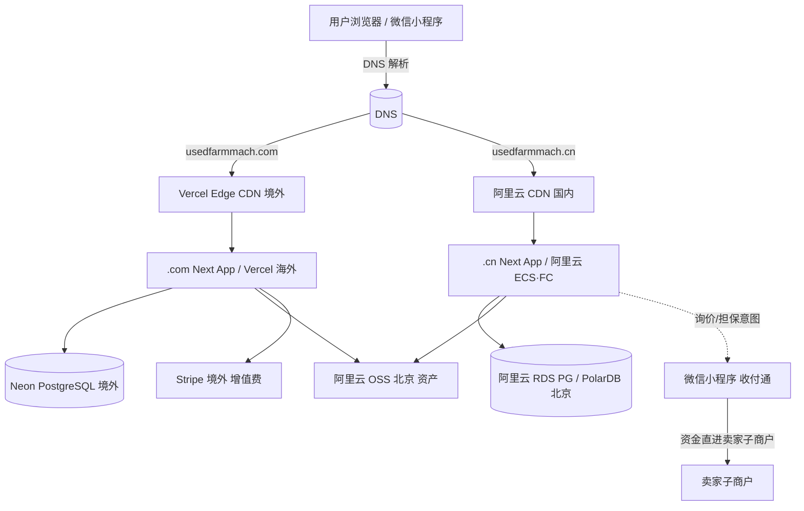
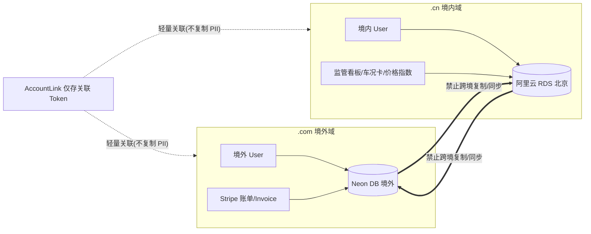
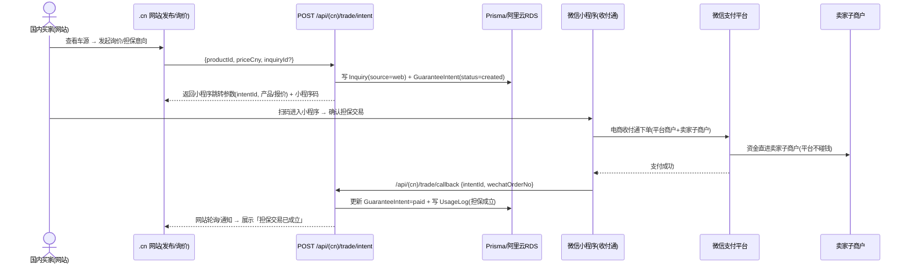
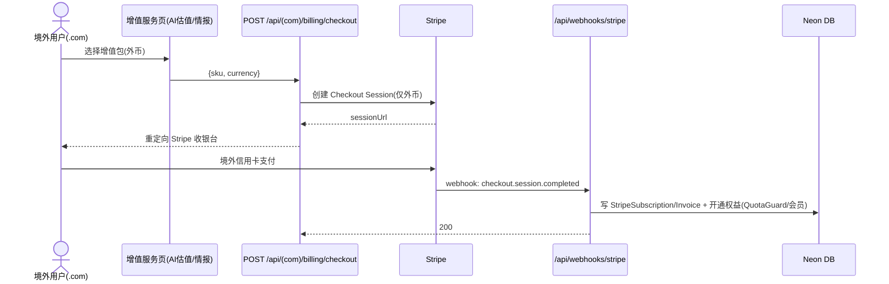
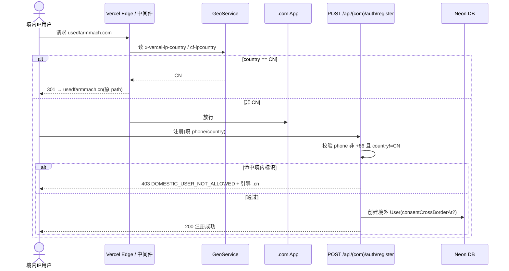

# 网站一分为二技术架构设计 + 任务分解（.com 国际化 + .cn 国内）

> **文档性质**：架构设计 + 任务分解（给工程师实现用，不含源码）
> **撰写**：架构师 高见远（software-architect）｜ **日期**：2026-07-25
> **依据**：`docs/site-split-prd.md`（PM 许清楚 v1.0）+ `docs/p1-user-system-design.md`（已落地 P1 用户体系）+ 实读 `prisma/schema.prisma`、`src/middleware.ts`、`package.json`
> **代码基线**：`usedfarmmach/`（Next.js 14 App Router + Prisma + PostgreSQL + next-intl 8 语 + Vercel 境外部署 + 阿里云 OSS 北京）
> **范围**：仅设计（部署拓扑 / 数据驻留 / 代码与 i18n 共享 / 支付集成 / 任务分解），回答 PRD 待确认 Q1–Q8，不含实现代码。

---

## 0. 设计结论速览（决策总表）

| # | 待确认问题 | **架构师推荐** | 一句话理由 |
|---|-----------|---------------|-----------|
| **Q1** | `.cn` 独立代码库 vs 共享 monorepo + 配置切换？ | **共享 monorepo + `SITE=com\|cn` 配置切换**；`.cn` 独立境内部署 + 独立数据存储 | 复用 P1 用户体系 / next-intl / 业务组件；`.cn` 必须物理隔离（备案 + 数据本地化）靠「独立部署 + 独立库」实现，而非独立代码库 |
| **Q2** | `.cn` 国内托管选型（阿里云 / 腾讯云）？ | **阿里云**（RDS PostgreSQL / PolarDB 北京 + 阿里云 CDN + SLB/ECS 或函数计算） | 已有阿里云 OSS 北京，备案主体与存量资源统一在阿里云，变更最少；微信收付通是纯 API 对接，与云厂商无关（详见 §14） |
| **Q3** | 数据出境 10 万人阈值如何落地？ | `.com` 侧 **三层识别**（网络 geo + 注册地/手机号归属 + 单独同意），主动排除境内用户；复用 `EmailSendLog` 出境计数做 10 万阈值自评估看板 | 不主动收集境内 PII → 出境人数天然趋零；阈值监控与 PIPIA 自评估机制兜底 |
| **Q4** | Stripe 币种与税务？ | Stripe **仅外币**（USD/EUR/GBP…），暂不注册境外税号，发票走 Stripe 内置；VAT 留待确认 | 先跑通增值服务费营收，税号按需补办 |
| **Q5** | 会员两站是否打通？ | **账户关联、权益分站计费**（两账号 + `AccountLink` 仅存关联 token，数据不合并） | 避免跨境资金/数据混同；会员额度本就按账户计（`QuotaGuard`/`UsageLog` 已支持） |
| **Q6** | `.cn` 备案前过渡期口径？ | 备案前 `.cn` 仅「信息发布 + 增值服务费（可收）」，**不碰资金托管/交易费**；对外话术「信息撮合 + 增值信息服务」 | 严守 PRD 红线（未备案不得收交易费/资金托管） |
| **Q7** | 元氏县/流通协会对接责任与时间表？ | 由 PM / 政府关系线负责；架构侧**预留监管看板 + 备案/合同数据接口**（P2 `GovDashboard` 已规划） | 平台能力先行，政务对接并行 |
| **Q8** | 小程序与网站询价数据是否打通？ | **打通（同一 `User` 体系，`miniOpenid` 绑定），资金仅小程序闭环** | 网站询价与小程序担保同用户；`EscrowOrder`/收付通仅在小程序侧 |

---

# Part A：系统设计

## 1. 实现方案（Implementation Approach）

### 1.1 难点拆解与对策

| 难点 | 说明 | 对策 |
|------|------|------|
| 双站物理隔离 + 代码复用 | `.cn` 需 ICP 备案 + 数据境内，`.com` 维持 Vercel 境外；但业务组件（发布/询价/估值/会员）高度重合 | **共享 monorepo**：同一份 Next.js 代码，通过 `SITE` 环境变量 + 运行时 host 判定切换站点；**双独立数据库 + 双独立部署流水线**（见 §2/§3） |
| 数据驻留（红线） | `.cn` 数据不得出境，`.com` 不得收集境内 PII | 双库 schema 同源、数据不互备；`.cn` → 阿里云 RDS 北京（自动快照仅国内）；`.com` → Neon（境外）。`DataResidencyGuard` 在写入关键 PII 前断言站点与属地一致（见 §3） |
| 境内用户识别与排除（Q3） | 数据出境 10 万阈值合规 | 三层识别：① 网络层 `x-vercel-ip-country`/`cf-ipcountry`（Edge）；② 注册层拦截 `+86` 手机号 / 境内身份证 / `country==='CN'`；③ 同意层 `consentCrossBorderAt`。`.com` 命中境内 → 301 跳 `.cn` |
| 支付边界（红线） | `.cn` 不得碰资金（二清），`.com` 不得收 RMB | `.cn` 网站仅「发布 + 询价 + 担保意图」，真实担保交易经**小程序微信收付通**（资金直进卖家子商户）；`.com` 仅 Stripe 收外币增值费。网站侧零资金流（见 §5） |
| i18n 双站差异 | `.com` 全 8 语、`.cn` 主要中/英 | `next-intl` 按 `siteConfig.locales` 动态加载语料；新增 `(cn)` / `(com)` 路由分组承载站点专属页面（见 §4） |
| 会员/额度/审计复用 | 避免重复建设 | **直接复用 P1**：`QuotaGuard`、`super_admin` 双层校验、`UsageLog`、双轨邮件路由、`MEMBERSHIP_TIERS`。新增仅「站点标识 + 币种 + 关联 token」 |

### 1.2 框架与库（默认技术栈；新增极少）

- **Next.js 14 App Router**：维持现状；新增 `(cn)` / `(com)` 路由分组 + `output: 'standalone'` 支持阿里云部署。
- **Prisma + PostgreSQL**：双库同源 schema；`.cn` 用阿里云 RDS/PolarDB，`.com` 用 Neon。
- **next-intl**：按 `SITE` 注入 `locales` / `defaultLocale`。
- **支付**：`.com` 新增 `stripe`（^16）；`.cn` 新增 `wechatpay-node-v3`（或 `wechatpay-api-v3`）封装微信收付通 V3。
- **geo**：`.com` 直接用 Vercel 提供的 `x-vercel-ip-country` 头；`.cn` 用 `geoip-lite`（MaxMind 库，离线 mmdb，不依赖外网，满足数据不出境）。
- **既有复用**：`ali-oss`（北京资产）、`@prisma/client`、`jsonwebtoken`、`bcryptjs`、`zod`、`recharts`（价格指数图）、`qrcode`（小程序码）。

### 1.3 架构模式

```
单仓库 monorepo
 ├─ 同一份 Next.js 应用代码（src/）
 ├─ 构建时/运行时由 SITE 决定：语料、支付、合规文案、特性开关
 └─ 两条部署流水线（GitHub Actions）：
      SITE=com → Vercel（境外） → Neon DB（境外）
      SITE=cn  → 阿里云（ECS/FC + CDN）→ 阿里云 RDS 北京（境内）
```

**关键决策**：
1. `SITE` 真相源 = `src/config/site.ts`（读 `process.env.SITE`，缺省 `com`）；客户端用 `NEXT_PUBLIC_SITE`（构建时注入）。
2. **鉴权沿用 P0/P1**：`httpOnly` Cookie `token`（HS256 JWT）；中间件 `verifyTokenEdge` 做网关，`route` 内 `getUserFromRequest` 做业务鉴权。前端禁读 localStorage。
3. **额度/积分红线**（沿用 P1）：额度消费只写 `UsageLog`，绝不写 `CreditTransaction`；`CREDITS_ISSUANCE_ENABLED=false` 期间任何增发路径禁用。
4. **支付边界**：网站 route 永远不直接调支付收单；`.cn` 只生成「担保意图 + 小程序跳转参数」，`.com` 只生成 Stripe Checkout Session。

---

## 2. 总体拓扑与路由（需求 1）

### 2.1 部署拓扑图



### 2.2 DNS / CDN / geo 分流策略

| 维度 | `.com`（国际化） | `.cn`（国内） |
|------|------------------|--------------|
| 域名 | `usedfarmmach.com` | `usedfarmmach.cn` |
| DNS | A/AAAA → Vercel（境外 Anycast） | A → 阿里云 CDN / SLB（国内节点） |
| CDN | Vercel Edge（自带 geo 头 `x-vercel-ip-country`） | 阿里云 CDN（国内节点，**数据不出境**） |
| 部署目标 | Vercel 项目（`SITE=com`） | 阿里云 ECS/容器/函数计算（`output:standalone`，`SITE=cn`） |
| 数据库 | Neon（境外） | 阿里云 RDS PostgreSQL / PolarDB（北京） |
| 资产存储 | 阿里云 OSS 北京（两站共用，纯静态资产不涉 PII） | 同左 |
| 备案 | 不备案（境外托管） | **必须 ICP 备案**（主体建议阿里云）后方可对外服务 |
| geo 行为 | 命中境内 IP → **301 跳 `.cn`** 或展示「不服务境内」提示 | 仅服务境内/境内外商，无需 geo 拦截 |

### 2.3 `.com` ↔ `.cn` 流量路由（反转现有 middleware）

> ⚠️ **重要修正**：当前 `src/middleware.ts` 第 67–71 行是 `.cn → .com` 全站 301 跳转（早期测试遗留）。本设计**反转**该逻辑：`.cn` 成为独立国内站，`.com` 对境内用户提示跳转 `.cn`。

**路由规则（写入 `src/middleware.ts`）**：
1. 读取 `host`：含 `usedfarmmach.cn` → 以 `SITE=cn` 上下文处理；含 `usedfarmmach.com` → `SITE=com`。
2. `SITE=com` 且 `x-vercel-ip-country === 'CN'`（或 `cf-ipcountry === 'CN'`）→ 返回 301 至 `https://usedfarmmach.cn<原 path>`（保留路径，便于用户直达对应页）。
3. `SITE=cn`：正常放行；若需，可加「境外用户欢迎语」而非拦截（PRD 允许 `.cn` 服务境内外商）。
4. 两站各自独立 `next-intl` locale 前缀路由（`.com` 8 语、`.cn` 中/英）。

---

## 3. 数据驻留（核心，需求 2）

### 3.1 数据驻留图



### 3.2 双库 schema 同源策略

- **同源**：两站使用**同一份 `prisma/schema.prisma`** 与同一套 migration。`.cn` 与 `.com` 各自 `prisma migrate deploy` 到自己的库。保证业务模型（User / Product / Inquiry / Valuation / MachineryIdentity / InspectionReport / ElectronicContract / PriceIndex / UsageLog …）一致，工程师只维护一份 schema。
- **站点专属扩展**（用 `SITE` 决定启用，不破坏同源）：
  - `.com` 专属：`StripeCustomer` / `StripeSubscription` / `StripeInvoice`（增值费账单）。
  - 两站共用但语义不同：`ServiceOrder`（`.cn` 走微信对账 / `.com` 走 Stripe）、`UsageLog`（已含 `tier` 快照，按账户计，天然分站）。
  - `AccountLink`（Q5 跨站关联，仅存双方 userId + linkToken，**绝不存 PII 副本**）。
- **数据分类守卫**：`src/lib/data-residency.ts` 提供 `assertDomesticWrite(user)` / `assertOverseasWrite(user)`，在写入 `User`/`Inquiry` 等关键 PII 前断言 `site` 与 `user.country` 一致；`.cn` 库写入 `country==='CN'` 才放行，`.com` 库写入 `country!=='CN'` 才放行（注册层已拦截，此处为 defense-in-depth）。

### 3.3 迁移 / 初始化 / 备份

| 动作 | `.com`（Neon，已有） | `.cn`（阿里云 RDS，新建） |
|------|----------------------|---------------------------|
| 建库 | 已存在 | `scripts/db-init-cn.mjs`：创建 RDS 实例 + 库 + `prisma migrate deploy` |
| 初始化数据 | 现有 | seed：`SystemConfig`（ICP 备案号、合规文案）、`Category`/`Brand` 国产农机基础数据、`MachineryIdentity` 车况卡模板、`PriceIndex` 初始样本、元氏县 demo |
| 备份 | Neon 自动备份 + 时点恢复 | 阿里云 RDS **自动快照（仅国内地域，禁止复制到海外）** + 手动跨可用区（同国内） |
| 同步 | 无 | **严禁**与 `.com` 做任何 replica/ETL 跨境同步 |
| 容灾 | Neon 多区域读副本（境外） | 阿里云 RDS 同城/同地域多可用区 |

### 3.4 Q3：`.com` 境内用户识别与排除技术

**三层识别（任一层命中即视为境内，排除/跳转）**：

1. **网络层（Edge / 中间件）**：读 `x-vercel-ip-country`（Vercel）或 `cf-ipcountry`（若套 Cloudflare）；`CN` → 301 跳 `.cn`。
2. **注册层（业务）**：`.com` 注册接口校验 `phone` 不以 `+86` 开头、`idCard` 非境内格式、`country !== 'CN'` 才允许建号；否则返回 `DOMESTIC_USER_NOT_ALLOWED` 并引导 `.cn`。
3. **同意层**：任何涉跨境传输的动作（如 resend 发邮件）要求 `consentCrossBorderAt` 已填；复用 P1 `EmailSendLog.provider='resend'` 计为出境。

**10 万阈值自评估看板**：扩展 P1 `/admin/system/compliance`，指标 = `distinct EmailSendLog.recipientHash WHERE provider='resend'`（即出境收件人数）；接近 10 万触发告警，要求补 PIPIA 与《个人信息出境标准合同》/ 安全评估。因 `.com` 不主动收集境内用户，该计数天然趋零。

---

## 4. 代码与 i18n 共享（需求 3）

### 4.1 SITE 注入机制

```ts
// src/config/site.ts（SITE 真相源，新增）
export const SITE = (process.env.SITE ?? "com") as "com" | "cn";
export const siteConfig = {
  com: { locales: ["zh","en","ru","es","pt","ar","fr","hi"], defaultLocale: "en",
         payments: { stripe: true, wechatPay: false },
         features: { valuation:true, priceIndex:false, govDashboard:false,
                     machineryIdentity:false, expo:true, stripeAddons:true },
         compliance: { icpNo:null, dataLocalized:false, serveDomesticUsers:false } },
  cn:  { locales: ["zh","en"], defaultLocale: "zh",
         payments: { stripe: false, wechatPay: true },
         features: { valuation:true, priceIndex:true, govDashboard:true,
                     machineryIdentity:true, expo:true, stripeAddons:false },
         compliance: { icpNo: process.env.CN_ICP_NO, dataLocalized:true, serveDomesticUsers:true } },
}[SITE];
```

- **客户端**：构建时注入 `NEXT_PUBLIC_SITE`；组件用 `useSite()` 读 `siteConfig` 决定渲染（如 `.cn` 显示「车况信息卡 / 价格指数 / 监管看板 / 小程序扫码」；`.com` 显示「AI 估值 CTA / Stripe 增值包 / 多币种」）。
- **服务端**：`src/lib/db.ts` 按 `SITE` 选 `DATABASE_URL`（`.cn` 用 `DATABASE_URL_CN` / 阿里云 RDS；`.com` 用 `DATABASE_URL` / Neon）。
- **路由分组**：`src/app/[locale]/(cn)/...` 与 `src/app/[locale]/(com)/...` 承载站点专属页面；通用页（首页壳、登录、会员中心）共用，内部按 `siteConfig.features` 条件渲染模块。

### 4.2 next-intl 策略

- `.com`：`locales` 全 8 语，`defaultLocale: 'en'`（国际化优先）。
- `.cn`：`locales: ['zh','en']`，`defaultLocale: 'zh'`（境内优先中文，英文入口服务境内外商）。
- `middleware.ts` 中 `createMiddleware({ locales: siteConfig.locales, defaultLocale: siteConfig.defaultLocale })`，按 `SITE` 动态生成。
- 语料文件 `messages/*.json` 两站共用命名空间（`valuation` / `adminSystem` / `cn` / `com`），新增 `cn`（车况卡/核验/价格指数/监管/小程序）与 `com`（Stripe/增值包/多币种）命名空间。

### 4.3 共享业务组件边界

| 复用（P1） | 站点专属（新增/条件渲染） |
|-----------|--------------------------|
| `QuotaGuard` / `UsageLog` / `MEMBERSHIP_TIERS` | `.cn`：车况信息卡 `MachineryIdentityCard`、权属核验流程、价格指数 `PriceIndexChart`、监管看板 `GovDashboard`、小程序码 `MiniProgramQr` |
| `super_admin` 双层校验 / `PiiAuditLog` | `.com`：Stripe 增值结账 `StripeCheckout`、多币种展示 |
| 双轨邮件路由 `selectProviderForUser` | 两站均用：`.cn` 走国内服务商（备案后）、`.com` 走 resend |
| 发布/询价/估值/会员中心 组件 | 同组件按 `siteConfig.features` 切换模块与文案 |

---

## 5. 支付集成点（需求 4）

### 5.1 支付集成时序图

**A) `.cn` 担保交易联动小程序（网站不碰资金）**



**B) `.com` Stripe 增值服务费（仅外币）**



### 5.2 接口边界与数据模型影响

| 维度 | `.cn`（国内） | `.com`（境外） |
|------|---------------|----------------|
| 收款方式 | **不收**（网站侧）。担保交易经**小程序微信收付通** | **Stripe**（仅增值服务费，仅外币） |
| 网站侧动作 | 发布 / 询价 / 生成「担保意图 + 小程序跳转」 | 发布 / 询价 / 生成 Stripe Checkout Session |
| 订单/账单模型 | `GuaranteeIntent`（网站侧状态）+ 小程序侧收付通订单（资金闭环在微信） | `StripeCustomer` / `StripeSubscription` / `StripeInvoice` |
| `ServiceOrder` | `orderType` 限 `membership`/`credit_pack`（增值服务费，可收）；`paymentMethod` 走微信对账 | 同，但 `paymentMethod` 走 Stripe |
| 币种 | `amountCny`（RMB） | `currency` ∈ {USD,EUR,GBP…}；`amount` 外币 |
| `UsageLog` | 复用：`action` 含 `publish/inquiry/aiValuation/viewContact`；担保成立可加 `guarantee` 计数 | 复用：同动作；Stripe 增值消费记 `aiValuation`/`intel` |
| Webhook | `POST /api/(cn)/trade/callback`（小程序回调，验签） | `POST /api/webhooks/stripe`（Stripe 签名校验） |
| 二清风险 | **无**（资金直进卖家子商户，平台不碰钱） | 不适用（仅增值费，非交易抽成） |

**关键数据模型 JSON Schema（节选）**

```json
// GuaranteeIntent —— .cn 网站侧担保意向（资金在微信小程序闭环）
{
  "id": "cuid",
  "inquiryId": "string|null",
  "productId": "string",
  "buyerUserId": "string",
  "sellerUserId": "string",
  "amountCny": "number",
  "wechatSubMerchantId": "string",
  "wechatOrderNo": "string|null",
  "status": "created|paying|paid|delivered|completed|refunded|disputed",
  "createdAt": "ISODate", "updatedAt": "ISODate"
}

// StripeSubscription —— .com 增值服务订阅（仅外币）
{
  "id": "cuid",
  "userId": "string",
  "stripeCustomerId": "string",
  "plan": "valuation_pack|intel_pack|premium|enterprise",
  "currency": "USD|EUR|GBP",
  "status": "active|canceled|past_due",
  "currentPeriodEnd": "ISODate",
  "createdAt": "ISODate"
}

// AccountLink —— Q5 跨站账户关联（仅 token，不复制 PII）
{
  "id": "cuid",
  "comUserId": "string",
  "cnUserId": "string",
  "linkToken": "sha256-hash",
  "method": "email|phone|manual",
  "linkedAt": "ISODate"
}

// Inquiry 统一模型（Q8 打通）—— 复用现有 Inquiry，新增 source 与担保关联
{
  "id": "cuid",
  "productId": "string",
  "buyerId": "string|null",
  "source": "web|miniprogram",
  "name": "string", "email": "string|null", "phone": "string|null",
  "guaranteeIntentId": "string|null",
  "status": "pending|quoted|guaranteed|closed",
  "createdAt": "ISODate"
}
```

### 5.3 Webhook 处理约定

- **Stripe**：`/api/webhooks/stripe` 用 `stripe.webhooks.constructEvent(rawBody, sig, WHSEC)` 验签；仅处理 `checkout.session.completed` / `invoice.paid`；成功写 `StripeSubscription`/`Invoice` 并开通权益（调用 `QuotaGuard` 提额或 `membershipTier` 升级）。
- **微信收付通**：`/api/(cn)/trade/callback` 用微信支付 V3 平台证书 + 对称/非对称验签；仅更新 `GuaranteeIntent.status` 并落 `UsageLog`；**绝不**在网站侧触碰资金流水。
- 两 webhook 均幂等（按 `wechatOrderNo` / `sessionId` 去重）。

---

## 6. 文件清单（File List）

> 约定：🆕=新建，✏️=修改。路径相对 `usedfarmmach/`。

### 6.1 站点配置与部署基建（T01）
- 🆕 `src/config/site.ts` — `SITE` 真相源 + `siteConfig`
- ✏️ `next.config.mjs` — 注入 `NEXT_PUBLIC_SITE`；`output:'standalone'`（.cn 用）
- ✏️ `src/middleware.ts` — 反转 `.cn→.com` 跳转为双站路由 + geo 拦截骨架
- 🆕 `.github/workflows/deploy-cn.yml` — `.cn` 阿里云部署流水线（`SITE=cn`）
- 🆕 `.github/workflows/deploy-com.yml` — `.com` Vercel 部署流水线（`SITE=com`）
- 🆕 `Dockerfile.cn` — Next standalone 镜像（阿里云 ECS/ACK/FC）
- ✏️ `env.example` / `.env` / `.env.vercel.production` — 增 `SITE`、`DATABASE_URL_CN`、`CN_ICP_NO`、`STRIPE_*`、`WECHAT_*`；`.cn` 用独立 env 文件

### 6.2 数据驻留与双库（T02）
- ✏️ `prisma/schema.prisma` — 增 `StripeCustomer`/`StripeSubscription`/`StripeInvoice`、 `AccountLink`、`GuaranteeIntent`；`Inquiry` 加 `source`/`guaranteeIntentId`
- 🆕 `prisma/migrations/`（自动生成，同源）
- 🆕 `src/lib/data-residency.ts` — 双库守卫 + 数据分类断言
- ✏️ `src/lib/db.ts` — 按 `SITE` 选 `DATABASE_URL`
- 🆕 `scripts/db-init-cn.mjs` — `.cn` RDS 建库/迁移/seed
- 🆕 `docs/cn-db-runbook.md` — 备份/恢复/备案操作手册

### 6.3 `.cn` 国内站业务层（T03，复用 P1）
- 🆕 `src/app/[locale]/(cn)/publish/page.tsx`、`verify/page.tsx`、`inquiry/page.tsx`、`archive/page.tsx`（备案）、`intel/page.tsx`（情报）、`expo/page.tsx`（展会）、`admin/gov/page.tsx`（监管看板）
- 🆕 `src/components/cn/MachineryIdentityCard.tsx`、`ConditionCard.tsx`、`PriceIndexChart.tsx`、`GovDashboard.tsx`、`MiniProgramQr.tsx`、`DomesticBanner.tsx`
- ✏️ `messages/zh.json` `en.json`（+ 其余 6 语按需）— 增 `cn` / `com` 命名空间
- ✏️ `src/config/site.ts` — `features` 开关驱动渲染

### 6.4 支付集成（T04）
- 🆕 `src/lib/payments/stripe.ts` — Stripe 客户端 + Checkout 封装（仅 `.com`）
- 🆕 `src/lib/payments/wechat.ts` — 收付通 V3 客户端（验签/下单，仅 `.cn` 网站侧意图）
- 🆕 `src/app/api/(com)/billing/checkout/route.ts`、`src/app/api/webhooks/stripe/route.ts`
- 🆕 `src/app/api/(cn)/trade/intent/route.ts`、`src/app/api/(cn)/trade/callback/route.ts`
- ✏️ `prisma/schema.prisma`（见 6.2 支付模型）

### 6.5 合规与 geo 分流（T05）
- 🆕 `src/lib/geo.ts` — `GeoService`（读 geo 头 / `geoip-lite` 离线库）
- ✏️ `src/middleware.ts` — 完整 geo 拦截（境内跳 `.cn`）+ 注册层 `DOMESTIC_USER_NOT_ALLOWED`
- 🆕 `src/components/com/DomesticRedirectBanner.tsx`
- ✏️ `src/app/api/admin/system/compliance/route.ts`（P1 已有）— 扩 10 万阈值 + 境内排除指标
- 🆕 `src/lib/compliance/cross-border.ts` — 出境自评估与告警

---

## 7. 数据结构与接口（Class Diagram）

```mermaid
classDiagram
    class SiteConfig {
        <<config>>
        +SITE: "com"|"cn"
        +locales: string[]
        +defaultLocale: string
        +payments: {stripe, wechatPay}
        +features: {valuation, priceIndex, govDashboard, machineryIdentity, expo, stripeAddons}
        +compliance: {icpNo, dataLocalized, serveDomesticUsers}
    }
    class GeoService {
        +detectCountry(request): string
        +isDomestic(ip): boolean
    }
    class DataResidencyGuard {
        +assertDomesticWrite(user): void
        +assertOverseasWrite(user): void
    }
    class StripeService {
        +createCheckoutSession(sku, currency): url
        +verifyWebhook(raw, sig): Event
    }
    class WechatPayService {
        +createGuaranteeIntent(payload): params
        +verifyCallback(raw, sig): Event
    }
    class User {
        +id: string
        +role: string
        +country: string
        +preferredLanguage: string
        +membershipTier: string
        +miniOpenid: string
        +consentCrossBorderAt: DateTime?
        +usagePeriodStart: DateTime?
        +usagePublish / usageInquiry / usageAiValuation / usageViewContact: int
    }
    class Product {
        +id: string
        +sellerId: string
        +priceCny: float
        +country: string?
    }
    class Inquiry {
        +id: string
        +productId: string
        +buyerId: string
        +source: "web"|"miniprogram"
        +guaranteeIntentId: string?
        +status: string
    }
    class GuaranteeIntent {
        +id: string
        +inquiryId: string?
        +productId: string
        +buyerUserId: string
        +sellerUserId: string
        +amountCny: float
        +wechatSubMerchantId: string
        +wechatOrderNo: string?
        +status: string
    }
    class StripeCustomer {
        +id: string
        +userId: string
        +stripeCustomerId: string
    }
    class StripeSubscription {
        +id: string
        +userId: string
        +plan: string
        +currency: string
        +status: string
        +currentPeriodEnd: DateTime
    }
    class StripeInvoice {
        +id: string
        +subscriptionId: string
        +amount: float
        +currency: string
        +status: string
    }
    class AccountLink {
        +id: string
        +comUserId: string
        +cnUserId: string
        +linkToken: string
        +method: string
    }
    class UsageLog {
        +id: string
        +userId: string
        +action: string
        +tier: string
        +periodStart: DateTime
    }
    class MachineryIdentity {
        +id: string
        +productId: string
        +qrCode: string
        +isVerified: boolean
    }
    class InspectionReport {
        +id: string
        +productId: string
        +overallGrade: string
    }
    class PriceIndex {
        +id: string
        +date: DateTime
        +indexValue: float
        +avgPriceCny: float
    }
    class ElectronicContract {
        +id: string
        +productId: string
        +sellerId: string
        +buyerId: string
        +status: string
    }

    SiteConfig ..> User : 决定 features/locales
    GeoService ..> DataResidencyGuard : 提供 country
    DataResidencyGuard ..> User : 写入前断言属地
    StripeService ..> StripeCustomer
    StripeService ..> StripeSubscription
    StripeService ..> StripeInvoice
    WechatPayService ..> GuaranteeIntent
    User "1" --> "0..*" Inquiry
    Product "1" --> "0..*" Inquiry
    Inquiry "0..1" --> "1" GuaranteeIntent : guaranteeIntentId
    User "1" --> "0..*" UsageLog
    User "1" --> "1" AccountLink : comUserId
    User "1" --> "1" AccountLink : cnUserId
    Product "1" --> "1" MachineryIdentity
    Product "1" --> "0..*" InspectionReport
    Product "1" --> "0..*" PriceIndex
    Product "1" --> "0..*" ElectronicContract
```

---

## 8. 程序调用流（Sequence Diagram）

> 下方含「.com 境内用户识别与排除」时序，与 §5.1 的 A/B 共同构成核心调用流。



---

## 9. 任何不明确 / 假设（Anything UNCLEAR）

1. **Q2 备案主体**：假设备案主体在**阿里云**（因 OSS 已用阿里云北京）。若实际备案主体在腾讯云，则 Q2 改为腾讯云，影响 `DATABASE_URL_CN` 与 CDN 选型（设计已解耦，仅改 env/流水线）。
2. **Q4 Stripe 税务**：默认暂不注册境外税号，发票由 Stripe 生成；VAT/OSS 申报待财务确认。
3. **Q6 备案前 `.cn` 收增值服务费范围**：假设「增值信息服务费（会员/AI 估值/情报）」在 ICP 备案后即可收，**不依赖 EDI**；EDI 仅影响「交易备案/合同」正式化（P1）。
4. **Q7 元氏县时间表**：监管看板（`GovDashboard`）架构已预留，具体交付节点由 PM/政府关系线定。
5. **收付通分账费率**：默认平台服务费走「增值信息服务费」口径，具体费率/分账比例待与微信支付商户号配置确认。
6. **`.cn` geo 数据源**：`.cn` 部署在阿里云（非 Vercel），无 `x-vercel-ip-country`；采用 **`geoip-lite` 离线 mmdb**（不依赖外网，满足数据不出境）。需确认阿里云 CDN 回源是否携带真实客户端 IP（X-Forwarded-For）。
7. **Q5 关联强度**：默认「同邮箱/手机自动建议关联 + 用户手动确认」，仅存 `linkToken`；不做数据合并。
8. **双库数据初始化**：`.cn` 首期 seed 用「国产农机基础数据 + 元氏县 demo」；`.com` 现有数据保留，不做迁移（两站用户体系本就独立）。
9. **OSS 资产跨境**：静态图片/视频存阿里云 OSS 北京，两站共用；纯静态资产不涉 PII，不视为数据出境（与法务结论一致）。

---

# Part B：任务分解

## 10. 所需依赖包（Required Packages）

```
- stripe@^16            # .com Stripe 增值服务费（仅外币）
- wechatpay-node-v3@^1  # .cn 微信收付通 V3 API 封装（验签/下单）
- geoip-lite@^1.4       # .cn 离线 geo（MaxMind mmdb，不依赖外网，数据不出境）
- @prisma/client@^5.14  # 双库同源（已有）
- pg@^8.21              # PostgreSQL 驱动（已有）
- next-intl@^3.15      # 按 SITE 动态 locales（已有）
- next@^14.2           # App Router + output:standalone（已有）
- ali-oss@^6.23        # 北京资产（已有）
- zod@^3.23            # 入参校验（已有）
- recharts@^2.10       # 价格指数图（已有）
- qrcode@^1.5          # 小程序码（已有）
```
> 无重大新增；i18n 与 DB 全复用。仅 Stripe / 微信收付通 / geoip 三项新增。

## 11. 任务清单（按依赖排序，≤5 个）

> 规则适配：本项目为存量应用，T01 承担「基础设施/站点配置/双站部署」首任务职责；T02 数据驻留为地基延伸；T03/T04/T05 仅依赖 T01+T02，可并行。

### T01 — 站点配置与部署基建（SITE 切换 + 双站路由 + 双部署流水线）
- **源文件**：`src/config/site.ts`（新）、`next.config.mjs`（改）、`src/middleware.ts`（改：反转 `.cn→.com` 为双站路由）、`.github/workflows/deploy-cn.yml`（新）、`.github/workflows/deploy-com.yml`（新）、`Dockerfile.cn`（新）、`env.example`/`.env`（改：增 `SITE`/`DATABASE_URL_CN`/`CN_ICP_NO`）
- **依赖**：无
- **优先级**：P0
- **要点**：`SITE` 真相源唯一；`.cn` 走 `output:standalone` + 阿里云流水线；`.com` 走 Vercel；middleware 反转旧跳转逻辑。

### T02 — 数据驻留与双库同源 schema
- **源文件**：`prisma/schema.prisma`（改：`Stripe*`/`AccountLink`/`GuaranteeIntent` + `Inquiry.source`）、`src/lib/data-residency.ts`（新）、`src/lib/db.ts`（改：按 SITE 选库）、`scripts/db-init-cn.mjs`（新）、`docs/cn-db-runbook.md`（新）
- **依赖**：T01
- **优先级**：P0
- **要点**：双库同源迁移；`DataResidencyGuard` defense-in-depth；`.cn` RDS 初始化 + 备份手册；严禁跨境复制。

### T03 — `.cn` 国内站业务层（复用 P1 用户体系）
- **源文件**：`src/app/[locale]/(cn)/publish|verify|inquiry|archive|intel|expo|admin/gov`（新页）、`src/components/cn/*`（新组件：车况卡/权属核验/价格指数/监管看板/小程序码）、`messages/*.json`（改：增 `cn` 命名空间）、`src/config/site.ts`（改：features 开关）
- **依赖**：T01, T02
- **优先级**：P0
- **要点**：直接复用 `QuotaGuard`/`super_admin`/`UsageLog`/双轨邮件；按 `siteConfig.features` 条件渲染；落实元氏县功能清单（发布/核验/估值/会员/备案/情报/展会/监管看板）。

### T04 — 支付集成（`.cn` 收付通 + `.com` Stripe）
- **源文件**：`src/lib/payments/stripe.ts`（新）、`src/lib/payments/wechat.ts`（新）、`src/app/api/(com)/billing/checkout/route.ts`（新）、`src/app/api/webhooks/stripe/route.ts`（新）、`src/app/api/(cn)/trade/intent/route.ts`（新）、`src/app/api/(cn)/trade/callback/route.ts`（新）、`prisma/schema.prisma`（改，见 T02）
- **依赖**：T01, T02
- **优先级**：P0（`.cn` 资金闭环 blocked-by 微信收付通商户号配置；`.com` Stripe 可立即）
- **要点**：网站零资金流；`.cn` 仅担保意图 + 小程序跳转；`.com` 仅 Stripe 外币增值；两 webhook 幂等 + 验签。

### T05 — 合规与 geo 分流（Q3 落地）
- **源文件**：`src/lib/geo.ts`（新）、`src/middleware.ts`（改：完整 geo 拦截 + 注册层 `DOMESTIC_USER_NOT_ALLOWED`）、`src/components/com/DomesticRedirectBanner.tsx`（新）、`src/app/api/admin/system/compliance/route.ts`（改：扩 10 万阈值 + 境内排除）、`src/lib/compliance/cross-border.ts`（新）
- **依赖**：T01, T02
- **优先级**：P0
- **要点**：三层识别（网络/注册/同意）；境内跳 `.cn`；10 万阈值自评估看板；`EmailSendLog` 出境计数复用。

## 12. 共享约定（Shared Knowledge）

- **SITE 真相源**：`src/config/site.ts` 单一入口；客户端 `NEXT_PUBLIC_SITE`，服务端 `process.env.SITE`（缺省 `com`）。所有站点差异（语料/支付/合规/特性）经 `siteConfig` 读取。
- **统一响应信封**：成功 `{ success:true, data, message? }`；失败 `{ success:false, error, code? }`（沿用 P0/P1）。
- **鉴权唯一真相**：`httpOnly` Cookie `token`（HS256 JWT）；`middleware` 用 `verifyTokenEdge` 网关，`route` 内 `getUserFromRequest` 业务鉴权；前端禁读 localStorage。
- **双层校验惯式**：`super_admin` 端点 = middleware `SUPER_ADMIN_PATHS` 网关 **+** route 内 `checkAdmin()` 再校验。
- **额度 vs 积分（红线）**：额度消费只写 `UsageLog`，绝不写 `CreditTransaction`；`CREDITS_ISSUANCE_ENABLED=false` 期间任何增发路径禁用。
- **支付边界（红线）**：网站 route 永不直接收单；`.cn` 仅「担保意图 + 小程序跳转」，`.com` 仅 Stripe Checkout；资金仅在微信小程序闭环。
- **数据驻留（红线）**：两站**独立数据库 + 独立部署**；严禁任何跨境 replica/ETL；`DataResidencyGuard` 写入前断言属地。
- **PII 最小化**：邮件/审计仅存 `recipientHash=SHA-256`；`AccountLink` 仅存关联 token，不复制 PII。
- **双轨邮件**：`.cn` 走国内服务商（备案后生效，否则 console 降级），`.com` 走 resend（计为出境）。
- **合规命名**：对外一律「增值信息服务费」；买家永远免费；未备案 `.cn` 不接任何商户号。

## 13. 任务依赖图（Task Dependency Graph）

```mermaid
graph TD
    T01[T01 站点配置/双站部署基建 P0] --> T02[T02 数据驻留/双库同源 P0]
    T02 --> T03[T03 .cn 国内站业务层 P0]
    T02 --> T04[T04 支付集成 P0]
    T02 --> T05[T05 合规与 geo 分流 P0]
    T03 --> DONE1[交付:.cn 信息/核验/估值/情报/监管]
    T04 --> DONE2[交付:收付通+.com Stripe]
    T04 -. .cn 资金闭环 blocked-by 微信商户号 .-> WX[微信收付通商户号]
    T05 --> DONE3[交付:境内排除+10万阈值看板]
```

> **并行说明**：T01 为地基（含 middleware 反转、双部署流水线）；T02 紧随（双库）。随后 **T03 / T04 / T05 三者相互独立、可并行**（仅依赖 T01+T02）。`.com` Stripe 可立即做；`.cn` 真实担保资金闭环需「微信收付通商户号」配置就绪后生效（代码先完成）。

## 14. Q2 / Q5 / Q8 明确推荐（再次强调）

- **Q2（.cn 托管）→ 阿里云**：RDS PostgreSQL / PolarDB（北京）+ 阿里云 CDN + ECS/函数计算。`理由`：① 已有阿里云 OSS 北京，备案主体与资源统一，变更最少、合规面最小；② 微信收付通是纯 API 对接（V3 签名），与云厂商无关，腾讯云并非必须；③ 阿里云国内节点 + 自动快照满足「数据不出境 + 备份」。`备选`：若备案主体确在腾讯云，则整体迁腾讯云（设计已 env/流水线解耦，仅改配置）。
- **Q5（会员打通）→ 账户关联、权益分站计费**：两站各自独立 `User` 账号（数据物理隔离），经 `AccountLink`（仅 `linkToken`）轻量关联；会员等级/额度/`UsageLog` 按各自账户计算，`.cn` 走微信/RMB、`.com` 走 Stripe/外币，`绝不`合并资金与 PII。
- **Q8（小程序↔网站询价打通）→ 打通（同一 `User` 体系），资金仅小程序闭环**：网站用户与小程序用户通过 `User.miniOpenid`（或 phone）绑定到同一 `User`；网站询价写 `Inquiry(source=web)`，担保意向写 `GuaranteeIntent`；真实收付通资金流**仅在小程序侧**完成，网站只读状态。

## 15. 待明确事项（需主理人/PM/法务最终拍板）

1. `.cn` 备案主体究竟在阿里云还是腾讯云？（决定 Q2 终版 + 域名实名/接入）
2. Stripe 是否需注册境外税号 / 处理 VAT？（影响发票与对账）
3. `.cn` 备案前「增值服务费」的具体可收范围与对外话术（与监管沟通口径）
4. 微信收付通平台服务费费率与分账比例（商户号配置）
5. 元氏县/流通协会对接时间表与监管看板交付节点（Q7）
6. `.cn` 非 Vercel 环境下真实客户端 IP 获取方式（阿里云 CDN X-Forwarded-For 透传确认）
7. `AccountLink` 关联强度（自动按邮箱/手机 vs 手动确认）与解绑流程
8. 数据出境 PIPIA 与《标准合同》备案的负责方与时间表（10 万阈值触发后）

---

*设计：software-architect（高见远）｜ 基于 `docs/site-split-prd.md` + `docs/p1-user-system-design.md` + `prisma/schema.prisma` / `src/middleware.ts` 实读对齐 ｜ 2026-07-25 ｜ 本文仅给出架构方案与任务分解，不含源码（由工程师按本文落地）。*
