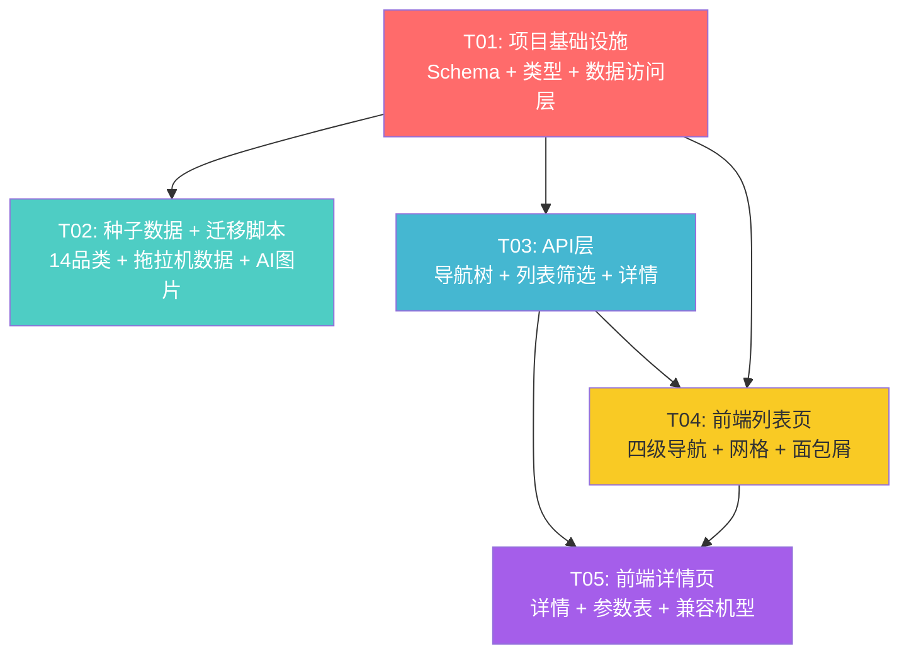

# 农机配件专区V2 — 系统设计与任务分解

> 项目：神雕农机 usedfarmmach
> 技术栈：Next.js 14 App Router + Prisma + Neon PostgreSQL + Tailwind CSS
> 日期：2026-07-08
> 架构师：Bob (software-architect)

---

## Part A: 系统设计

### 1. 实现方案

#### 1.1 核心技术挑战

| 挑战 | 分析 | 方案 |
|------|------|------|
| 四级分类体系 | 14整机品类 × 9子系统 × N部件组 × M配件，层级深、数据量大 | 三张分类表 + 一张配件表，通过外键关联，导航树API预加载缓存 |
| 旧数据兼容 | 现有Part表有25条测试数据，字段结构与新模型不兼容 | 旧Part模型重命名为PartLegacy（`@@map("part_legacy")`），新Part模型重建，旧数据保留备份 |
| 前端导航复杂度 | 从扁平8分类升级为4级级联导航，需要流畅的交互体验 | 三级级联选择器（整机品类→子系统→部件组）+ 面包屑 + 配件网格，客户端状态管理 |
| 配件数据量增长 | 首批50-100条，最终目标3-5万条，需要分页和缓存 | API层分页（默认24条/页）+ 导航树ISR缓存（1小时）+ 配件列表force-dynamic |
| AI图片生成 | 每个拖拉机配件需要白底工业摄影风格产品图 | 独立脚本批量调用ImageGen，图片上传至OSS，URL写入Part.images字段 |
| 可扩展性 | 拖拉机跑通后，其余13品类需快速复制 | 种子数据结构化设计，分类数据与配件数据分离，新增品类只需追加种子数据 |

#### 1.2 框架与库选型

| 组件 | 选型 | 理由 |
|------|------|------|
| ORM | Prisma (已用) | 项目已深度集成，支持PostgreSQL全部特性 |
| 数据库 | Neon PostgreSQL (已用) | 支持数组字段(String[])、JSON字段、全文索引 |
| 前端框架 | Next.js 14 App Router (已用) | ISR缓存、Server Components、API Routes一体化 |
| UI组件库 | shadcn/ui + Tailwind (已用) | 项目已有Card/Badge/Input/Pagination等组件 |
| 图标 | lucide-react (已用) | 项目已集成 |
| 图片存储 | 阿里云OSS (已用) | 已有getImageUrl工具函数处理OSS路径 |
| AI图片生成 | ImageGen (通过ToolSearch调用) | 方案指定，白底工业摄影风格 |

#### 1.3 架构模式

采用 **分层架构**：
- **数据层**：Prisma schema + 种子数据脚本
- **数据访问层**：`src/lib/parts-catalog.ts` 封装分类树查询、配件查询逻辑
- **API层**：Next.js Route Handlers（REST风格）
- **前端层**：React Client Components + 级联导航 + 响应式网格

---

### 2. 文件列表

#### 新建文件

| 文件路径 | 说明 |
|----------|------|
| `src/types/parts-v2.ts` | 新配件系统TypeScript类型定义 |
| `src/lib/parts-catalog.ts` | 配件分类数据访问层（查询封装、缓存逻辑） |
| `src/app/api/parts/catalog/route.ts` | 导航树API（四级分类结构，ISR缓存） |
| `src/app/api/parts/[id]/route.ts` | 配件详情API |
| `src/components/parts/PartsCatalogNav.tsx` | 四级级联导航组件 |
| `src/components/parts/PartsGrid.tsx` | 配件网格组件（含分页） |
| `src/components/parts/PartCard.tsx` | 配件卡片组件 |
| `src/components/parts/PartsBreadcrumb.tsx` | 面包屑导航组件 |
| `src/components/parts/PartDetailClient.tsx` | 配件详情页客户端组件 |
| `src/components/parts/PartSpecsTable.tsx` | 技术参数表格组件 |
| `src/app/[locale]/parts/[id]/page.tsx` | 配件详情页（Server Component） |
| `prisma/seed-parts-v2.ts` | V2种子数据：14品类+9子系统+拖拉机部件组+50-100条配件 |
| `scripts/migrate-old-parts.ts` | 旧Part数据迁移到PartLegacy的脚本 |
| `scripts/generate-part-images.ts` | AI图片批量生成脚本（ImageGen调用） |

#### 修改文件

| 文件路径 | 修改内容 |
|----------|----------|
| `prisma/schema.prisma` | 旧Part重命名为PartLegacy；新增MachineType/SubSystem/ComponentGroup/Part/CompatibleMachine |
| `src/app/api/parts/route.ts` | 重写为多级筛选API（machineType/subSystem/componentGroup/brand/keyword/page） |
| `src/app/[locale]/parts/PartsClient.tsx` | 从扁平8分类重构为四级级联导航 |
| `src/app/[locale]/parts/page.tsx` | 更新SEO元数据，适配新结构 |

---

### 3. 数据结构与接口

#### 3.1 Prisma模型最终版

```prisma
// ═══════════════════════════════════════════════════════
// 配件专区V2 — 四级分类体系
// ═══════════════════════════════════════════════════════

/// Level 1: 整机品类（拖拉机、收割机等14大类）
model MachineType {
  id          String      @id @default(cuid())
  code        String      @unique // "tractor", "combine_harvester"
  nameZh      String
  nameEn      String
  nameRu      String      @default("")
  nameEs      String      @default("")
  namePt      String      @default("")
  nameAr      String      @default("")
  nameFr      String      @default("")
  nameHi      String      @default("")
  imageUrl    String?
  sortOrder   Int         @default(0)
  isActive    Boolean     @default(true)
  subSystems  SubSystem[]
  createdAt   DateTime    @default(now())
  updatedAt   DateTime    @updatedAt

  @@index([isActive, sortOrder])
}

/// Level 2: 子系统（动力、液压、传动等9大系统，按整机品类分组）
model SubSystem {
  id              String          @id @default(cuid())
  code            String          // "powertrain", "hydraulic"
  nameZh          String
  nameEn          String
  nameRu          String          @default("")
  nameEs          String          @default("")
  namePt          String          @default("")
  nameAr          String          @default("")
  nameFr          String          @default("")
  nameHi          String          @default("")
  machineType     MachineType     @relation(fields: [machineTypeId], references: [id])
  machineTypeId   String
  componentGroups ComponentGroup[]
  sortOrder       Int             @default(0)
  isActive        Boolean         @default(true)
  createdAt       DateTime        @default(now())
  updatedAt       DateTime        @updatedAt

  @@unique([machineTypeId, code])
  @@index([machineTypeId, isActive])
}

/// Level 3: 部件组（液压泵、滤芯等，按子系统分组）
model ComponentGroup {
  id          String   @id @default(cuid())
  code        String   // "hydraulic_pump", "air_filter"
  nameZh      String
  nameEn      String
  nameRu      String   @default("")
  nameEs      String   @default("")
  namePt      String   @default("")
  nameAr      String   @default("")
  nameFr      String   @default("")
  nameHi      String   @default("")
  subSystem   SubSystem @relation(fields: [subSystemId], references: [id])
  subSystemId String
  parts       Part[]
  sortOrder   Int      @default(0)
  isActive    Boolean  @default(true)
  createdAt   DateTime @default(now())
  updatedAt   DateTime @updatedAt

  @@unique([subSystemId, code])
  @@index([subSystemId, isActive])
}

/// Level 4: 配件（具体SKU，关联到部件组）
model Part {
  id                String              @id @default(cuid())
  sku               String              @unique // SD-TRACTOR-HYD-001
  nameZh            String
  nameEn            String
  nameRu            String              @default("")
  nameEs            String              @default("")
  brand             String              // 配件品牌（Bosch Rexroth, SKF等）
  oemNumber         String?             // 原厂编号
  componentGroup    ComponentGroup      @relation(fields: [componentGroupId], references: [id])
  componentGroupId  String
  compatibleMachines CompatibleMachine[]
  price             Float
  currency          String              @default("CNY")
  stockStatus       String              @default("in_stock") // in_stock, low_stock, out_of_stock, preorder
  images            String[]
  descriptionZh     String?             @db.Text
  descriptionEn     String?             @db.Text
  descriptionRu     String?             @db.Text
  specs             Json?               // {material, weight, dimensions, warranty, ...}
  isActive          Boolean             @default(true)
  isOEM             Boolean             @default(false)
  isAftermarket     Boolean             @default(false)
  dataSource        String              @default("manual") // manual, scraped, ai_generated
  dataQuality       String              @default("verified") // verified, unverified, draft
  createdAt         DateTime            @default(now())
  updatedAt         DateTime            @updatedAt

  @@index([componentGroupId, isActive])
  @@index([brand, isActive])
  @@index([sku])
  @@index([oemNumber])
  @@index([stockStatus, isActive])
}

/// 配件兼容机型（多对多，一个配件可兼容多个整机型号）
model CompatibleMachine {
  id        String   @id @default(cuid())
  part      Part     @relation(fields: [partId], references: [id], onDelete: Cascade)
  partId    String
  brand     String   // 整机品牌（John Deere, CLAAS等）
  model     String   // 整机型号（6155R, LEXION 770等）
  yearRange String?  // "2015-2020"
  notes     String?

  @@index([partId])
  @@index([brand, model])
}

/// 旧配件数据备份（原Part模型，不再使用，仅保留数据）
model PartLegacy {
  id               String   @id @default(cuid())
  nameZh           String
  nameEn           String   @default("")
  nameRu           String   @default("")
  brand            String
  category         String
  price            Float
  currency         String   @default("CNY")
  stockStatus      String   @default("in_stock")
  compatibleModels String[]
  images           String[]
  descriptionZh    String?  @db.Text
  descriptionEn    String?  @db.Text
  descriptionRu    String?  @db.Text
  isActive         Boolean  @default(true)
  createdAt        DateTime @default(now())
  updatedAt        DateTime @updatedAt

  @@index([category, isActive])
  @@index([brand, isActive])

  @@map("part_legacy")
}
```

#### 3.2 旧数据处理策略

| 步骤 | 操作 | 说明 |
|------|------|------|
| 1 | schema.prisma中旧Part重命名为PartLegacy，加`@@map("part_legacy")` | Prisma生成迁移时将旧Part表重命名为part_legacy |
| 2 | 新建MachineType/SubSystem/ComponentGroup/Part/CompatibleMachine模型 | 新Part表与旧表完全独立 |
| 3 | `prisma migrate dev --name parts_v2` 生成迁移 | 工程师需检查迁移SQL，确保是ALTER TABLE RENAME而非DROP+CREATE |
| 4 | 运行`scripts/migrate-old-parts.ts`（可选） | 将旧25条数据映射到新模型（category→componentGroup的映射规则） |
| 5 | 运行`prisma/seed-parts-v2.ts` | 播种14品类+9子系统+拖拉机部件组+50-100条配件 |

**旧→新分类映射规则**（用于迁移脚本）：

| 旧category | → 新MachineType | → 新SubSystem | → 新ComponentGroup |
|------------|----------------|---------------|-------------------|
| engine | tractor | powertrain | engine_assembly |
| hydraulic | tractor | hydraulic_system | hydraulic_pump |
| transmission | tractor | transmission_system | clutch |
| electrical | tractor | electrical_system | alternator |
| filters | tractor | filter_system | oil_filter |
| tires | tractor | chassis_system | tire |
| bearings | tractor | bearing_seal_system | ball_bearing |
| body | tractor | body_cab | cab |

#### 3.3 与现有Product/Brand表的关联决策

| 问题 | 决策 | 理由 |
|------|------|------|
| MachineType是否关联Brand表？ | **不关联** | MachineType是品类（拖拉机/收割机），Brand是品牌（约翰迪尔/克拉斯）。一个品类有多个品牌，属于多对多关系，无需在MachineType上建FK |
| CompatibleMachine.brand是否关联Brand表？ | **暂不关联，保留为String** | CompatibleMachine.brand记录的是整机品牌名（如"John Deere"），与Brand表可能不完全匹配（Brand表可能没有所有农机品牌）。保持String灵活性，后续可增加brandId可选FK |
| Part.brand是否关联Brand表？ | **暂不关联，保留为String** | 同上。配件品牌（如Bosch Rexroth、SKF、Parker）不一定在Brand表中（Brand表主要存农机整机品牌） |

#### 3.4 种子数据结构说明

**种子文件**：`prisma/seed-parts-v2.ts`

数据分三层写入：

```
Layer 1: 14个MachineType（全量，但只有tractor有子节点）
  ├─ tractor (code: "tractor", sortOrder: 1)
  ├─ combine_harvester (code: "combine_harvester", sortOrder: 2)
  ├─ forage_harvester (sortOrder: 3)
  ├─ ... 其余11个品类（只有名称，无子系统）

Layer 2: 拖拉机下的9个SubSystem
  ├─ powertrain (动力系统)
  ├─ hydraulic_system (液压系统)
  ├─ electrical_system (电气系统)
  ├─ transmission_system (传动系统)
  ├─ chassis_system (行走系统)
  ├─ working_implement (工作装置)
  ├─ body_cab (车身/驾驶室)
  ├─ filter_system (过滤系统)
  └─ bearing_seal_system (轴承密封系统)

Layer 3: 拖拉机9子系统下的部件组（约60-70个）
  每个子系统下6-10个部件组，参考方案3.3节拖拉机拆解表

Layer 4: 50-100条拖拉机配件数据
  覆盖9大子系统的核心部件组，每条包含：
  - SKU (SD-TRACTOR-{SUB}-{SEQ})
  - 中英俄西四语名称
  - 品牌 + OEM编号
  - 价格 + 库存状态
  - 技术参数 (specs JSON)
  - 兼容机型 (CompatibleMachine数组)
  - 描述（中英俄三语）
```

**SKU编码规则**：`SD-{MACHINE_CODE}-{SUB_CODE_PREFIX}-{SEQ3}`

| 示例 | 含义 |
|------|------|
| SD-TRACTOR-PWR-001 | 拖拉机-动力系统-第001号 |
| SD-TRACTOR-HYD-001 | 拖拉机-液压系统-第001号 |
| SD-TRACTOR-ELE-001 | 拖拉机-电气系统-第001号 |

子系统编码前缀映射：

| SubSystem code | SKU前缀 |
|----------------|---------|
| powertrain | PWR |
| hydraulic_system | HYD |
| electrical_system | ELE |
| transmission_system | TRN |
| chassis_system | CHS |
| working_implement | WIM |
| body_cab | BCB |
| filter_system | FLT |
| bearing_seal_system | BRS |

---

### 4. API设计方案

#### 4.1 接口总览

| 接口 | 方法 | 缓存策略 | 说明 |
|------|------|---------|------|
| `/api/parts/catalog` | GET | ISR 3600s | 导航树（14品类→子系统→部件组，含配件计数） |
| `/api/parts` | GET | force-dynamic | 配件列表（多级筛选+分页+搜索） |
| `/api/parts/[id]` | GET | ISR 3600s | 配件详情（含兼容机型、技术参数） |

#### 4.2 导航树API

```
GET /api/parts/catalog
```

**响应结构**：
```json
{
  "success": true,
  "data": [
    {
      "id": "cuid",
      "code": "tractor",
      "nameZh": "拖拉机",
      "nameEn": "Tractor",
      "sortOrder": 1,
      "subSystems": [
        {
          "id": "cuid",
          "code": "hydraulic_system",
          "nameZh": "液压系统",
          "nameEn": "Hydraulic System",
          "sortOrder": 2,
          "componentGroups": [
            {
              "id": "cuid",
              "code": "hydraulic_pump",
              "nameZh": "液压泵",
              "nameEn": "Hydraulic Pump",
              "sortOrder": 1,
              "partCount": 5
            }
          ]
        }
      ]
    }
  ]
}
```

**设计要点**：
- 使用 `export const revalidate = 3600` 实现ISR缓存
- 只返回 `isActive: true` 的节点
- 每个ComponentGroup附带 `partCount`（该部件组下活跃配件数）
- 只有拖拉机返回完整子树，其余13品类 `subSystems` 为空数组

#### 4.3 配件列表API

```
GET /api/parts?machineType=tractor&subSystem=hydraulic_system&componentGroup=hydraulic_pump&brand=Bosch&keyword=pump&page=1&pageSize=24
```

**查询参数**：

| 参数 | 类型 | 默认 | 说明 |
|------|------|------|------|
| machineType | string | - | 整机品类code（如 "tractor"） |
| subSystem | string | - | 子系统code（如 "hydraulic_system"） |
| componentGroup | string | - | 部件组code（如 "hydraulic_pump"） |
| brand | string | - | 配件品牌（精确匹配） |
| keyword | string | - | 搜索词（匹配nameZh/nameEn/nameRu/oemNumber/brand） |
| page | int | 1 | 页码 |
| pageSize | int | 24 | 每页条数（最大100） |

**响应结构**：
```json
{
  "success": true,
  "data": [
    {
      "id": "cuid",
      "sku": "SD-TRACTOR-HYD-001",
      "nameZh": "博世力士乐液压齿轮泵",
      "nameEn": "Bosch Rexroth Hydraulic Gear Pump",
      "brand": "Bosch Rexroth",
      "oemNumber": "A10VSO45DFR/31R",
      "price": 8500,
      "currency": "CNY",
      "stockStatus": "in_stock",
      "images": ["https://oss.../parts/tractor/hydraulic/SD-TRACTOR-HYD-001.jpg"],
      "isOEM": true,
      "componentGroup": { "code": "hydraulic_pump", "nameZh": "液压泵" },
      "subSystem": { "code": "hydraulic_system", "nameZh": "液压系统" },
      "machineType": { "code": "tractor", "nameZh": "拖拉机" }
    }
  ],
  "pagination": {
    "page": 1,
    "pageSize": 24,
    "total": 87,
    "totalPages": 4
  },
  "filters": {
    "brands": ["Bosch Rexroth", "Parker", "SKF"],
    "stockStatuses": ["in_stock", "low_stock"]
  }
}
```

**设计要点**：
- `force-dynamic` 确保库存状态实时性
- 多级筛选通过 Prisma relation查询：`where: { componentGroup: { subSystem: { machineType: { code: "tractor" } } } }`
- keyword搜索使用 `OR` + `contains` + `mode: "insensitive"`
- 响应附带 `filters` 聚合数据（当前筛选条件下的可用品牌列表），供前端渲染筛选面板
- 列表只返回摘要字段（不含specs/description），减少传输量

#### 4.4 配件详情API

```
GET /api/parts/[id]
```

**响应结构**：
```json
{
  "success": true,
  "data": {
    "id": "cuid",
    "sku": "SD-TRACTOR-HYD-001",
    "nameZh": "...",
    "nameEn": "...",
    "nameRu": "...",
    "brand": "Bosch Rexroth",
    "oemNumber": "A10VSO45DFR/31R",
    "price": 8500,
    "currency": "CNY",
    "stockStatus": "in_stock",
    "images": ["url1", "url2"],
    "descriptionZh": "...",
    "descriptionEn": "...",
    "descriptionRu": "...",
    "specs": {
      "material": "Cast Iron",
      "weight": "12kg",
      "dimensions": "200×150×180mm",
      "warranty": "12 months",
      "pressure": "250 bar",
      "flowRate": "45 L/min"
    },
    "isOEM": true,
    "isAftermarket": false,
    "dataQuality": "verified",
    "componentGroup": { "code": "hydraulic_pump", "nameZh": "液压泵", "nameEn": "Hydraulic Pump" },
    "subSystem": { "code": "hydraulic_system", "nameZh": "液压系统", "nameEn": "Hydraulic System" },
    "machineType": { "code": "tractor", "nameZh": "拖拉机", "nameEn": "Tractor" },
    "compatibleMachines": [
      { "brand": "John Deere", "model": "6155R", "yearRange": "2014-2020" },
      { "brand": "John Deere", "model": "6175R", "yearRange": "2014-2020" }
    ]
  }
}
```

**设计要点**：
- 使用 `export const revalidate = 3600` ISR缓存
- 包含完整层级关系（componentGroup → subSystem → machineType），用于面包屑
- 包含compatibleMachines数组，用于兼容机型展示

---

### 5. 前端导航设计

#### 5.1 页面布局

```
┌─────────────────────────────────────────────────┐
│  Hero区域（保留现有橙色渐变 + 搜索框）              │
├─────────────────────────────────────────────────┤
│  面包屑：首页 > 配件专区 > 拖拉机 > 液压系统 > 液压泵  │
├──────────┬──────────────────────────────────────┤
│          │  筛选栏：品牌下拉 | 库存状态 | 排序     │
│  左侧    ├──────────────────────────────────────┤
│  导航树  │                                      │
│          │  配件网格（4列响应式）                  │
│  拖拉机 ► │  ┌────┐ ┌────┐ ┌────┐ ┌────┐       │
│   ├动力  │  │卡片│ │卡片│ │卡片│ │卡片│       │
│   ├液压 ►│  └────┘ └────┘ └────┘ └────┘       │
│   │├液压泵│  ┌────┐ ┌────┐ ┌────┐ ┌────┐       │
│   │├油缸  │  │卡片│ │卡片│ │卡片│ │卡片│       │
│   │└阀门  │  └────┘ └────┘ └────┘ └────┘       │
│   ├传动  │                                      │
│   └...   │  分页：< 1 2 3 4 >                   │
│  收割机  │                                      │
│  青储机  │                                      │
│  ...     │                                      │
└──────────┴──────────────────────────────────────┘
```

#### 5.2 交互流程

1. **页面初次加载**：
   - 调用 `/api/parts/catalog` 获取完整导航树
   - 调用 `/api/parts`（无筛选）获取第一页配件
   - 左侧导航树渲染14个整机品类，拖拉机展开显示9个子系统
   - 默认显示全部配件（或拖拉机配件）

2. **选择整机品类**（如点击"拖拉机"）：
   - 展开子系统列表
   - 调用 `/api/parts?machineType=tractor` 获取拖拉机配件
   - 面包屑更新：配件专区 > 拖拉机

3. **选择子系统**（如点击"液压系统"）：
   - 展开部件组列表
   - 调用 `/api/parts?machineType=tractor&subSystem=hydraulic_system`
   - 面包屑更新：配件专区 > 拖拉机 > 液压系统

4. **选择部件组**（如点击"液压泵"）：
   - 调用 `/api/parts?machineType=tractor&subSystem=hydraulic_system&componentGroup=hydraulic_pump`
   - 面包屑更新：配件专区 > 拖拉机 > 液压系统 > 液压泵

5. **搜索**：
   - 输入关键词，300ms防抖
   - 调用 `/api/parts?keyword=xxx`（保留当前层级筛选）
   - 网格更新

6. **点击配件卡片**：
   - 跳转到 `/[locale]/parts/[id]`
   - 展示配件详情（图片轮播、技术参数表、兼容机型列表、询价按钮）

#### 5.3 响应式设计

| 断点 | 布局 |
|------|------|
| < 768px (mobile) | 导航树收起为顶部下拉选择器，网格1-2列 |
| 768px-1024px (tablet) | 导航树收起为顶部级联选择器，网格2-3列 |
| > 1024px (desktop) | 左侧导航树常驻，网格3-4列 |

---

### 6. 待明确事项

| # | 问题 | 当前假设 | 需确认方 |
|---|------|---------|---------|
| 1 | 旧Part表25条数据是否需要迁移到新模型？ | 假设：不迁移，旧数据仅保留备份（PartLegacy表），新数据全部重新录入 | 产品/用户 |
| 2 | CompatibleMachine.brand是否需要关联Brand表？ | 假设：暂不关联，保留为String，后续可扩展 | 架构 |
| 3 | AI图片生成用ImageGen还是其他工具？ | 假设：使用ImageGen（通过ToolSearch调用），图片上传至OSS | 产品 |
| 4 | 首批50-100条拖拉机配件数据来源？ | 假设：手动整理真实OEM数据（品牌官网+配件平台），非爬虫自动采集 | 产品/数据 |
| 5 | 其余13品类是否需要预填9个子系统名称？ | 假设：否，只填整机品类名称（14个MachineType记录），子系统等后续扩展时再填 | 产品 |
| 6 | 配件详情页是否需要询价表单？ | 假设：是，复用现有Inquiry机制或简单mailto链接 | 产品 |
| 7 | 配件图片是否需要多角度？ | 假设：首批每配件1张（正视图），后续可扩展到2-3张 | 产品 |

---

## Part B: 任务分解

### 7. 依赖包列表

本项目无需新增第三方依赖包，所有功能基于现有技术栈实现：

```
# 已有依赖（无需新增）
- next@^14.2.0: App Router + API Routes + ISR缓存
- @prisma/client@^5.14.0: ORM
- prisma@^5.14.0: Schema管理 + 迁移
- react@^18.3.0: UI框架
- tailwindcss@^3.4.0: 样式
- lucide-react@^0.378.0: 图标
- tsx@^4.10.0: 种子脚本执行
- ali-oss@^6.23.0: OSS图片上传（devDependency，脚本用）

# AI图片生成
- ImageGen: 通过ToolSearch/DeferExecuteTool调用，无需npm安装
```

---

### 8. 任务列表

#### T01: 项目基础设施（Schema + 类型 + 数据访问层）

| 项 | 内容 |
|----|------|
| **任务ID** | T01 |
| **任务名** | 项目基础设施：Prisma Schema更新 + TypeScript类型 + 数据访问层 |
| **源文件** | `prisma/schema.prisma`（修改）, `src/types/parts-v2.ts`（新建）, `src/lib/parts-catalog.ts`（新建） |
| **依赖** | 无 |
| **优先级** | P0 |

**工作内容**：
1. 在 `prisma/schema.prisma` 中：
   - 将旧 `Part` 模型重命名为 `PartLegacy`，添加 `@@map("part_legacy")`
   - 新增 `MachineType`、`SubSystem`、`ComponentGroup`、`Part`（新）、`CompatibleMachine` 模型
   - 确保8语言字段、复合唯一约束、索引完整
2. 创建 `src/types/parts-v2.ts`：
   - 定义 `MachineType`、`SubSystem`、`ComponentGroup`、`Part`、`CompatibleMachine` 的 TypeScript 接口
   - 定义 `CatalogTree`、`PartListResponse`、`PartDetailResponse` 等 API 响应类型
   - 定义 `PartSpecs` 接口（material, weight, dimensions, warranty 等可选字段）
3. 创建 `src/lib/parts-catalog.ts`：
   - `getCatalogTree()`: 查询完整导航树（MachineType → SubSystem → ComponentGroup + partCount），使用 Prisma include 嵌套查询
   - `getParts(filters)`: 多级筛选查询，返回配件列表 + 分页 + 品牌聚合
   - `getPartById(id)`: 查询配件详情，include componentGroup → subSystem → machineType + compatibleMachines
   - `getBrandsByComponentGroup(componentGroupId)`: 获取某部件组下的品牌列表（用于筛选面板）
4. 运行 `npx prisma migrate dev --name parts_v2` 生成迁移
5. 运行 `npx prisma generate` 更新 Prisma Client

---

#### T02: 种子数据 + 迁移脚本

| 项 | 内容 |
|----|------|
| **任务ID** | T02 |
| **任务名** | 种子数据：14品类架构 + 拖拉机深度填充 + 旧数据迁移脚本 |
| **源文件** | `prisma/seed-parts-v2.ts`（新建）, `scripts/migrate-old-parts.ts`（新建）, `scripts/generate-part-images.ts`（新建） |
| **依赖** | T01 |
| **优先级** | P0 |

**工作内容**：
1. 创建 `prisma/seed-parts-v2.ts`：
   - **Layer 1**: 14个MachineType（全量，参考方案3.1节，含8语名称 + sortOrder）
   - **Layer 2**: 拖拉机下9个SubSystem（powertrain/hydraulic_system/electrical_system/transmission_system/chassis_system/working_implement/body_cab/filter_system/bearing_seal_system）
   - **Layer 3**: 拖拉机9子系统下的部件组（参考方案3.3节，约60-70个ComponentGroup）
   - **Layer 4**: 50-100条拖拉机真实OEM配件数据（覆盖9大子系统核心部件组，每条含SKU/四语名称/品牌/OEM编号/价格/库存/specs/兼容机型/描述）
   - 脚本支持幂等执行（先deleteMany再创建）
   - 运行命令：`npx tsx prisma/seed-parts-v2.ts`
2. 创建 `scripts/migrate-old-parts.ts`：
   - 读取PartLegacy表全部数据
   - 按3.2节映射规则，将旧category映射到新ComponentGroup
   - 写入新Part表（补充SKU、componentGroupId等字段）
   - 运行命令：`npx tsx scripts/migrate-old-parts.ts`（可选执行）
3. 创建 `scripts/generate-part-images.ts`：
   - 读取新Part表中images为空的拖拉机配件
   - 对每个配件，根据nameEn + brand + componentGroup生成ImageGen prompt
   - 调用ImageGen生成白底工业摄影风格图片
   - 上传至OSS（路径：`/parts/{machineType}/{componentGroup}/{sku}.jpg`）
   - 更新Part.images字段
   - 支持批量处理 + 失败重试
   - Prompt模板：`"Professional product photography of {nameEn}, {brand} agricultural machinery part, clean white background, studio lighting, 8k resolution, sharp focus, industrial catalog style, metallic texture, precise engineering details"`

---

#### T03: API层（多级筛选 + 导航树 + 详情接口）

| 项 | 内容 |
|----|------|
| **任务ID** | T03 |
| **任务名** | API层：导航树接口 + 配件列表多级筛选接口 + 配件详情接口 |
| **源文件** | `src/app/api/parts/catalog/route.ts`（新建）, `src/app/api/parts/route.ts`（修改）, `src/app/api/parts/[id]/route.ts`（新建） |
| **依赖** | T01 |
| **优先级** | P0 |

**工作内容**：
1. 创建 `src/app/api/parts/catalog/route.ts`：
   - `export const revalidate = 3600`（ISR缓存1小时）
   - 调用 `getCatalogTree()` 返回完整导航树
   - 响应格式：`{ success: true, data: CatalogTreeNode[] }`
2. 修改 `src/app/api/parts/route.ts`：
   - `export const dynamic = "force-dynamic"`
   - 解析查询参数：machineType, subSystem, componentGroup, brand, keyword, page, pageSize
   - 调用 `getParts(filters)` 返回配件列表 + 分页 + 品牌聚合
   - 响应格式：`{ success: true, data: Part[], pagination: {...}, filters: { brands: [...] } }`
   - 保留现有错误处理模式（try-catch + 500响应）
3. 创建 `src/app/api/parts/[id]/route.ts`：
   - `export const revalidate = 3600`（ISR缓存1小时）
   - 调用 `getPartById(id)` 返回配件详情
   - 包含完整层级关系 + 兼容机型
   - 404处理：配件不存在时返回 `{ success: false, error: "Part not found" }`

---

#### T04: 前端列表页（四级导航 + 配件网格 + 面包屑）

| 项 | 内容 |
|----|------|
| **任务ID** | T04 |
| **任务名** | 前端列表页：四级级联导航 + 配件网格 + 卡片 + 面包屑 + 页面集成 |
| **源文件** | `src/app/[locale]/parts/PartsClient.tsx`（修改）, `src/app/[locale]/parts/page.tsx`（修改）, `src/components/parts/PartsCatalogNav.tsx`（新建）, `src/components/parts/PartsGrid.tsx`（新建）, `src/components/parts/PartCard.tsx`（新建）, `src/components/parts/PartsBreadcrumb.tsx`（新建） |
| **依赖** | T01, T03 |
| **优先级** | P0 |

**工作内容**：
1. 创建 `src/components/parts/PartsCatalogNav.tsx`：
   - Props: `catalogTree`, `selectedMachineType`, `selectedSubSystem`, `selectedComponentGroup`, `onSelect` 回调
   - 渲染左侧导航树：14个整机品类（拖拉机展开）
   - 三级级联：MachineType → SubSystem → ComponentGroup
   - 每个节点显示配件计数（partCount）
   - 选中状态高亮
   - 响应式：移动端收起为级联选择器
2. 创建 `src/components/parts/PartCard.tsx`：
   - Props: `part`, `locale`
   - 渲染：图片 + 品牌Badge + 名称 + 库存状态 + 价格 + 询价按钮
   - 复用现有 `getImageUrl()` 处理OSS图片
   - 复用现有 `Card`/`Badge` UI组件
   - 链接到 `/[locale]/parts/[id]`
3. 创建 `src/components/parts/PartsGrid.tsx`：
   - Props: `parts`, `loading`, `error`, `locale`, `pagination`, `onPageChange`
   - 渲染响应式网格（1/2/3/4列）
   - 包含分页控件（复用现有Pagination组件）
   - 加载/错误/空状态处理
4. 创建 `src/components/parts/PartsBreadcrumb.tsx`：
   - Props: `machineTypeName`, `subSystemName`, `componentGroupName`, `locale`
   - 渲染面包屑：首页 > 配件专区 > [整机品类] > [子系统] > [部件组]
   - 每级可点击返回
5. 修改 `src/app/[locale]/parts/PartsClient.tsx`：
   - 移除旧的8分类硬编码（PART_CATEGORIES）
   - 新增状态：catalogTree, selectedMachineType, selectedSubSystem, selectedComponentGroup
   - 页面加载时fetch `/api/parts/catalog` 获取导航树
   - 层级选择时fetch `/api/parts?...` 获取配件列表
   - 布局：左侧导航树 + 右侧（面包屑 + 筛选栏 + 配件网格）
   - 保留现有Hero区域和搜索框
   - 保留现有服务保障区块和CTA区块
6. 修改 `src/app/[locale]/parts/page.tsx`：
   - 更新 `generatePageMetadata` 中的关键词（从8分类改为四级分类体系）
   - 更新面包屑结构化数据

---

#### T05: 前端详情页（配件详情 + 技术参数 + 兼容机型）

| 项 | 内容 |
|----|------|
| **任务ID** | T05 |
| **任务名** | 前端详情页：配件详情展示 + 技术参数表 + 兼容机型列表 + 询价入口 |
| **源文件** | `src/app/[locale]/parts/[id]/page.tsx`（新建）, `src/components/parts/PartDetailClient.tsx`（新建）, `src/components/parts/PartSpecsTable.tsx`（新建） |
| **依赖** | T01, T03, T04 |
| **优先级** | P1 |

**工作内容**：
1. 创建 `src/app/[locale]/parts/[id]/page.tsx`（Server Component）：
   - `generateMetadata`: 根据配件名称生成SEO元数据
   - `generateStaticParams` 预生成首批配件的静态路径
   - `BreadcrumbStructuredData` 面包屑结构化数据
   - 渲染 `PartDetailClient`
2. 创建 `src/components/parts/PartDetailClient.tsx`：
   - Props: `part`, `locale`
   - 布局：左侧图片轮播 + 右侧信息区
   - 信息区：SKU + 品牌 + OEM编号 + 名称 + 价格 + 库存 + 询价按钮
   - 下方：技术参数表 + 兼容机型列表 + 描述
   - 面包屑：首页 > 配件专区 > 拖拉机 > 液压系统 > 液压泵 > [配件名]
   - 询价按钮：跳转到 `/about#contact` 或弹出简单表单
3. 创建 `src/components/parts/PartSpecsTable.tsx`：
   - Props: `specs` (JSON对象)
   - 将specs JSON渲染为键值对表格
   - 常见字段：材质/重量/尺寸/保修期/压力/流量等
   - 支持中英文标签映射

---

### 9. 共享知识（跨文件约定）

```
# 数据库
- Prisma client导入：import { prisma } from "@/lib/db"
- 旧Part模型已重命名为PartLegacy（prisma.partLegacy），不再使用
- 新Part模型通过prisma.part访问
- 所有分类表使用8语言字段：nameZh/nameEn/nameRu/nameEs/namePt/nameAr/nameFr/nameHi
- Part表使用4语名称（zh/en/ru/es）+ 3语描述（zh/en/ru），后续可扩展

# SKU编码
- 格式：SD-{MACHINE_CODE}-{SUB_CODE_PREFIX}-{SEQ3}
- 示例：SD-TRACTOR-HYD-001
- 子系统前缀：PWR/HYD/ELE/TRN/CHS/WIM/BCB/FLT/BRS
- SKU全局唯一（@unique约束）

# API
- 所有API响应格式：{ success: boolean, data: T, pagination?: {...}, error?: string, filters?: {...} }
- 导航树API和详情API使用ISR缓存（revalidate = 3600）
- 列表API使用force-dynamic（库存状态实时性）
- 分页：默认pageSize=24，最大100，响应包含pagination对象
- 多级筛选参数：machineType, subSystem, componentGroup（均为code，非id）

# 前端
- 图片URL处理：使用 getImageUrl() from "@/lib/image-url"（OSS缩略图）
- 详情大图：使用 getDetailImageUrl() from "@/lib/image-url"
- UI组件：复用 src/components/ui/ 下的 Card/Badge/Input/Pagination/Skeleton
- 图标：使用 lucide-react
- 多语言：通过 locale prop 传递（"zh"/"en"/"ru"等），前端用 isZh = locale === "zh" 判断
- 导航树状态管理：useState管理选中的 machineType/subSystem/componentGroup
- 搜索防抖：300ms

# 图片
- OSS路径规则：/parts/{machineType}/{componentGroup}/{sku}.jpg
- AI图片风格：白底工业摄影（clean white background, studio lighting, 8k, sharp focus）
- 图片尺寸：1024×1024，< 200KB，JPG格式
- 占位图：/images/placeholders/tractor.svg（现有）

# 种子数据
- 种子文件幂等：先deleteMany再创建
- 运行命令：npx tsx prisma/seed-parts-v2.ts
- 14品类中只有tractor有完整子系统+部件组+配件数据
- 其余13品类只有MachineType记录（名称+code+sortOrder）
```

---

### 10. 任务依赖图



**关键路径**：T01 → T03 → T04 → T05（主线）
**可并行**：T02 与 T03 可并行（都只依赖 T01）
