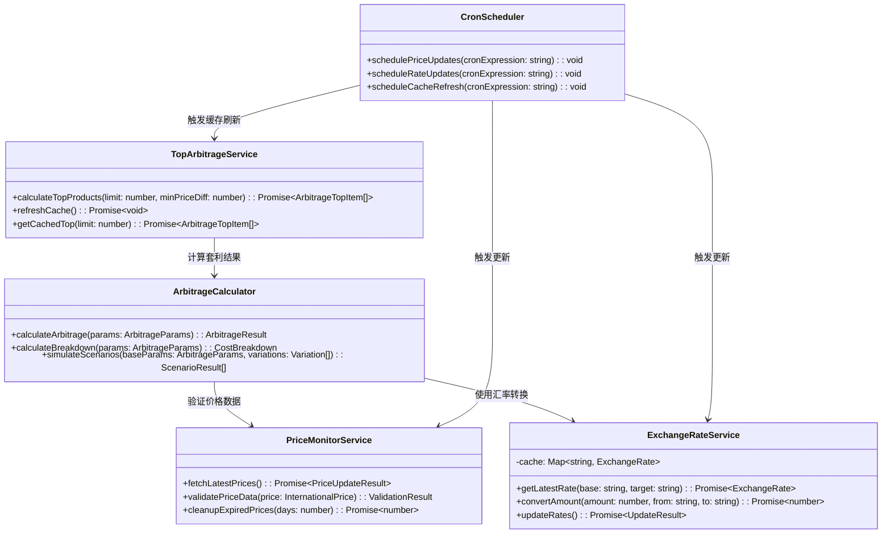
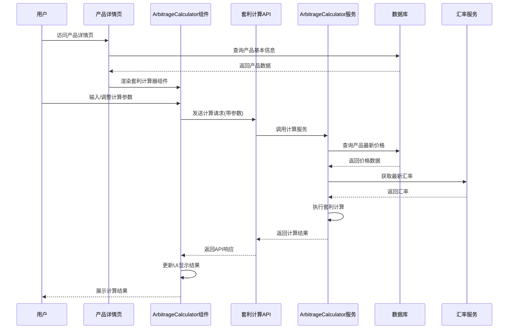
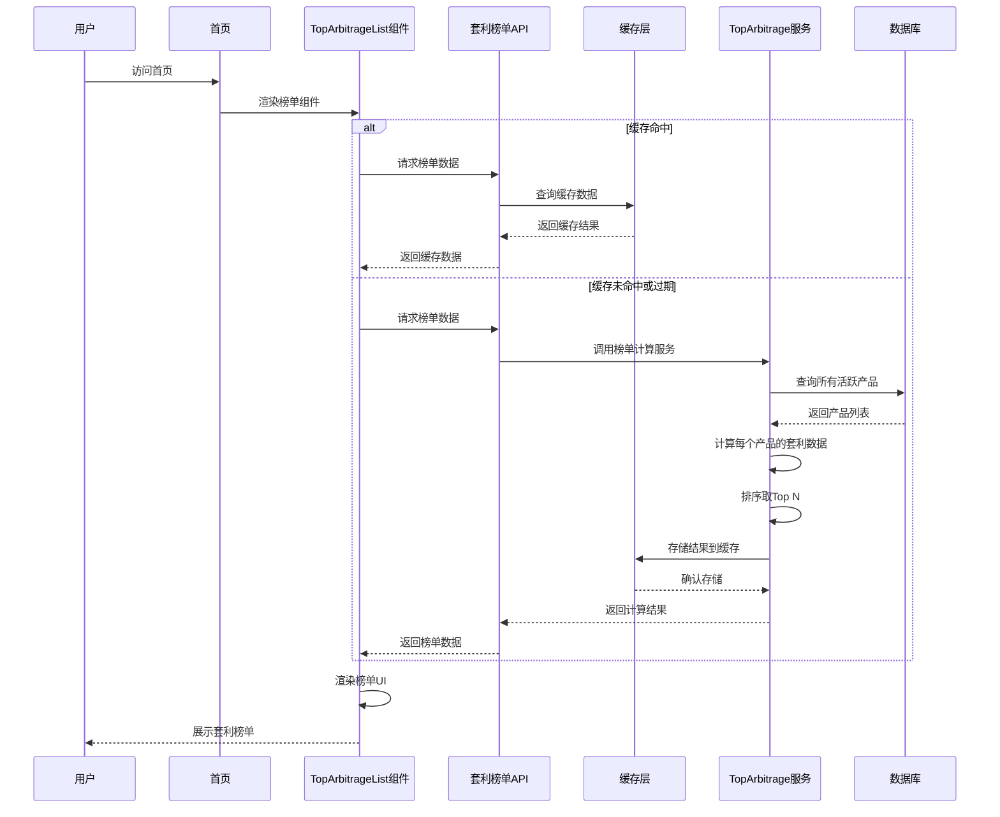
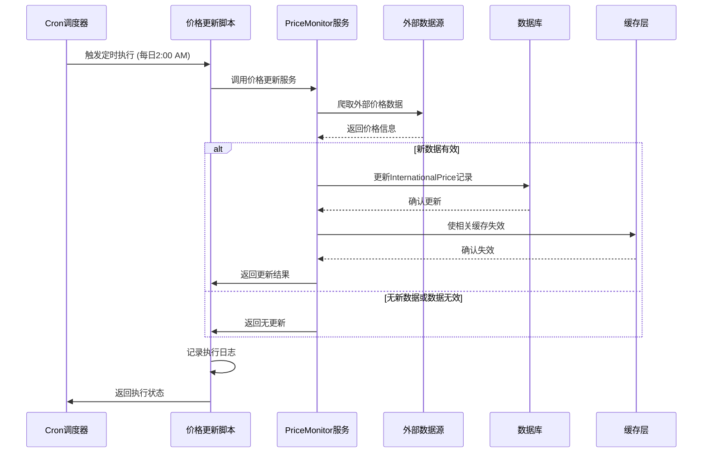
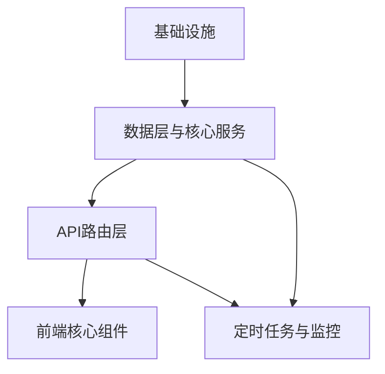

# 神雕农机平台跨境套利功能 - 系统架构设计

**架构师**: 高见远  
**日期**: 2026-XX-XX  
**版本**: 1.0

## 1. 实现方案 + 框架选型

### 1.1 核心技术挑战分析

| 挑战点 | 解决方案 | 选型依据 |
|--------|----------|----------|
| **实时价格数据获取** | 多源爬虫 + API集成 + 手动导入三轨并行 | 现有脚本已支持JSON/Markdown导入，扩展为定时任务 |
| **汇率动态更新** | 集成公开汇率API + 本地缓存 + 失败回退机制 | 选择稳定免费的汇率API，缓存机制保证可用性 |
| **套利计算复杂度** | 分层计算引擎：基础价差 → 运输成本 → 关税保险 → 净利 | 模块化设计，参数可配置，支持What-if分析 |
| **榜单性能优化** | 预计算物化视图 + 缓存策略 + 增量更新 | 避免实时计算Top N，通过预处理提升首页加载速度 |
| **数据质量管理** | 数据验证规则 + 异常检测 + 过期数据清理 | 确保套利计算基础的准确性和可靠性 |

### 1.2 框架/库选型

| 类型 | 选型 | 版本 | 理由 |
|------|------|------|------|
| **前端UI组件** | MUI (Material-UI) | ^5.14.0 | 项目已集成，组件丰富，与Tailwind兼容性好 |
| **数据可视化** | Recharts | ^2.10.3 | 轻量级、React原生支持，适合价格趋势图表 |
| **定时任务** | node-cron | ^3.0.3 | 简单可靠的cron调度，适合Vercel Serverless环境 |
| **HTTP请求** | axios | ^1.6.0 | 项目已使用，稳定可靠，支持拦截器 |
| **汇率API** | exchangerate-api | 公开API | 免费、稳定、支持170+货币 |
| **数据验证** | Zod (已集成) | ^3.23.0 | 已有依赖，用于API输入验证和类型安全 |
| **环境配置** | dotenv (已集成) | N/A | Next.js内置支持 |

### 1.3 架构模式

采用 **分层架构 + 服务层模式**：

```
┌─────────────────────────────────────────────┐
│              Presentation Layer              │
│  ┌─────────┐ ┌──────────┐ ┌─────────────┐  │
│  │ 页面组件 │ │ 计算器组件│ │ 榜单组件    │  │
│  └─────────┘ └──────────┘ └─────────────┘  │
└─────────────────────────────────────────────┘
┌─────────────────────────────────────────────┐
│                Service Layer                 │
│  ┌─────────┐ ┌──────────┐ ┌─────────────┐  │
│  │套利计算服务│ │价格获取服务│ │汇率服务    │  │
│  └─────────┘ └──────────┘ └─────────────┘  │
└─────────────────────────────────────────────┘
┌─────────────────────────────────────────────┐
│             Data Access Layer                │
│  ┌─────────────────┐ ┌───────────────────┐  │
│  │  Prisma Client  │ │ 外部API/爬虫      │  │
│  └─────────────────┘ └───────────────────┘  │
└─────────────────────────────────────────────┘
┌─────────────────────────────────────────────┐
│                 Data Layer                   │
│  ┌─────────────┐ ┌────────────┐ ┌────────┐  │
│  │ PostgreSQL  │ │  缓存(Redis) │ │ 文件存储 │  │
│  └─────────────┘ └────────────┘ └────────┘  │
└─────────────────────────────────────────────┘
```

**关键设计决策**：
1. **服务层抽象**：业务逻辑集中在服务层，便于测试和维护
2. **缓存策略**：首页榜单使用Redis缓存，减少数据库压力
3. **增量更新**：价格监控脚本只抓取变化的数据，避免全量更新
4. **优雅降级**：汇率API失败时使用上次成功值，保证功能可用

## 2. 文件列表及相对路径

### 2.1 新增文件

#### API路由 (App Router)
- `src/app/api/arbitrage/calculator/route.ts` - 套利计算API
- `src/app/api/arbitrage/top-products/route.ts` - 套利榜单API
- `src/app/api/arbitrage/trends/[productId]/route.ts` - 价格趋势API
- `src/app/api/exchange-rates/route.ts` - 汇率管理API
- `src/app/api/cron/update-prices/route.ts` - 定时价格更新API（公开）
- `src/app/api/cron/update-exchange-rates/route.ts` - 定时汇率更新API

#### 服务层
- `src/lib/services/arbitrage-calculator.ts` - 套利计算核心引擎
- `src/lib/services/price-monitor.ts` - 价格监控服务
- `src/lib/services/exchange-rate-service.ts` - 汇率服务
- `src/lib/services/top-arbitrage-service.ts` - 榜单计算服务

#### 组件层
- `src/components/arbitrage/calculator/ArbitrageCalculator.tsx` - 套利计算器主组件
- `src/components/arbitrage/calculator/CalculatorInputs.tsx` - 输入参数组件
- `src/components/arbitrage/calculator/CalculatorResults.tsx` - 计算结果组件
- `src/components/arbitrage/calculator/CostBreakdown.tsx` - 成本分解组件
- `src/components/arbitrage/top-list/TopArbitrageList.tsx` - 首页榜单组件
- `src/components/arbitrage/top-list/TopArbitrageCard.tsx` - 榜单卡片组件
- `src/components/arbitrage/top-list/TopArbitrageFilters.tsx` - 榜单筛选组件
- `src/components/arbitrage/trends/PriceTrendChart.tsx` - 价格趋势图表组件
- `src/components/arbitrage/shared/ArbitrageBadgeEnhanced.tsx` - 增强版套利徽章

#### 工具类/类型定义
- `src/lib/arbitrage/calculations.ts` - 套利计算工具函数
- `src/lib/arbitrage/formulas.ts` - 套利计算公式常量
- `src/lib/arbitrage/validation.ts` - 套利数据验证
- `src/types/arbitrage.ts` - 套利相关类型定义
- `src/types/exchange-rates.ts` - 汇率类型定义

#### 定时任务脚本
- `src/scripts/cron/update-prices.ts` - 价格更新定时脚本
- `src/scripts/cron/update-exchange-rates.ts` - 汇率更新定时脚本
- `src/scripts/cron/cleanup-expired-prices.ts` - 过期数据清理脚本

#### 配置/常量
- `src/config/arbitrage.ts` - 套利功能配置（阈值、默认参数等）
- `src/config/exchange-rates.ts` - 汇率API配置
- `src/config/price-sources.ts` - 价格数据源配置

#### 数据库扩展
- `prisma/migrations/[timestamp]_add_arbitrage_related_fields/` - 数据库迁移
- `prisma/seed-arbitrage-data.ts` - 套利测试数据种子

### 2.2 修改文件

#### 页面组件
- `src/app/[locale]/products/[id]/page.tsx` - 集成套利计算器组件
- `src/app/[locale]/page.tsx` - 集成首页套利榜单组件

#### 现有组件增强
- `src/components/product/arbitrage-badge.tsx` - 增强为支持更多状态
- `src/lib/utils.ts` - 添加套利计算相关工具函数

#### API路由
- `src/app/api/products/[id]/route.ts` - 添加套利相关数据字段

#### 数据库模型
- `prisma/schema.prisma` - 添加汇率表、套利计算结果缓存表

## 3. 数据结构和接口（类图）

### 3.1 数据库模型扩展

```prisma
// 汇率表 - 存储最新和历史汇率
model ExchangeRate {
  id            String   @id @default(cuid())
  baseCurrency  String   @default("CNY")  // 基础货币
  targetCurrency String  // 目标货币: USD, EUR, GBP等
  rate          Float    // 汇率值 (1 CNY = X USD)
  source        String   @default("exchangerate-api") // 数据来源
  lastUpdated   DateTime @default(now()) // 最后更新时间
  effectiveDate DateTime // 汇率生效日期
  
  @@unique([baseCurrency, targetCurrency, effectiveDate])
  @@index([baseCurrency, targetCurrency])
}

// 套利计算结果缓存表 - 预计算Top N设备
model ArbitrageTopCache {
  id            String   @id @default(cuid())
  productId     String   // 产品ID
  rank          Int      // 排名 (1-10)
  domesticPrice Float    // 国内价格(CNY)
  foreignPrice  Float    // 国外价格(CNY)
  priceDiff     Float    // 价差(CNY)
  priceDiffPercent Float // 价差百分比(%)
  profitMargin  Float?   // 利润率(%)
  lastCalculated DateTime @default(now()) // 最后计算时间
  validUntil    DateTime // 有效期至
  
  product Product @relation(fields: [productId], references: [id], onDelete: Cascade)
  
  @@unique([productId, rank])
  @@index([rank])
  @@index([validUntil])
}

// InternationalPrice模型扩展（现有模型添加字段）
// 在现有InternationalPrice模型中添加：
// - isActive: Boolean @default(true) // 数据是否有效
// - confidenceScore: Float @default(0.5) // 数据置信度 (0-1)
// - lastVerified: DateTime? // 最后验证时间
```

### 3.2 服务类设计



### 3.3 API接口定义

#### GET `/api/arbitrage/calculator`
```typescript
// 请求参数
interface ArbitrageCalculatorQuery {
  productId: string;           // 产品ID
  domesticPrice?: number;      // 国内价格(CNY) - 可选，默认用数据库值
  foreignPrice?: number;       // 国外价格(CNY) - 可选，默认用最新国际价
  foreignCurrency?: string;    // 国外货币 - 可选，默认用记录货币
  shippingCost?: number;       // 运输成本(CNY)
  importTaxRate?: number;      // 进口关税率(%)
  insuranceRate?: number;      // 保险费率(%)
  otherCosts?: number;         // 其他成本(CNY)
  exchangeRate?: number;       // 汇率 - 可选，默认用最新汇率
}

// 响应
interface ArbitrageCalculatorResponse {
  success: boolean;
  data?: {
    productInfo: ProductBasicInfo;
    domesticPrice: number;     // 国内价格(CNY)
    foreignPrice: number;      // 国外价格(原货币)
    foreignPriceCny: number;   // 国外价格(CNY)
    priceDifference: number;   // 价差(CNY)
    priceDiffPercent: number;  // 价差百分比(%)
    
    // 成本分解
    costs: {
      shipping: number;        // 运输成本
      importTax: number;       // 进口关税
      insurance: number;       // 保险费用
      other: number;          // 其他成本
      totalAdditional: number; // 总附加成本
    };
    
    // 利润分析
    profit: {
      grossProfit: number;     // 毛利润
      grossMargin: number;     // 毛利率(%)
      netProfit: number;       // 净利润
      netMargin: number;       // 净利率(%)
      breakEvenPrice: number;  // 盈亏平衡价
    };
    
    // 套利等级评估
    assessment: {
      level: 'high' | 'medium' | 'low'; // 套利等级
      score: number;           // 套利评分(0-100)
      opportunity: string;     // 机会描述
      riskFactors: string[];   // 风险因素
    };
    
    // 数据源信息
    sources: {
      domesticPriceSource: string;     // 国内价格来源
      foreignPriceSource: string;      // 国外价格来源
      exchangeRateSource: string;      // 汇率来源
      lastUpdated: string;             // 数据更新时间
    };
  };
  error?: string;
}
```

#### GET `/api/arbitrage/top-products`
```typescript
// 请求参数
interface TopArbitrageQuery {
  limit?: number;              // 返回数量，默认10
  minPriceDiff?: number;       // 最小价差%，默认15
  sortBy?: 'priceDiff' | 'profitMargin' | 'totalSaving'; // 排序字段
  includeDetails?: boolean;    // 是否包含详细信息
}

// 响应
interface TopArbitrageResponse {
  success: boolean;
  data?: {
    generatedAt: string;       // 生成时间
    products: ArbitrageTopItem[];
    summary: {
      totalProducts: number;   // 总产品数
      averagePriceDiff: number;// 平均价差%
      maxPriceDiff: number;    // 最大价差%
      minPriceDiff: number;    // 最小价差%
    };
  };
  error?: string;
}

interface ArbitrageTopItem {
  rank: number;                // 排名
  productId: string;          // 产品ID
  productName: string;        // 产品名称
  brandName: string;          // 品牌名称
  year: number;               // 年份
  
  // 价格信息
  domesticPrice: number;      // 国内价格(CNY)
  foreignPrice: number;       // 国外价格(CNY)
  priceDiff: number;          // 价差(CNY)
  priceDiffPercent: number;   // 价差百分比(%)
  
  // 套利评估
  arbitrageLevel: 'high' | 'medium' | 'low';
  opportunityScore: number;   // 机会评分(0-100)
  
  // 链接
  productUrl: string;         // 产品详情页链接
  foreignSourceUrl?: string;  // 国外价格来源链接
}
```

## 4. 程序调用流程（时序图）

### 4.1 套利计算器组件工作流程



### 4.2 首页套利榜单生成流程



### 4.3 定时价格更新流程



## 5. 任务列表（有序、含依赖关系）

### 任务分解规则
- **最大任务数**: 5个任务（硬性上限）
- **最小粒度**: 每个任务至少包含3个相关文件
- **分组原则**: 按功能模块/层次分组，不按单文件拆分
- **第一个任务**: 必须是"项目基础设施"（配置文件 + 入口文件 + 依赖声明）

### 任务清单

#### T01: 项目基础设施（P0）
**任务名称**: 跨境套利功能基础设施搭建  
**源文件**:
- `package.json` - 新增依赖包声明
- `src/config/arbitrage.ts` - 套利功能配置
- `src/config/exchange-rates.ts` - 汇率API配置
- `src/config/price-sources.ts` - 价格数据源配置
- `src/types/arbitrage.ts` - 套利相关TypeScript类型定义
- `src/types/exchange-rates.ts` - 汇率类型定义

**依赖**: 无  
**优先级**: P0  
**描述**: 建立项目基础配置和类型定义，声明所有需要的第三方依赖包。

#### T02: 数据层与核心服务（P0）
**任务名称**: 数据库扩展与核心服务实现  
**源文件**:
- `prisma/schema.prisma` - 新增ExchangeRate、ArbitrageTopCache模型
- `prisma/migrations/[timestamp]_add_arbitrage_related_fields/` - 数据库迁移文件
- `src/lib/services/arbitrage-calculator.ts` - 套利计算核心引擎
- `src/lib/services/exchange-rate-service.ts` - 汇率服务
- `src/lib/services/top-arbitrage-service.ts` - 榜单计算服务
- `src/lib/arbitrage/calculations.ts` - 套利计算工具函数
- `src/lib/arbitrage/formulas.ts` - 套利计算公式常量
- `src/lib/arbitrage/validation.ts` - 套利数据验证

**依赖**: T01  
**优先级**: P0  
**描述**: 扩展数据库模型，实现核心业务逻辑服务层，包含套利计算、汇率转换、榜单计算等核心功能。

#### T03: API路由层（P0）
**任务名称**: 套利功能API接口实现  
**源文件**:
- `src/app/api/arbitrage/calculator/route.ts` - 套利计算API
- `src/app/api/arbitrage/top-products/route.ts` - 套利榜单API
- `src/app/api/arbitrage/trends/[productId]/route.ts` - 价格趋势API
- `src/app/api/exchange-rates/route.ts` - 汇率管理API
- `src/app/api/cron/update-prices/route.ts` - 定时价格更新API
- `src/app/api/cron/update-exchange-rates/route.ts` - 定时汇率更新API
- `src/app/api/products/[id]/route.ts` - 增强现有产品API返回套利数据

**依赖**: T02  
**优先级**: P0  
**描述**: 实现所有必要的RESTful API接口，为前端组件提供数据支持，包括计算、榜单、趋势图等接口。

#### T04: 前端核心组件（P0）
**任务名称**: 套利计算器与榜单组件开发  
**源文件**:
- `src/components/arbitrage/calculator/ArbitrageCalculator.tsx` - 套利计算器主组件
- `src/components/arbitrage/calculator/CalculatorInputs.tsx` - 输入参数组件
- `src/components/arbitrage/calculator/CalculatorResults.tsx` - 计算结果组件
- `src/components/arbitrage/calculator/CostBreakdown.tsx` - 成本分解组件
- `src/components/arbitrage/top-list/TopArbitrageList.tsx` - 首页榜单组件
- `src/components/arbitrage/top-list/TopArbitrageCard.tsx` - 榜单卡片组件
- `src/components/arbitrage/top-list/TopArbitrageFilters.tsx` - 榜单筛选组件
- `src/components/arbitrage/shared/ArbitrageBadgeEnhanced.tsx` - 增强版套利徽章
- `src/app/[locale]/products/[id]/page.tsx` - 集成计算器到产品详情页
- `src/app/[locale]/page.tsx` - 集成榜单到首页

**依赖**: T03  
**优先级**: P0  
**描述**: 开发所有前端UI组件，包括交互式套利计算器、首页套利榜单，并集成到现有页面中。

#### T05: 定时任务与数据监控（P1）
**任务名称**: 自动化脚本与监控增强  
**源文件**:
- `src/scripts/cron/update-prices.ts` - 价格更新定时脚本
- `src/scripts/cron/update-exchange-rates.ts` - 汇率更新定时脚本
- `src/scripts/cron/cleanup-expired-prices.ts` - 过期数据清理脚本
- `src/lib/services/price-monitor.ts` - 价格监控服务
- `scripts/import-international-prices.ts` - 增强现有导入脚本
- `src/components/arbitrage/trends/PriceTrendChart.tsx` - 价格趋势图表组件（P2功能前端）
- `prisma/seed-arbitrage-data.ts` - 套利测试数据种子

**依赖**: T02, T03  
**优先级**: P1  
**描述**: 实现价格监控自动化脚本，增强现有数据导入功能，添加数据清理和趋势可视化组件。

### 任务依赖图



**说明**: 
- T01是所有任务的基础，必须最先完成
- T02依赖T01的配置和类型定义
- T03依赖T02的服务层实现
- T04依赖T03的API接口
- T05可以并行开发，但依赖T02和T03的核心功能

## 6. 依赖包列表

### 新增生产依赖
```
axios@^1.6.0: HTTP客户端，用于调用外部API
node-cron@^3.0.3: Cron定时任务调度
recharts@^2.10.3: 数据可视化图表库
```

### 新增开发依赖
```
@types/node-cron@^3.0.10: Node-cron类型定义
```

### 现有依赖（已满足需求）
```
@prisma/client@^5.14.0: 数据库ORM（已有）
next@^14.2.0: React框架（已有）
react@^18.3.0: UI库（已有）
tailwindcss@^3.4.0: CSS框架（已有）
zod@^3.23.0: 数据验证（已有）
```

### 外部服务依赖
**汇率API服务**:
- 主服务: exchangerate-api.com (免费层: 1500请求/月)
- 备用服务: Frankfurter.app (免费、无限制)
- 本地缓存: 24小时有效期，API失败时使用缓存

**价格数据源**:
- Agroline.de (德国农机平台)
- TractorHouse.com (美国农机平台)
- e-farm.com (欧洲农机平台)
- 神雕日报/套利报告 (本地数据)

## 7. 共享知识（跨文件约定）

### 7.1 命名规范
- **组件命名**: PascalCase，如`ArbitrageCalculator`
- **服务命名**: PascalCase + Service后缀，如`ExchangeRateService`
- **API路由**: 使用kebab-case路径，如`/api/arbitrage/top-products`
- **TypeScript接口**: 使用I前缀或PascalCase，如`IArbitrageParams`或`ArbitrageParams`
- **环境变量**: 使用`ARBITRAGE_`前缀，如`ARBITRAGE_EXCHANGE_API_KEY`

### 7.2 数据格式约定
- **货币金额**: 统一使用人民币(CNY)为基准，存储单位为"元"
- **百分比**: 存储为小数(0.15表示15%)，显示时转换为百分比
- **日期格式**: 数据库存储ISO 8601字符串，前端显示本地化格式
- **汇率格式**: 1 CNY = X USD，存储X值

### 7.3 API响应格式
```typescript
// 统一响应格式
{
  success: boolean;      // 请求是否成功
  data?: any;           // 成功时返回的数据
  error?: string;       // 失败时的错误信息
  code?: string;        // 错误代码(可选)
  timestamp: string;    // 响应时间戳
}
```

### 7.4 错误处理约定
- **客户端错误(4xx)**: 用户输入错误、权限不足等
- **服务器错误(5xx)**: 服务端内部错误、外部API失败等
- **业务错误**: 使用特定错误代码，如`ARBITRAGE_INVALID_INPUT`
- **日志级别**: info(正常操作)、warn(可恢复错误)、error(严重错误)

### 7.5 国际化(i18n)支持
- **文本提取**: 所有用户可见文本必须通过`next-intl`的`useTranslations`获取
- **语言文件**: 在`messages/`目录下按语言组织
- **货币格式化**: 根据用户语言环境格式化货币显示
- **日期格式化**: 根据用户语言环境格式化日期

### 7.6 性能优化约定
- **数据库查询**: 使用Prisma的select只查询必要字段
- **缓存策略**: 首页榜单使用Redis缓存，有效期1小时
- **图片优化**: 使用Next.js Image组件自动优化
- **代码分割**: 大型组件使用动态导入(`dynamic import`)
- **API限流**: 公共API添加限流保护

## 8. 待明确事项

### 基于PRD"Open Questions"的技术澄清点

#### 8.1 国内价格来源确认
**问题**: 国内价格使用哪个字段？`priceCny`还是其他字段？  
**假设**: 使用Product模型的`priceCny`字段作为国内价格基准。需要确认该字段是否总是代表当前销售价格。
**建议**: 添加`priceCnyLastUpdated`字段记录价格更新时间，并建立价格历史追踪。

#### 8.2 汇率更新策略
**问题**: 实时更新还是每日批量更新？  
**方案**: 
1. 每日凌晨2:00批量更新当天汇率（主策略）
2. 用户请求时如汇率超过24小时则触发异步更新（降级策略）
3. 提供手动更新接口供管理员使用

#### 8.3 数据更新频率
**问题**: 国外价格数据更新频率？  
**方案**:
- 高优先级数据源(Agroline): 每日更新
- 中优先级数据源(TractorHouse): 每3日更新
- 低优先级数据源(e-farm): 每周更新
- 神雕日报数据: 有新报告时立即导入

#### 8.4 套利计算参数默认值
**问题**: 运输成本、关税等参数的默认值设定？
**方案**:
```typescript
// src/config/arbitrage.ts
export const DEFAULT_ARBITRAGE_PARAMS = {
  shippingCost: 0.1,          // 运输成本占设备价格10%
  importTaxRate: 0.08,        // 进口关税8%
  insuranceRate: 0.02,        // 保险费2%
  otherCosts: 50000,          // 其他杂费5万CNY
  minProfitMargin: 0.15,      // 最小利润率15%才显示为套利机会
};
```

#### 8.5 数据源优先级与置信度
**问题**: 多个数据源价格冲突时如何处理？
**方案**:
1. 建立数据源置信度评分体系（0.0-1.0）
2. 同一产品多个价格时使用加权平均（权重=置信度）
3. 提供数据来源透明度展示给用户

#### 8.6 移动端适配策略
**问题**: 计算器复杂UI在移动端的显示优化？
**方案**:
1. 响应式设计：桌面端显示完整计算器，移动端显示简化版
2. 分步骤引导：复杂操作分解为多个简单步骤
3. 触摸友好：增大按钮和输入框尺寸

#### 8.7 性能监控指标
**需要定义的关键指标**:
- API响应时间P95 < 500ms
- 首页加载时间 < 3s
- 价格数据新鲜度 < 24h
- 汇率数据新鲜度 < 4h
- 缓存命中率 > 80%

### 技术决策待确认点
1. **缓存存储选择**: 使用Vercel KV (Redis) 还是内存缓存？建议使用Vercel KV保证跨实例一致性。
2. **外部API调用频率限制**: 需要明确各数据源的API调用限制和配额。
3. **错误恢复机制**: 外部服务失败时的降级策略需要详细设计。
4. **数据备份策略**: 价格历史数据是否需要单独备份以防止丢失？
5. **监控告警**: 需要设置哪些关键告警指标和阈值？

---
**文档版本控制**
| 版本 | 日期 | 修改说明 | 修改人 |
|------|------|----------|--------|
| 1.0 | 2026-XX-XX | 初始版本 | 高见远 |