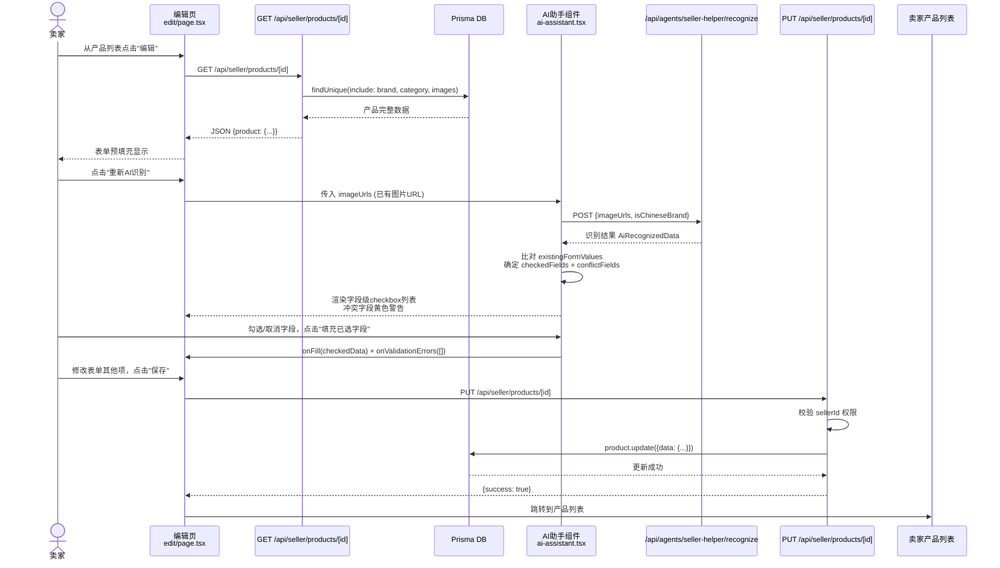
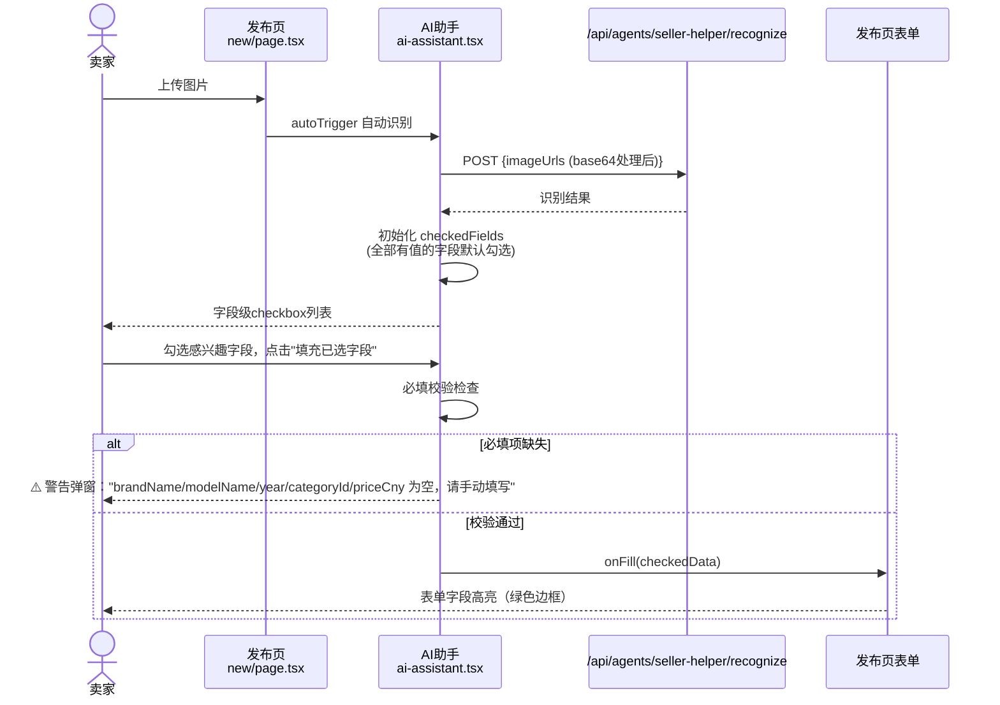
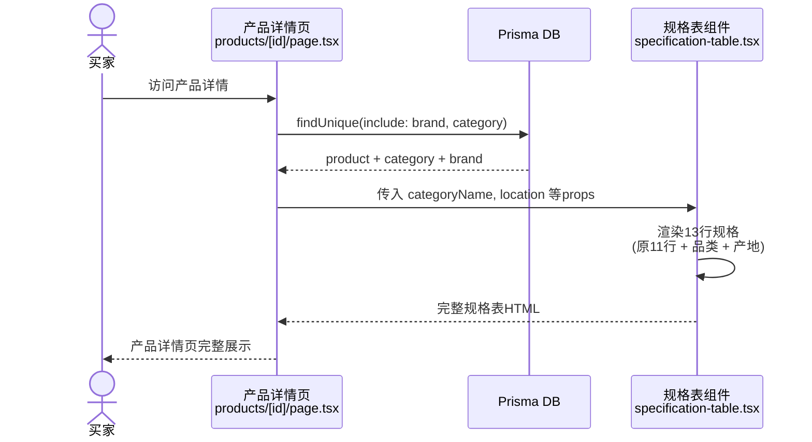
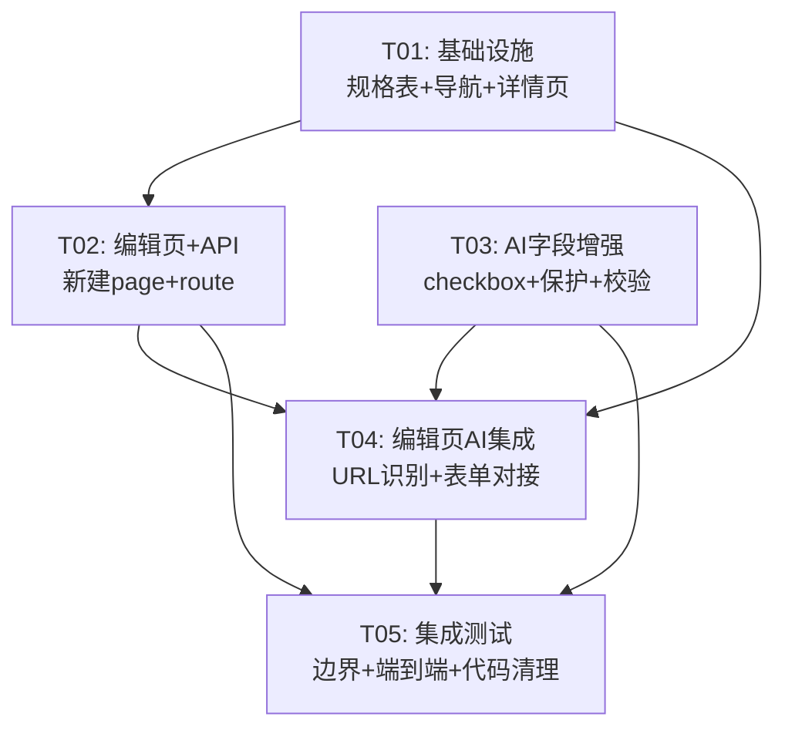

# AI识别字段补全 — 系统架构设计 + 任务分解

> **作者**: Bob (Architect)  
> **日期**: 2026-07-15  
> **项目**: 神雕农机 (usedfarmmach.com)  
> **版本**: v1.0

---

## Part A: 系统设计

### 1. 实现方案

#### 方案A — MF3404重新识别并补齐数据库（P0-1, P0-2）

**核心策略**: 新建产品编辑页 + 新建产品更新API

- **新建编辑页**: `src/app/[locale]/seller/products/[id]/edit/page.tsx`
  - 复用发布页的表单结构（品牌/品类/型号/年份/规格等字段），从数据库预填充
  - 展示已有产品图片（OSS URL），新增"重新AI识别"按钮
  - 调用 `/api/agents/seller-helper/recognize` 时传入 `imageUrls`（已有图片HTTP URL）
  - 识别完成后复用方案B的字段级确认机制

- **新建更新API**: `src/app/api/seller/products/[id]/route.ts`
  - `GET`：根据产品ID返回产品完整数据（含品牌/品类/图片），用于编辑页初始化
  - `PUT`：接收更新后的表单数据，写入 `mainConfig`, `overallLength/Width/Height`, `netWeight` 等字段
  - 权限校验：仅该产品的卖家（`sellerId`）可编辑

- **卖家产品列表增加编辑入口**: 在 `seller/products/page.tsx` 每个产品卡片右侧增加"编辑"按钮

#### 方案B — AI回填增强：字段级确认+必填校验（P0-3, P0-4, P0-5）

**核心策略**: 改造 `ai-assistant.tsx` 组件

- **字段级确认（P0-3）**:
  - 识别结果区域从"绿框文字列表"改为"字段级 checkbox 列表"
  - 每个字段左侧加 `<input type="checkbox">`，右侧显示 AI 识别值
  - "一键填充到表单"改为"填充已选字段"，仅填充勾选的字段
  - 新增状态: `checkedFields: Set<string>` 管理选中/取消

- **已填字段保护（P0-4）**:
  - 新增 Props: `existingFormValues?: Record<string, any>` — 父页面传入已填表单值
  - 比较逻辑: AI值非空 且 existingFormValues[field] 非空 → 默认不勾选 + 黄色警告标签 `⚠️ 表单已填写，AI值不同`
  - 比较逻辑: AI值非空 且 existingFormValues[field] 为空 → 默认勾选（新数据的自然行为）
  - 新增状态: `conflictFields: Set<string>` 记录冲突字段

- **必填字段校验（P0-5）**:
  - 必填项列表: `brandName`, `modelName`, `year`, `categoryId`/`categoryName`, `priceCny`
  - 填充后检查：若上述字段在表单中仍为空，触发警告提示
  - 新增 Props: `onValidationErrors?: (missingFields: string[]) => void` — 通知父页面
  - 在"填充已选字段"按钮点击后弹出校验摘要

#### 方案C — 规格表展示补全（P0-6, P0-7）

**核心策略**: 改造 `specification-table.tsx` + 产品详情页传参

- **新增"品类"行（P0-6）**:
  - 在"品牌→型号→年份"之后插入"品类"行，数据源: `category.nameZh` / `category.nameEn` / `category.nameRu`
  - Props 新增: `categoryName: string`
  - LABELS 补充三语: `category: "品类" / "Category" / "Категория"`

- **新增"产地"行（P0-7）**:
  - 在"整机重量"之后插入"产地"行
  - 数据源优先级: `product.location` → `province+city`拼接 → "暂无"
  - Props 新增: `location?: string | null`
  - LABELS 补充三语: `location: "产地" / "Origin" / "Происхождение"`

#### P1备注 — 外形尺寸部分展示

（本次不实现，仅在设计文档中标注）规格表 `formatDimension()` 改为支持部分值展示：
```
// 现状：三个值都有才显示 "8900×2990×3490"，否则"暂无"
// 改进：有部分值显示 "8900×-×3490" 或 "8900×2990×暂无"
```

---

### 2. 文件列表

| 操作 | 相对路径 | 说明 |
|------|----------|------|
| ✅ 修改 | `src/components/product/specification-table.tsx` | 新增品类/产地行 + 三语标签 |
| ✅ 修改 | `src/components/seller/ai-assistant.tsx` | 字段级checkbox + 字段保护 + 必填校验 |
| ✅ 修改 | `src/app/[locale]/seller/products/new/page.tsx` | 适配新`onFill`签名、传入`existingFormValues` |
| ✅ 修改 | `src/app/[locale]/seller/products/page.tsx` | 产品卡片增加"编辑"按钮 |
| ✅ 修改 | `src/app/[locale]/products/[id]/page.tsx` | 给规格表传入`categoryName`和`location` |
| 🆕 新建 | `src/app/[locale]/seller/products/[id]/edit/page.tsx` | 产品编辑页（全新） |
| 🆕 新建 | `src/app/api/seller/products/[id]/route.ts` | 产品 CRUD API（GET + PUT） |

---

### 3. 数据结构和接口

```mermaid
classDiagram
    class SellerAiAssistantProps {
        +File[] imageFiles
        +File? videoFile
        +boolean autoTrigger
        +Record~string, any~? existingFormValues
        +function onFill(data)
        +function? onValidationErrors(missingFields)
    }

    class AiRecognizedData {
        +string? brand
        +string? modelName
        +number? year
        +string? enginePower
        +string? engineType
        +string? driveSystem
        +string? overallLength
        +string? overallWidth
        +string? overallHeight
        +string? netWeight
        +string? mainConfig
        +number? workingHours
        +string? condition
        +string? priceMode
        +string? tradeTerm
        +string? tradePort
        +boolean isChineseBrand
        +number confidence
        +string? category
        +string? location
        +string? country
        +string? province
        +string? city
        +number? referencePrice
    }

    class SellerAiAssistant_State {
        -boolean recognizing
        -AiRecognizedData? recognized
        -string? error
        -string phase
        -string engineMode
        -Set~string~ checkedFields
        -Set~string~ conflictFields
    }

    class SpecificationTableProps {
        +string brandName
        +string modelName
        +number year
        +number? workingHours
        +string? engineType
        +number? enginePower
        +string? driveSystem
        +string? mainConfig
        +number? overallLength
        +number? overallWidth
        +number? overallHeight
        +number? netWeight
        +string conditionLabel
        +string locale
        +string categoryName
        +string? location
    }

    class ProductUpdateBody {
        +string? brandName
        +string? categoryName
        +string? modelName
        +number? year
        +string? condition
        +number? enginePower
        +string? engineType
        +string? driveSystem
        +number? overallLength
        +number? overallWidth
        +number? overallHeight
        +number? netWeight
        +string? mainConfig
        +string? location
        +string? country
        +string? province
        +string? city
        +string? priceMode
        +string? tradeTerm
        +string? tradePort
        +boolean? isChineseBrand
    }

    class ProductEditData {
        +string id
        +string brandId
        +string brandName
        +string categoryId
        +string categoryName
        +string modelName
        +number year
        +number? workingHours
        +string condition
        +number priceCny
        +string location
        +string? country
        +string? province
        +string? city
        +number? enginePower
        +string? engineType
        +string? driveSystem
        +number? overallLength
        +number? overallWidth
        +number? overallHeight
        +number? netWeight
        +string? mainConfig
        +string priceMode
        +string tradeTerm
        +string? tradePort
        +boolean isChineseBrand
        +object[] images
    }

    SpecificationTableProps --> SpecificationTable : 渲染规格表
    SellerAiAssistantProps --> SellerAiAssistant : 渲染AI助手
    ProductUpdateBody --> "PUT /api/seller/products/[id]" : 请求体
    ProductEditData --> "edit/page.tsx" : 页面初始化
```

---

### 4. 程序调用流程

#### 4.1 完整链路：产品编辑页 → AI重新识别 → 字段确认 → 更新保存



#### 4.2 发布页：AI识别 → 字段确认 → 必填校验



#### 4.3 产品详情页：规格表渲染（新增品类+产地行）



---

### 5. Anything UNCLEAR（已决策 + 待确认）

| # | 问题 | 架构师决策 |
|---|------|-----------|
| 1 | 编辑页是否存在？ | 不存在，需**新建** `seller/products/[id]/edit/page.tsx` |
| 2 | 产品更新API是否存在？ | 不存在，需**新建** `api/seller/products/[id]/route.ts` |
| 3 | 重新识别图片来源 | 使用产品已有图片的 OSS URL（recognize 接口支持 `imageUrls`） |
| 4 | 数据覆盖策略 | 复用方案B的字段级确认——所有字段默认不覆盖，用户手动勾选 |
| 5 | 规格表产地数据源 | 优先 `product.location`，为空则 `province+city` 拼接 |
| 6 | 品类多语言 | 从 `product.category.nameZh/nameEn/nameRu` 取，规格表接收 `categoryName` prop |
| 7 | 外形尺寸部分展示 | 本次**不实现**（P1），保持现有"全有或暂无"逻辑 |
| 8 | 编辑页是否复用发布页表单 | **不复用**组件提取，独立实现编辑页表单（避免影响现有发布流程） |
| 9 | AI助手URL模式 | 新增 `imageUrls?: string[]` prop，跳过压缩/上传步骤，直接调用 recognize API |

---

## Part B: 任务分解

### 6. Required Packages

**无需新增 npm 包。** 所有功能基于现有技术栈实现：
- React 18 + Next.js 14 (App Router)
- TypeScript
- Tailwind CSS
- Prisma ORM
- Lucide React (图标，已安装)

---

### 7. Task List（按依赖关系排序）

#### T01: 项目基础设施 — 规格表增强 + 卖家列表编辑入口 + 产品详情页传参

| 字段 | 内容 |
|------|------|
| **Task ID** | T01 |
| **Task Name** | 基础设施：规格表补全 + 编辑导航 + 详情页集成 |
| **Source Files** | `src/components/product/specification-table.tsx`（改）, `src/app/[locale]/seller/products/page.tsx`（改）, `src/app/[locale]/products/[id]/page.tsx`（改） |
| **Dependencies** | 无 |
| **Priority** | P0 |

**涉及修改**:

1. **`specification-table.tsx`** — 规格表增强
   - `SpecificationTableProps` 新增 `categoryName: string` 和 `location?: string | null`
   - `LABELS` 三语新增: `category` / `location`
   - rows 数组在"年份"后插入"品类"行（图标用 `Tag`），在"整机重量"后插入"产地"行（图标用 `MapPin`）
   - 产地值: `location || "暂无"` / `location || l.notAvailable`

2. **`seller/products/page.tsx`** — 卖家产品列表
   - 在每个产品卡片右侧（"在售"标签旁）增加"编辑"按钮
   - 链接到 `/zh/seller/products/${p.id}/edit`
   - 按钮样式：`rounded-lg border border-gray-300 px-3 py-1 text-xs text-gray-600 hover:bg-gray-100`
   - 导入 `Edit3` 图标（来自 lucide-react）

3. **`products/[id]/page.tsx`** — 产品详情页
   - 在 `SpecificationTable` 调用处新增两个 prop:
     ```tsx
     categoryName={categoryName}
     location={product.location ?? null}
     ```

---

#### T02: 产品编辑页 + 更新API

| 字段 | 内容 |
|------|------|
| **Task ID** | T02 |
| **Task Name** | 新建产品编辑页 + 产品 CRUD API |
| **Source Files** | `src/app/[locale]/seller/products/[id]/edit/page.tsx`（新）, `src/app/api/seller/products/[id]/route.ts`（新） |
| **Dependencies** | T01（编辑入口已就绪） |
| **Priority** | P0 |

**涉及修改**:

1. **`api/seller/products/[id]/route.ts`**（新建）— 产品 CRUD API
   - `GET`: 根据 `params.id` 查询产品（含 brand, category, images），校验 sellerId 权限
   - `PUT`: 接收 JSON body (`ProductUpdateBody`)，校验 sellerId，prisma.product.update
   - 权限：从 JWT token 提取 userId，对比 product.sellerId，不匹配返回 403
   - 响应格式: `{ success: true, data: product }` / `{ success: false, error: "..." }`

2. **`seller/products/[id]/edit/page.tsx`**（新建）— 产品编辑页
   - **顶部**: 面包屑 "返回产品列表" → 链接到 `/zh/seller/products`
   - **Step 1**: 展示已有图片（从 `product.images` 取 OSS URL），不可删除/新增（编辑页仅改参数）
   - **Step 2**: "重新AI识别"按钮（先留占位，T05 对接AI组件）
   - **Step 3**: 表单 — 与发布页相同的字段布局（品牌/品类/型号/年份/成色/价格/产地/规格/贸易信息）
   - 表单初始值从 `GET /api/seller/products/[id]` 获取并预填充
   - **Step 4**: "保存修改"按钮 → 调用 `PUT /api/seller/products/[id]`
   - 必填校验: `modelName`, `priceCny`, `location` 不能为空
   - 提交成功后跳转到 `/zh/seller/products`
   - **参考发布页表单字段**（80%相同）: 品牌、品类、型号、年份、成色、价格Cny、产地、引擎功率/类型、驱动方式、外形尺寸、整机重量、主要配置、价格模式、贸易条款、贸易港口

---

#### T03: AI助手字段级增强

| 字段 | 内容 |
|------|------|
| **Task ID** | T03 |
| **Task Name** | AI助手字段级确认 + 已填字段保护 + 必填校验 |
| **Source Files** | `src/components/seller/ai-assistant.tsx`（改）, `src/app/[locale]/seller/products/new/page.tsx`（改） |
| **Dependencies** | 无（可独立开发并测试） |
| **Priority** | P0 |

**涉及修改**:

1. **`ai-assistant.tsx`** — 核心改造
   - **新增 Props**:
     - `existingFormValues?: Partial<Record<string, any>>` — 已填表单值
     - `onValidationErrors?: (missingFields: string[]) => void` — 必填项缺失回调
     - `imageUrls?: string[]` — 外部图片URL（跳过压缩/上传，直接识别）
   - **新增 State**:
     - `checkedFields: Set<string>` — 已勾选字段集合
     - `conflictFields: Set<string>` — 冲突字段（AI值≠已有值）
   - **识别完成后逻辑**:
     - 遍历 `AiRecognizedData` 所有有值字段
     - 对于每个字段：若 `existingFormValues[field]` 有值且 ≠ AI值 → 加入 `conflictFields`，默认不勾选
     - 若 `existingFormValues[field]` 无值或为空 → 默认勾选
   - **渲染改造**: `renderField()` 改为 `renderFieldWithCheckbox()`
     - 左侧: `<input type="checkbox" checked={checkedFields.has(key)} onChange={toggleField}>`
     - 中间: 字段标签
     - 右侧: AI识别值
     - 冲突字段附加: `<span class="text-amber-600 text-[10px]">⚠️ 表单已有值</span>`
   - **必填校验**（`handleFill`中）:
     - 勾选回填后，检查 `brandName/modelName/year/categoryId/categoryName/priceCny` 是否为空
     - 若有关键字段缺失，调用 `onValidationErrors` 通知父页面
   - **"一键填充"按钮** → 改为 "填充已选字段（{checkedFields.size}项）"

2. **`new/page.tsx`** — 发布页适配
   - `handleAiFill` 函数中，`onFill` 回调现在只传勾选字段的数据（但 `ai-assistant` 内部已做过滤）
   - 添加 `onValidationErrors` 回调: 弹出红色警告提示缺失字段
   - 为 `SellerAiAssistant` 传入 `existingFormValues={{...form}}`
   - `aiFilledFields` Set 标记逻辑保持不变（用于绿色高亮样式）

---

#### T04: 编辑页AI识别对接 + 端到端集成

| 字段 | 内容 |
|------|------|
| **Task ID** | T04 |
| **Task Name** | 编辑页AI识别集成 + 完整链路联调 |
| **Source Files** | `src/app/[locale]/seller/products/[id]/edit/page.tsx`（改）, `src/components/seller/ai-assistant.tsx`（改-URL模式）, `src/app/api/seller/products/[id]/route.ts`（改-完善） |
| **Dependencies** | T02（编辑页存在）, T03（AI组件增强完成） |
| **Priority** | P0 |

**涉及修改**:

1. **`edit/page.tsx`** — AI识别集成
   - 引入 `SellerAiAssistant` 组件
   - 从 `GET` 响应中提取 `product.images` URL 数组
   - 传入 `imageUrls={product.images.map(img => img.url)}`
   - 传入 `existingFormValues={{...form}}` (已填表单值，即数据库现有值)
   - 实现 `onFill` 回调: 将AI识别的勾选字段更新到表单 state
   - 实现 `onValidationErrors` 回调: 弹出警告提示
   - 提交逻辑: `PUT` API + 跳转到产品列表

2. **`ai-assistant.tsx`** — URL模式完善
   - 当 `imageUrls` prop 有值时，跳过图片压缩和上传步骤
   - 直接调用 `/api/agents/seller-helper/recognize` 传入 `imageUrls`
   - "重新识别"按钮文案根据模式调整: "重新AI识别（{imageUrls.length}张已有图片）"

3. **`api/seller/products/[id]/route.ts`** — 完善PUT
   - 完善字段白名单（只允许更新非关键字段：规格字段、贸易字段）
   - 不允许修改 `sellerId`, `brandId`, `categoryId` 以防篡改

---

#### T05: 集成测试 + 收尾

| 字段 | 内容 |
|------|------|
| **Task ID** | T05 |
| **Task Name** | 集成测试 + 边界情况处理 + 代码收尾 |
| **Source Files** | `src/app/[locale]/seller/products/[id]/edit/page.tsx`（验证）, `src/components/seller/ai-assistant.tsx`（边界处理）, `src/components/product/specification-table.tsx`（边界处理） |
| **Dependencies** | T01, T02, T03, T04（全部完成） |
| **Priority** | P0 |

**涉及内容**:

1. 边界情况验证清单:
   - 编辑页：产品不存在时的 404 处理
   - 编辑页：非产品所有者访问时的 403 处理
   - AI组件：所有字段为空时 `checkedFields` 为空，"填充已选字段"按钮禁用
   - AI组件：`existingFormValues` 为空对象时的默认行为（全勾选）
   - 规格表：`categoryName` / `location` 为 null 时显示 "暂无"
   - 规格表：多语言切换（zh/en/ru）新行标签正确

2. 端到端测试场景:
   - 新发布 → 上传图片 → AI识别 → 字段级勾选 → 填充 → 提交
   - 编辑页 → 加载已有数据 → 重新AI识别 → 冲突字段警告 → 选择性覆盖 → 保存
   - 产品详情页 → 规格表加载 → 品类行 + 产地行显示

3. 代码清理: 移除 console.log 调试代码，确保 TypeScript 无 any 类型警告

---

### 8. Shared Knowledge（跨文件约定）

```yaml
# ── Props 命名规范 ──
# • 中文字段保持中文名（如 brandName, categoryName, modelName）
# • 新增 Props 使用 camelCase
# • optional props 统一加 ? 后缀

# ── API 响应格式 ──
# 所有 API 使用统一格式: { success: boolean, data?: any, error?: string, code?: string }
# HTTP 状态码: 200=成功, 400=参数错误, 401=未登录, 403=无权限, 404=不存在, 500=服务器错误

# ── Tailwind 颜色约定 ──
# • AI识别成功: bg-green-50 border-green-200 text-green-700
# • AI字段冲突警告: bg-amber-50 border-amber-200 text-amber-600
# • 表单已填高亮: border-green-400 bg-green-50 （保持现有 fieldClass()）
# • 错误提示: bg-red-50 text-red-600
# • 编辑按钮: text-gray-600 hover:bg-gray-100 border-gray-300

# ── Lucide 图标 ──
# • 品类行: Tag (lucide-react)
# • 产地行: MapPin (lucide-react)
# • 编辑按钮: Edit3 (lucide-react) — 或 Pencil

# ── 字段映射（AI识别字段名 → 表单字段名）──
# brand → brandName
# modelName → modelName (一致)
# enginePower → enginePower (一致)
# overallLength/Width/Height → overallLength/Width/Height (一致)
# 品类: category → categoryName (编辑页/发布页中 categoryId 需额外匹配)

# ── 必填字段列表 ──
REQUIRED_FIELDS = ["brandName", "modelName", "year", "categoryId", "priceCny"]

# ── 编辑页不开放修改的字段 ──
READONLY_FIELDS = ["sellerId", "brandId", "categoryId"]
# (品牌和品类在编辑页可以修改，但需要同步更新 brandId/categoryId)
```

---

### 9. Task Dependency Graph



**并行能力**: T02 和 T03 可同时开发（互不依赖）；T01 先行；T04 需等待 T01+T02+T03；T05 收尾。

---

*End of System Design Document*
