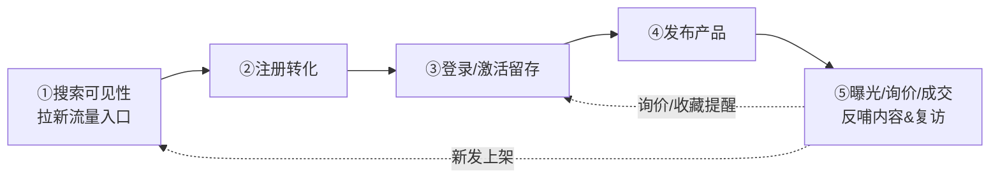

# usedfarmmach 搜索排名现状与增长方案
**副标题**：吸引客户「注册 → 登录 → 发布产品」可执行方案（简单 PRD 风格）
**版本**：v1.0 ｜ **日期**：2026-07-28 ｜ **产出**：产品经理（许清楚）
**数据来源**：主理人 2026-07-28 实测 Google / 百度排名 + 已上线技术背景

---

## 一、搜索排名现状梳理

### 1.1 一句话结论
> usedfarmmach **在核心中英文搜索词上基本零自然排名**（Google 英文词前 5 页未见；百度中文词前 5 页未见）。当前流量几乎不来自搜索，增长必须"先修可见性、再修转化漏斗"。

### 1.2 关键词排名对比表

| 关键词 | 搜索引擎 | 当前排名 | 前排主要竞品 | 差距根因 |
|---|---|---|---|---|
| used farm machinery marketplace online | Google（全球） | **无**（前5页未见） | TractorHouse、AgriClicks、tractorpool、Agriaffaires | 新站权重低；竞品海量 listing/外链压制；无自有内容 |
| China used agricultural machinery export usedfarmmach | Google | **无** | made-in-china 供应商页（青岛/山东出口商）、stabili.cn | 品牌词未建立；独立站 SEO 未起步；被 B2B 平台权重吃掉 |
| 二手农机 交易平台 网站 | 百度（中国） | **无** | 谷子二手农机网、淘宝/闲鱼/58同城、中国农机网、农机365、农机114 | 中文内容缺失；无百度收录沉淀；C 端被综合平台瓜分 |
| 农机出口 企业 二手农机 | 百度 | **无**（仅行业报道偶提"许建辉"） | 2026中国农机出海论坛报道、1688、stabili.cn | 品牌曝光靠偶发报道而非自有渠道；缺落地页承接流量 |

### 1.3 竞品格局速览（决定我们怎么打）

| 阵营 | 代表 | 特征 | 我们的差异点 |
|---|---|---|---|
| 国际老牌 | TractorHouse(Sandhills)、Agriaffaires、tractorpool、AgriClicks | 2001 年起、海量 listing、多语自动翻译、担保交易/合同 | 我们轻、新、可聚焦"中国/亚洲出口农机"垂直品类 |
| 国内平台 | 谷子二手农机网（农机通，日均过万）、中国农机网、农机365 | 中文 SEO 根基深、C 端流量大 | 我们强在出口 + 展会 + 会员担保体系 |
| 出口独立站 | stabili.cn（16年、50+出口国）、made-in-china 供应商页 | SEO 强、靠 B2B 平台权重与外链年积累 | 我们可借"论坛曝光 + 多语站 + 担保交易"组合突围 |

### 1.4 根因诊断（诚实版）
1. **权重低**：`.com` 上线不久；`.cn` 为独立新站，无历史积累。
2. **内容少**：无核心词落地页、无机型百科、无品牌承接页。
3. **外链几乎为零**：除偶发论坛报道，无主动外链建设。
4. **收录浅**：搜索引擎仅抓取基础页面，结构化数据/ sitemap 未系统化提交。

---

## 二、增长方案（核心）：注册 → 登录 → 发布产品 漏斗

### 2.0 漏斗全景

### 2.1 ① 搜索可见性（拉新流量入口）
**技术 SEO 落地清单（工程 + 运营配合）**
- [ ] `sitemap.xml` 多语分站提交 → Google Search Console + 百度站长平台验证
- [ ] 结构化数据补全：复用已有 `src/components/seo/structured-data.tsx`，扩展 `Product` / `Offer` 类型（产品详情页已有基础）
- [ ] 多语 `hreflang` 标签：next-intl 8 语已支持，需确保每语版均生成并自引用
- [ ] 核心词落地页：英文 `used farm machinery marketplace`、中文 `二手农机 交易平台`（含 FAQ + 机型列表承接）
- [ ] 内容矩阵：品牌页（借许建辉论坛曝光）、机型百科（按「品牌+机型+年份」长尾词铺量）

**外链与行业背书（纯运营为主）**
- [ ] 借 2026 中国农机出海论坛"许建辉"发言做 PR 稿 + 客座文章，回链 `usedfarmmach.cn`
- [ ] 行业目录 / 农机垂直媒体投稿（换链/客座）

**B2B 平台开店导流（纯运营）**
- [ ] made-in-china 开店，供应商页回链主站
- [ ] 1688 产业带内容挂载回链

### 2.2 ② 注册转化
- **微信 / 邮箱一键注册**：`.cn` 已有微信收付通基础，可复用登录态降低摩擦
- **卖家入驻引导**：注册即选 `seller` 角色，跳转入驻引导（而非先注册再找入口）
- **首单激励**：发布首个产品赠 `free` 会员额度或"新发曝光位"，降低冷启动门槛

### 2.3 ③ 登录留存
- **会员体系钩子**：明示升级路径（free 5次 → basic 99元50次 → premium 299无限 → enterprise 999无限），让免费用户有"差一步"的升级动机
- **询价 / 收藏驱动回头**：询价状态提醒、收藏机型"新上/降价"提醒（邮件 + 微信模板）

### 2.4 ④ 发布产品
- **信息架构优化**：字段引导、图片上传、必填/选填分层（现有产品详情页 + 询价入口扩展）
- **AI 辅助填表**：根据机型自动补全参数（减轻卖家填写负担，提升发布完成率）
- **发布即得曝光承诺**：新发产品自动进"最新上架"频道 / 推荐位，给卖家即时正反馈

---

## 三、需求池 P0 / P1 / P2

> 字段说明：**做什么** / **预期效果** / **是否需工程师** / **优先级**。类型标注「运营」（今天就能做）与「工程」（需排期）。

### P0（Must have — 先活下来，1~2 周可启动）
| 需求 | 做什么 | 预期效果 | 是否需工程 | 类型 |
|---|---|---|---|---|
| 搜索可见性基线 | 提交 sitemap、补全结构化数据、配 hreflang、GSC/百度站长验证 | 核心页被收录、可索引 | 需工程（小） | 技术SEO |
| 注册门槛优化 | 微信/邮箱一键注册；注册选角色引导 | 注册转化率↑ | 需工程（中） | 注册转化 |
| 卖家入驻引导 | 注册→seller 引导填写首条产品 | 发布率↑ | 需工程（小） | 发布产品 |
| 论坛 PR 借势 | 许建辉发言稿 + 客座文，回链主站 | 首批外链 + 品牌词 | 纯运营 | 外链 |

### P1（Should have — 1 个月内）
| 需求 | 做什么 | 预期效果 | 是否需工程 | 类型 |
|---|---|---|---|---|
| 核心词落地页 | 英文/中文核心词 LP（含 FAQ/机型列表） | 长尾排名起点 | 需工程（中） | 技术SEO |
| 内容矩阵 | 品牌页 + 机型百科（运营撰写，工程给模板） | 长尾收录增量 | 需工程（模板）+ 运营 | 内容 |
| B2B 开店导流 | made-in-china / 1688 开店回链 | 导流 + 外链 | 纯运营 | 外链 |
| 会员钩子 | 升级路径明示、首单激励 | 留存/付费↑ | 需工程（小） | 留存 |
| 询价/收藏提醒 | 邮件/微信提醒 | 回头率↑ | 需工程（中） | 留存 |

### P2（Nice to have — 排期后置）
| 需求 | 做什么 | 预期效果 | 是否需工程 | 类型 |
|---|---|---|---|---|
| AI 辅助填表 | 机型参数自动补全 | 发布效率↑ | 需工程（中） | 发布产品 |
| 发布曝光承诺 | 新发进推荐位/最新频道 | 发布动机↑ | 需工程（小） | 发布产品 |
| 多语内容扩量 | 8 语长尾页批量生成 | 国际流量 | 需工程 + 运营 | 技术SEO |

---

## 四、待确认问题（需立忠拍板）

1. **预算**：SEO / 内容 / 外链 / B2B 开店是否有专项预算？PR 投放与 made-in-china 年费谁出？
2. **B2B 开店**：是否开 made-in-china / 1688 店？由谁运营（现有团队还是外包）？
3. **内容人力**：机型百科 / 品牌页由谁写、产出频率（SEO 见效依赖持续内容）？
4. **首单激励成本**：赠会员额度 / 曝光位是否可控、是否设上限？
5. **考核周期**：SEO 见效通常 3~6 月，是否接受阶段性指标（先收录/索引量 → 再排名）？
6. **分站关系**：`.cn` 与 `.com` 是否共享会员/内容？当前分站数据隔离是否影响卖家"一次发布双站展示"的体验？

---

**附：成功指标建议（供排期参考）**
- 阶段一（0~1月）：GSC/百度收录页 ≥ 500；核心页 100% 可索引；注册转化率基线建立
- 阶段二（1~3月）：核心词进入 Google/百度前 10 页；月注册量环比 +30%
- 阶段三（3~6月）：核心词进入前 3 页；卖家月发布量 +50%；会员付费转化 > 5%
