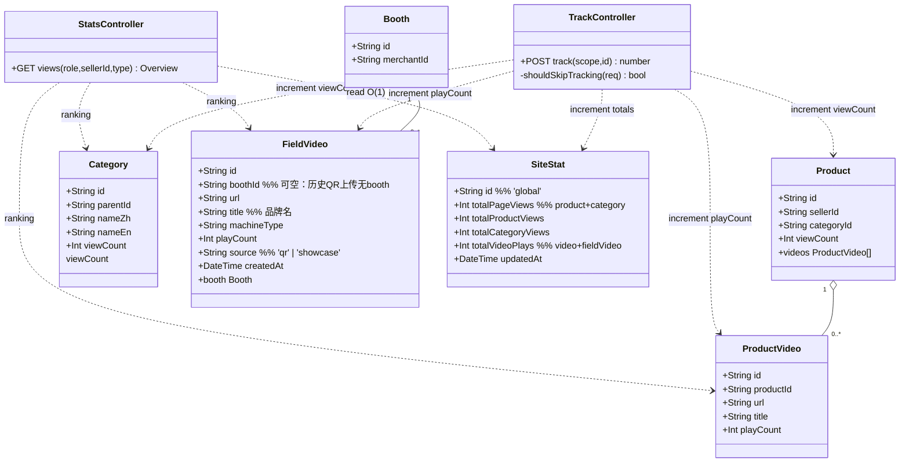
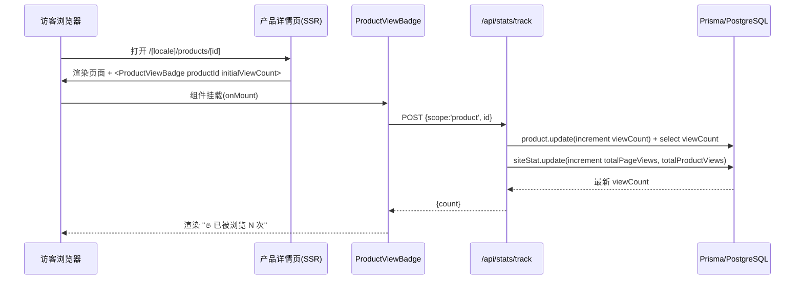
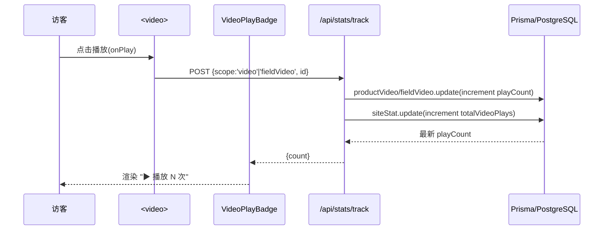
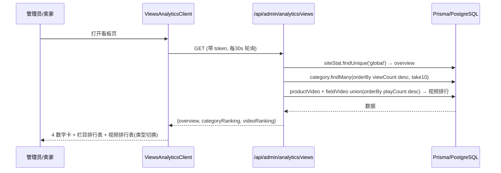
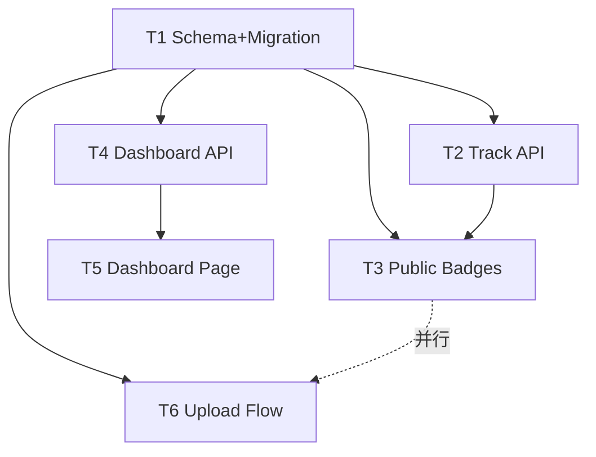

# 系统架构设计 + 任务分解：网站浏览量统计与标注（product_view_stats）

> 文档类型：架构设计 + 任务分解（Architect 产出）
> 作者：高见远（software-architect）
> 适用：usedfarmmach（.com / .cn 同源代码，各自独立数据库，各自 `prisma migrate deploy`）
> 日期：2025-07-29
> 上游输入：PRD `docs/view-stats-prd.md`、PM 许清楚；schema `prisma/schema.prisma`；参考实现 `seller/booth/analytics`

---

## 0. 重要代码事实更正（影响设计）

PRD §3.1.1 假设"地头展现场作业视频"真实落库于 `ShowcaseItem.videos`，且团队主理人据此要求"改造成落 FieldVideo"。**实际代码核查结论不同**，必须先讲清：

现状存在**两套互不相干**的"视频"体系：

1. **`ShowcaseItem.videos String[]`** —— 展商展台展品视频，由展位管理后台上传，渲染于 `src/app/[locale]/expo/showroom/[id]/ShowcaseDetail.tsx`（第 271–278 行 `<video src={video}>`）。**无逐视频主键，无法精确 +1**，属于展台体系。
2. **"地头展现场作业视频"扫码上传流程**（PRD 所指标的功能的真正承载方）：
   - `GET/POST /api/field-videos/upload`：前端拿 OSS 直传签名 → 直传 OSS → `POST` 确认时把 `{id, url, brandName, machineType, uploadedAt}` **写入 OSS 上的 JSON 文件 `uploads/field-expo-videos/db.json`**，**不写数据库、不写 ShowcaseItem、不带 boothId**。
   - `GET /api/field-videos/list`：读取该 OSS `db.json` 返回视频列表。
   - 渲染页：`src/app/[locale]/expo/field-videos/page.tsx`（大屏/线上集锦）。

**结论**：地头展现场作业视频的"历史真源"是 **OSS `db.json`**，而非 `ShowcaseItem.videos`。因此本设计的历史迁移与上传改造必须对准 `field-videos` 那套 API，而非 `ShowcaseItem`。`ShowcaseItem.videos` 作为展台展品视频，可在迁移时一并并入 `FieldVideo`（source='showcase'）以统一统计，亦可选择不并入（见 §8 待明确事项）。

---

## 1. 实现方案 + 框架选型

- **沿用既有技术栈，零新依赖**：Next.js 14 App Router + next-intl（8 语）+ Prisma 5.14 + PostgreSQL + 现有 MUI/Tailwind。所有计数用 Prisma 内置 `increment` 原子自增，无需 Redis/消息队列。
- **为何不引入新框架**：
  - 实时性需求仅为"累计 +1 + 前端读最新值 + 后台轮询 30s"，无需 WebSocket（PRD 已确认）。
  - 统计聚合用单例 `SiteStat` 行 + 各实体 `orderBy desc`，SQL 成本极低，无需 ES/ClickHouse。
  - 分站架构要求"一套代码两库各 migrate"，因此**所有 schema 变更必须 additive（只加字段/加新表），不删不改既有字段**，保证 `.com`（Neon）与 `.cn`（阿里云 PG）迁移都安全幂等。
- **计数并发安全**：所有 `+1` 走 Prisma `update({ data: { x: { increment: 1 } } })`，数据库原子执行，避免读-改-写覆盖。
- **track API 不被缓存**：`export const dynamic = "force-dynamic"` + `revalidate = 0`。
- **迁移脚本运行器**：`tsx` 已在 devDependencies（`package.json` 有 `"db:seed": "tsx prisma/seed.ts"`），历史迁移脚本用 `tsx scripts/migrate-field-videos.ts` 运行，**不新增依赖**。

---

## 2. 文件列表（相对路径，标注 新建/修改）

### [改] 数据库 / 迁移（T1）
| 文件 | 动作 | 说明 |
|---|---|---|
| `prisma/schema.prisma` | 修改 | Product +`viewCount`；ProductVideo +`playCount`；Category +`viewCount`；新增 `FieldVideo`、`SiteStat` 模型 |
| `prisma/migrations/<ts>_add_view_stats/migration.sql` | 新建（自动生成） | `prisma migrate dev` 生成；两库各自 `migrate deploy` 执行 |
| `scripts/migrate-field-videos.ts` | 新建 | 历史迁移：读 OSS `db.json` + `ShowcaseItem.videos` → 写 `FieldVideo`；并 upsert `SiteStat` 全局行（幂等，按 url 去重） |

### [新] 埋点 API + 公共工具（T2）
| 文件 | 动作 | 说明 |
|---|---|---|
| `src/app/api/stats/track/route.ts` | 新建 | `POST /api/stats/track`，四类 scope 原子自增 + 返回最新值；预留去重/UA 扩展点 |
| `src/lib/track-guard.ts` | 新建 | 服务端扩展点 `shouldSkipTracking(req)`（当前恒 false，P2 填 UA/爬虫/去重逻辑） |
| `src/lib/stats.ts` | 新建 | 前端客户端工具 `trackView(scope, id): Promise<number|null>`（供各 badge / onPlay 调用） |

### [新/改] 公开标注组件 + 前端挂载（T3）
| 文件 | 动作 | 说明 |
|---|---|---|
| `src/components/stats/ProductViewBadge.tsx` | 新建 | 产品详情页"已被浏览 N 次"，挂载即 track(product) |
| `src/components/stats/CategoryViewBadge.tsx` | 新建 | 栏目/列表页"本栏目已被浏览 N 次"，挂载即 track(category) |
| `src/components/stats/VideoPlayBadge.tsx` | 新建 | 视频播放处"播放 N 次"，显示 playCount（由父级 onPlay 更新） |
| `src/app/[locale]/products/[id]/page.tsx` | 修改 | 标题下挂 `<ProductViewBadge>`；视频区挂 `<VideoPlayBadge>` + `<video onPlay=track>` |
| `src/app/[locale]/category/[slug]/page.tsx` + `CategoryClient.tsx` | 修改 | 列表顶部挂 `<CategoryViewBadge categoryId>` |
| `src/app/[locale]/products/page.tsx` + `ProductsClient.tsx` | 修改 | 栏目筛选生效时挂 `<CategoryViewBadge>` |

### [新] 后台看板 API（T4）
| 文件 | 动作 | 说明 |
|---|---|---|
| `src/app/api/admin/analytics/views/route.ts` | 新建 | `GET` 总览 + 栏目排行 + 视频排行；角色/卖家过滤；复用 `getTokenFromHeaders`+`verifyToken` |
| `src/lib/stats-queries.ts` | 新建 | 排行查询封装（category ranking、video union ranking、占比计算） |
| `src/types/stats.ts` | 新建 | 看板响应类型定义（Overview / CategoryRank / VideoRank） |

### [新/改] 后台看板页 + 轮询 + 导航（T5）
| 文件 | 动作 | 说明 |
|---|---|---|
| `src/app/[locale]/admin/analytics/views/page.tsx` | 新建 | 管理后台看板页（server wrapper，校验后渲染 client） |
| `src/app/[locale]/admin/analytics/views/ViewsAnalyticsClient.tsx` | 新建 | 30s 轮询 + 4 数字卡 + 栏目排行表 + 视频排行表（类型切换）；参考 `seller/booth/analytics` 风格 |
| `src/app/[locale]/admin/admin-sidebar.tsx` | 修改 | 侧边栏加"浏览量看板"导航项 |
| `src/app/[locale]/seller/analytics/views/page.tsx` + `ViewsAnalyticsClient.tsx` | 新建 | 卖家自视图入口（复用同一 API，API 按角色返回自有数据） |

### [改] 地头展视频上传流程改造（T6）
| 文件 | 动作 | 说明 |
|---|---|---|
| `src/app/api/field-videos/upload/route.ts` | 修改 | `POST` 确认上传后**额外** `prisma.fieldVideo.create`（双写：保留 OSS db.json 兼容 + 写 FieldVideo） |
| `src/app/api/field-videos/list/route.ts` | 修改 | 改读 `FieldVideo` 表（返回含 `id`/`playCount`，供前端 track 与展示） |
| `src/app/[locale]/expo/field-videos/page.tsx` | 修改 | 用返回的 `FieldVideo.id` 在 `<video onPlay>` 调 `track('fieldVideo', id)`；展示 playCount |

**新建 / 修改统计**：新建文件 **17** 个，修改文件 **9** 个（含自动生成的 migration.sql）。

---

## 3. 数据结构和接口（Mermaid 类图）



### 接口签名（JSON Schema）

**埋点 `POST /api/stats/track`**
```
Request:  { "scope": "product"|"category"|"video"|"fieldVideo", "id": string }
Response: { "success": true, "data": { "scope": string, "id": string, "count": number } }
          // count = 最新 viewCount(对 product/category) 或 playCount(对 video/fieldVideo)
Error:    { "success": false, "error": string }  (404 当 id 不存在；400 当 scope 非法)
```
> 公开接口，无需登录；`force-dynamic`，预留 `shouldSkipTracking` 扩展点。

**看板 `GET /api/admin/analytics/views`**
```
Query:    ?type=all|product|field  (视频排行类型过滤，默认 all)
          ?sellerId=xxx            (仅 admin/super_admin 可传，钻取某卖家；卖家自身强制忽略)
Header:   Authorization: Bearer <token>
Response: {
  "success": true,
  "data": {
    "overview": { "totalPageViews":number, "totalProductViews":number,
                  "totalCategoryViews":number, "totalVideoPlays":number },
    "categoryRanking": [ { "id":string, "name":string, "viewCount":number, "ratio":number } ],
    "videoRanking":    [ { "id":string, "title":string, "type":"product"|"field",
                           "playCount":number } ],
    "scope": "all"|"mine"   // 卖家视角标记
  }
}
Error:    { "success":false, "error":"请先登录" } 401 / 权限不足 403
```
> 鉴权：复用 `getTokenFromHeaders` + `verifyToken`；`payload.role` ∈ {admin,super_admin} 看全站，seller 看自有（product.sellerId / fieldVideo.booth.merchantId 过滤），其余 403。

---

## 4. 程序调用流程（Mermaid 时序图）

### 4.1 访客打开产品详情页 → 前端 track(product) → 自增 → badge 渲染


### 4.2 视频开始播放 → track(video / fieldVideo) → playCount 自增


### 4.3 后台看板打开 → 轮询 stats API → 渲染总览/排行


---

## 5. 任务列表（核心，有序 + 依赖）

> 依赖原则：DB 先行（T1）→ 埋点（T2）→ 公开组件（T3）→ 看板 API（T4）→ 看板页（T5）→ 上传改造（T6）。T3 依赖 T2（调其 API）；T5 依赖 T4（调其 API）；T4/T3/T6 均依赖 T1（读新字段/新表）。T6 与 T3/T4 无强依赖，可并行。

| Task | 名称 | 依赖 | 优先级 | 内容 |
|---|---|---|---|---|
| **T1** | Schema + Migration + 历史迁移 | — | P0 | `schema.prisma` 加字段/新表；生成 migration.sql；`scripts/migrate-field-videos.ts` 迁 OSS db.json + ShowcaseItem.videos → FieldVideo，并 seed SiteStat 全局行 |
| **T2** | 埋点 API + 公共工具 | T1 | P0 | `track/route.ts`（四类 scope 原子自增 + 返回最新值 + 预留去重/UA 扩展点）；`track-guard.ts`；`stats.ts`(前端 trackView) |
| **T3** | 公开 badge 组件 + 前端挂载 | T2 | P0 | 三个 Badge 组件 + 在 产品详情页 / 栏目页 / 列表页 挂载，挂载即 track，视频 onPlay track |
| **T4** | 后台看板 API | T1 | P1 | `admin/analytics/views/route.ts`（总览 O(1) + 栏目排行 + 视频排行 + 角色/卖家过滤）；`stats-queries.ts`；`types/stats.ts` |
| **T5** | 后台看板页 + 轮询 + 导航 | T4 | P1 | admin 看板页 + `ViewsAnalyticsClient`（30s 轮询）+ sidebar 导航 + seller 自视图入口 |
| **T6** | 地头展视频上传流程改造 | T1 | P0 | `field-videos/upload` 双写 FieldVideo；`field-videos/list` 改读 FieldVideo；大屏页 `onPlay` 调 track(fieldVideo) |

**依赖图**


---

## 6. 依赖包列表

**无需新增任何 npm 包。**
- 计数原子自增：`@prisma/client` 内置 `increment`（已用 5.14）。
- 历史迁移脚本运行：`tsx`（已在 devDependencies）。
- OSS 读取：复用现有 `ali-oss` / `fetch` 逻辑（脚本内直接 `fetch` OSS `db.json`，Node 18+ 全局 fetch 可用）。
- 前端轮询：原生 `setInterval` + `fetch`，无需 SWR/React-Query。
- UI：沿用 MUI + Tailwind + lucide-react（已装）。

---

## 7. 共享知识（跨文件约定）

1. **原子自增**：所有计数只能走 `prisma.x.update({ data: { field: { increment: 1 } } })`，禁止"先查后改"；保证并发安全、两库一致。
2. **分站各自 migrate，不串库**：`.com` 与 `.cn` 各自 `prisma migrate deploy`；本功能全部为 additive 变更（只加字段/新表），两库执行同一 migration 安全幂等；`SiteStat` 各自独立计数，互不汇总（Q8）。
3. **track API 必须 `force-dynamic` 且不被缓存**：`export const dynamic = "force-dynamic"; export const revalidate = 0;`，否则 +1 可能命中 CDN/Route Cache。
4. **看板 API 鉴权复用现有模式**：`const token = getTokenFromHeaders(req.headers); const payload = verifyToken(token);`（与 `seller/booth/analytics/route.ts` 一致）；无 token → 401，角色不符 → 403。
5. **SiteStat 单例行约定**：固定 `id = 'global'`；track 时按需自增 `totalPageViews/totalProductViews/totalCategoryViews/totalVideoPlays`；看板总览 O(1) 读取该行，不跑 `sum`。迁移脚本需确保该行存在（upsert）。
6. **视频不计入 PV**（Q3）：`totalPageViews` 仅含 product + category 的页面访问；video / fieldVideo 播放只增 `totalVideoPlays`，二者分离呈现。
7. **扩展点占位**：`track-guard.ts#shouldSkipTracking(req)` 当前返回 `false`；P2 防刷去重（同 IP/用户滑动窗口）、爬虫 UA 过滤在此统一接入，本期不实现具体逻辑但入口已留。
8. **FieldVideo 双写兼容**：上传确认时同时写 OSS `db.json`（大屏旧链路）与 `FieldVideo`（统计/看板）；`list` 改读 `FieldVideo` 后前端拿到的是 `FieldVideo.id`，故 `onPlay` 用该 id 调 track。
9. **历史从 0 起**（Q7）：新字段默认 0，不回填；`migrate-field-videos.ts` 仅创建 FieldVideo 记录（`playCount=0`），不臆造历史值。

---

## 8. 待明确事项（已给默认，需 PM/主理人最终拍板）

1. **ShowcaseItem.videos 是否并入 FieldVideo 统计（关键）**：本设计在迁移脚本中把 `ShowcaseItem.videos` 一并导入 `FieldVideo`（source='showcase'，boothId=ShowcaseItem.boothId），使"展台展品视频"也出现在视频排行。若团队认为展台展品视频与"地头展现场作业视频"语义不同、不应混计，可在脚本中**仅迁 OSS db.json**、跳过 ShowcaseItem.videos。请确认取哪一种。
2. **FieldVideo 额外字段**：本设计在 PRD 最小集（boothId/url/title?/playCount）之外加了 `machineType?`（机型标签，供大屏展示/过滤）与 `source`（'qr'|'showcase'，溯源）。若坚持最小化仅留 `title`，则大屏需从 title 解析机型。默认保留这两个扩展字段。
3. **历史 FieldVideo 的 boothId 空缺**：OSS db.json 来源的视频无 booth 上下文 → `boothId=null`；因此卖家维度过滤（P1-2）对这批视频**不可见**（仅 admin 可见）。是否后续让扫码上传携带 boothId（需改二维码/上传页传参）列为 P2，本期不阻塞。
4. **卖家自视图路由**：本设计提供 `/admin/analytics/views`（admin 全站）+ `/seller/analytics/views`（seller 复用同一 API，返回自有数据）双入口。若本期只需 admin 视角，可删去 seller 路由。
5. **本期明确不实现**（已按主理人决策后置 P2，架构已留扩展点）：防刷去重（Q2）、爬虫排除（Q4）、栏目子栏目递归汇总（Q6）、历史回填（Q7 已从 0）。

---

## 附：历史数据衔接方案选择（明确决策）

**选择：一次性迁移脚本（而非运行时双源合并）。**

理由：
- Q1 目标是"逐视频精确 +1"，必须为每条视频生成独立 `FieldVideo.id`；运行时双源合并（FieldVideo ∪ ShowcaseItem.videos）无法给无主键的 URL 稳定 +1，且每次读取都要 union，复杂易错。
- 脚本把双源（OSS `db.json` + `ShowcaseItem.videos`）在落库时合并为 `FieldVideo` 记录，读取层只需查 `FieldVideo`，简单且 O(1) 友好。
- 脚本幂等：按 `url` 去重，重复执行不重复插入；同时 upsert `SiteStat` 全局行。

迁移脚本伪流程：
```
1. 确保 SiteStat 全局行存在（upsert id='global'）。
2. 读 OSS db.json → 每条 {url,brandName,machineType}：
     若 FieldVideo 中无同 url → create({ url, title:brandName, machineType, source:'qr', boothId:null, playCount:0 })
3. 读所有 ShowcaseItem（含 videos[]、boothId）：
     对每个 video url → 若 FieldVideo 中无同 url → create({ url, title:brandName?, source:'showcase', boothId, playCount:0 })
4. 打印迁移条数，结束。
```
