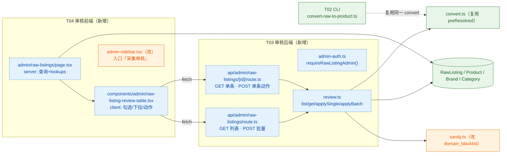
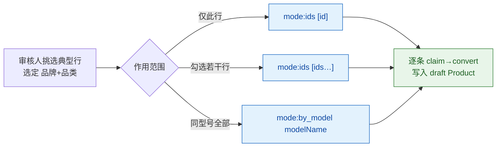
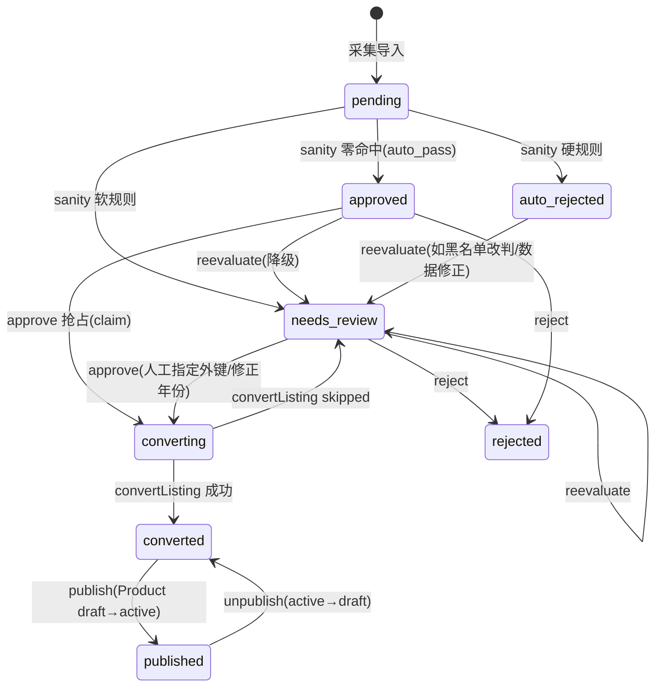

# 《采集数据上架》T03/T04 增量设计（审核后端 API + 审核前端页）

> 分支 `feat/raw-listing-publish-p0`，head `1a3a66be4433b790f43e73be059337c83f9a9a99`（parent = main `1b3ba45e`）。
> **本文所有现状描述均以 GitHub REST API 真身（`?ref=feat/raw-listing-publish-p0`）核对**，非本地检出。
> 定位：T01（types/sanity）+ T02（convert/CLI）已落地，本文补 **T03 审核后端**与 **T04 审核前端**。
> 硬约束：只新增 + 最小修改；不改前台 `src/app/[locale]/products/**`；不改既有 admin/seller/miniapp 三条创建路径；不引入新框架。

---

## 0. 前置事实（真身核对结论）

| 事项 | 真身结论（文件:行号 / 证据） |
|---|---|
| `RawListing` 已加 `productId String?`、`convertedAt DateTime?`；索引仅 `[status,scrapedAt]`/`[source,scrapedAt]`/`[contentHash]`，**无 `productId` 索引** | `prisma/schema.prisma:613-647`（新增列 637-640） |
| `types.ts` 导出 | `SanityAction`(19)、`SanityRuleId`(22-33)、`ACTION_PRIORITY`(61-65)、`SanityContext`(112-121)、`PROCESSABLE_RAW_STATUSES=["pending","approved"]`(217)、`CONVERTED_PRODUCT_STATUS="draft"`(220)、`RawListingLike`(136-153)、`ConvertResult`(174)、`PreResolvedFks`(204-210) |
| `sanity.ts` | 纯函数 `evaluateSanity(input, ctx, opts?)`(116-239)；导出 `resolveEffectivePriceCny`(66)、`tryParseHttpUrl`(83)、`isBlacklistedHost`(95)、`isNoisyModelName`(101)、`EXCHANGE_RATES`(39) |
| `convert.ts` | `convertListing(listing, client?, preResolved?)`(273-344)、`resolveBrandForListing`(194)、`inferCategory`(211)、`getOrCreateScoutSeller`(161)、`findScoutSellerId`(184)、`buildDescriptionZh`(244)、`probeDuplicate`(353)、`normalizeBrandName`(139)、`BRAND_NORMALIZATION`(68) |
| `convertListing` **关键行为**：`modelName` 空 / `year` 非法缺失 / 无价 / 超硬边界 → `skipped`；品牌未匹配 → `skipped`；品类无法解析 → `skipped` | `convert.ts:278-311` |
| `convertListing` **已支持人工外键**：第 3 参 `preResolved?: PreResolvedFks` 命中即跳过品牌/品类解析 | `convert.ts:292-311`（`fks = preResolved`） |
| CLI 已有 sanity 上下文探测（品牌/品类/中位价/重复）可复用范式 | `scripts/convert-raw-to-product.ts:141-212` |
| 鉴权范式 | `getTokenFromHeaders(headers)`/`verifyToken(token)→{userId,role,tier}\|null`（`src/lib/auth.ts:47-72`）；API 范本 `src/app/api/admin/analytics/views/route.ts:26-40` |
| admin 布局**角色集含 editor**（`["admin","super_admin","editor"]`）⇒ 审核页需**页内额外收紧** | `src/app/[locale]/admin/layout.tsx:45-47` |
| 表格范式 / 侧栏入口范式 | `src/app/[locale]/admin/products/page.tsx:23-56`、`admin-sidebar.tsx:27-41` |
| **当前不存在** `src/app/api/admin/raw-listings`、`src/app/[locale]/admin/raw-listings` | 目录列表核对（无该目录） |

### 0.1 需求变更（老板刚提，必须落地）

`domain_blacklist`（youtube/youtu.be/facebook/instagram/tiktok/pinterest）**由 `auto_reject` 改为 `needs_review`**——「可能是获取信息的重要渠道，不判死刑」。

- 修改点：`src/lib/raw-listing/sanity.ts` 规则①黑名单分支 `sanity.ts:141-147`，`action: "auto_reject"` → `"needs_review"`，`detail` 同步改为「命中黑名单域名，改为人工核实」；
- 同步改注释：`sanity.ts:17-21`（模块 docstring 的「刻意收敛」段）、`types.ts:78`（`SOURCE_URL_BLACKLIST` 注释「命中即 auto_reject」→「命中即 needs_review」）；
- `source_url_invalid`（URL 存在但非 http(s)）**保持 `auto_reject` 不变**；`source_url_missing` 保持 `needs_review` 不变。
- **预期分布**（805 行）：调整后 `auto_pass 11 / needs_review 792 / auto_reject 2`（6 条黑名单行由 reject 转 review；调整前为 11/786/8）。

### 0.2 现状数据（决定 T03 的核心难点）

| 卡点 | 行数 | 为何卡住 |
|---|---|---|
| `category_undetermined` | **756** | `RawListing` 无品类字段；`inferCategory(modelName)` 失败 → 兜底「农机配件/配件」，但 `auto_pass` 需 `categoryInferable`，故进 `needs_review` |
| `brand_unmatched` | **56** | `resolveBrandForListing` 未命中 `Brand` 表 |
| 其余 | ~ | `no_price` / `invalid_year` / `price_outlier` / `source_url_missing` 等 |

⇒ **审核页的核心价值不是「点通过」，而是「人工补齐品牌/品类/年份后能真正落成 `Product`」。**

---

## 1. 架构总览



---

## 2. T03 审核后端 API

### 2.1 鉴权（`src/lib/raw-listing/admin-auth.ts`）

复用 `src/lib/auth.ts` 的 `getTokenFromHeaders(req.headers)` + `verifyToken(token)`；**角色限 `admin`/`super_admin`（不含 `editor`，老板已拍板）**。

```ts
// src/lib/raw-listing/admin-auth.ts
import { NextRequest, NextResponse } from "next/server";
import { getTokenFromHeaders, verifyToken } from "@/lib/auth";
import { prisma } from "@/lib/db";

export type GuardOk  = { ok: true; userId: string; role: string };
export type GuardErr = { ok: false; status: 401 | 403; body: { success: false; error: string; code: string } };
export type GuardResult = GuardOk | GuardErr;

const ALLOWED = new Set(["admin", "super_admin"]); // ⚠️ 不含 editor

export async function requireRawListingAdmin(req: NextRequest): Promise<GuardResult> {
  const token = getTokenFromHeaders(req.headers);
  if (!token) return { ok: false, status: 401, body: { success: false, error: "请先登录", code: "UNAUTHORIZED" } };
  const payload = verifyToken(token);
  if (!payload) return { ok: false, status: 401, body: { success: false, error: "Token无效", code: "UNAUTHORIZED" } };
  // 关键：JWT 内 role 可能过期（被降权），以 DB 真身为准
  const u = await prisma.user.findUnique({ where: { id: payload.userId }, select: { role: true, isActive: true } });
  if (!u || !u.isActive || !ALLOWED.has(u.role)) {
    return { ok: false, status: 403, body: { success: false, error: "权限不足（仅 admin/super_admin）", code: "FORBIDDEN" } };
  }
  return { ok: true, userId: payload.userId, role: u.role };
}
```

### 2.2 端点清单

| # | 方法 | 路径 | 用途 | 鉴权 |
|---|---|---|---|---|
| 1 | `GET` | `/api/admin/raw-listings` | 列表（分页/筛选/搜索）+ 状态计数 | admin/super_admin |
| 2 | `POST` | `/api/admin/raw-listings` | **批量**动作（approve/reject/reevaluate/publish/unpublish） | 同上 |
| 3 | `GET` | `/api/admin/raw-listings/[id]` | 单条详情（含 images 解析、产物关联） | 同上 |
| 4 | `POST` | `/api/admin/raw-listings/[id]` | **单条**动作（approve/reject/reevaluate/publish/unpublish） | 同上 |

> 统一响应信封 `{ success: boolean, data?: T, error?: string, code?: string }`（与既有 admin 路由一致）。

### 2.3 ① 列表 `GET /api/admin/raw-listings`

Query 参数：

| 参数 | 类型 | 默认 | 说明 |
|---|---|---|---|
| `page` | int | 1 | 页码 |
| `pageSize` | int | 30 | 上限 100 |
| `status` | string | `needs_review` | `pending\|auto_rejected\|needs_review\|approved\|rejected\|converted\|published\|converting\|all` |
| `source` | string | — | 精确匹配 `RawListing.source`（如 `agriaffaires`、`domestic_xxx`） |
| `rule` | string | — | 命中规则筛选，实现为 `notes: { contains: <SanityRuleId> }` |
| `q` | string | — | 关键词：`modelName`/`brandName`/`location`/`sourceUrl` 模糊（`contains`） |
| `orderBy` | string | `scrapedAt` | `scrapedAt\|createdAt\|priceCny` |
| `order` | string | `desc` | `asc\|desc` |

`where` 组装（`src/app/[locale]/admin/products/page.tsx:23-38` 同范式）：

```ts
const where: Prisma.RawListingWhereInput = {};
if (status && status !== "all") where.status = status;
if (source) where.source = source;
if (rule)   where.notes  = { contains: rule };
if (q) where.OR = [
  { modelName:  { contains: q } },
  { brandName:  { contains: q } },
  { location:   { contains: q } },
  { sourceUrl:  { contains: q } },
];
```

响应（`data.items[]` 每项字段）：

```jsonc
{
  "success": true,
  "data": {
    "items": [
      {
        "id": "clx…", "source": "agriaffaires", "sourceUrl": "https://www.agriaffaires.com/…",
        "status": "needs_review",
        "brandName": "Claas", "brandNormalized": "克拉斯", "modelName": "Arion 460",
        "year": 2019, "workingHours": 3200, "condition": null,
        "priceRaw": 74000, "currency": "EUR", "priceCny": 585340, "location": "France",
        "sellerName": null, "sellerPhone": null, "sellerWechat": null, "sellerWhatsapp": null,
        "images": null,                       // RawListing.images 原样（当前恒 null）
        "scrapedAt": "2026-08-13T22:05:00.000Z",
        "reviewedAt": "2026-09-24T…Z", "reviewedBy": "auto",
        "notes": "[sanity] needs_review：category_undetermined(…); brand_unmatched(…)",
        "productId": null, "convertedAt": null,
        "reasons": ["category_undetermined", "brand_unmatched"]   // 由 notes 解析出的规则名，供前端 chips
      }
    ],
    "total": 792,
    "page": 1, "pageSize": 30, "totalPages": 27,
    "statusCounts": { "pending": 0, "auto_rejected": 2, "needs_review": 792, "converted": 11, "published": 0 },
    "lookups": {
      "sources": ["agriaffaires", "agroline", "mascus", "search_api", "domestic_xxx"]
    }
  }
}
```

> `reasons` 由服务端解析 `notes` 中形如 `ruleName(detail)` 的片段得出（`sanity.ts:233-236` 的生成格式），避免前端重复解析。
> **品牌/品类下拉数据不在本响应**（体积大且静态）：由 T04 的 server 组件 `page.tsx` 直接 `prisma.brand.findMany` / `prisma.category.findMany` 后传给客户端（见 §4.2）。

### 2.4 ② 单条详情 `GET /api/admin/raw-listings/[id]`

返回 §2.3 的单项 + `product`（若 `productId != null`：`{ id, status, brandId, categoryId, modelName, priceCny, images[] }`），用于详情页与「已转换」态回显。404 走 `NOT_FOUND`。

### 2.5 ③ 单条动作 `POST /api/admin/raw-listings/[id]`

请求体（`action` 必填）：

```jsonc
{
  "action": "approve",            // approve | reject | reevaluate | publish | unpublish
  "brandId": "clx_brand",          // 仅 approve/reject 可带；approve 时可人工指定/修正
  "categoryId": "clx_cat",         // 同上
  "year": 2019,                    // 可选：人工修正年份（approve 前先写回 RawListing）
  "priceCny": 585340,              // 可选：人工补/改价（谨慎；仅显式提供才写）
  "note": "已核对品牌与品类"        // 可选，写入 notes
}
```

各动作语义与响应 `data`：

| action | 前置校验（违反 → 错误码） | 副作用 | 响应 `data` |
|---|---|---|---|
| `approve` | `status∈{pending,approved,needs_review}` 且 `productId==null`（否则 `409 ALREADY_CONVERTED`/`STATE_CONFLICT`）；`year` 可解析；品牌+品类可确定 | ① 若带 `year/priceCny` → 先 update `RawListing`；② 组装 `PreResolvedFks`；③ `convertListing(listing, prisma, fks)`；④ 成功 → `status="converted"`,`productId`,`convertedAt`,`reviewedBy=actorId`,`reviewedAt`；跳过 → 回落 `status="needs_review"` | `{ action:"approve", status:"converted"\|"needs_review", productId?, productStatus:"draft"?, skippedReason? }` |
| `reject` | `productId==null`（否则 `409 STATE_CONFLICT`，禁止丢弃已产物） | `status="rejected"`,`reviewedBy=actorId`,`reviewedAt`,`notes += note` | `{ action:"reject", status:"rejected" }` |
| `reevaluate` | — | 重跑 `evaluateSanity`（重探 ctx），按结果写 `auto_rejected`/`needs_review`/保持 | `{ action:"reevaluate", status, reasons[], notes }` |
| `publish` | `productId != null`（否则 `409 STATE_CONFLICT`） | `Product.status="active"`；`RawListing.status="published"`，`reviewedBy/reviewedAt` | `{ action:"publish", status:"published", productId, productStatus:"active" }` |
| `unpublish` | `productId != null` | `Product.status="draft"`；`RawListing.status="converted"` | `{ action:"unpublish", status:"converted", productId, productStatus:"draft" }` |

**approve 的外键解析顺序**（本文最关键逻辑）：

```
brandId      := body.brandId   ?? resolveBrandForListing(listing.brandName).brandId
categoryId   := body.categoryId ?? inferCategory(listing.modelName).categoryId
year         := body.year      ?? listing.year
→ 若 brandId  仍为空 → 422 FK_UNRESOLVED { missing:["brandId"] }
→ 若 categoryId 仍为空 → 422 FK_UNRESOLVED { missing:["categoryId"] }
→ 若 year  为空/非法   → 422 FIELD_REQUIRED { field:"year" }
→ 否则 fks = { brandId, brandDisplayName, categoryId, categoryDisplayName, usedCategoryFallback: Boolean(body.categoryId) ? false : resolved.usedFallback }
   convertListing(listingWithOverrides, prisma, fks)
```

> `usedCategoryFallback` 仅当「未人工指定品类、且解析走了兜底」时为 `true`；人工选定品类即视为可信（`false`）。

**并发/幂等（防双建）**：`approve` 采用「抢占-转换-落定」三步，避免同一 `RawListing` 被并发 approve 生成两个 `Product`：

```
1) claim:  const c = await prisma.rawListing.updateMany({
              where: { id, productId: null, status: { in: ["pending","approved","needs_review"] } },
              data:  { status: "converting", reviewedBy: actorId, reviewedAt: now } });
           if (c.count === 0) → 409 (ALREADY_CONVERTED | CLAIM_FAILED)
2) convert: convertListing(...)
3) finalize: 成功 → status="converted", productId, convertedAt ；
             跳过 → status="needs_review"（附 skippedReason）+ 释放 converting
```

> `converting` 为**瞬态占位**：若进程中途崩溃，该行停在 `converting`。恢复策略见 §9 待明确（建议 `reevaluate` 可把 `converting` 拉回，或加一条 `updatedAt` 超时的惰性回收）。

### 2.6 ④ 批量动作 `POST /api/admin/raw-listings`

请求体：

```jsonc
{
  "action": "approve",              // approve | reject | reevaluate | publish | unpublish
  "mode": "ids",                    // ids（默认，显式选择）| by_model（按型号批量套用，见 §3.3）
  "ids": ["clx1","clx2"],           // mode=ids 时必填，长度 ≤ 100
  "modelName": "Arion 460",         // mode=by_model 时必填（精确匹配 trim 后 modelName）
  "overrides": { "brandId": "clx_brand", "categoryId": "clx_cat" }, // 可选，统一套用
  "limit": 200                      // by_model 命中上限，默认 200，超限 → 422
}
```

响应（逐条结果 + 汇总，便于前端展示「成功 N / 跳过 M / 失败 K」）：

```jsonc
{
  "success": true,
  "data": {
    "results": [
      { "id": "clx1", "ok": true,  "action": "approve", "status": "converted", "productId": "prod_1" },
      { "id": "clx2", "ok": false, "action": "approve", "status": "needs_review", "skippedReason": "category 仍无法解析" }
    ],
    "summary": { "total": 2, "ok": 1, "converted": 1, "skipped": 1, "failed": 0 }
  }
}
```

- 服务端对每个 id 复用 `applySingleAction`（**顺序执行**，控制并发以保护 DB）；
- `mode=by_model` 由服务端选 id：`findMany({ where:{ modelName, productId:null, status:{ in:["pending","approved","needs_review"] } }, select:{id}, take: limit+1 })`，命中 > limit → `422 TOO_MANY_IDS`；
- 批量 `publish`/`unpublish` 亦走本端点（`ids` = `converted` 行集合）。

### 2.7 错误码表

| HTTP | code | 场景 |
|---|---|---|
| 401 | `UNAUTHORIZED` | 无 token / token 无效 |
| 403 | `FORBIDDEN` | role ∉ {admin, super_admin}（含 editor） |
| 404 | `NOT_FOUND` | `[id]` 不存在 |
| 400 | `VALIDATION_ERROR` | body 不合法（缺 action / ids 非数组等） |
| 409 | `ALREADY_CONVERTED` | approve 时 `productId != null` |
| 409 | `STATE_CONFLICT` | 动作与当前 status 不符（如 publish 无产物、reject 已转换行） |
| 409 | `CLAIM_FAILED` | 并发抢占失败（另一请求已处理） |
| 422 | `FK_UNRESOLVED` | approve 时 brand/category 无法确定且未人工指定 `{ missing:[...] }` |
| 422 | `FIELD_REQUIRED` | approve 时 `year` 缺失/非法 `{ field:"year" }` |
| 422 | `TOO_MANY_IDS` | `ids>100` 或 `by_model` 命中 > limit |
| 500 | `INTERNAL_ERROR` | 未预期异常 |

### 2.8 服务层 `src/lib/raw-listing/review.ts`（路由只做 HTTP 适配）

```ts
// 列表
export interface ListQuery { page?: number; pageSize?: number; status?: string; source?: string; rule?: string; q?: string; orderBy?: string; order?: "asc"|"desc"; }
export interface RawListingListItem { /* §2.3 单项，含 reasons/productId/convertedAt */ }
export interface ListResult { items: RawListingListItem[]; total: number; page: number; pageSize: number; totalPages: number; statusCounts: Record<string, number>; lookups: { sources: string[] } }
export async function listRawListings(q: ListQuery): Promise<ListResult>;

// 单条
export async function getRawListing(id: string): Promise<RawListingListItem & { product: ProductBrief | null } | null>;
export type SingleAction = "approve" | "reject" | "reevaluate" | "publish" | "unpublish";
export interface SingleActionInput { action: SingleAction; actorId: string; brandId?: string; categoryId?: string; year?: number; priceCny?: number; note?: string; }
export interface SingleActionResult { action: SingleAction; status: string; productId?: string | null; productStatus?: string | null; skippedReason?: string; missing?: string[]; }
export async function applySingleAction(id: string, input: SingleActionInput): Promise<SingleActionResult>;   // 抛领域错误（供路由映射到错误码）

// 批量
export interface BatchActionInput { action: SingleAction; actorId: string; mode?: "ids" | "by_model"; ids?: string[]; modelName?: string; overrides?: { brandId?: string; categoryId?: string }; limit?: number; }
export async function applyBatchAction(input: BatchActionInput): Promise<{ results: Array<SingleActionResult & { id: string; ok: boolean }>; summary: Record<string, number> }>;

// 重新评估（内部复用 sanity）
export async function probeSanityContext(listing: RawListingLike, brandMedianCny: number | null, scoutSellerId: string | null): Promise<SanityContext>;
export async function reevaluateOne(id: string): Promise<{ action: SanityAction; status: string; reasons: string[]; notes: string }>;
```

> `probeSanityContext` 与 CLI 中 `getBrand/getCategory/medianMap/probeDuplicate`（`scripts/convert-raw-to-product.ts:141-212`）逻辑同源；T03 实现后**建议 CLI 回切复用本函数**（最小改动、去重逻辑），但 CLI 改造非本任务强制项。

### 2.9 端到端时序（审核 → 转换 → 发布）

```mermaid
sequenceDiagram
    autonumber
    participant Admin as 审核人(浏览器)
    participant Page as admin/raw-listings/page.tsx
    participant API as /api/admin/raw-listings
    participant Auth as admin-auth.ts
    participant Svc as review.ts
    participant CV as convert.ts
    participant DB as prisma

    Admin->>Page: 打开列表(status=needs_review)
    Page->>DB: rawListing.findMany + count + groupBy(status) + brand/category lookups
    DB-->>Page: items + statusCounts + lookups
    Page-->>Admin: 表格 + 品牌/品类下拉
    Admin->>Page: 选 brandId+categoryId → 点「通过并转换」
    Page->>API: POST /[id] { action:"approve", brandId, categoryId }
    API->>Auth: requireRawListingAdmin()
    Auth-->>API: {ok,userId}
    API->>Svc: applySingleAction(id, input)
    Svc->>DB: claim updateMany(productId=null → converting)
    Svc->>CV: convertListing(listing, prisma, preResolved)
    CV->>DB: product.create({ status:"draft", brandId, categoryId, … })
    CV-->>Svc: {status:"converted", productId}
    Svc->>DB: rawListing.update(status=converted, productId, convertedAt, reviewedBy, reviewedAt)
    Svc-->>API: {action:"approve", status:"converted", productId}
    API-->>Page: {success:true, data}
    Admin->>Page: 点「发布」
    Page->>API: POST /[id] { action:"publish" }
    API->>Svc: applySingleAction(id,{action:"publish"})
    Svc->>DB: product.update(status=active) ; rawListing.update(status=published)
    API-->>Page: {success:true, productStatus:"active"}
```

---

## 3. 🔴 关键链路：`needs_review` 行如何真正变成 `Product`

### 3.1 为什么现在卡住

`convertListing` 是「外键缺失即跳过」的保守设计（`convert.ts:296-303`）：品牌未匹配 / 品类无法解析 → `skipped`。而 756 行卡在 `category_undetermined`、56 行卡在 `brand_unmatched`，**CLI 无论重复跑多少次都无法自动越过**。必须在审核层引入**人工作为外键的最终裁决者**。

### 3.2 人工指定 → `approve` → `convert`（主链路）

- 审核页每行提供 **品牌下拉**（`Brand.id` → `nameZh`）、**品类下拉**（`Category.id` → `nameZh`，可带 `parentId` 层级缩进），默认值 = 系统自动解析结果（若命中则预选，未命中留空）。
- 点击「通过并转换」→ `POST /[id] { action:"approve", brandId, categoryId }` → 服务端组装 `PreResolvedFks` → `convertListing(listing, prisma, fks)`。**`convertListing` 已有 `preResolved` 形参（`convert.ts:273-311`），无需改 convert.ts。**
- 若 `year` 也缺失/非法：审核页提供年份输入框（`overrides.year`），先写回 `RawListing` 再转换（`422 FIELD_REQUIRED` 时前端高亮该字段）。
- 若 `no_price`（无价）：**不建议**让审核人凭空填价（易失真）；前端以「拒绝」为主路径，或允许谨慎填 `priceCny`（默认折叠，需二次确认）。

### 3.3 降低 756 条人工量：按型号批量套用

756 条里存在**同型号多行**（CLI 注释记录「distinct 型号 ≈ 482」）。设计两级降本：

1. **选择集批量套用**（`mode:"ids"`）：勾选多行 → 统一选一个品牌/品类 → `POST /api/admin/raw-listings { action:"approve", mode:"ids", ids:[...], overrides:{brandId,categoryId} }`。
2. **同型号批量套用**（`mode:"by_model"`，**本设计的核心降本点**）：在列表按 `modelName` 聚合，对某型号一键「套用品牌+品类到同型号全部待审」→ 服务端 `findMany(modelName=…, productId=null, status∈{pending,approved,needs_review})` → 逐条 `approve`（≤200/批）。



> 近似型号（如 `Arion 460` vs `ARION 460 `）建议前端提供「去空格/忽略大小写」的归一化提示；精确聚合仍按 `trim()` 后 `modelName`——是否引入更激进的归一（复用 `src/lib/model-alias.ts` 的 `resolveModelCandidates`）列入 §9 待明确，避免本任务过度设计。

### 3.4 覆盖缺口一览

| 卡点 | 人工可否解决 | 通路 |
|---|---|---|
| `category_undetermined` (756) | ✅ 选品类（可 by_model 批量） | approve overrides.categoryId |
| `brand_unmatched` (56) | ✅ 选品牌 | approve overrides.brandId |
| `invalid_year` | ✅ 填年份 | approve overrides.year |
| `no_price` | ⚠️ 谨慎填价 or 拒绝 | approve overrides.priceCny / reject |
| `price_outlier` / 黑名单(改后) | ✅ 人工判断后 approve 或 reject | approve / reject |
| `duplicate_product` (auto_reject) | ❌ 保持拒绝（不开放 override），防重复 | — |

---

## 4. T04 审核前端页

### 4.1 路由与鉴权

- 路由：`src/app/[locale]/admin/raw-listings/page.tsx`（**新增**）。
- ⚠️ admin 布局放行了 `editor`（`layout.tsx:45-47`），故**页内必须再次校验角色**：server 组件内读 token/`verifyToken` + DB 角色，非 `admin|super_admin` → `redirect` 回 `/${locale}/admin`。与后端 `requireRawListingAdmin` 同口径。

### 4.2 列表页（server 组件，范式对齐 `admin/products/page.tsx`）

- `export const dynamic = "force-dynamic";`
- `searchParams`：`status`（默认 `needs_review`）`source` `rule` `q` `page`；直接调用 `review.listRawListings()`（**同一服务层**，避免重复 where 逻辑）。
- 并行取 lookups：`prisma.brand.findMany({ select:{id,nameZh,nameEn}, orderBy:{nameZh:"asc"} })`、`prisma.category.findMany({ select:{id,nameZh,nameEn,parentId}, orderBy:{nameZh:"asc"} })`。
- 顶部：状态 Tab（带 `statusCounts` 徽标）+ 筛选表单（GET，同 products 页 60-88 行范式）+「重新评估全部 `needs_review`」按钮（可选，走批量 reevaluate）。
- 正文：`<RawListingReviewTable items={…} brands={…} categories={…} locale={…} />`（客户端组件）。

### 4.3 表格列与操作

| 列 | 内容 |
|---|---|
| ☑ | 行选择（批量操作依据） |
| 状态 | badge：`needs_review`(琥珀) / `auto_rejected`(红) / `approved`(青) / `converted`(蓝) / `published`(绿) / `converting`(灰) |
| 来源 | `source` + `sourceUrl` 外链图标（host 命中黑名单时标警示） |
| 品牌 | `brandName`（原始）+ 归一箭头 `→ brandNormalized`（若不同） |
| 型号 | `modelName`（截断 + title） |
| 年份 / 小时 | `year ?? "-"` / `workingHours ?? "-"` |
| 价格 | `¥priceCny`（超硬边界标红；`price_outlier` 标琥珀） |
| 位置 | `location` |
| 命中规则 | `reasons[]` → chips（`category_undetermined` / `brand_unmatched` / `no_price` / `price_outlier` / `domain_blacklist` / `invalid_year` …） |
| 产物 | `productId ? <Link to /admin/products/{id}> : "—"` |
| 操作 | **品牌▾ + 品类▾（行内）** → `[通过并转换]` `[拒绝]` `[重新评估]`；`converted` 行显示 `[发布]`；`published` 行显示 `[下线]` |

批量工具条（选中 ≥1 时出现）：`已选 N 条` → `[批量通过并转换]`（用统一 overrides）`[批量拒绝]` `[批量发布]` `[批量下线]` `[同型号批量套用]`。

### 4.4 命中规则 / 判定可视化

- `reasons` 直接来自服务端解析（§2.3），前端仅做 chip 着色，不重复解析 `notes`。
- `notes` 全文放在**行展开/悬浮 title**，保留审计原文（含 `[sanity] …`、`[convert-skip] …`、`[review] …`）。

### 4.5 单条详情（P1）

`src/app/[locale]/admin/raw-listings/[id]/page.tsx`：完整字段（含 `images` 原始 JSON）、自动解析结果（品牌/品类/年份）、命中规则明细、产物链接（跳到 `/admin/products/{id}`）、以及同一「通过/拒绝/发布」动作（复用同一 API）。价值：便于处理疑难行与留痕复核。

### 4.6 侧栏入口（改 `admin-sidebar.tsx`）

在 `links`（`admin-sidebar.tsx:27-41`）追加，并新增 `lucide-react` 图标 `Inbox`（或 `ScanSearch`）：

```tsx
{ href: `/${locale}/admin/raw-listings`, label: "采集审核", icon: Inbox, hideForEditor: true },
```

- `hideForEditor: true` ⇒ `editor` 不可见（与后端角色口径一致，`admin-sidebar.tsx:43`）。
- 图标需加入顶部 `import { … } from "lucide-react"`（`admin-sidebar.tsx:9`）。

---

## 5. 状态机与回写规则



**每个动作的写入规则**（`—` = 不改动）：

| 动作 | `status` | `reviewedAt` | `reviewedBy` | `notes` | `productId` | `convertedAt` | `Product.status` |
|---|---|---|---|---|---|---|---|
| sanity `auto_reject` | `auto_rejected` | now | `"auto"` | 覆盖为 `[sanity] …` | — | — | — |
| sanity `needs_review` | `needs_review` | now | `"auto"` | 覆盖为 `[sanity] …` | — | — | — |
| sanity `auto_pass`→convert | `converted` | now | `"auto"` | `[sanity] …；已生成 draft …` | 新 id | now | `draft` |
| **approve**(人工) | `converted`（claim 期 `converting`） | now | **`actorId`** | append `[review] approved by <actorId>` | 新 id | now | `draft` |
| convert 跳过 | `needs_review` | now | `actorId` | append `[convert-skip] <reason>` | — | — | — |
| reject | `rejected` | now | `actorId` | append `[review] rejected: <note>` | — | — | — |
| reevaluate | 按 `evaluateSanity` 结果 | now | `actorId` | 覆盖 `[sanity] …`（保留末尾 `[review]` 历史可选） | — | — | — |
| publish | `published` | now | `actorId` | append `[review] published` | 保留 | 保留 | `active` |
| unpublish | `converted` | now | `actorId` | append `[review] unpublished` | 保留 | 保留 | `draft` |

**幂等保证**：所有转换类动作的前提是 `productId == null`（`approve` 用 claim 条件锁，`publish`/`unpublish` 要求 `productId != null`），因此重复点击不会重复建 `Product`。

**notes 写入策略**：`sanity` 覆盖写；`review` 类**追加**（读旧值 + `" ; "` 拼接），保留审计链；长度护栏：单条 `notes` 超 2000 字符时截断最旧片段（防 DB/展示异常）。

---

## 6. `domain_blacklist` 变更设计（需求变更）

| 项 | 现值（真身） | 改为 |
|---|---|---|
| 规则①黑名单分支动作 | `sanity.ts:141-147` → `action:"auto_reject"` | `action:"needs_review"` |
| detail 文案 | `来源域名命中黑名单：<host>` | `命中黑名单域名 <host>，按新策略转人工核实（可能为有效信息渠道）` |
| 模块 docstring | `sanity.ts:17-21`（「host 缺失列为 auto_reject」的收敛说明） | 补一句：黑名单已按老板决策改为 `needs_review` |
| `SOURCE_URL_BLACKLIST` 注释 | `types.ts:78`「命中即 auto_reject」 | 改为「命中即 needs_review」 |
| 不受影响 | `source_url_invalid`（URL 存在但非 http(s)）仍 `auto_reject`；`source_url_missing` 仍 `needs_review` | — |

**预期结果**：805 行分布由 `auto_pass 11 / needs_review 786 / auto_reject 8` → **`auto_pass 11 / needs_review 792 / auto_reject 2`**（6 条黑名单行改判）。已落 `auto_rejected` 的历史行需重跑 `reevaluate` 或 CLI 重跑方可翻回（见 §9）。

---

## 7. 文件清单

**新增**
| 文件（相对路径） | 说明 |
|---|---|
| `src/lib/raw-listing/admin-auth.ts` | `requireRawListingAdmin()` 鉴权守卫（admin/super_admin） |
| `src/lib/raw-listing/review.ts` | 审核服务层：`listRawListings`/`getRawListing`/`applySingleAction`/`applyBatchAction`/`reevaluateOne`/`probeSanityContext` |
| `src/app/api/admin/raw-listings/route.ts` | `GET` 列表 + `POST` 批量 |
| `src/app/api/admin/raw-listings/[id]/route.ts` | `GET` 单条 + `POST` 单条动作 |
| `src/app/[locale]/admin/raw-listings/page.tsx` | 审核列表页（server） |
| `src/components/admin/raw-listing-review-table.tsx` | 审核表格（client：勾选/行内下拉/批量工具条） |
| `src/app/[locale]/admin/raw-listings/[id]/page.tsx` | （P1）单条详情页 |
| `src/components/admin/raw-listing-fk-select.tsx` | （P1）品牌/品类联动下拉子组件（可内联，视实现） |
| `docs/采集数据上架-runbook.md` | （P1）审核运维手册 + 恢复 `converting` 处置 |

**修改（最小）**
| 文件 | 改动 |
|---|---|
| `src/lib/raw-listing/sanity.ts` | 黑名单分支 `auto_reject`→`needs_review`（§6） |
| `src/lib/raw-listing/types.ts` | `SOURCE_URL_BLACKLIST` 注释同步 |
| `src/app/[locale]/admin/admin-sidebar.tsx` | 新增「采集审核」入口 + `Inbox` 图标 import |

**明确不改**：`src/app/[locale]/products/**`（前台）、`src/app/api/internal/products/route.ts`、`src/lib/raw-listing/convert.ts`（`preResolved` 已够用）、既有 admin/seller/miniapp 创建路径。

---

## 8. 任务拆分（≤3，每任务 ≥3 文件）

| 任务 | 名称 | 文件 | 依赖 | 优先级 |
|---|---|---|---|---|
| **T03** | 审核后端 API + 黑名单改判 | `src/lib/raw-listing/admin-auth.ts`、`src/lib/raw-listing/review.ts`、`src/app/api/admin/raw-listings/route.ts`、`src/app/api/admin/raw-listings/[id]/route.ts`、**改** `src/lib/raw-listing/sanity.ts`、**改** `src/lib/raw-listing/types.ts` | T01/T02（已完成） | **P0** |
| **T04** | 审核前端页 | `src/app/[locale]/admin/raw-listings/page.tsx`、`src/components/admin/raw-listing-review-table.tsx`、**改** `src/app/[locale]/admin/admin-sidebar.tsx` | T03 | **P0** |
| **T05** | 单条详情 + 批量套用收尾 + 手册 | `src/app/[locale]/admin/raw-listings/[id]/page.tsx`、`src/components/admin/raw-listing-fk-select.tsx`、`docs/采集数据上架-runbook.md`、（可选）`messages/zh.json`+`messages/en.json` | T03/T04 | **P1** |

**最小可用闭环** = T03 + T04：能在 `/admin/raw-listings` 看到 792 行、给卡住的行选品牌/品类、一键「通过并转换」（→ `draft`）、再「发布」（`draft→active`）。

---

## 9. 待明确事项

1. **`converting` 卡死回收**：崩溃后停在 `converting` 的行如何恢复？建议把 `converting` 纳入 `reevaluate` 可回收状态，并加 `updatedAt` 超时（如 >10min）惰性回退——需确认阈值与是否要定时任务。
2. **历史 `auto_rejected` 行是否重判**：黑名单改判后，6 条已被旧逻辑写成 `auto_rejected` 的行（若有）是否要批量 `reevaluate` 翻回 `needs_review`？
3. **`no_price` 行**：是否允许审核人填 `priceCny`（有失真正风险），还是一律「拒绝」？
4. **同型号聚合的口径**：仅 `trim()` 精确匹配，还是引入 `src/lib/model-alias.ts` 的 `resolveModelCandidates` 做更激进归一（会显著提升降本，但增加复杂度与误并风险）？
5. **批量上限**：`ids ≤100` / `by_model ≤200` 是否合适？是否需要「按品牌批量」`mode:"by_brand"`。
6. **是否需要审计表**：当前仅靠 `RawListing.notes` 留痕；是否需要独立的审核操作日志（谁在何时通过/拒绝/发布）？
7. **i18n**：审核页文案是否必须走 next-intl（现有 admin 页多为硬编码中文）？
8. **`Product.status` 回退保护**：`unpublish` 把 `active` 打回 `draft` 是否需限制（如仅限未产生询价/收藏的产物）？
